# Frameworks for Software Supply Chain Security

In the realm of software supply chain security, various frameworks provide structured approaches to enhance security practices. This document outlines some of the key frameworks that organizations can adopt to strengthen their security posture.

FRAMEWORK GUIDE

Implementing security frameworks provides structure, consistency, and comprehensive coverage for your supply chain security program. This guide will help you understand and select the most appropriate frameworks for your organization.

## Comparison of Major Security Frameworks

```mermaid
graph TD
    classDef nist fill:#4287f5, stroke:#333, stroke-width:1px, color:white
    classDef slsa fill:#ff9900, stroke:#333, stroke-width:1px, color:white
    classDef samm fill:#1db954, stroke:#333, stroke-width:1px, color:white
    classDef iso fill:#800080, stroke:#333, stroke-width:1px, color:white
    classDef cis fill:#ff6666, stroke:#333, stroke-width:1px, color:white
    
    NIST[NIST CSF]:::nist --> NIST_ID[Identify]
    NIST --> NIST_PR[Protect]
    NIST --> NIST_DT[Detect]
    NIST --> NIST_RS[Respond]
    NIST --> NIST_RC[Recover]
    
    SLSA[SLSA]:::slsa --> SLSA_SRC[Source]
    SLSA --> SLSA_BUILD[Build]
    SLSA --> SLSA_PROV[Provenance]
    SLSA --> SLSA_VER[Verification]
    
    SAMM[OWASP SAMM]:::samm --> SAMM_GOV[Governance]
    SAMM --> SAMM_CONST[Construction]
    SAMM --> SAMM_VER[Verification]
    SAMM --> SAMM_OPS[Operations]
    
    ISO[ISO 27001]:::iso --> ISO_RISK[Risk Assessment]
    ISO --> ISO_CONT[Controls]
    ISO --> ISO_ISMS[ISMS]
    
    CIS[CIS Controls]:::cis --> CIS_BASIC[Basic]
    CIS --> CIS_FOUND[Foundational]
    CIS --> CIS_ORG[Organizational]
    
    click NIST href "#1-nist-cybersecurity-framework" "NIST Cybersecurity Framework"
    click SLSA href "#6-slsa-supply-chain-levels-for-software-artifacts" "SLSA Framework"
    click SAMM href "#2-owasp-software-assurance-maturity-model-samm" "OWASP SAMM"
    click ISO href "#3-iso-iec-27001" "ISO/IEC 27001"
    click CIS href "#4-cis-controls" "CIS Controls"
```

## 1. NIST Cybersecurity Framework

The NIST Cybersecurity Framework offers a policy framework of computer security guidance for how private sector organizations can assess and improve their ability to prevent, detect, and respond to cyber attacks. It consists of five core functions:

- **Identify**: Develop an organizational understanding to manage cybersecurity risk.
- **Protect**: Implement appropriate safeguards to ensure delivery of critical services.
- **Detect**: Develop and implement appropriate activities to identify the occurrence of a cybersecurity event.
- **Respond**: Take action regarding a detected cybersecurity incident.
- **Recover**: Maintain plans for resilience and restore any capabilities or services that were impaired due to a cybersecurity incident.

### NIST CSF Implementation for Supply Chain Security

The framework can be specifically applied to software supply chain security:

| Core Function | Supply Chain Security Application | Example Controls |
|---------------|----------------------------------|------------------|
| **Identify** | Inventory all software dependencies and their sources | SBOM generation, dependency mapping |
| **Protect** | Implement controls to prevent compromise of supply chain | Signed commits, dependency verification, least privilege |
| **Detect** | Deploy monitoring to identify suspicious supply chain activity | Continuous dependency scanning, anomaly detection |
| **Respond** | Establish plans for addressing supply chain incidents | Vulnerability disclosure process, incident response playbooks |
| **Recover** | Create mechanisms to restore compromised systems | Secure backups, alternative dependency sources |

!!! info "NIST SP 800-218"
    NIST has also published Special Publication 800-218, the Secure Software Development Framework (SSDF), which provides more specific guidance for secure software development practices that can be integrated with the CSF.

## 2. OWASP Software Assurance Maturity Model (SAMM)

The OWASP SAMM provides a framework to analyze and improve an organization’s software security posture. It helps organizations to:

- Assess their current software security practices.
- Define a roadmap for improvement.
- Measure the effectiveness of their software security initiatives.

## 3. ISO/IEC 27001

ISO/IEC 27001 is an international standard for information security management systems (ISMS). It provides a systematic approach to managing sensitive company information, ensuring its confidentiality, integrity, and availability. The standard includes:

- Risk assessment and treatment.
- Security controls implementation.
- Continuous improvement processes.

## 4. CIS Controls

The Center for Internet Security (CIS) Controls are a set of best practices designed to help organizations improve their cybersecurity posture. The controls are divided into three categories:

- **Basic Controls**: Essential for all organizations.
- **Foundational Controls**: Recommended for organizations that have implemented basic controls.
- **Organizational Controls**: Focus on governance and risk management.

## 5. FAIR (Factor Analysis of Information Risk)

FAIR is a framework for understanding, analyzing, and quantifying information risk. It provides a model for:

- Identifying and assessing risks.
- Making informed decisions about risk management.
- Communicating risk in financial terms.

## Conclusion

Adopting these frameworks can significantly enhance an organization's ability to manage software supply chain security risks. By implementing structured approaches, organizations can better protect their assets and ensure the integrity of their software supply chains.