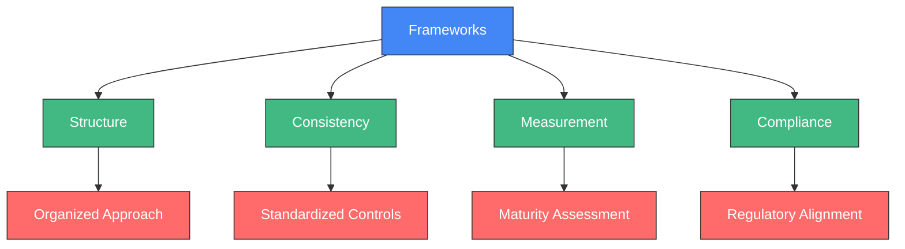
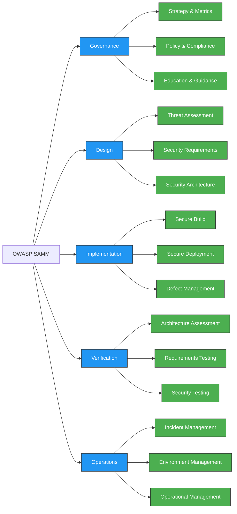
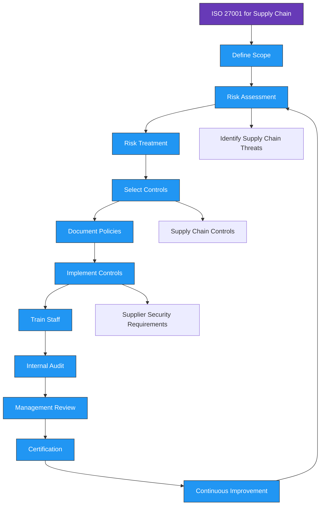
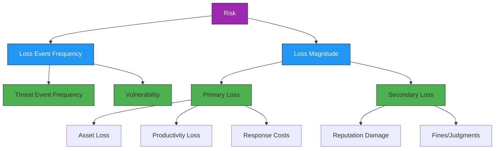
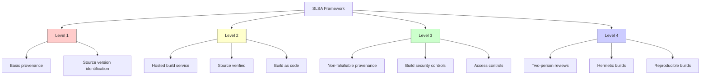
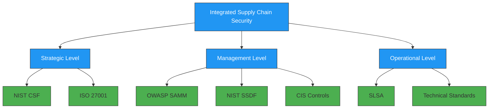

# Frameworks for Software Supply Chain Security

<div class="secure-component">
<span class="security-badge badge-info">FRAMEWORK GUIDE</span>

Implementing security frameworks provides structure, consistency, and comprehensive coverage for your supply chain security program. This guide will help you understand and select the most appropriate frameworks for your organization.
</div>

## Introduction to Security Frameworks

Security frameworks serve as structured approaches to managing security risks and implementing controls. For software supply chain security specifically, frameworks help organizations:

- Identify security gaps and establish a baseline
- Create a roadmap for security improvement
- Standardize security practices across teams and projects
- Demonstrate compliance with industry requirements
- Enable objective measurement of security maturity
- Prioritize investments in security controls



## Framework Selection Guide

When selecting a framework for your organization, consider these key factors:

| Selection Factor | Considerations | Questions to Ask |
|-----------------|----------------|-----------------|
| **Industry Requirements** | Regulatory compliance, customer expectations | What regulations apply to our industry? What do our customers require? |
| **Organizational Size** | Resources available, complexity to manage | Do we have dedicated security staff? What's our budget for implementation? |
| **Security Maturity** | Current capabilities, goals for improvement | What is our current security posture? Where do we want to be in 1-2 years? |
| **Technical Environment** | Development practices, technology stack | What development methodologies do we use? What technologies are in our stack? |
| **Risk Appetite** | Tolerance for security risk, business priorities | How much risk is acceptable? What business impacts must we mitigate? |

## Comparison of Major Security Frameworks

```mermaid
graph TD
    classDef nist fill:#4287f5, stroke:#333, stroke-width:1px, color:white
    classDef slsa fill:#ff9900, stroke:#333, stroke-width:1px, color:white
    classDef samm fill:#1db954, stroke:#333, stroke-width:1px, color:white
    classDef iso fill:#800080, stroke:#333, stroke-width:1px, color:white
    classDef cis fill:#ff6666, stroke:#333, stroke-width:1px, color:white
    
    NIST[NIST CSF]:::nist --> NIST_ID[Identify]
    NIST --> NIST_PR[Protect]
    NIST --> NIST_DT[Detect]
    NIST --> NIST_RS[Respond]
    NIST --> NIST_RC[Recover]
    
    SLSA[SLSA]:::slsa --> SLSA_SRC[Source]
    SLSA --> SLSA_BUILD[Build]
    SLSA --> SLSA_PROV[Provenance]
    SLSA --> SLSA_VER[Verification]
    
    SAMM[OWASP SAMM]:::samm --> SAMM_GOV[Governance]
    SAMM --> SAMM_CONST[Construction]
    SAMM --> SAMM_VER[Verification]
    SAMM --> SAMM_OPS[Operations]
    
    ISO[ISO 27001]:::iso --> ISO_RISK[Risk Assessment]
    ISO --> ISO_CONT[Controls]
    ISO --> ISO_ISMS[ISMS]
    
    CIS[CIS Controls]:::cis --> CIS_BASIC[Basic]
    CIS --> CIS_FOUND[Foundational]
    CIS --> CIS_ORG[Organizational]
    
    click NIST href "#1-nist-cybersecurity-framework" "NIST Cybersecurity Framework"
    click SLSA href "#6-slsa-supply-chain-levels-for-software-artifacts" "SLSA Framework"
    click SAMM href "#2-owasp-software-assurance-maturity-model-samm" "OWASP SAMM"
    click ISO href "#3-iso-iec-27001" "ISO/IEC 27001"
    click CIS href "#4-cis-controls" "CIS Controls"
```



## Framework Comparison Matrix

| Framework | Focus Area | Maturity Model | Supply Chain Specific | Implementation Complexity | Certification Available |
|-----------|------------|----------------|----------------------|--------------------------|------------------------|
| **NIST CSF** | Comprehensive cybersecurity | ✅ (Tiers 1-4) | Partial (SSDF component) | Medium | ❌ |
| **OWASP SAMM** | Software security practices | ✅ (Levels 1-3) | Partial | Medium | ❌ |
| **ISO 27001** | Information security management | ❌ | ❌ | High | ✅ |
| **CIS Controls** | Technical security controls | ✅ (Implementation Groups 1-3) | ❌ | Medium | ✅ |
| **SLSA** | Build integrity & provenance | ✅ (Levels 1-4) | ✅ | Medium | ❌ |
| **FAIR** | Risk quantification | ❌ | ❌ | High | ✅ |
| **NIST SSDF** | Secure software development | ❌ | ✅ | Medium | ❌ |
| **SCMMM** | Supply chain maturity | ✅ (Levels 1-4) | ✅ | Medium | ❌ |

## 1. NIST Cybersecurity Framework

The NIST Cybersecurity Framework offers a policy framework of computer security guidance for how private sector organizations can assess and improve their ability to prevent, detect, and respond to cyber attacks. It consists of five core functions:

- **Identify**: Develop an organizational understanding to manage cybersecurity risk.
- **Protect**: Implement appropriate safeguards to ensure delivery of critical services.
- **Detect**: Develop and implement appropriate activities to identify the occurrence of a cybersecurity event.
- **Respond**: Take action regarding a detected cybersecurity incident.
- **Recover**: Maintain plans for resilience and restore any capabilities or services that were impaired due to a cybersecurity incident.

### NIST CSF Implementation for Supply Chain Security

The framework can be specifically applied to software supply chain security:

| Core Function | Supply Chain Security Application | Example Controls |
|---------------|----------------------------------|------------------|
| **Identify** | Inventory all software dependencies and their sources | SBOM generation, dependency mapping, threat modeling |
| **Protect** | Implement controls to prevent compromise of supply chain | Signed commits, dependency verification, least privilege |
| **Detect** | Deploy monitoring to identify suspicious supply chain activity | Continuous dependency scanning, anomaly detection |
| **Respond** | Establish plans for addressing supply chain incidents | Vulnerability disclosure process, incident response playbooks |
| **Recover** | Create mechanisms to restore compromised systems | Secure backups, alternative dependency sources |

!!! info "NIST SP 800-218"
    NIST has also published Special Publication 800-218, the Secure Software Development Framework (SSDF), which provides more specific guidance for secure software development practices that can be integrated with the CSF.

### NIST CSF Maturity Tiers

The CSF defines four tiers of implementation maturity:

1. **Tier 1: Partial** - Risk management practices are not formalized and are managed reactively
2. **Tier 2: Risk Informed** - Risk management practices are approved but may not be established organization-wide
3. **Tier 3: Repeatable** - Risk management practices are formally approved and expressed as policy
4. **Tier 4: Adaptive** - Organization adapts cybersecurity practices based on lessons learned and predictive indicators

### Implementation Example: NIST CSF for Supply Chain

```yaml
# Example: Docker Build with NIST CSF Controls
name: NIST CSF Compliant Build

on: [push, pull_request]

jobs:
  secure-build:
    runs-on: ubuntu-latest
    steps:
      # IDENTIFY: Generate SBOM
      - name: Generate SBOM
        run: syft . -o cyclonedx-json > sbom.json
      
      # PROTECT: Verify Dependencies
      - name: Dependency Check
        uses: dependency-check/Dependency-Check_Action@main
        with:
          project: 'test'
          path: '.'
          format: 'HTML'
          
      # DETECT: Scan for Vulnerabilities  
      - name: Run Trivy vulnerability scanner
        uses: aquasecurity/trivy-action@master
        with:
          scan-type: 'fs'
          format: 'sarif'
          output: 'trivy-results.sarif'
          
      # PROTECT: Sign Artifacts  
      - name: Sign artifact
        uses: sigstore/cosign-installer@main
        with:
          cosign-release: 'v1.13.0'
```

## 2. OWASP Software Assurance Maturity Model (SAMM)

The OWASP SAMM provides a framework to analyze and improve an organization's software security posture. It helps organizations to:

- Assess their current software security practices
- Build a balanced software security program in well-defined iterations
- Demonstrate concrete improvements to a security assurance program
- Define and measure security-related activities throughout an organization

### SAMM Business Functions and Security Practices

SAMM is organized into four business functions, each containing three security practices:

1. **Governance**
   - Strategy & Metrics
   - Policy & Compliance
   - Education & Guidance

2. **Design**
   - Threat Assessment
   - Security Requirements
   - Security Architecture

3. **Implementation**
   - Secure Build
   - Secure Deployment
   - Defect Management

4. **Verification**
   - Architecture Assessment
   - Requirements Testing
   - Security Testing

5. **Operations**
   - Incident Management
   - Environment Management
   - Operational Management



### SAMM Supply Chain Security Implementation

SAMM can be specifically applied to software supply chain security through practices like:

- **Governance**: Creating policies for trusted dependencies and artifact verification
- **Design**: Modeling threats to the supply chain during design phase
- **Implementation**: Implementing secure build practices with dependency verification
- **Verification**: Testing for supply chain vulnerabilities
- **Operations**: Monitoring for compromised dependencies in production

### Practical SAMM Assessment Example

```python
# Example SAMM assessment data structure
samm_assessment = {
    "governance": {
        "strategy": 2,  # Level 2 maturity
        "policy": 1,    # Level 1 maturity
        "education": 2  # Level 2 maturity
    },
    "design": {
        "threat_assessment": 1,
        "security_requirements": 2,
        "security_architecture": 1
    },
    "implementation": {
        "secure_build": 3,        # Strong supply chain controls
        "secure_deployment": 2,
        "defect_management": 2
    },
    "verification": {
        "architecture_assessment": 1,
        "requirements_testing": 1,
        "security_testing": 2
    },
    "operations": {
        "incident_management": 2,
        "environment_management": 2,
        "operational_management": 1
    }
}

# Calculate average maturity
import numpy as np
maturity = np.mean(list(map(lambda x: np.mean(list(x.values())), 
                            samm_assessment.values())))
print(f"Overall SAMM maturity: {maturity:.2f} out of 3")
```

## 3. ISO/IEC 27001

ISO/IEC 27001 is an international standard for information security management systems (ISMS). It provides a systematic approach to managing sensitive company information, ensuring its confidentiality, integrity, and availability.

### Key Components of ISO 27001

- **Information Security Policy**: Organization-wide policy for information security
- **Risk Assessment Process**: Methodology for identifying and evaluating risks
- **Risk Treatment Plan**: Controls to address identified risks
- **Statement of Applicability**: Documentation of all controls and their implementation status
- **Information Security Objectives**: Measurable goals for security
- **Competence and Awareness Programs**: Staff training and awareness
- **Operational Security Controls**: Day-to-day security measures
- **Security Performance Monitoring**: Metrics and measurements
- **Management Reviews**: Regular executive assessment of the ISMS
- **Corrective Actions**: Process for addressing deficiencies

### ISO 27001 Annex A Controls Relevant to Supply Chain

ISO 27001 includes specific controls in Annex A that directly relate to supply chain security:

- **A.14.1.1**: Information security requirements analysis and specification
- **A.14.2.7**: Outsourced development
- **A.14.2.8**: System security testing
- **A.14.2.9**: System acceptance testing
- **A.15.1.1**: Information security policy for supplier relationships
- **A.15.1.2**: Addressing security within supplier agreements
- **A.15.1.3**: Information and communication technology supply chain
- **A.15.2.1**: Monitoring and review of supplier services
- **A.15.2.2**: Managing changes to supplier services

### ISO 27001 Implementation for Supply Chain Security



## 4. CIS Controls

The Center for Internet Security (CIS) Controls are a set of best practices designed to help organizations improve their cybersecurity posture. The controls are divided into three categories:

- **Basic Controls (1-6)**: Essential for all organizations
- **Foundational Controls (7-16)**: Recommended for organizations that have implemented basic controls
- **Organizational Controls (17-20)**: Focus on governance and risk management

### CIS Controls for Software Supply Chain Security

While not specifically designed for supply chain security, several CIS Controls can be applied to this area:

- **Control 2: Inventory and Control of Software Assets**: Track all software components and dependencies
- **Control 3: Continuous Vulnerability Management**: Scan for vulnerabilities in dependencies
- **Control 4: Controlled Use of Administrative Privileges**: Limit access to build and deployment systems
- **Control 5: Secure Configuration for Hardware and Software**: Harden build systems and repositories
- **Control 14: Security Awareness and Training**: Train developers on secure supply chain practices
- **Control 18: Application Software Security**: Apply secure development practices

### CIS Controls Implementation Groups

CIS organizes implementations into three groups based on organization size and capability:

1. **Implementation Group 1**: Essential cyber hygiene - organizations with limited resources
2. **Implementation Group 2**: Organizations with moderate resources and cybersecurity expertise
3. **Implementation Group 3**: Organizations with significant resources and cybersecurity expertise

## 5. FAIR (Factor Analysis of Information Risk)

FAIR is a framework for understanding, analyzing, and quantifying information risk in financial terms. It enables organizations to:

- Make well-informed decisions about risk management investments
- Communicate cyber risk in terms that business executives understand
- Prioritize remediation efforts based on financial impact

### FAIR Risk Taxonomy



### Applying FAIR to Supply Chain Risk Analysis

FAIR can help organizations quantify the risks associated with software supply chain:

1. **Identify supply chain risk scenarios** (e.g., compromised dependency, build system breach)
2. **Estimate the frequency** of these events occurring
3. **Assess vulnerability factors** that could allow the event to succeed
4. **Calculate primary losses** from an incident (direct costs)
5. **Calculate secondary losses** (reputation damage, regulatory impact)
6. **Quantify overall risk exposure** in financial terms
7. **Compare to control implementation costs** to make investment decisions

### Example FAIR Analysis for Supply Chain Risk

| Risk Scenario | Annual Frequency | Vulnerability | Primary Loss | Secondary Loss | Annual Loss Exposure |
|---------------|------------------|--------------|--------------|----------------|---------------------|
| **Compromised Dependency** | 2 events/year | 30% | $100,000 | $400,000 | $300,000/year |
| **Build Server Compromise** | 0.1 events/year | 20% | $500,000 | $2,000,000 | $50,000/year |
| **Developer Account Takeover** | 0.5 events/year | 15% | $300,000 | $700,000 | $75,000/year |

## 6. SLSA (Supply chain Levels for Software Artifacts)

SLSA is a security framework specifically designed to improve the integrity of the software supply chain. It provides a set of incrementally adoptable security guidelines that help protect against common supply chain attacks.

### SLSA Levels

SLSA defines four levels of increasing software supply chain security:

1. **Level 1: Documentation** - Basic build provenance
2. **Level 2: Tamper Resistance** - Requires a hosted build service with guarantees of source verification and provenance generation
3. **Level 3: Extra Hardening** - Additional hardening requirements to make build systems more resilient against specific threats
4. **Level 4: Maximum Security** - Most stringent controls including two-person review of all changes and hermetic, reproducible builds

### SLSA Requirements by Level



### SLSA Implementation Example

```yaml
# Example SLSA Level 2 GitHub Actions workflow
name: SLSA Level 2 Build

on:
  push:
    branches: [ main ]
  pull_request:
    branches: [ main ]

jobs:
  build:
    permissions:
      id-token: write  # For signing
      contents: read   # For checkout
    
    # Uses GitHub-hosted runner (SLSA L2 requirement)
    runs-on: ubuntu-latest
    
    steps:
      # Checkout source code
      - uses: actions/checkout@v3
        with:
          fetch-depth: 0
      
      # Build with provenance
      - name: Build
        id: build
        run: |
          make release
          echo "::set-output name=artifact::./bin/app"
      
      # Generate provenance using SLSA generator
      - name: Generate SLSA provenance
        uses: slsa-framework/slsa-github-generator@v1
        with:
          artifact-path: ${{ steps.build.outputs.artifact }}
```

## 7. NIST SSDF (Secure Software Development Framework)

The NIST Secure Software Development Framework (SSDF) provides a set of fundamental secure software development practices based on established standards and guidelines. It helps organizations integrate security into their development practices.

### SSDF Practices

The SSDF organizes its practices into four groups:

1. **Prepare the Organization (PO)**: Ensure the organization is prepared to develop secure software
2. **Protect the Software (PS)**: Protect all components from tampering and unauthorized access
3. **Produce Well-Secured Software (PW)**: Produce well-secured software with minimal vulnerabilities
4. **Respond to Vulnerabilities (RV)**: Identify and address vulnerabilities in software releases

### SSDF for Supply Chain Security

For supply chain security specifically, key SSDF practices include:

- **PO.5**: Implement supporting toolchains
- **PS.1**: Protect all forms of code from unauthorized access and tampering
- **PS.2**: Provide a mechanism for verifying software integrity
- **PS.3**: Archive and protect each software release
- **PW.4**: Reuse existing, well-secured software components when feasible
- **PW.5**: Create and maintain a Software Bill of Materials
- **PW.7**: Review and test third-party components

## 8. SCMM (Supply Chain Maturity Model)

The Supply Chain Maturity Model provides a framework for assessing and improving the maturity of an organization's supply chain security practices.

### SCMM Maturity Levels

1. **Initial**: Ad-hoc, reactive approaches to supply chain security
2. **Managed**: Basic controls established, but not consistently applied
3. **Defined**: Standardized processes across the organization
4. **Measured**: Quantitative understanding and control of security posture
5. **Optimizing**: Continuous improvement and adaptation to new threats

### SCMM Domain Areas

- **Supplier Management**: Selection, assessment, and monitoring of suppliers
- **Component Management**: Tracking, validating, and securing components
- **Build Environment Security**: Protecting build systems and pipelines
- **Delivery Infrastructure**: Securing code repositories and distribution channels
- **Verification and Testing**: Validating the security of supplied components
- **Vulnerability Management**: Identifying and remediating vulnerabilities in the supply chain
- **Incident Response**: Handling supply chain security incidents

## Framework Integration and Mapping

Organizations often need to implement multiple frameworks to address different aspects of supply chain security. These frameworks can be integrated through:



### Framework Control Mapping Example

| Control Objective | NIST CSF | ISO 27001 | SLSA | CIS | OWASP SAMM |
|-------------------|----------|-----------|------|-----|------------|
| **Secure Build Process** | PR.IP-2 | A.14.2.1 | Level 2-3 | Control 18.1 | I1-Secure Build |
| **Dependency Management** | ID.SC-3 | A.15.1.3 | Level 1+ | Control 2.1 | I1-Secure Build |
| **Artifact Integrity** | PR.DS-6 | A.14.2.8 | Level 2+ | Control 18.3 | V3-Security Testing |
| **Access Controls** | PR.AC-4 | A.9.2.3 | Level 3 | Control 4.3 | G2-Policy & Compliance |

## Practical Implementation Guidance

### Getting Started with Frameworks

1. **Assess your current state** using one or more framework maturity models
2. **Identify gaps and prioritize improvements** based on risk
3. **Begin with foundational controls** that apply across frameworks
4. **Document your approach** and create a roadmap for implementation
5. **Implement incrementally**, focusing on high-impact improvements first
6. **Measure progress** using the framework's assessment methodology
7. **Continuously improve** based on evolving threats and organizational needs

### Small-Medium Business Implementation

For smaller organizations with limited resources:

- Start with **SLSA Level 1** requirements for basic provenance
- Implement core **CIS Controls** from Implementation Group 1
- Use the **NIST SSDF** as a guide for secure development practices
- Focus on automating dependency scanning and verification

### Enterprise Implementation

For larger organizations:

- Implement **ISO 27001** as an overarching information security framework
- Use **OWASP SAMM** to structure your secure development program
- Target **SLSA Level 2 or 3** for critical systems
- Apply **FAIR** for risk quantification and resource allocation
- Map controls across frameworks to identify synergies

## Conclusion

Adopting security frameworks provides a structured approach to managing software supply chain security risks. By implementing appropriate frameworks, organizations can:

1. **Establish baseline security controls** to address common supply chain threats
2. **Measure and improve** their security posture over time
3. **Demonstrate compliance** with industry best practices and regulatory requirements
4. **Efficiently allocate resources** to the most impactful security improvements
5. **Communicate security posture** to stakeholders in a standardized way

For most organizations, a combination of frameworks will be most effective, with specific implementations tailored to the organization's size, industry, risk profile, and resources.

!!! tip "Getting Started Recommendation"
    Begin with a self-assessment using SLSA to identify your current supply chain security level, then create a roadmap to progressively implement controls from NIST SSDF. For organizations needing a more comprehensive approach, consider implementing NIST CSF or ISO 27001 as an overarching framework.