# Industry Standards for Software Supply Chain Security

<div class="secure-component">
<span class="security-badge badge-info">REFERENCE GUIDE</span>

This comprehensive guide examines key industry standards and frameworks that specifically address or can be applied to software supply chain security. Understanding and implementing these standards is crucial for establishing robust software supply chain security controls.
</div>

## Standards Landscape

The software supply chain security standards landscape continues to evolve in response to increasing threats. These standards provide organizations with structured approaches to secure their software development lifecycle and supply chain.

```mermaid
graph TD
    classDef general fill:#3498db, stroke:#333, stroke-width:1px, color:white
    classDef specific fill:#e74c3c, stroke:#333, stroke-width:1px, color:white
    classDef crypto fill:#f39c12, stroke:#333, stroke-width:1px, color:white
    classDef privacy fill:#9b59b6, stroke:#333, stroke-width:1px, color:white
    classDef guidance fill:#2ecc71, stroke:#333, stroke-width:1px, color:white
    
    A[Standards for Software Supply Chain Security]:::general --> B[General Security<br/>Standards]:::general
    A --> C[Supply Chain<br/>Specific Standards]:::specific
    A --> D[Cryptographic<br/>Standards]:::crypto
    A --> E[Privacy & Data<br/>Protection]:::privacy
    A --> F[Best Practices &<br/>Guidance]:::guidance
    
    B --> B1[ISO/IEC 27001<br/>ISMS]:::general
    B --> B2[NIST CSF]:::general
    B --> B3[SOC 2]:::general
    
    C --> C1[SLSA]:::specific
    C --> C2[NIST SP 800-161<br/>Supply Chain Risk]:::specific
    C --> C3[ISO/IEC 27036<br/>Supplier Relationships]:::specific
    
    D --> D1[FIPS 140-2/3<br/>Cryptographic Modules]:::crypto
    D --> D2[ISO/IEC 19790<br/>Security Requirements]:::crypto
    
    E --> E1[GDPR]:::privacy
    E --> E2[CCPA/CPRA]:::privacy
    
    F --> F1[OWASP Top 10]:::guidance
    F --> F2[CIS Controls]:::guidance
    F --> F3[SANS Top 25]:::guidance
    
    click C1 "#slsa" "Supply chain Levels for Software Artifacts"
    click C2 "#nist-sp-800-161" "NIST Supply Chain Risk Management"
    click B1 "#isoiec-27001" "Information Security Management Systems"
    
    style A stroke-width:3px
```



## General Security Standards

### ISO/IEC 27001 {#isoiec-27001}

<div class="security-grid">
<div class="security-grid-item security-grid-item-main">
ISO/IEC 27001 is an international standard for information security management systems (ISMS). While not specifically designed for software supply chain security, it provides a comprehensive framework that can be applied to secure the various components of software supply chains.

#### Key Aspects for Supply Chain Security:

- **Annex A.14**: System acquisition, development and maintenance
- **Annex A.15**: Supplier relationships
- **Annex A.8**: Asset management (tracking dependencies)

#### Implementation Approach:
1. Conduct a risk assessment of your software supply chain
2. Develop security controls based on identified risks
3. Implement a continuous monitoring and improvement process
4. Seek certification through an accredited body
</div>

<div class="security-grid-item security-grid-item-side">
<div class="security-info-box">
<strong>Implementation Guidance</strong>
<ul>
<li>Begin with scope definition centered on supply chain elements</li>
<li>Develop specific controls for third-party code assessment</li>
<li>Establish explicit supplier security requirements</li>
<li>Create documentation for the verification of external components</li>
<li>Implement monitoring solutions for supply chain indicators</li>
</ul>
</div>
</div>
</div>

### NIST Cybersecurity Framework {#nist-csf}

<div class="security-grid">
<div class="security-grid-item security-grid-item-main">
The NIST Cybersecurity Framework (CSF) provides a policy framework for private sector organizations to assess and improve their ability to prevent, detect, and respond to cyber attacks. The framework is structured around five core functions:

1. **Identify**: Develop an organizational understanding of risks to systems, assets, data, and capabilities
2. **Protect**: Implement safeguards to ensure delivery of critical infrastructure services
3. **Detect**: Implement activities to identify cybersecurity events
4. **Respond**: Implement activities to take action regarding detected cybersecurity events
5. **Recover**: Implement activities to maintain resilience and restore capabilities impaired by cybersecurity events

#### Application to Supply Chain Security:

The NIST CSF can be mapped to software supply chain security as follows:

- **Identify**: Inventory all software dependencies, build processes, and deployment pipelines
- **Protect**: Implement secure coding practices, dependency scanning, and artifact signing
- **Detect**: Deploy monitoring for unauthorized changes, suspicious build patterns, or compromised dependencies
- **Respond**: Establish protocols for addressing identified supply chain compromises
- **Recover**: Create backup systems and restoration procedures for clean rebuilds
</div>

<div class="security-grid-item security-grid-item-side">
<div class="security-info-box">
<strong>CSF Implementation Tiers</strong>
<p>Organizations can assess their maturity in supply chain security using the CSF tiers:</p>
<ul>
<li><strong>Tier 1 (Partial)</strong>: Ad-hoc processes, limited awareness</li>
<li><strong>Tier 2 (Risk Informed)</strong>: Risk management but not organization-wide</li>
<li><strong>Tier 3 (Repeatable)</strong>: Formal policies, integrated throughout the organization</li>
<li><strong>Tier 4 (Adaptive)</strong>: Continuous improvement, proactive security posture</li>
</ul>
</div>
</div>
</div>

## Supply Chain Specific Standards

### NIST SP 800-161 {#nist-sp-800-161}

<div class="secure-component">
<span class="security-badge badge-secure">SUPPLY CHAIN SPECIFIC</span>

NIST Special Publication 800-161, "Supply Chain Risk Management Practices for Federal Information Systems and Organizations," provides guidance specifically for managing supply chain risks in information systems.
</div>

#### Key Components:

- **Multi-tiered risk management** approach addressing organization, mission, and system levels
- **Supply chain risk assessment** process tailored for software components
- **Controls implementation guidance** for different phases of the system development lifecycle
- **Countermeasures** specifically for software supply chain risks

#### Implementation in Software Development:

```yaml
Implementation Examples:
  - Establish a Software Component & Supplier Inventory Database
  - Create Code Provenance Verification Procedures
  - Implement Build Environment Security Requirements
  - Develop Dependency Update Policies and Procedures
  - Design Incident Response Plans for Supply Chain Compromises
```

### Supply chain Levels for Software Artifacts (SLSA) {#slsa}

<div class="secure-component">
<span class="security-badge badge-secure">EMERGING STANDARD</span>

SLSA (pronounced "salsa") is a security framework, a check-list of standards and controls to prevent tampering, improve integrity, and secure packages and infrastructure in your projects, businesses or enterprises.
</div>

SLSA is designed specifically to address software supply chain security with four progressive levels of maturity:

<div class="security-table">
<table>
<thead>
<tr>
<th>SLSA Level</th>
<th>Description</th>
<th>Requirements</th>
</tr>
</thead>
<tbody>
<tr>
<td><strong>Level 1</strong></td>
<td>Build process documentation</td>
<td>
  - Documentation of the build process<br>
  - Provenance available
</td>
</tr>
<tr>
<td><strong>Level 2</strong></td>
<td>Tamper resistance</td>
<td>
  - Hosted build service with minimal security controls<br>
  - Requires source version control<br>
  - Generated provenance
</td>
</tr>
<tr>
<td><strong>Level 3</strong></td>
<td>Build service security</td>
<td>
  - Security controls on build service<br>
  - Build as code (parameterized)<br>
  - Ephemeral environment with isolated builds
</td>
</tr>
<tr>
<td><strong>Level 4</strong></td>
<td>Highest security assurance</td>
<td>
  - Two-party review of build configuration changes<br>
  - Hermetic builds (fully defined dependencies)<br>
  - Reproducible builds when possible
</td>
</tr>
</tbody>
</table>
</div>

#### Implementation Example:

```shell
# Example of generating SLSA provenance for a container image
slsa-provenance generate \
  --artifact-path my-container:latest \
  --builder-id "https://github.com/slsa-framework/slsa-github-generator/.github/workflows/generator_container_slsa3.yml@main" \
  --output provenance.json
```

### ISO/IEC 27036 {#isoiec-27036}

ISO/IEC 27036 is a multi-part standard focused specifically on information security for supplier relationships. Part 4 specifically addresses security guidelines for securing the software supply chain, including:

1. Software acquisition process security
2. Security requirements specification
3. Acceptance testing and review
4. Software deployment security
5. Monitoring and maintenance of acquired software

## Application Security Standards 

### OWASP Top Ten {#owasp-top-ten}

The OWASP Top Ten identifies the most critical web application security risks. While focusing broadly on application security, several categories directly address supply chain concerns:

<div class="security-grid">
<div class="security-grid-item security-grid-item-main">
<table>
<thead>
<tr>
<th>OWASP Category</th>
<th>Supply Chain Security Relevance</th>
</tr>
</thead>
<tbody>
<tr>
<td><strong>A06:2021 - Vulnerable and Outdated Components</strong></td>
<td>Directly addresses dependency management, a core supply chain concern</td>
</tr>
<tr>
<td><strong>A08:2021 - Software and Data Integrity Failures</strong></td>
<td>Covers CI/CD pipeline security, code signing, and update verification</td>
</tr>
<tr>
<td><strong>A09:2021 - Security Logging and Monitoring Failures</strong></td>
<td>Critical for detecting potential supply chain compromises</td>
</tr>
</tbody>
</table>
</div>

<div class="security-grid-item security-grid-item-side">
<div class="security-info-box">
<strong>Implementation Tips</strong>
<ul>
<li>Run automated tools to scan for vulnerable dependencies</li>
<li>Implement artifact signing to ensure integrity</li>
<li>Establish monitoring for unusual build patterns</li>
<li>Maintain an inventory of all third-party components</li>
<li>Set up alerting for any unauthorized changes to build scripts</li>
</ul>
</div>
</div>
</div>

### CIS Controls {#cis-controls}

The Center for Internet Security (CIS) Controls are a set of best practices designed to help organizations improve their cybersecurity posture. Several CIS Controls directly apply to securing the software supply chain:

- **Control 2: Inventory and Control of Software Assets**
- **Control 4: Secure Configuration of Enterprise Assets and Software**
- **Control 7: Continuous Vulnerability Management**
- **Control 14: Security Awareness and Skills Training**
- **Control 18: Application Software Security**

#### Implementation Example for Control 7:

```yaml
Continuous Vulnerability Management:
  - Implement automated dependency scanning in CI/CD pipelines
  - Establish regular dependency update cadence
  - Document and test remediation processes for vulnerable components
  - Create risk assessment process for evaluating new dependencies
  - Deploy runtime monitoring for known vulnerabilities
```

### SANS Top 25 {#sans-top-25}

The SANS Institute's Top 25 Most Dangerous Software Errors highlights the most critical programming errors that can lead to security vulnerabilities. Key areas related to supply chain security include:

1. **Improper Input Validation** (particularly when consuming third-party data sources)
2. **Path Traversal** (relevant for build systems and dependency resolution)
3. **Cross-Site Request Forgery** (impacting package management systems)
4. **Unrestricted Upload of File with Dangerous Type** (affecting artifact repositories)

## Compliance and Regulatory Standards

### PCI DSS {#pci-dss}

The Payment Card Industry Data Security Standard (PCI DSS) ensures that all companies that accept, process, store, or transmit credit card information maintain a secure environment. Supply chain relevant requirements include:

- **Requirement 6**: Develop and maintain secure systems and applications
- **Requirement 11**: Regularly test security systems and processes
- **Requirement 12**: Maintain an information security policy

### GDPR {#gdpr}

The General Data Protection Regulation (GDPR) addresses data protection and privacy. Key supply chain concerns include:

- **Processor requirements**: Ensuring third-party components maintain data protection
- **Data protection by design**: Including security in supplier selection
- **Breach notification**: Supply chain compromises affecting personal data

## Audit and Assurance Standards

### SSAE 18 / SOC 2 {#ssae-18}

The Statement on Standards for Attestation Engagements (SSAE) 18 and the resulting SOC 2 reports provide assurance about controls related to security, availability, processing integrity, confidentiality, and privacy.

<div class="security-grid">
<div class="security-grid-item security-grid-item-main">

#### Supply Chain Security Considerations:

1. **Vendor Management**: Assessing security postures of software suppliers
2. **Change Management**: Ensuring secure software update processes
3. **Risk Management**: Identifying and mitigating third-party software risks
4. **Access Controls**: Limiting access to build systems and code repositories

#### Trust Services Criteria for Supply Chain:

- **Security**: Protection against unauthorized access to build systems
- **Availability**: Ensuring the reliability of dependency sources
- **Processing Integrity**: Ensuring build processes operate as expected
- **Confidentiality**: Protecting sensitive information in the supply chain
</div>

<div class="security-grid-item security-grid-item-side">
<div class="security-info-box">
<strong>SOC 2 Assessment Areas for Supply Chain</strong>
<ul>
<li>Code repository access controls</li>
<li>Build server security measures</li>
<li>Dependency management processes</li>
<li>Artifact repository security</li>
<li>Development environment isolation</li>
<li>Third-party code review procedures</li>
</ul>
</div>
</div>
</div>

### FIPS 140-2/3 {#fips-140}

The Federal Information Processing Standard (FIPS) 140-2/3 specifies security requirements for cryptographic modules. Key aspects for software supply chains include:

1. **Module authentication**: Ensuring the authenticity of software components
2. **Key management**: Properly handling signing keys for code and artifacts
3. **Self-tests**: Verifying the integrity of cryptographic operations
4. **Secure design**: Implementing secure cryptographic operations in software

## Implementing Standards in Your Organization

To effectively implement these standards in your organization:

1. **Perform Gap Analysis**: Compare your current practices against the most relevant standards
2. **Prioritize by Risk**: Address the highest-risk areas of your supply chain first
3. **Create an Implementation Roadmap**: Plan phased implementation based on resource availability
4. **Document Compliance**: Maintain evidence of adherence to chosen standards
5. **Conduct Regular Audits**: Periodically verify continued compliance

<div class="secure-component">
<span class="security-badge badge-warning">IMPORTANT</span>

Standards should be implemented based on your organization's risk profile, resources, and specific requirements. Not all standards will be applicable to every organization, and implementation should be tailored accordingly.
</div>

## Standards Comparison Matrix

<div class="security-table">
<table>
<thead>
<tr>
<th>Standard</th>
<th>Primary Focus</th>
<th>Supply Chain Applicability</th>
<th>Implementation Complexity</th>
<th>Best For</th>
</tr>
</thead>
<tbody>
<tr>
<td>ISO/IEC 27001</td>
<td>Overall Information Security</td>
<td>Medium</td>
<td>High</td>
<td>Organizations seeking comprehensive security framework</td>
</tr>
<tr>
<td>NIST CSF</td>
<td>Cybersecurity Risk Management</td>
<td>Medium-High</td>
<td>Medium</td>
<td>Flexible implementation based on risk profile</td>
</tr>
<tr>
<td>SLSA</td>
<td>Software Supply Chain Security</td>
<td>Very High</td>
<td>Varies by level</td>
<td>Progressive implementation of supply chain controls</td>
</tr>
<tr>
<td>NIST SP 800-161</td>
<td>Supply Chain Risk Management</td>
<td>Very High</td>
<td>High</td>
<td>Organizations with complex supply chains</td>
</tr>
<tr>
<td>OWASP Top 10</td>
<td>Application Security</td>
<td>Medium</td>
<td>Low</td>
<td>Starting point for securing applications</td>
</tr>
<tr>
<td>CIS Controls</td>
<td>Practical Security Actions</td>
<td>Medium</td>
<td>Medium</td>
<td>Prioritized, practical security implementations</td>
</tr>
<tr>
<td>FIPS 140-2/3</td>
<td>Cryptographic Module Security</td>
<td>Low-Medium</td>
<td>High</td>
<td>Government systems and regulated industries</td>
</tr>
</tbody>
</table>
</div>

## Conclusion

Adopting relevant security standards is a critical component of securing your software supply chain. By understanding and implementing these standards, organizations can systematically identify and address security risks throughout their development lifecycle and supply chain.

Remember that standards implementation should be viewed as an ongoing process rather than a one-time event, with regular reviews and updates to address emerging threats and changing requirements.