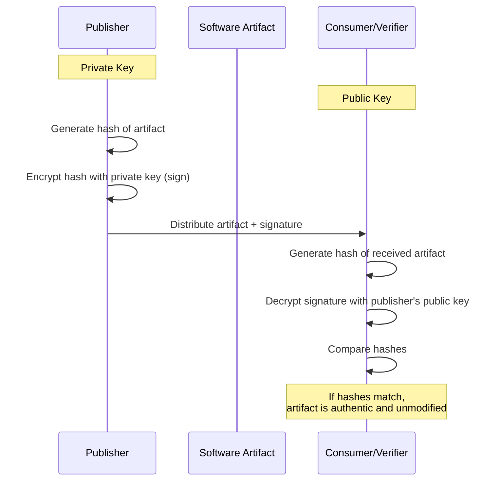
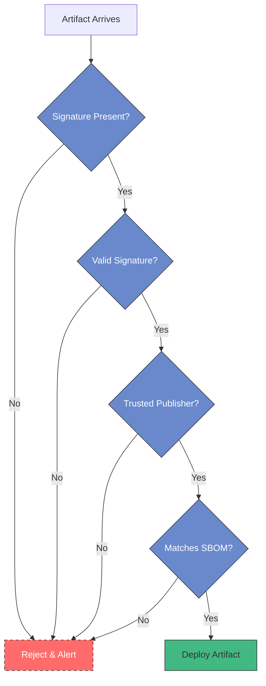
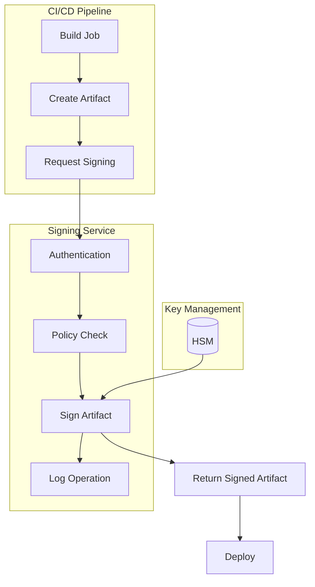

# Artifact Signing in CI/CD

<div class="secure-component">
<span class="security-badge badge-info">INTEGRITY CONTROL</span>

Artifact signing is a foundational security control that creates a verifiable chain of trust for software throughout the supply chain. This guide covers implementation strategies and best practices.
</div>

Artifact signing is a crucial practice in the CI/CD process that ensures the integrity and authenticity of software artifacts. By signing artifacts, developers can provide assurance that the artifacts have not been tampered with and originate from a trusted source.

## How Artifact Signing Works

Artifact signing uses cryptographic techniques to create a verifiable link between the software artifact and its creator or publisher. The process involves generating a digital signature that can be verified by recipients.



### Cryptographic Foundations

Artifact signing relies on asymmetric cryptography:

1. The **private key** is used by the publisher to create the signature
2. The **public key** is distributed to users to verify the signature
3. The **cryptographic hash** provides a unique fingerprint of the artifact
4. The **signature** is the encrypted hash that proves authenticity

## Importance of Artifact Signing

1. **Integrity**: Signing artifacts helps verify that the code has not been altered after it was built. This is essential for maintaining the trustworthiness of the software.

2. **Authenticity**: A signature confirms the identity of the publisher, allowing users to verify that the artifact comes from a legitimate source.

3. **Compliance**: Many regulatory frameworks require the use of signing to ensure that software components meet security standards.

4. **Non-Repudiation**: Signed artifacts cannot be disavowed by the signer, providing accountability in the software supply chain.

5. **Trust Establishment**: Signatures create verifiable trust chains from developer to end user across the entire software distribution process.

!!! warning "SolarWinds Attack Implications"
    The 2020 SolarWinds attack demonstrated the critical importance of artifact signing. Attackers were able to inject malicious code into the build process, which was then signed with SolarWinds' legitimate code-signing certificate. While the attack still succeeded, proper verification of build provenance and more granular signing could have helped detect the compromise.

## Types of Artifacts to Sign

Organizations should implement signing for all artifact types across the development and deployment pipeline:

| Artifact Type | Examples | Signing Method | Verification Point |
|---------------|----------|----------------|-------------------|
| **Source Code** | Git commits, tags | GPG/SSH signatures | Code review, CI pipeline |
| **Packages** | NPM, PyPI, Maven | Package-specific, sigstore | Installation, CI pipeline |
| **Containers** | Docker images, OCI | Cosign, Notary | Before deployment |
| **Executables** | .exe, .msi, .appx | Authenticode, codesign | Installation time |
| **Firmware** | BIOS, device firmware | Hardware-backed signing | Boot time |
| **Infrastructure** | Terraform, CloudFormation | Checksums, OIDC | Before application |

## Key Signing Technologies

### Code Signing Certificates

X.509 certificates issued by Certificate Authorities (CAs) that verify the identity of the publisher:

```bash
# Windows Authenticode signing example
signtool sign /a /tr http://timestamp.digicert.com /td sha256 /fd sha256 app.exe

# macOS code signing example
codesign --sign "Developer ID Application: Your Company (ABCDE12345)" app.dmg
```

### Sigstore/Cosign

Sigstore is an open-source project aimed at improving software supply chain integrity by making code signing more accessible:

```bash
# Sign a container with key-based signing
cosign sign --key cosign.key myregistry.io/myimage:v1.0

# Sign with keyless method using OIDC identity
cosign sign myregistry.io/myimage:v1.0

# Verify a signed container image
cosign verify myregistry.io/myimage:v1.0
```

### GPG/PGP Signing

Used primarily for signing Git commits, tags, and some package formats:

```bash
# Configure Git to use GPG signing
git config --global user.signingkey YOUR_GPG_KEY_ID
git config --global commit.gpgsign true

# Sign a tag
git tag -s v1.0.0 -m "Release v1.0.0"

# Verify a tag
git verify-tag v1.0.0
```

## Best Practices for Artifact Signing

### Key Management

- **Use Hardware Security Modules (HSMs)** for storing production signing keys
- **Implement key rotation schedules** to limit the impact of key compromise
- **Establish clear custody chains** for access to signing keys
- **Create separate signing keys** for different environments (development, staging, production)
- **Implement multi-party signing ceremonies** for critical releases

### Process Integration

- **Automate the Signing Process**: Integrate artifact signing into the CI/CD pipeline to ensure that all artifacts are signed consistently and automatically.

```yaml
# Example GitHub Action for signing a container
name: Sign Container

on:
  push:
    tags: ['v*']

jobs:
  sign:
    runs-on: ubuntu-latest
    steps:
      - uses: actions/checkout@v3
      
      - name: Set up Cosign
        uses: sigstore/cosign-installer@main
      
      - name: Log in to registry
        run: echo "${{ secrets.REGISTRY_PASSWORD }}" | docker login -u ${{ secrets.REGISTRY_USERNAME }} --password-stdin
      
      - name: Build and push image
        run: |
          docker build -t registry.example.com/app:${{ github.ref_name }} .
          docker push registry.example.com/app:${{ github.ref_name }}
      
      - name: Sign the container
        run: |
          cosign sign --key cosign.key \
            registry.example.com/app:${{ github.ref_name }}
        env:
          COSIGN_PASSWORD: ${{ secrets.COSIGN_PASSWORD }}
```

- **Generate and verify SBOMs** during the signing process to document artifact contents
- **Implement signing policies** that define which artifacts require signatures
- **Use attestations** to document build environment and process characteristics

### Verification and Enforcement



- **Verify Signatures**: Implement checks to verify signatures before deploying artifacts to production environments.
- **Enforce signature verification** at runtime for critical components
- **Implement trust policies** that define which signatures are trusted
- **Use binary transparency** frameworks to log and verify artifact publication
- **Monitor and alert** on signature verification failures

## Implementation Approaches

### Centralized Signing Service

Creating a dedicated signing service that handles all artifact signing requests:



- Provides centralized logging and audit trail
- Enforces consistent signing policies
- Allows better key protection
- Enables multi-party authorization

### Keyless Signing with OIDC

Modern approaches like Sigstore's keyless signing remove the need to manage signing keys:

1. The developer authenticates with an identity provider (e.g., GitHub, Google)
2. A short-lived signing key is generated
3. The artifact is signed with this ephemeral key
4. The signature, certificate, and artifact hash are recorded in a transparent log
5. The ephemeral private key is discarded

This approach provides:
- Verification tied to developer identity
- Elimination of long-term key management issues
- Public transparency logs of all signed artifacts

## Regulatory and Compliance Considerations

Many industries and governments now mandate code signing:

- **US Executive Order 14028** emphasizes software supply chain security including signed releases
- **EU Cyber Resilience Act** proposes requirements for signed software
- **SLSA Framework** (Supply chain Levels for Software Artifacts) includes signing as a key component
- **PCI DSS** requires code signing for payment application development

## Conclusion

Artifact signing is no longer optional but a fundamental control for ensuring software supply chain integrity. By implementing comprehensive signing across all artifact types and enforcing verification, organizations can dramatically reduce the risk of supply chain compromise.

!!! info "Implementation Checklist"
    1. ✅ Identify all artifact types in your environment
    2. ✅ Select appropriate signing technologies for each
    3. ✅ Implement secure key management practices
    4. ✅ Integrate signing into CI/CD pipelines
    5. ✅ Configure verification at deployment and runtime
    6. ✅ Monitor for signing or verification failures