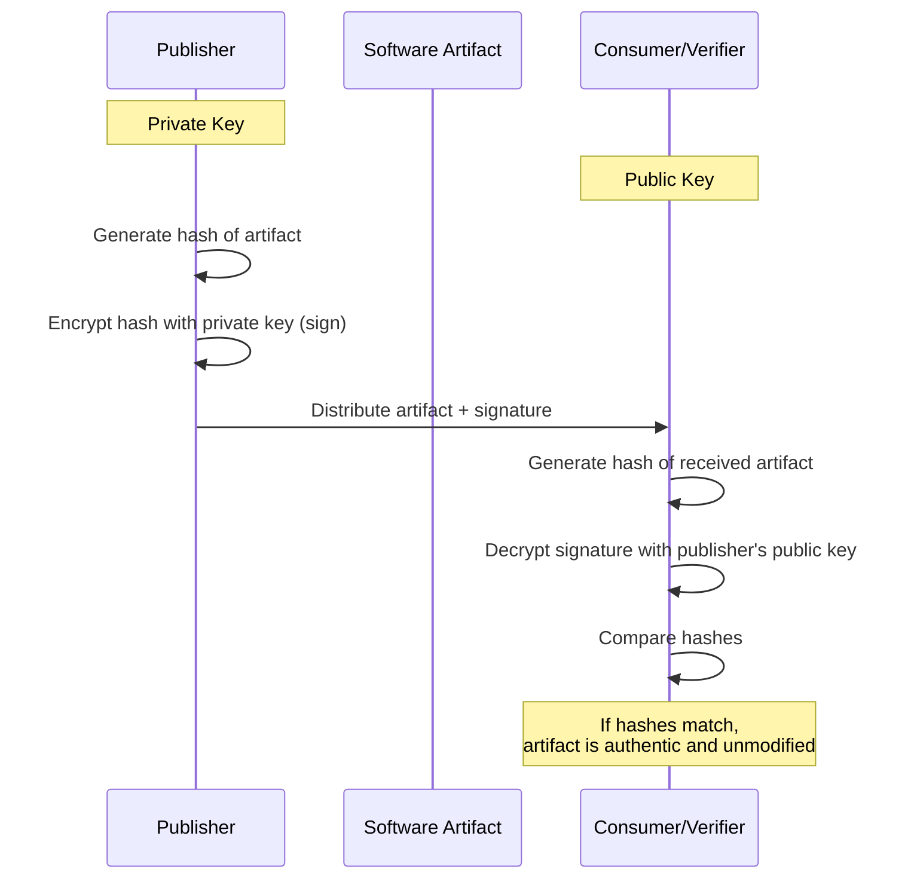
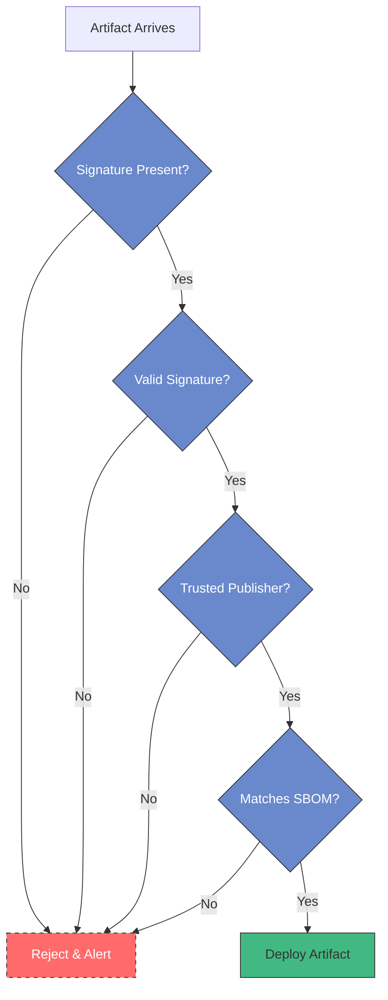
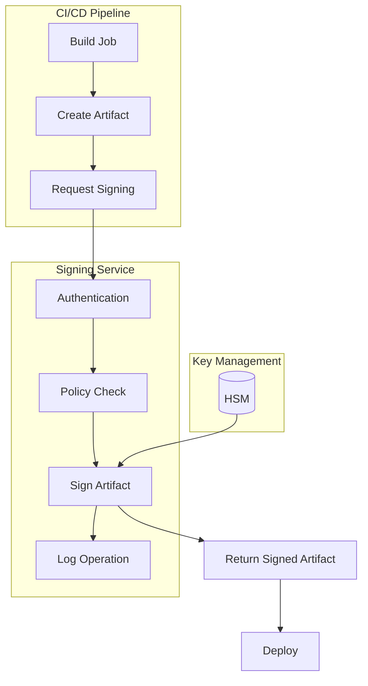
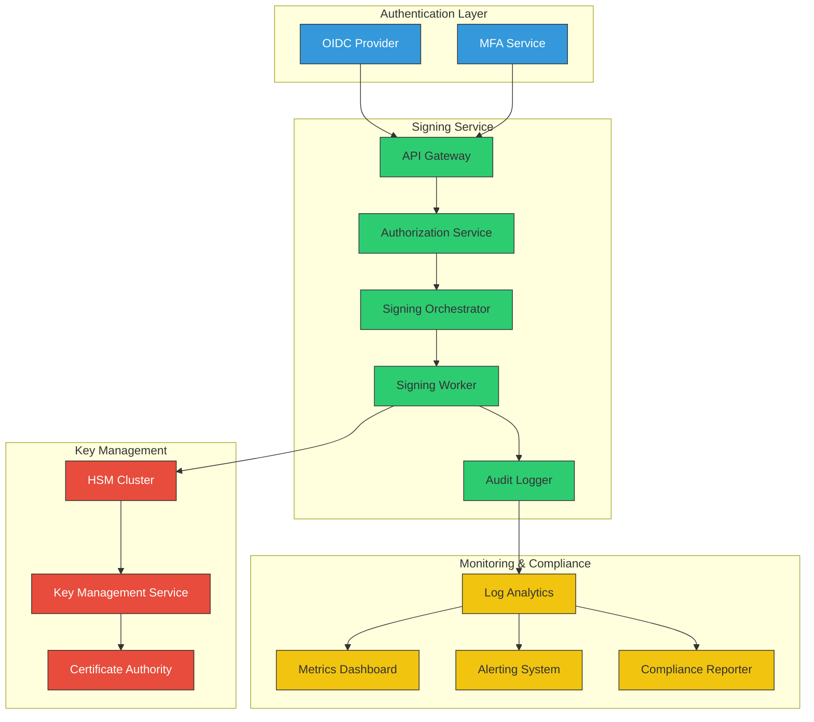
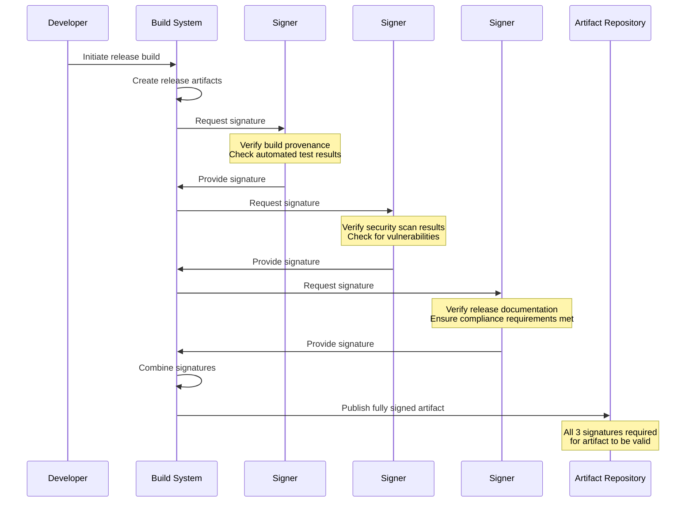
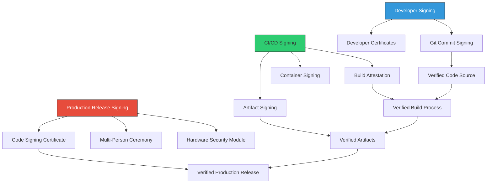
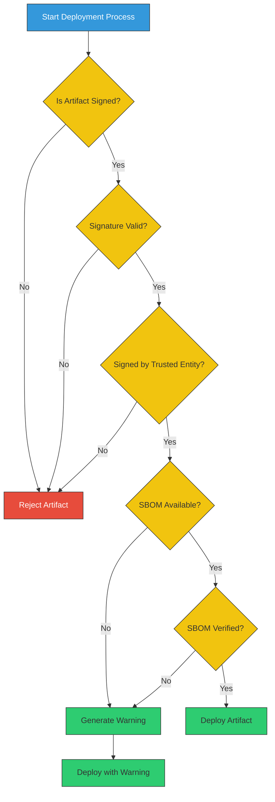

# Artifact Signing in CI/CD

<div class="secure-component">
<span class="security-badge badge-info">INTEGRITY CONTROL</span>

Artifact signing is a foundational security control that creates a verifiable chain of trust for software throughout the supply chain. This guide covers implementation strategies and best practices.
</div>

Artifact signing is a crucial practice in the CI/CD process that ensures the integrity and authenticity of software artifacts. By signing artifacts, developers can provide assurance that the artifacts have not been tampered with and originate from a trusted source.

## How Artifact Signing Works

Artifact signing uses cryptographic techniques to create a verifiable link between the software artifact and its creator or publisher. The process involves generating a digital signature that can be verified by recipients.



### Cryptographic Foundations

Artifact signing relies on asymmetric cryptography:

1. The **private key** is used by the publisher to create the signature
2. The **public key** is distributed to users to verify the signature
3. The **cryptographic hash** provides a unique fingerprint of the artifact
4. The **signature** is the encrypted hash that proves authenticity

## Importance of Artifact Signing

1. **Integrity**: Signing artifacts helps verify that the code has not been altered after it was built. This is essential for maintaining the trustworthiness of the software.

2. **Authenticity**: A signature confirms the identity of the publisher, allowing users to verify that the artifact comes from a legitimate source.

3. **Compliance**: Many regulatory frameworks require the use of signing to ensure that software components meet security standards.

4. **Non-Repudiation**: Signed artifacts cannot be disavowed by the signer, providing accountability in the software supply chain.

5. **Trust Establishment**: Signatures create verifiable trust chains from developer to end user across the entire software distribution process.

!!! warning "SolarWinds Attack Implications"
    The 2020 SolarWinds attack demonstrated the critical importance of artifact signing. Attackers were able to inject malicious code into the build process, which was then signed with SolarWinds' legitimate code-signing certificate. While the attack still succeeded, proper verification of build provenance and more granular signing could have helped detect the compromise.

## Types of Artifacts to Sign

Organizations should implement signing for all artifact types across the development and deployment pipeline:

| Artifact Type | Examples | Signing Method | Verification Point |
|---------------|----------|----------------|-------------------|
| **Source Code** | Git commits, tags | GPG/SSH signatures | Code review, CI pipeline |
| **Packages** | NPM, PyPI, Maven | Package-specific, sigstore | Installation, CI pipeline |
| **Containers** | Docker images, OCI | Cosign, Notary | Before deployment |
| **Executables** | .exe, .msi, .appx | Authenticode, codesign | Installation time |
| **Firmware** | BIOS, device firmware | Hardware-backed signing | Boot time |
| **Infrastructure** | Terraform, CloudFormation | Checksums, OIDC | Before application |

## Key Signing Technologies

### Code Signing Certificates

X.509 certificates issued by Certificate Authorities (CAs) that verify the identity of the publisher:

```bash
# Windows Authenticode signing example
signtool sign /a /tr http://timestamp.digicert.com /td sha256 /fd sha256 app.exe

# macOS code signing example
codesign --sign "Developer ID Application: Your Company (ABCDE12345)" app.dmg
```

### Sigstore/Cosign

Sigstore is an open-source project aimed at improving software supply chain integrity by making code signing more accessible:

```bash
# Sign a container with key-based signing
cosign sign --key cosign.key myregistry.io/myimage:v1.0

# Sign with keyless method using OIDC identity
cosign sign myregistry.io/myimage:v1.0

# Verify a signed container image
cosign verify myregistry.io/myimage:v1.0
```

### GPG/PGP Signing

Used primarily for signing Git commits, tags, and some package formats:

```bash
# Configure Git to use GPG signing
git config --global user.signingkey YOUR_GPG_KEY_ID
git config --global commit.gpgsign true

# Sign a tag
git tag -s v1.0.0 -m "Release v1.0.0"

# Verify a tag
git verify-tag v1.0.0
```

## Best Practices for Artifact Signing

### Key Management

- **Use Hardware Security Modules (HSMs)** for storing production signing keys
- **Implement key rotation schedules** to limit the impact of key compromise
- **Establish clear custody chains** for access to signing keys
- **Create separate signing keys** for different environments (development, staging, production)
- **Implement multi-party signing ceremonies** for critical releases

### Process Integration

- **Automate the Signing Process**: Integrate artifact signing into the CI/CD pipeline to ensure that all artifacts are signed consistently and automatically.

```yaml
# Example GitHub Action for signing a container
name: Sign Container

on:
  push:
    tags: ['v*']

jobs:
  sign:
    runs-on: ubuntu-latest
    steps:
      - uses: actions/checkout@v3
      
      - name: Set up Cosign
        uses: sigstore/cosign-installer@main
      
      - name: Log in to registry
        run: echo "${{ secrets.REGISTRY_PASSWORD }}" | docker login -u ${{ secrets.REGISTRY_USERNAME }} --password-stdin
      
      - name: Build and push image
        run: |
          docker build -t registry.example.com/app:${{ github.ref_name }} .
          docker push registry.example.com/app:${{ github.ref_name }}
      
      - name: Sign the container
        run: |
          cosign sign --key cosign.key \
            registry.example.com/app:${{ github.ref_name }}
        env:
          COSIGN_PASSWORD: ${{ secrets.COSIGN_PASSWORD }}
```

- **Generate and verify SBOMs** during the signing process to document artifact contents
- **Implement signing policies** that define which artifacts require signatures
- **Use attestations** to document build environment and process characteristics

### Verification and Enforcement



- **Verify Signatures**: Implement checks to verify signatures before deploying artifacts to production environments.
- **Enforce signature verification** at runtime for critical components
- **Implement trust policies** that define which signatures are trusted
- **Use binary transparency** frameworks to log and verify artifact publication
- **Monitor and alert** on signature verification failures

## Implementation Approaches

### Centralized Signing Service

Creating a dedicated signing service that handles all artifact signing requests:



- Provides centralized logging and audit trail
- Enforces consistent signing policies
- Allows better key protection
- Enables multi-party authorization

### Keyless Signing with OIDC

Modern approaches like Sigstore's keyless signing remove the need to manage signing keys:

1. The developer authenticates with an identity provider (e.g., GitHub, Google)
2. A short-lived signing key is generated
3. The artifact is signed with this ephemeral key
4. The signature, certificate, and artifact hash are recorded in a transparent log
5. The ephemeral private key is discarded

This approach provides:
- Verification tied to developer identity
- Elimination of long-term key management issues
- Public transparency logs of all signed artifacts

## Regulatory and Compliance Considerations

Many industries and governments now mandate code signing:

- **US Executive Order 14028** emphasizes software supply chain security including signed releases
- **EU Cyber Resilience Act** proposes requirements for signed software
- **SLSA Framework** (Supply chain Levels for Software Artifacts) includes signing as a key component
- **PCI DSS** requires code signing for payment application development

## Conclusion

Artifact signing is no longer optional but a fundamental control for ensuring software supply chain integrity. By implementing comprehensive signing across all artifact types and enforcing verification, organizations can dramatically reduce the risk of supply chain compromise.

!!! info "Implementation Checklist"
    1. ✅ Identify all artifact types in your environment
    2. ✅ Select appropriate signing technologies for each
    3. ✅ Implement secure key management practices
    4. ✅ Integrate signing into CI/CD pipelines
    5. ✅ Configure verification at deployment and runtime
    6. ✅ Monitor for signing or verification failures
    7. ✅ Document procedures for key rotation and recovery
    8. ✅ Train developers and operators on signing importance

## Advanced Signing Architectures

As organizations scale their signing operations, more sophisticated architectures become necessary to maintain security while enabling efficient processes.

### Enterprise Signing Service Architecture



Key components of an enterprise signing service:

1. **Authentication & Authorization**
   - Multi-factor authentication for signing requests
   - Fine-grained authorization policies
   - Just-in-time access for critical operations

2. **Signing Infrastructure**
   - Redundant, geographically distributed signing capabilities
   - Automated key rotation
   - Support for multiple signing technologies and formats

3. **Monitoring & Compliance**
   - Real-time monitoring of signing operations
   - Anomaly detection for unusual signing patterns
   - Compliance reporting and attestation

4. **Hardware Security**
   - FIPS 140-2/3 validated HSMs
   - Physical security controls
   - Tamper-evident seals and monitoring

### Multi-Party Signing for Critical Releases

For high-value software releases, multi-party signing provides additional security through consensus requirements:



Implementation considerations:

1. **Quorum Requirements**: Define the minimum number of signatures required (e.g., 2 of 3, 3 of 5)
2. **Role Separation**: Ensure signers represent different organizational roles
3. **Timeout Handling**: Define procedures for when signatures aren't provided in time
4. **Emergency Procedures**: Create break-glass procedures for urgent situations
5. **Audit Trail**: Maintain comprehensive records of signature requests and approvals

## Signing Implementation Patterns

### Pattern 1: Developer and CI/CD Signing

This pattern combines developer-level signing (for code commits) with CI/CD-level signing (for artifacts):



### Pattern 2: Keyless Signing with OIDC

Modern approaches like Sigstore's keyless signing remove the need to manage signing keys:

```yaml
# Example GitHub Action for keyless signing with Sigstore
name: Keyless Signing

on:
  push:
    tags:
      - 'v*'

jobs:
  sign:
    runs-on: ubuntu-latest
    permissions:
      contents: read
      id-token: write # Required for keyless signing
      
    steps:
      - uses: actions/checkout@v3
      
      - name: Build artifact
        run: make build
        
      - name: Install cosign
        uses: sigstore/cosign-installer@main
        
      - name: Sign the artifact with GitHub OIDC
        run: |
          # Keyless signing with GitHub identity
          cosign sign-blob \
            --output-signature artifact.sig \
            --output-certificate artifact.crt \
            artifact.bin
            
      - name: Verify signature
        run: |
          cosign verify-blob \
            --signature artifact.sig \
            --certificate artifact.crt \
            artifact.bin
            
      - name: Upload signed artifact
        uses: actions/upload-artifact@v3
        with:
          name: signed-artifact
          path: |
            artifact.bin
            artifact.sig
            artifact.crt
```

This approach provides:
- Verification tied to developer identity
- Elimination of long-term key management issues
- Public transparency logs of all signed artifacts
- Short-lived certificates that reduce key compromise risk

### Pattern 3: Threshold Signing with Multiple Parties

For high-security environments, threshold cryptography allows signing to occur only when multiple parties agree:

```python
# Conceptual implementation of threshold signing (t-of-n)
from shamir import split_secret, combine_shares
import cryptography.signatures as sig

# Setup: Split signing key into n shares, t required to reconstruct
def setup_threshold_signing(key, t, n):
    """Split a signing key into n shares, requiring t shares to reconstruct."""
    return split_secret(key, t, n)

# Signing: Requires t participants to contribute their shares
def threshold_sign(message, shares, t):
    """Sign a message using at least t shares of the key."""
    # Collect at least t shares from participants
    collected_shares = []  # In practice, these would come from different people
    
    # Reconstruct the private key using t shares
    if len(collected_shares) >= t:
        private_key = combine_shares(collected_shares)
        # Sign the message with the reconstructed key
        return sig.sign(message, private_key)
    else:
        raise ValueError(f"Need at least {t} shares, only {len(collected_shares)} provided")
```

## Implementation by Artifact Type

### Source Code Signing

```bash
# Set up Git for commit signing
git config --global user.signingkey <YOUR_GPG_KEY_ID>
git config --global commit.gpgsign true

# Sign a commit
git commit -S -m "Add important feature"

# Sign a tag
git tag -s v1.0.0 -m "Release version 1.0.0"

# Verify a signed tag
git verify-tag v1.0.0

# Configure GitHub to require signed commits for protected branches
# (This would be done through GitHub repository settings)
```

### Package Signing

**NPM Packages:**

```bash
# Generate keys for npm package signing
npm login
npm profile enable-2fa auth-and-writes

# Publish a signed npm package
npm publish --provenance

# Verify npm package
npm audit signatures <package-name>
```

**Python Packages:**

```bash
# Generate GPG key for package signing
gpg --gen-key

# Configure PyPI token
poetry config pypi-token.pypi <your-token>

# Build and sign package
poetry build
gpg --detach-sign -a dist/*.tar.gz
gpg --detach-sign -a dist/*.whl

# Upload signed package
poetry publish
```

### Container Signing with Cosign

```bash
# Generate a keypair
cosign generate-key-pair

# Sign a container image
cosign sign --key cosign.key \
  registry.example.com/myapp:1.0.0

# Verify a container image
cosign verify --key cosign.pub \
  registry.example.com/myapp:1.0.0

# Add attestations (SBOM)
cosign attest --key cosign.key \
  --type cyclonedx \
  --predicate sbom.json \
  registry.example.com/myapp:1.0.0
```

### Binary/Executable Signing

**Windows Authenticode:**

```powershell
# Sign an executable with a certificate from the Windows certificate store
$cert = Get-ChildItem -Path Cert:\CurrentUser\My -CodeSigningCert
Set-AuthenticodeSignature -FilePath .\MyApp.exe -Certificate $cert

# Sign with timestamp
Set-AuthenticodeSignature -FilePath .\MyApp.exe -Certificate $cert -TimestampServer "http://timestamp.digicert.com"

# Verify signature
Get-AuthenticodeSignature -FilePath .\MyApp.exe | Format-List
```

**macOS Signing:**

```bash
# Sign a macOS application
codesign --sign "Developer ID Application: Your Company (ABCDE12345)" \
  --options runtime \
  --timestamp \
  ./MyApp.app

# Verify macOS signature
codesign --verify --verbose ./MyApp.app
```

## Verification Workflows

### Runtime Verification



### CI/CD Integration for Verification

**GitHub Actions Example:**

```yaml
name: Verify Artifact Signatures

on:
  workflow_dispatch:
    inputs:
      image:
        description: 'Image to verify'
        required: true
        type: string

jobs:
  verify:
    runs-on: ubuntu-latest
    
    steps:
      - name: Install cosign
        uses: sigstore/cosign-installer@main
      
      - name: Verify container signature
        run: |
          # Verify using public key
          cosign verify \
            --key cosign.pub \
            ${{ github.event.inputs.image }}
      
      - name: Verify attestations
        run: |
          # Verify SBOM attestation
          cosign verify-attestation \
            --key cosign.pub \
            --type cyclonedx \
            ${{ github.event.inputs.image }}
          
          # Extract SBOM for vulnerability scanning
          cosign download attestation \
            --key cosign.pub \
            ${{ github.event.inputs.image }} > attestation.json
      
      - name: Check SBOM for vulnerabilities
        run: |
          # Extract SBOM from attestation
          cat attestation.json | jq -r '.payload' | base64 -d | jq -r '.predicate' > sbom.json
          
          # Use Grype to scan SBOM for vulnerabilities
          grype sbom:sbom.json --fail-on high
```

## Custom Signature Verification Tools

Organizations often need to build custom tools to verify signatures across their supply chain:

```python
# Example Python script for batch signature verification
#!/usr/bin/env python3
import os
import sys
import subprocess
import json

def verify_container_signature(image_name, public_key=None):
    """Verify a container signature using cosign."""
    cmd = ["cosign", "verify"]
    if public_key:
        cmd.extend(["--key", public_key])
    else:
        # Use keyless verification
        cmd.append("--certificate-identity-regexp=.*")
        cmd.append("--certificate-oidc-issuer=https://token.actions.githubusercontent.com")
    
    cmd.append(image_name)
    
    try:
        result = subprocess.run(cmd, capture_output=True, text=True, check=True)
        return True, result.stdout
    except subprocess.CalledProcessError as e:
        return False, e.stderr

def verify_artifact_signature(artifact_path, signature_path, public_key):
    """Verify a file signature using OpenSSL."""
    cmd = [
        "openssl", "dgst", "-sha256", 
        "-verify", public_key,
        "-signature", signature_path,
        artifact_path
    ]
    
    try:
        result = subprocess.run(cmd, capture_output=True, text=True, check=True)
        return True, result.stdout
    except subprocess.CalledProcessError as e:
        return False, e.stderr

def batch_verify(manifest_path):
    """Verify all artifacts listed in a manifest file."""
    with open(manifest_path, 'r') as f:
        manifest = json.load(f)
    
    results = {
        "verified": [],
        "failed": []
    }
    
    for item in manifest["artifacts"]:
        artifact_type = item["type"]
        
        if artifact_type == "container":
            success, output = verify_container_signature(
                item["image"],
                item.get("public_key")
            )
        elif artifact_type == "file":
            success, output = verify_artifact_signature(
                item["path"],
                item["signature"],
                item["public_key"]
            )
        else:
            success = False
            output = f"Unsupported artifact type: {artifact_type}"
        
        if success:
            results["verified"].append({
                "artifact": item,
                "message": "Verified successfully"
            })
        else:
            results["failed"].append({
                "artifact": item,
                "error": output
            })
    
    return results

if __name__ == "__main__":
    if len(sys.argv) < 2:
        print("Usage: verify_signatures.py <manifest_path>")
        sys.exit(1)
        
    results = batch_verify(sys.argv[1])
    
    # Print results
    print(f"✅ Verified {len(results['verified'])} artifacts")
    
    if results["failed"]:
        print(f"❌ Failed to verify {len(results['failed'])} artifacts:")
        for fail in results["failed"]:
            print(f"  - {fail['artifact'].get('path', fail['artifact'].get('image'))}: {fail['error']}")
        sys.exit(1)
    
    sys.exit(0)
```

## Signing Maturity Model

Organizations can assess their artifact signing maturity using this framework:

| Level | Description | Key Characteristics | Example Practices |
|-------|-------------|---------------------|-------------------|
| **Level 1: Ad-hoc** | Basic, inconsistent signing | Manual signing processes, limited verification | Occasional code signing, no enforcement |
| **Level 2: Repeatable** | Standardized signing for critical components | Documented processes, basic key management | CI/CD signing for releases, manual key management |
| **Level 3: Defined** | Comprehensive signing across artifacts | Automated signing in pipelines, formal key management | All artifacts signed, HSM for key storage, verification gates |
| **Level 4: Managed** | Measured, optimized signing operations | Metrics-driven, integrated with risk management | Multi-party signing, anomaly detection, signing SLAs |
| **Level 5: Optimizing** | Advanced signing infrastructure | Continuous improvement, innovative approaches | Threshold cryptography, automated key rotation, transparency logs |

## Common Challenges and Solutions

### Key Management Challenges

| Challenge | Solution | Implementation Example |
|-----------|----------|------------------------|
| **Key Protection** | Use Hardware Security Modules | Configure YubiHSM for code signing with restricted access |
| **Key Distribution** | Implement secure key distribution protocols | Use Hashicorp Vault for dynamic key issuance with short TTL |
| **Key Rotation** | Automate key rotation procedures | Script to generate, distribute, and update keys quarterly |
| **Recovery Planning** | Establish backup and recovery processes | Air-gapped backup HSMs with m-of-n recovery scheme |
| **Access Control** | Implement robust access policies | Require MFA and quorum approval for signing operations |

### Scaling Challenges

| Challenge | Solution | Implementation Example |
|-----------|----------|------------------------|
| **High Volume Signing** | Deploy distributed signing infrastructure | Regional signing services with load balancing |
| **Verification Performance** | Implement caching and parallel verification | Signature verification proxy with result caching |
| **Developer Experience** | Create user-friendly tools and processes | CLI tools and IDE plugins for seamless signing |
| **Cross-Platform Support** | Standardize on portable signature formats | Use cosign, which works across container registries |
| **Integration Complexity** | Create reusable integration components | Shared libraries and CI templates for signing |

## Future Trends in Artifact Signing

The field of artifact signing continues to evolve with several emerging technologies and approaches:

1. **Transparent Supply Chains**
   - Public transparency logs (like Certificate Transparency for signing)
   - Verifiable build systems with cryptographic attestations
   - Distributed verification networks

2. **Post-Quantum Cryptography**
   - Transition to quantum-resistant algorithms
   - Hybrid signature schemes during transition
   - New key management approaches for PQC algorithms

3. **Identity-Based Signing**
   - Further development of ephemeral certificate approaches
   - Integration with organizational identity systems
   - Attribute-based verification policies

4. **Policy-Driven Verification**
   - Dynamic verification requirements based on risk
   - Context-aware signature validation
   - Integration with software supply chain risk management

## Conclusion

Artifact signing is a fundamental control for software supply chain security, providing a cryptographic guarantee of integrity and authenticity. By implementing comprehensive signing across all artifact types and enforcing verification, organizations can dramatically reduce the risk of supply chain compromise.

A robust artifact signing strategy should include:
- End-to-end signing from source code to deployment
- Strong key management practices
- Automated verification at critical points
- Clear policies and procedures for signing operations
- Regular assessment and improvement of signing practices

As supply chain attacks continue to increase in sophistication, artifact signing serves as a critical defense by ensuring that only authorized, unmodified software enters your environment.

!!! info "Implementation Checklist"
    1. ✅ Identify all artifact types in your environment
    2. ✅ Select appropriate signing technologies for each
    3. ✅ Implement secure key management practices
    4. ✅ Integrate signing into CI/CD pipelines
    5. ✅ Configure verification at deployment and runtime
    6. ✅ Monitor for signing or verification failures
    7. ✅ Document procedures for key rotation and recovery
    8. ✅ Train developers and operators on signing importance