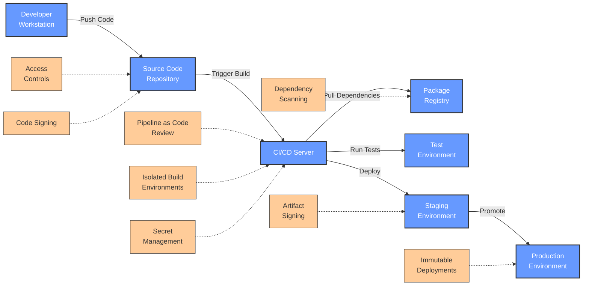
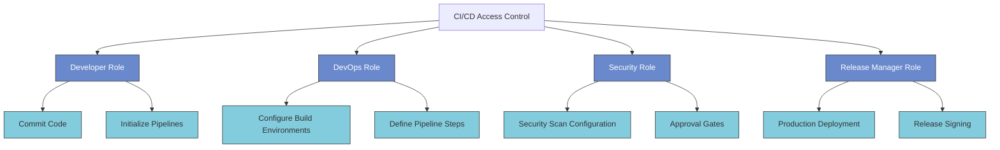
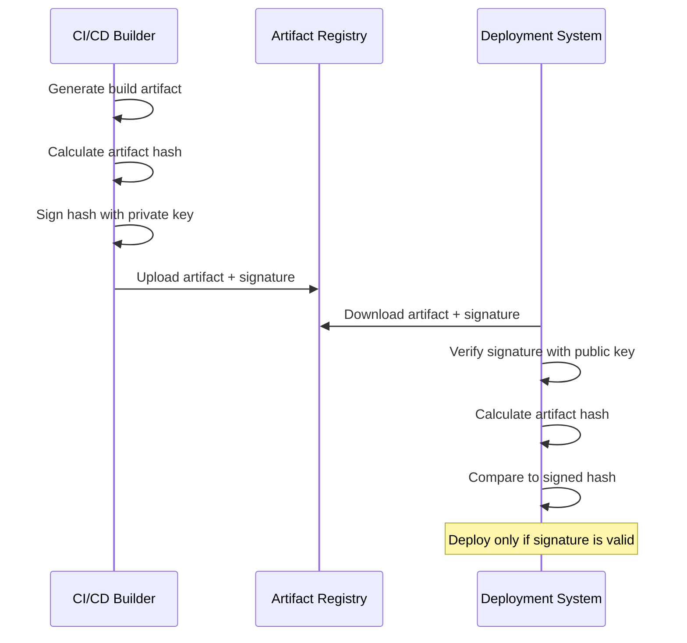
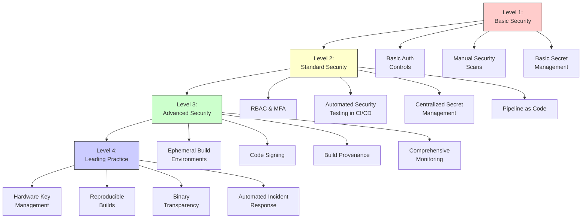

# Security Measures for CI/CD Pipelines

<div class="secure-component">
<span class="security-badge badge-warning">CRITICAL INFRASTRUCTURE</span>

CI/CD pipelines represent a high-value target for attackers seeking to compromise software supply chains. This guide provides comprehensive security controls to protect these essential systems.
</div>

In the modern software development landscape, Continuous Integration and Continuous Deployment (CI/CD) pipelines play a crucial role in automating the software delivery process. However, these pipelines can also introduce security vulnerabilities if not properly managed. This document outlines key security measures that should be implemented to ensure the integrity and security of CI/CD pipelines.

## CI/CD Pipeline Architecture and Security Considerations



## Understanding CI/CD Pipeline Risks

CI/CD pipelines face several security risks that can compromise the integrity of your software:

| Risk Category | Description | Potential Impact |
|---------------|-------------|-----------------|
| **Unauthorized Access** | Attackers gaining access to build systems | Code tampering, credential theft |
| **Supply Chain Injection** | Malicious code or dependencies inserted during build | Backdoors, data exfiltration |
| **Credential Exposure** | Sensitive keys and tokens exposed in build logs or scripts | Account compromise, lateral movement |
| **Insecure Pipeline Configuration** | Misconfigured pipelines allowing security bypasses | Bypassed security controls |
| **Tampering with Build Artifacts** | Unauthorized modifications to compiled code or containers | Distribution of compromised software |

!!! warning "The Codecov Attack"
    In 2021, attackers compromised the bash uploader script at Codecov, a popular code coverage tool. This allowed them to exfiltrate environment variables and secrets from thousands of CI/CD pipelines that used the tool. This attack demonstrates how a compromised build tool can lead to widespread supply chain breaches.

## Key CI/CD Security Controls

### 1. Access Controls and Permissions

Implement strict access controls to limit who can modify pipelines or deploy code:



- **Implement Role-Based Access Control (RBAC)** with least privilege principles
- **Separate duties** between pipeline configuration and code deployment
- **Require Multi-Factor Authentication** for all CI/CD system access
- **Audit access regularly** and remove permissions for team members who no longer need them
- **Implement protected branches** requiring code reviews before merging

**Example GitHub Protected Branch Configuration:**
```yaml
# .github/settings.yml
branches:
  - name: main
    protection:
      required_pull_request_reviews:
        required_approving_review_count: 2
        dismiss_stale_reviews: true
        require_code_owner_reviews: true
      required_status_checks:
        strict: true
        contexts: ["security/scan", "tests"]
      enforce_admins: true
      restrictions:
        users: []
        teams: ["release-managers"]
```

### 2. Secure Pipeline Configuration

Ensure that CI/CD pipelines are secured from initial configuration:

- **Use Pipeline as Code** with all pipeline definitions stored in version-controlled repositories
- **Validate pipeline configuration files** through linting and security scanning
- **Implement configuration drift detection** to prevent unauthorized changes
- **Keep CI/CD systems and runners updated** with security patches
- **Disable features not in use** to reduce attack surface

**Example GitLab CI Security Configuration:**
```yaml
# .gitlab-ci.yml
variables:
  SECURE_FILES_ENABLED: "true"
  SECURE_ANALYZERS_PREFIX: "registry.gitlab.com/security-products"

include:
  - template: Security/SAST.gitlab-ci.yml
  - template: Security/Dependency-Scanning.gitlab-ci.yml
  - template: Security/Secret-Detection.gitlab-ci.yml

stages:
  - test
  - build
  - security
  - deploy

# Job definitions would follow...
```

### 3. Isolated Build Environments

Implement isolated, ephemeral build environments to prevent cross-contamination and ensure clean builds:

- **Use containerized builds** that start fresh for each pipeline run
- **Implement infrastructure as code** for build environment consistency
- **Regularly rotate build agents/runners** to prevent persistent compromises
- **Ensure network isolation** of build environments from production systems
- **Use separate build agents** for different security tiers of projects

**Example Docker Build Configuration:**
```yaml
# .github/workflows/build.yml
jobs:
  build:
    runs-on: ubuntu-latest
    container:
      image: node:18-alpine
      options: --read-only --tmpfs /tmp:exec --network-alias build
    
    steps:
      - uses: actions/checkout@v3
      # Build steps follow...
```

### 4. Secret Management

Implement robust secret management practices to prevent credentials from being exposed:

- **Use a dedicated secret management service** like HashiCorp Vault, AWS Secrets Manager, or Azure Key Vault
- **Rotate secrets regularly** and after team member departures
- **Implement just-in-time access** for credentials needed during builds
- **Audit secret usage** to detect abnormal access patterns
- **Scan repositories and build logs** to detect accidentally committed secrets

**Example Jenkins Credential Management:**
```groovy
// Jenkinsfile
pipeline {
    agent any
    
    environment {
        // Credentials defined in Jenkins credential store
        AWS_CREDS = credentials('aws-deploy-credentials')
    }
    
    stages {
        stage('Deploy') {
            steps {
                // AWS credentials injected as environment variables
                sh 'aws s3 cp ./dist s3://my-bucket/ --recursive'
            }
        }
    }
}
```

### 5. Dependency and Vulnerability Scanning

Implement comprehensive scanning to detect vulnerabilities throughout the build process:

- **Scan all dependencies** for known vulnerabilities before including them
- **Use Software Composition Analysis (SCA)** tools to create and maintain SBOMs
- **Implement policy-based blocking** of builds with critical vulnerabilities
- **Continuously monitor for new vulnerabilities** in existing dependencies
- **Scan container images** before deployment and in runtime

**Example GitHub Action for Dependency Scanning:**
```yaml
# .github/workflows/security.yml
name: Security Scan
on: [push, pull_request]

jobs:
  scan:
    runs-on: ubuntu-latest
    steps:
      - uses: actions/checkout@v3
      
      - name: Run Trivy vulnerability scanner
        uses: aquasecurity/trivy-action@master
        with:
          scan-type: 'fs'
          scan-ref: '.'
          format: 'table'
          exit-code: '1'
          ignore-unfixed: true
          severity: 'CRITICAL,HIGH'
```

### 6. Artifact Signing and Verification

Implement cryptographic signing to ensure the integrity of build artifacts:



- **Implement code signing** with properly secured private keys
- **Use hardware security modules (HSMs)** for critical signing operations
- **Establish a chain of trust** by signing all artifacts (containers, packages, binaries)
- **Verify signatures before deployment** as an automated step
- **Implement key rotation procedures** and secure backup of signing keys

**Example Sigstore/Cosign Container Signing:**
```bash
# Sign a container image
cosign sign --key cosign.key \
  my-registry.example.com/my-app:v1.0.0

# Verify a container image
cosign verify --key cosign.pub \
  my-registry.example.com/my-app:v1.0.0
```

### 7. Immutable and Verifiable Builds

Implement reproducible builds to ensure consistency and detect tampering:

- **Use deterministic build processes** that produce identical outputs for the same inputs
- **Record build provenance data** including source code commit, build environment, and dependencies
- **Store build logs securely** for audit purposes
- **Create verifiable build attestations** documenting the build process
- **Implement binary transparency** to track changes in build outputs over time

**Example SLSA Build Provenance:**
```json
{
  "builder": {
    "id": "https://github.com/actions/runner"
  },
  "buildType": "https://github.com/actions/runner/build",
  "invocation": {
    "configSource": {
      "uri": "git+https://github.com/example/repo@refs/heads/main",
      "digest": {"sha1": "abc123"}
    },
    "parameters": {},
    "environment": {
      "github_event_name": "push",
      "github_run_id": "1234567890"
    }
  },
  "buildConfig": {
    "commands": ["npm ci", "npm run build"]
  },
  "metadata": {
    "completeness": {
      "parameters": true,
      "environment": true,
      "materials": true
    },
    "reproducible": false
  },
  "materials": [
    {
      "uri": "git+https://github.com/example/repo@refs/heads/main",
      "digest": {"sha1": "abc123"}
    },
    {
      "uri": "pkg:npm/left-pad@1.3.0",
      "digest": {"sha512": "def456"}
    }
  ]
}
```

### 8. Monitoring and Logging

Implement comprehensive monitoring to detect security issues in real-time:

- **Centralize and secure logs** from all pipeline components
- **Implement log integrity mechanisms** to prevent tampering
- **Set up anomaly detection** for unusual pipeline behavior
- **Monitor for unauthorized changes** to pipeline configurations
- **Establish alert thresholds** for suspicious activities, like unusual build times or resources

**Example ELK Stack Configuration for CI/CD Monitoring:**
```yaml
# filebeat.yml for CI/CD logs
filebeat.inputs:
- type: log
  enabled: true
  paths:
    - /var/log/jenkins/jenkins.log
    - /var/log/github-actions/*.log
  fields:
    source: ci_cd

output.elasticsearch:
  hosts: ["elasticsearch:9200"]
  index: "cicd-logs-%{+yyyy.MM.dd}"

# Alert rule example
PUT _watcher/watch/unusual_build_time
{
  "trigger": { "schedule": { "interval": "10m" } },
  "input": {
    "search": {
      "request": {
        "indices": ["cicd-logs-*"],
        "body": {
          "query": {
            "bool": {
              "must": [
                { "range": { "build.duration": { "gt": 3600 } } },
                { "term": { "project.name": "critical-app" } }
              ]
            }
          }
        }
      }
    }
  },
  "condition": { "compare": { "ctx.payload.hits.total": { "gt": 0 } } },
  "actions": {
    "notify_security": {
      "webhook": {
        "scheme": "https",
        "host": "alerts.example.com",
        "port": 443,
        "method": "post",
        "path": "/api/alert",
        "params": {},
        "headers": {},
        "body": "Unusual build time detected for critical-app"
      }
    }
  }
}
```

### 9. Security Testing Integration

Incorporate comprehensive security testing into your pipeline:

- **Implement Static Application Security Testing (SAST)** to detect code vulnerabilities
- **Use Dynamic Application Security Testing (DAST)** for running application testing
- **Perform Infrastructure as Code (IaC) security scans** on deployment templates
- **Implement container security scanning** before deployment
- **Schedule regular penetration tests** of the pipeline itself

**Example Multi-Layer Security Testing in CI/CD:**
```yaml
# .github/workflows/security.yml
name: Security Testing
on: [push]

jobs:
  sast:
    runs-on: ubuntu-latest
    steps:
      - uses: actions/checkout@v3
      - name: SonarCloud Scan
        uses: SonarSource/sonarcloud-github-action@master
        env:
          SONAR_TOKEN: ${{ secrets.SONAR_TOKEN }}
  
  iac-scan:
    runs-on: ubuntu-latest
    steps:
      - uses: actions/checkout@v3
      - name: Scan Terraform
        uses: aquasecurity/tfsec-action@v1.0.0
  
  container-scan:
    runs-on: ubuntu-latest
    steps:
      - uses: actions/checkout@v3
      - name: Build image
        run: docker build -t test-image .
      - name: Scan image
        uses: aquasecurity/trivy-action@master
        with:
          image-ref: 'test-image'
          format: 'table'
          exit-code: '1'
          ignore-unfixed: true
          severity: 'CRITICAL,HIGH'
  
  dast:
    needs: [build, deploy-staging]
    runs-on: ubuntu-latest
    steps:
      - name: ZAP Scan
        uses: zaproxy/action-baseline@v0.7.0
        with:
          target: 'https://staging.example.com/'
```

## CI/CD Security Maturity Model



The CI/CD Security Maturity Model provides a roadmap for organizations to progressively enhance their pipeline security:

### Level 1: Basic Security
- Basic authentication controls
- Manual security scans before major releases
- Simple secret management using environment variables
- Limited logging and monitoring

### Level 2: Standard Security
- RBAC implementation with MFA
- Automated dependency and vulnerability scanning
- Centralized secret management
- Pipeline-as-Code with version control
- Regular security testing

### Level 3: Advanced Security
- Ephemeral, isolated build environments
- Artifact and container signing
- Build provenance attestation
- Comprehensive logging and monitoring
- Automated policy enforcement

### Level 4: Leading Practice
- Hardware security modules for signing
- Fully reproducible and verifiable builds
- Binary transparency for all artifacts
- Automated detection and response to pipeline anomalies
- Regular red team testing of CI/CD infrastructure

## Conclusion and Recommended Actions

Securing CI/CD pipelines requires a comprehensive approach that addresses people, processes, and technology. Organizations should:

1. **Assess your current state** using the maturity model as a guide
2. **Create a roadmap** for implementing missing controls
3. **Prioritize high-impact changes** such as access controls and secret management
4. **Conduct regular security testing** of the pipeline itself
5. **Train developers and operations teams** on secure CI/CD practices

By implementing these controls, organizations can significantly reduce the risk of supply chain attacks originating through their CI/CD pipelines, protecting both their own systems and their customers.

## Conclusion

By implementing these security measures, organizations can significantly reduce the risk of security breaches in their CI/CD pipelines. Continuous improvement and vigilance are essential to maintaining a secure software delivery process.