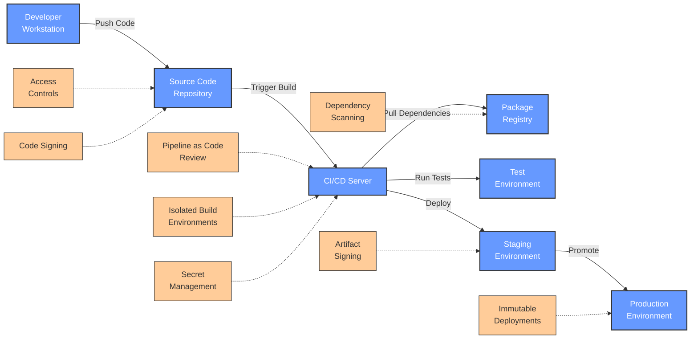
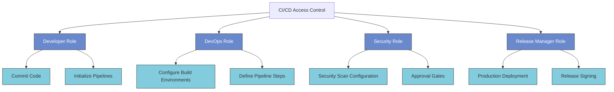
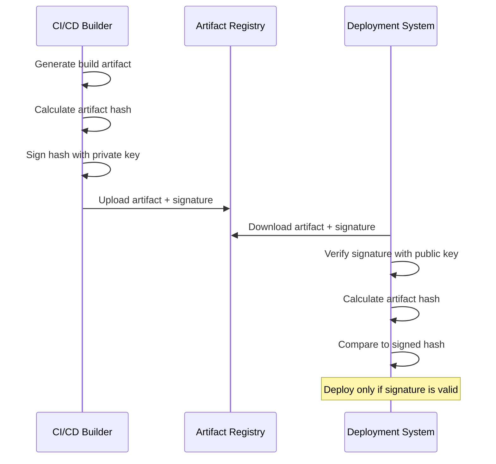
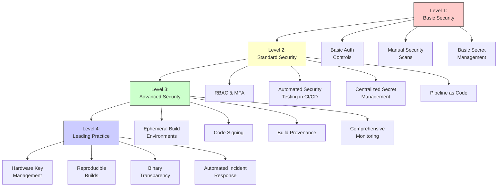
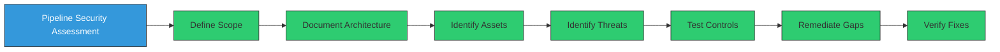
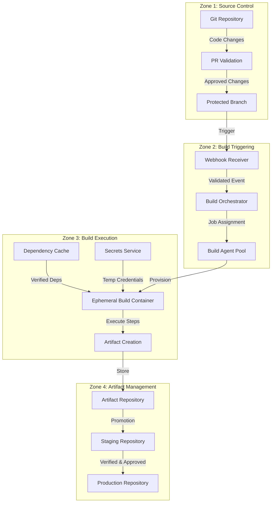
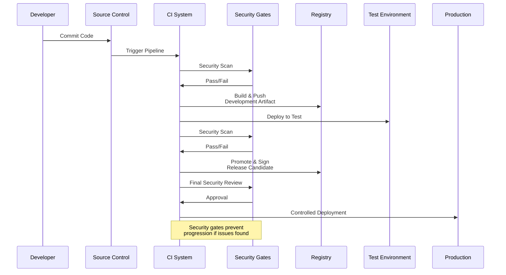
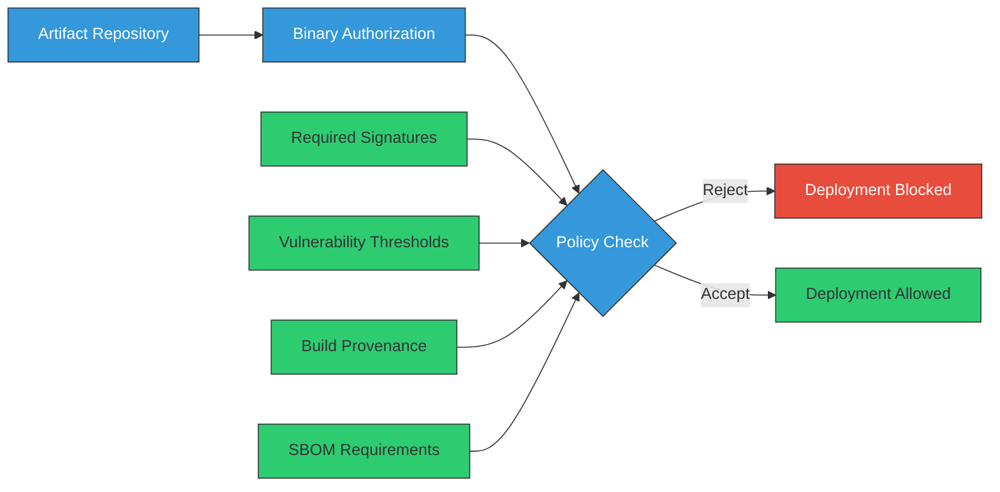
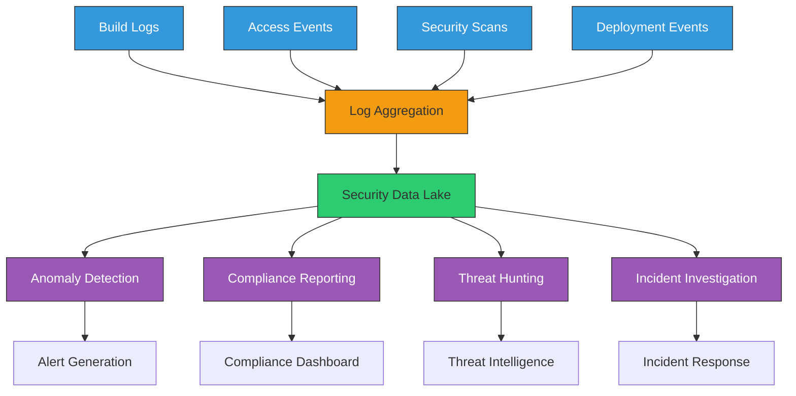

# Security Measures for CI/CD Pipelines

<div class="secure-component">
<span class="security-badge badge-warning">CRITICAL INFRASTRUCTURE</span>

CI/CD pipelines represent a high-value target for attackers seeking to compromise software supply chains. This guide provides comprehensive security controls to protect these essential systems.
</div>

In the modern software development landscape, Continuous Integration and Continuous Deployment (CI/CD) pipelines play a crucial role in automating the software delivery process. However, these pipelines can also introduce security vulnerabilities if not properly managed. This document outlines key security measures that should be implemented to ensure the integrity and security of CI/CD pipelines.

## CI/CD Pipeline Architecture and Security Considerations



## Understanding CI/CD Pipeline Risks

CI/CD pipelines face several security risks that can compromise the integrity of your software:

| Risk Category | Description | Potential Impact |
|---------------|-------------|-----------------|
| **Unauthorized Access** | Attackers gaining access to build systems | Code tampering, credential theft |
| **Supply Chain Injection** | Malicious code or dependencies inserted during build | Backdoors, data exfiltration |
| **Credential Exposure** | Sensitive keys and tokens exposed in build logs or scripts | Account compromise, lateral movement |
| **Insecure Pipeline Configuration** | Misconfigured pipelines allowing security bypasses | Bypassed security controls |
| **Tampering with Build Artifacts** | Unauthorized modifications to compiled code or containers | Distribution of compromised software |

!!! warning "The Codecov Attack"
    In 2021, attackers compromised the bash uploader script at Codecov, a popular code coverage tool. This allowed them to exfiltrate environment variables and secrets from thousands of CI/CD pipelines that used the tool. This attack demonstrates how a compromised build tool can lead to widespread supply chain breaches.

## Key CI/CD Security Controls

### 1. Access Controls and Permissions

Implement strict access controls to limit who can modify pipelines or deploy code:



- **Implement Role-Based Access Control (RBAC)** with least privilege principles
- **Separate duties** between pipeline configuration and code deployment
- **Require Multi-Factor Authentication** for all CI/CD system access
- **Audit access regularly** and remove permissions for team members who no longer need them
- **Implement protected branches** requiring code reviews before merging

**Example GitHub Protected Branch Configuration:**
```yaml
# .github/settings.yml
branches:
  - name: main
    protection:
      required_pull_request_reviews:
        required_approving_review_count: 2
        dismiss_stale_reviews: true
        require_code_owner_reviews: true
      required_status_checks:
        strict: true
        contexts: ["security/scan", "tests"]
      enforce_admins: true
      restrictions:
        users: []
        teams: ["release-managers"]
```

### 2. Secure Pipeline Configuration

Ensure that CI/CD pipelines are secured from initial configuration:

- **Use Pipeline as Code** with all pipeline definitions stored in version-controlled repositories
- **Validate pipeline configuration files** through linting and security scanning
- **Implement configuration drift detection** to prevent unauthorized changes
- **Keep CI/CD systems and runners updated** with security patches
- **Disable features not in use** to reduce attack surface

**Example GitLab CI Security Configuration:**
```yaml
# .gitlab-ci.yml
variables:
  SECURE_FILES_ENABLED: "true"
  SECURE_ANALYZERS_PREFIX: "registry.gitlab.com/security-products"

include:
  - template: Security/SAST.gitlab-ci.yml
  - template: Security/Dependency-Scanning.gitlab-ci.yml
  - template: Security/Secret-Detection.gitlab-ci.yml

stages:
  - test
  - build
  - security
  - deploy

# Job definitions would follow...
```

### 3. Isolated Build Environments

Implement isolated, ephemeral build environments to prevent cross-contamination and ensure clean builds:

- **Use containerized builds** that start fresh for each pipeline run
- **Implement infrastructure as code** for build environment consistency
- **Regularly rotate build agents/runners** to prevent persistent compromises
- **Ensure network isolation** of build environments from production systems
- **Use separate build agents** for different security tiers of projects

**Example Docker Build Configuration:**
```yaml
# .github/workflows/build.yml
jobs:
  build:
    runs-on: ubuntu-latest
    container:
      image: node:18-alpine
      options: --read-only --tmpfs /tmp:exec --network-alias build
    
    steps:
      - uses: actions/checkout@v3
      # Build steps follow...
```

### 4. Secret Management

Implement robust secret management practices to prevent credentials from being exposed:

- **Use a dedicated secret management service** like HashiCorp Vault, AWS Secrets Manager, or Azure Key Vault
- **Rotate secrets regularly** and after team member departures
- **Implement just-in-time access** for credentials needed during builds
- **Audit secret usage** to detect abnormal access patterns
- **Scan repositories and build logs** to detect accidentally committed secrets

**Example Jenkins Credential Management:**
```groovy
// Jenkinsfile
pipeline {
    agent any
    
    environment {
        // Credentials defined in Jenkins credential store
        AWS_CREDS = credentials('aws-deploy-credentials')
    }
    
    stages {
        stage('Deploy') {
            steps {
                // AWS credentials injected as environment variables
                sh 'aws s3 cp ./dist s3://my-bucket/ --recursive'
            }
        }
    }
}
```

### 5. Dependency and Vulnerability Scanning

Implement comprehensive scanning to detect vulnerabilities throughout the build process:

- **Scan all dependencies** for known vulnerabilities before including them
- **Use Software Composition Analysis (SCA)** tools to create and maintain SBOMs
- **Implement policy-based blocking** of builds with critical vulnerabilities
- **Continuously monitor for new vulnerabilities** in existing dependencies
- **Scan container images** before deployment and in runtime

**Example GitHub Action for Dependency Scanning:**
```yaml
# .github/workflows/security.yml
name: Security Scan
on: [push, pull_request]

jobs:
  scan:
    runs-on: ubuntu-latest
    steps:
      - uses: actions/checkout@v3
      
      - name: Run Trivy vulnerability scanner
        uses: aquasecurity/trivy-action@master
        with:
          scan-type: 'fs'
          scan-ref: '.'
          format: 'table'
          exit-code: '1'
          ignore-unfixed: true
          severity: 'CRITICAL,HIGH'
```

### 6. Artifact Signing and Verification

Implement cryptographic signing to ensure the integrity of build artifacts:



- **Implement code signing** with properly secured private keys
- **Use hardware security modules (HSMs)** for critical signing operations
- **Establish a chain of trust** by signing all artifacts (containers, packages, binaries)
- **Verify signatures before deployment** as an automated step
- **Implement key rotation procedures** and secure backup of signing keys

**Example Sigstore/Cosign Container Signing:**
```bash
# Sign a container image
cosign sign --key cosign.key \
  my-registry.example.com/my-app:v1.0.0

# Verify a container image
cosign verify --key cosign.pub \
  my-registry.example.com/my-app:v1.0.0
```

### 7. Immutable and Verifiable Builds

Implement reproducible builds to ensure consistency and detect tampering:

- **Use deterministic build processes** that produce identical outputs for the same inputs
- **Record build provenance data** including source code commit, build environment, and dependencies
- **Store build logs securely** for audit purposes
- **Create verifiable build attestations** documenting the build process
- **Implement binary transparency** to track changes in build outputs over time

**Example SLSA Build Provenance:**
```json
{
  "builder": {
    "id": "https://github.com/actions/runner"
  },
  "buildType": "https://github.com/actions/runner/build",
  "invocation": {
    "configSource": {
      "uri": "git+https://github.com/example/repo@refs/heads/main",
      "digest": {"sha1": "abc123"}
    },
    "parameters": {},
    "environment": {
      "github_event_name": "push",
      "github_run_id": "1234567890"
    }
  },
  "buildConfig": {
    "commands": ["npm ci", "npm run build"]
  },
  "metadata": {
    "completeness": {
      "parameters": true,
      "environment": true,
      "materials": true
    },
    "reproducible": false
  },
  "materials": [
    {
      "uri": "git+https://github.com/example/repo@refs/heads/main",
      "digest": {"sha1": "abc123"}
    },
    {
      "uri": "pkg:npm/left-pad@1.3.0",
      "digest": {"sha512": "def456"}
    }
  ]
}
```

### 8. Monitoring and Logging

Implement comprehensive monitoring to detect security issues in real-time:

- **Centralize and secure logs** from all pipeline components
- **Implement log integrity mechanisms** to prevent tampering
- **Set up anomaly detection** for unusual pipeline behavior
- **Monitor for unauthorized changes** to pipeline configurations
- **Establish alert thresholds** for suspicious activities, like unusual build times or resources

**Example ELK Stack Configuration for CI/CD Monitoring:**
```yaml
# filebeat.yml for CI/CD logs
filebeat.inputs:
- type: log
  enabled: true
  paths:
    - /var/log/jenkins/jenkins.log
    - /var/log/github-actions/*.log
  fields:
    source: ci_cd

output.elasticsearch:
  hosts: ["elasticsearch:9200"]
  index: "cicd-logs-%{+yyyy.MM.dd}"

# Alert rule example
PUT _watcher/watch/unusual_build_time
{
  "trigger": { "schedule": { "interval": "10m" } },
  "input": {
    "search": {
      "request": {
        "indices": ["cicd-logs-*"],
        "body": {
          "query": {
            "bool": {
              "must": [
                { "range": { "build.duration": { "gt": 3600 } } },
                { "term": { "project.name": "critical-app" } }
              ]
            }
          }
        }
      }
    }
  },
  "condition": { "compare": { "ctx.payload.hits.total": { "gt": 0 } } },
  "actions": {
    "notify_security": {
      "webhook": {
        "scheme": "https",
        "host": "alerts.example.com",
        "port": 443,
        "method": "post",
        "path": "/api/alert",
        "params": {},
        "headers": {},
        "body": "Unusual build time detected for critical-app"
      }
    }
  }
}
```

### 9. Security Testing Integration

Incorporate comprehensive security testing into your pipeline:

- **Implement Static Application Security Testing (SAST)** to detect code vulnerabilities
- **Use Dynamic Application Security Testing (DAST)** for running application testing
- **Perform Infrastructure as Code (IaC) security scans** on deployment templates
- **Implement container security scanning** before deployment
- **Schedule regular penetration tests** of the pipeline itself

**Example Multi-Layer Security Testing in CI/CD:**
```yaml
# .github/workflows/security.yml
name: Security Testing
on: [push]

jobs:
  sast:
    runs-on: ubuntu-latest
    steps:
      - uses: actions/checkout@v3
      - name: SonarCloud Scan
        uses: SonarSource/sonarcloud-github-action@master
        env:
          SONAR_TOKEN: ${{ secrets.SONAR_TOKEN }}
  
  iac-scan:
    runs-on: ubuntu-latest
    steps:
      - uses: actions/checkout@v3
      - name: Scan Terraform
        uses: aquasecurity/tfsec-action@v1.0.0
  
  container-scan:
    runs-on: ubuntu-latest
    steps:
      - uses: actions/checkout@v3
      - name: Build image
        run: docker build -t test-image .
      - name: Scan image
        uses: aquasecurity/trivy-action@master
        with:
          image-ref: 'test-image'
          format: 'table'
          exit-code: '1'
          ignore-unfixed: true
          severity: 'CRITICAL,HIGH'
  
  dast:
    needs: [build, deploy-staging]
    runs-on: ubuntu-latest
    steps:
      - name: ZAP Scan
        uses: zaproxy/action-baseline@v0.7.0
        with:
          target: 'https://staging.example.com/'
```

## CI/CD Security Maturity Model



The CI/CD Security Maturity Model provides a roadmap for organizations to progressively enhance their pipeline security:

### Level 1: Basic Security
- Basic authentication controls
- Manual security scans before major releases
- Simple secret management using environment variables
- Limited logging and monitoring

### Level 2: Standard Security
- RBAC implementation with MFA
- Automated dependency and vulnerability scanning
- Centralized secret management
- Pipeline-as-Code with version control
- Regular security testing

### Level 3: Advanced Security
- Ephemeral, isolated build environments
- Artifact and container signing
- Build provenance attestation
- Comprehensive logging and monitoring
- Automated policy enforcement

### Level 4: Leading Practice
- Hardware security modules for signing
- Fully reproducible and verifiable builds
- Binary transparency for all artifacts
- Automated detection and response to pipeline anomalies
- Regular red team testing of CI/CD infrastructure

## Conclusion and Recommended Actions

Securing CI/CD pipelines requires a comprehensive approach that addresses people, processes, and technology. Organizations should:

1. **Assess your current state** using the maturity model as a guide
2. **Create a roadmap** for implementing missing controls
3. **Prioritize high-impact changes** such as access controls and secret management
4. **Conduct regular security testing** of the pipeline itself
5. **Train developers and operations teams** on secure CI/CD practices

By implementing these controls, organizations can significantly reduce the risk of supply chain attacks originating through their CI/CD pipelines, protecting both their own systems and their customers.

## Pipeline Security Assessment Guide

Conducting regular security assessments of your CI/CD pipelines is essential for maintaining a secure software supply chain. Use this guide to evaluate your current security posture.

### Assessment Methodology



### CI/CD Security Audit Checklist

Use this comprehensive checklist to audit your CI/CD pipeline security:

#### Access Controls

- [ ] Multi-factor authentication enforced for all pipeline system accounts
- [ ] Role-based access control implemented with least privilege
- [ ] Regular access audits conducted and documented
- [ ] Service account permissions limited to required resources
- [ ] Temporary elevated access process implemented for maintenance
- [ ] Automated offboarding workflow for departing team members
- [ ] IP allowlisting for administrative access

#### Pipeline Configuration

- [ ] All pipeline definitions stored as code in version control
- [ ] Pipeline configuration changes require peer review
- [ ] Branch protection rules prevent direct commits to protected branches
- [ ] Automated linting/validation of CI/CD configuration files
- [ ] Pipeline templates use secure defaults
- [ ] Regular audits for unexpected pipeline configuration changes
- [ ] Secrets used in pipelines are rotated regularly

#### Build Environment Security

- [ ] Build environments are ephemeral and destroyed after use
- [ ] Each build runs in an isolated environment
- [ ] Network access is restricted during builds
- [ ] Base images are regularly updated with security patches
- [ ] Principle of least privilege applied to build containers
- [ ] Read-only file systems used where possible
- [ ] Host security controls applied to build servers

#### Secret Management

- [ ] No secrets stored in source code or pipeline definitions
- [ ] Secrets managed through dedicated secret management service
- [ ] Secrets accessed through short-lived, just-in-time tokens
- [ ] Secret access is logged and monitored
- [ ] Secrets are automatically rotated
- [ ] Pipeline outputs are scanned for accidentally leaked secrets
- [ ] Secret injection happens at runtime, not build time

#### Dependency Security

- [ ] All dependencies are scanned for vulnerabilities before use
- [ ] Dependency sources are verified (checksums, signatures)
- [ ] Private artifact repositories used for critical dependencies
- [ ] Dependency confusion attacks mitigated via configuration
- [ ] Dependency updates trigger security scans
- [ ] SBOMs generated for all builds
- [ ] Dependency caching is secure and tampering is detectable

#### Build Integrity

- [ ] Source code integrity verified before build (signatures)
- [ ] Reproducible builds implemented where possible
- [ ] Build provenance captured and stored securely
- [ ] All artifacts are signed
- [ ] Signatures verified before deployment
- [ ] Binary transparency logs maintained
- [ ] Comparison of artifacts across different build environments

#### Monitoring and Logging

- [ ] Comprehensive logging of all pipeline activities
- [ ] Pipeline logs are immutable and securely stored
- [ ] Anomaly detection implemented for build patterns
- [ ] Alerts configured for security-relevant events
- [ ] Build time monitoring for unexpected deviations
- [ ] Resource utilization monitored for abnormal patterns
- [ ] Log correlation across pipeline stages

#### Incident Response

- [ ] Incident response plan specific to CI/CD compromise
- [ ] Pipeline-specific playbooks for common scenarios
- [ ] Regular tabletop exercises for pipeline security incidents
- [ ] Capabilities to revoke compromised artifacts
- [ ] Process to rapidly patch compromised systems
- [ ] Communication plan for supply chain security incidents
- [ ] Post-incident review process

## Pipeline Security Architecture Patterns

### Pattern 1: Defense in Depth Pipeline Architecture



**Security Controls by Zone:**

**Zone 1: Source Control**
- Signed commits
- Multi-factor authentication
- Branch protection rules
- Required code reviews
- Status checks

**Zone 2: Build Triggering**
- Event validation
- Rate limiting
- IP allowlisting
- Webhook secrets

**Zone 3: Build Execution**
- Ephemeral environments
- Container security scanning
- Runtime isolation
- Just-in-time credentials
- Dependency verification

**Zone 4: Artifact Management**
- Artifact signing
- Security scanning
- Signature verification
- SBOM validation
- Promotion approvals

### Pattern 2: Secure Multi-Environment Pipeline



## Practical Implementation Guide

### Implementing Pipeline Security in GitHub Actions

```yaml
# .github/workflows/secure-pipeline.yml
name: Secure CI/CD Pipeline

on:
  push:
    branches: [ main ]
  pull_request:
    branches: [ main ]

jobs:
  # SECURITY GATE 1: Source Validation
  validate-source:
    runs-on: ubuntu-latest
    permissions:
      contents: read
    steps:
      - name: Checkout code
        uses: actions/checkout@v3
        with:
          fetch-depth: 0
          
      - name: Verify commit signatures
        run: |
          git verify-commit HEAD
          
      - name: Lint code
        uses: github/super-linter@v4
        env:
          VALIDATE_ALL_CODEBASE: true
          GITHUB_TOKEN: ${{ secrets.GITHUB_TOKEN }}
          
  # SECURITY GATE 2: Dependency Security
  dependency-check:
    needs: validate-source
    runs-on: ubuntu-latest
    permissions:
      contents: read
    steps:
      - name: Checkout code
        uses: actions/checkout@v3
      
      - name: Setup Node.js
        uses: actions/setup-node@v3
        with:
          node-version: 18
          registry-url: https://registry.npmjs.org/
          
      - name: Install dependencies
        run: npm ci
        
      - name: Check for vulnerable dependencies
        run: npm audit --audit-level=high
        
      - name: Generate SBOM
        uses: cyclonedx/gh-node-module-generatebom@master
        with:
          path: .
          output: sbom.xml
          
  # SECURITY GATE 3: SAST and Secret Scanning
  security-scans:
    needs: dependency-check
    runs-on: ubuntu-latest
    permissions:
      contents: read
      security-events: write
    steps:
      - name: Checkout code
        uses: actions/checkout@v3
      
      - name: CodeQL Analysis
        uses: github/codeql-action/analyze@v2
        
      - name: Secret scanning
        uses: gitleaks/gitleaks-action@v2
        env:
          GITHUB_TOKEN: ${{ secrets.GITHUB_TOKEN }}
          
  # SECURITY GATE 4: Secure Build
  build:
    needs: security-scans
    runs-on: ubuntu-latest
    permissions:
      contents: read
      packages: write
      id-token: write # For OIDC signing
    steps:
      - name: Checkout code
        uses: actions/checkout@v3
        
      - name: Setup Node.js
        uses: actions/setup-node@v3
        with:
          node-version: 18
      
      - name: Build application
        run: |
          npm ci
          npm run build
      
      - name: Sign artifacts
        uses: sigstore/cosign-installer@main
      
      - name: Build and push container
        uses: docker/build-push-action@v4
        with:
          context: .
          push: true
          tags: ghcr.io/myorg/myapp:${{ github.sha }}
      
      - name: Sign container with keyless signing
        run: |
          cosign sign ghcr.io/myorg/myapp:${{ github.sha }}
          
  # SECURITY GATE 5: Deployment Security
  deploy-staging:
    needs: build
    runs-on: ubuntu-latest
    permissions:
      contents: read
      id-token: write
    environment: staging
    steps:
      - name: Verify artifact signature
        uses: sigstore/cosign-installer@main
        
      - name: Verify signature
        run: |
          cosign verify ghcr.io/myorg/myapp:${{ github.sha }}
      
      - name: Deploy to staging
        run: |
          # Deployment script with signature validation
```

### Implementing Pipeline Security in GitLab CI

```yaml
# .gitlab-ci.yml
stages:
  - validate
  - scan
  - build
  - test
  - sign
  - deploy

variables:
  SECURE_ANALYZERS_PREFIX: "registry.gitlab.com/security-products"
  SECURE_CI_OPT_FLAGS: "true"

# Stage: Validate
validate-pipeline:
  stage: validate
  image: alpine:latest
  script:
    - ci-lint .gitlab-ci.yml

# Security Scans
include:
  - template: Security/SAST.gitlab-ci.yml
  - template: Security/Dependency-Scanning.gitlab-ci.yml
  - template: Security/Secret-Detection.gitlab-ci.yml
  - template: Security/Container-Scanning.gitlab-ci.yml

# Build with provenance
build:
  stage: build
  image: docker:20.10.16
  services:
    - docker:20.10.16-dind
  variables:
    DOCKER_TLS_CERTDIR: "/certs"
  script:
    - docker build -t $CI_REGISTRY_IMAGE:$CI_COMMIT_SHA .
    - echo "${CI_REGISTRY_PASSWORD}" | docker login -u "${CI_REGISTRY_USER}" --password-stdin $CI_REGISTRY
    - docker push $CI_REGISTRY_IMAGE:$CI_COMMIT_SHA
    # Generate provenance data
    - |
      cat > provenance.json <<EOF
      {
        "buildType": "gitlab-ci",
        "builder": {
          "id": "${CI_SERVER_URL}/${CI_PROJECT_PATH}/-/pipelines/${CI_PIPELINE_ID}"
        },
        "recipe": {
          "type": "Dockerfile",
          "uri": "git+${CI_REPOSITORY_URL}@${CI_COMMIT_SHA}"
        },
        "metadata": {
          "buildInvocationId": "${CI_PIPELINE_ID}",
          "buildStartedOn": "$(date -u +"%Y-%m-%dT%H:%M:%SZ")"
        }
      }
      EOF
    - cat provenance.json | base64 > provenance.b64
  artifacts:
    paths:
      - provenance.b64

# Sign artifacts
sign-artifacts:
  stage: sign
  image: alpine:latest
  script:
    - apk add --no-cache cosign
    - cosign sign --key ${COSIGN_KEY_PATH} $CI_REGISTRY_IMAGE:$CI_COMMIT_SHA
    - cosign attach attestation --key ${COSIGN_KEY_PATH} --type provenance $CI_REGISTRY_IMAGE:$CI_COMMIT_SHA --attestation provenance.b64
  dependencies:
    - build

# Deploy with verification
deploy:
  stage: deploy
  image: alpine:latest
  environment: production
  script:
    - apk add --no-cache cosign
    - cosign verify --key ${COSIGN_PUB_KEY_PATH} $CI_REGISTRY_IMAGE:$CI_COMMIT_SHA
    # Deploy only if signature is valid
    - echo "Deploying verified container..."
  rules:
    - if: $CI_COMMIT_BRANCH == "main"
```

### Implementing Pipeline Security in Azure DevOps

```yaml
# azure-pipelines.yml
trigger:
  - main

pool:
  vmImage: 'ubuntu-latest'

stages:
- stage: SecureValidation
  jobs:
  - job: ValidateSource
    steps:
    - checkout: self
      persistCredentials: true
      fetchDepth: 0
      
    - script: |
        # Verify GPG signatures if configured
        git verify-commit HEAD || echo "Commit signature verification not configured"
      displayName: 'Verify commit signatures'

    - task: WhiteSource@21
      displayName: 'Scan dependencies'
      inputs:
        cwd: '$(System.DefaultWorkingDirectory)'
        
- stage: SecureBuild
  dependsOn: SecureValidation
  jobs:
  - job: BuildWithProvenance
    steps:
    - task: Docker@2
      displayName: 'Build and Push'
      inputs:
        command: buildAndPush
        containerRegistry: 'myregistry'
        repository: 'myapp'
        tags: '$(Build.BuildId)'
        
    - script: |
        # Generate provenance data
        cat > provenance.json <<EOF
        {
          "buildType": "azure-devops",
          "builder": {
            "id": "$(System.TeamFoundationCollectionUri)/$(System.TeamProject)/_build/results?buildId=$(Build.BuildId)"
          },
          "recipe": {
            "type": "Dockerfile",
            "uri": "git+$(Build.Repository.Uri)@$(Build.SourceVersion)"
          },
          "metadata": {
            "buildInvocationId": "$(Build.BuildId)",
            "buildStartedOn": "$(Build.QueuedOn)"
          }
        }
        EOF
      displayName: 'Generate build provenance'
      
    - task: AzureKeyVault@2
      displayName: 'Get signing key from vault'
      inputs:
        azureSubscription: 'my-subscription'
        KeyVaultName: 'my-keyvault'
        SecretsFilter: 'signing-key'
        
    - script: |
        # Install Cosign
        curl -LO https://github.com/sigstore/cosign/releases/download/v1.13.0/cosign-linux-amd64
        chmod +x cosign-linux-amd64
        mv cosign-linux-amd64 /usr/local/bin/cosign
        
        # Sign the container
        echo "$(signing-key)" > cosign.key
        COSIGN_PASSWORD="" cosign sign --key cosign.key myregistry.azurecr.io/myapp:$(Build.BuildId)
        
        # Clean up
        rm -f cosign.key
      displayName: 'Sign container image'

- stage: SecureDeployment
  dependsOn: SecureBuild
  jobs:
  - job: VerifyAndDeploy
    steps:
    - task: AzureKeyVault@2
      displayName: 'Get verification key'
      inputs:
        azureSubscription: 'my-subscription'
        KeyVaultName: 'my-keyvault'
        SecretsFilter: 'verification-key'
        
    - script: |
        # Install Cosign
        curl -LO https://github.com/sigstore/cosign/releases/download/v1.13.0/cosign-linux-amd64
        chmod +x cosign-linux-amd64
        mv cosign-linux-amd64 /usr/local/bin/cosign
        
        # Verify signature
        echo "$(verification-key)" > cosign.pub
        cosign verify --key cosign.pub myregistry.azurecr.io/myapp:$(Build.BuildId)
        
        # Deploy if verification succeeds
        echo "Deploying verified container..."
        
        # Clean up
        rm -f cosign.pub
      displayName: 'Verify signature and deploy'
```

## Advanced Pipeline Security Techniques

### Binary Authorization and Policy Enforcement

Binary authorization enforces deployment-time security policies based on container images:



Key aspects of binary authorization:

1. **Policy Definition**: Define which attestations are required for deployment
2. **Attestation Creation**: Generate signed attestations during the build process
3. **Policy Enforcement**: Verify attestations before deployment
4. **Break Glass Procedures**: Define exception processes for emergencies

### Pipeline Security Monitoring



Implementation considerations:

1. **Centralized Logging**: Collect logs from all pipeline components
2. **Correlation**: Link events across different pipeline stages
3. **Baseline Establishment**: Understand normal pipeline behavior
4. **Detection Rules**: Create alerts for suspicious patterns
5. **Visualization**: Build dashboards for pipeline security metrics

## Conclusion and Recommended Actions

Securing CI/CD pipelines requires a comprehensive approach that addresses people, processes, and technology. Organizations should:

1. **Assess your current state** using the audit checklist provided
2. **Create a roadmap** for implementing missing controls
3. **Prioritize high-impact changes** such as access controls and secret management
4. **Conduct regular security testing** of the pipeline itself
5. **Train developers and operations teams** on secure CI/CD practices
6. **Implement continuous monitoring** to detect anomalies and security issues
7. **Regularly review and update** security controls as threats evolve

By implementing these controls, organizations can significantly reduce the risk of supply chain attacks originating through their CI/CD pipelines, protecting both their own systems and their customers.

!!! info "Additional Resources"
    - [SLSA Framework](https://slsa.dev/)
    - [CNCF Software Supply Chain Best Practices](https://github.com/cncf/tag-security/tree/main/supply-chain-security)
    - [OWASP CI/CD Security Top 10](https://owasp.org/www-project-top-10-ci-cd-security-risks/)
    - [Cloud Native Buildpacks](https://buildpacks.io/)
    - [In-toto Framework](https://in-toto.io/)
    - [NIST SP 800-204C: Implementation of DevSecOps](https://csrc.nist.gov/publications/detail/sp/800-204c/draft)