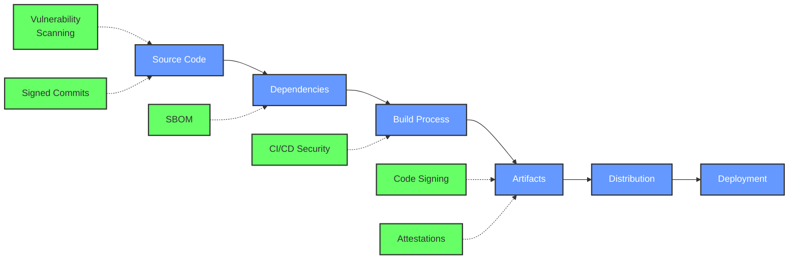

# Software Supply Chain Security Notes

A comprehensive resource on Software Supply Chain Security. This site contains notes, guides, and best practices for securing your software supply chain.

## What is Software Supply Chain Security?

Software supply chain security focuses on protecting the integrity, quality, and trustworthiness of software throughout its development lifecycle -- from code creation to deployment and beyond.

Recent high-profile incidents like SolarWinds and Log4j vulnerabilities have highlighted the critical importance of securing every link in the software supply chain.

## Supply Chain Visualization

## Key Components of Software Supply Chain Security

1. **Source Code Protection**
   - Access controls
   - Code review
   - Vulnerability scanning

2. **Dependency Management**
   - Vulnerability scanning
   - Software Bill of Materials (SBOM)
   - Dependency pinning

3. **Secure Build Processes**
   - Isolated build environments
   - Reproducible builds
   - Pipeline security

4. **Artifact Protection**
   - Code signing
   - Provenance
   - Attestations

5. **Secure Deployment**
   - Deployment validation
   - Runtime verification
   - Monitoring

## Recent Major Supply Chain Attacks

!!! security "Recent Attacks"
    - **SolarWinds (2020)** - Attackers inserted malicious code into software updates
    - **Log4Shell (2021)** - Critical vulnerability in widely used logging library
    - **Codecov (2021)** - Compromised bash uploader script affecting CI environments
    - **ua-parser-js (2021)** - Popular NPM package compromised with malicious code

## Getting Started

To begin securing your software supply chain, start with these essential steps:

1. Create a [Software Bill of Materials (SBOM)](secure-development/sbom.md)
2. Implement [dependency management practices](secure-development/dependency-management.md)
3. Secure your [CI/CD pipeline](ci-cd-security/pipeline-security.md)
4. Learn about the [SLSA Framework](best-practices/standards.md)
