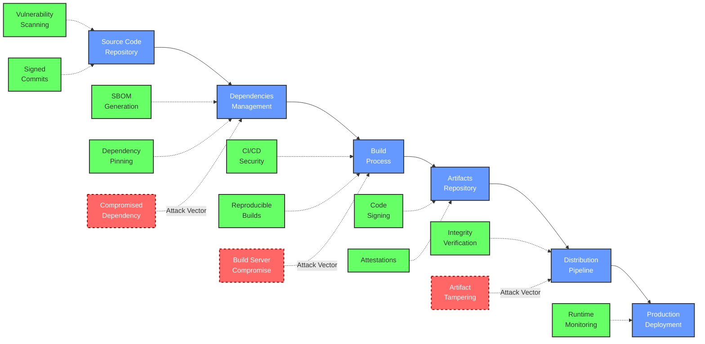

# Software Supply Chain Security Notes

A comprehensive resource on Software Supply Chain Security. This site contains notes, guides, and best practices for securing your software supply chain.

RESOURCE HUB

This knowledge base provides in-depth guidance on protecting your entire software supply chain, from source code to deployment. Use the navigation menu to explore specific topics or start with the [Getting Started](#getting-started) section below.

## What is Software Supply Chain Security?

Software supply chain security focuses on protecting the integrity, quality, and trustworthiness of software throughout its development lifecycle -- from code creation to deployment and beyond. It encompasses all the components, processes, and systems that go into building and delivering software.

!!! warning "Growing Threat Landscape"
    Software supply chains are increasingly targeted because they offer attackers a "force multiplier" effect. By compromising one component in the chain, attackers can potentially affect thousands or millions of downstream users and systems.

Recent high-profile incidents like SolarWinds and Log4j vulnerabilities have highlighted the critical importance of securing every link in the software supply chain. Organizations are now recognizing that traditional security approaches focusing solely on perimeter defense are insufficient. Modern security requires a holistic approach that secures the entire software development lifecycle.

### The Evolution of Supply Chain Security

Software supply chain security has evolved dramatically over the past decade:

| Era | Focus | Key Concerns | Primary Approaches |
| --- | ----- | ------------ | ------------------ |
| Pre-2015 | Network & Host Security | Server vulnerabilities, network intrusions | Firewalls, endpoint protection |
| 2015-2019 | Application Security | Web vulnerabilities, insecure code | SAST/DAST testing, secure coding |
| 2020-2023 | Early Supply Chain Focus | Dependency vulnerabilities, build system integrity | SCA tools, SBOM generation |
| 2023+ | Comprehensive Supply Chain Security | End-to-end integrity, attestations, provenance | Zero trust, SLSA framework, signed artifacts |

Organizations must adapt to this evolving landscape by implementing comprehensive security controls across their entire software development and deployment pipeline.

## Key Security Areas

  

    <h3><svg xmlns="http://www.w3.org/2000/svg" viewBox="0 0 24 24"><path d="M12 1 3 5v6c0 5.55 3.84 10.74 9 12 5.16-1.26 9-6.45 9-12V5l-9-4zm0 10.99h7c-.53 4.12-3.28 7.79-7 8.94V12H5V6.3l7-3.11v8.8z"></path></svg> Risk Assessment</h3>
    
Learn about threat modeling, vulnerability management, and security risk assessment strategies for your software supply chain.

  

  

    <h3><svg xmlns="http://www.w3.org/2000/svg" viewBox="0 0 24 24"><path d="M20 8.69V4h-4.69L12 .69 8.69 4H4v4.69L.69 12 4 15.31V20h4.69L12 23.31 15.31 20H20v-4.69L23.31 12 20 8.69zm-2 5.79V18h-3.52L12 20.48 9.52 18H6v-3.52L3.52 12 6 9.52V6h3.52L12 3.52 14.48 6H18v3.52L20.48 12 18 14.48zM12 6.5c-3.03 0-5.5 2.47-5.5 5.5s2.47 5.5 5.5 5.5 5.5-2.47 5.5-5.5-2.47-5.5-5.5-5.5zm0 9c-1.93 0-3.5-1.57-3.5-3.5s1.57-3.5 3.5-3.5 3.5 1.57 3.5 3.5-1.57 3.5-3.5 3.5z"></path></svg> Secure Development</h3>
    
Discover approaches for dependency management, SBOM generation, and secure coding practices to build secure software.

  

  

    <h3><svg xmlns="http://www.w3.org/2000/svg" viewBox="0 0 24 24"><path d="M10 20v-6h4v6h5v-8h3L12 3 2 12h3v8h5z"></path></svg> CI/CD Security</h3>
    
Explore pipeline security configurations, artifact signing strategies, and best practices for securing your delivery pipeline.

  

  

    <h3><svg xmlns="http://www.w3.org/2000/svg" viewBox="0 0 24 24"><path d="M19 8h-1V3H6v5H5c-1.66 0-3 1.34-3 3v6h4v4h12v-4h4v-6c0-1.66-1.34-3-3-3zM8 5h8v3H8V5zm8 12v2H8v-4h8v2zm2-2v-2H6v2H4v-4c0-.55.45-1 1-1h14c.55 0 1 .45 1 1v4h-2z"></path></svg> Security Tools</h3>
    
Review security scanners, monitoring solutions, and tools to enhance your software supply chain security posture.

  

## Supply Chain Visualization

The software supply chain is a complex ecosystem involving multiple components and security controls. The diagram below illustrates the core flow and critical security measures:

### Understanding the Supply Chain Flow

1. **Development Phase**: Developers write code and submit it to source repositories
2. **Dependency Phase**: Dependencies are integrated from various sources
3. **Build Phase**: Automated processes compile and package the software
4. **Artifact Phase**: Built artifacts are stored in repositories
5. **Distribution Phase**: Artifacts are distributed to end users or deployment targets
6. **Deployment Phase**: Software is deployed to production environments

Each phase has unique security requirements and potential vulnerabilities that must be addressed with specific security controls.

### Common Attack Vectors

The red dashed lines in the diagram highlight common attack vectors:

- **Compromised Dependencies**: Attackers inject malicious code into third-party libraries
- **Build Server Compromises**: CI/CD environments are targeted to inject malware during builds
- **Artifact Tampering**: Built artifacts are modified before or during distribution

These attack methods have been employed in several high-profile supply chain attacks.

## Key Components of Software Supply Chain Security

1. **Source Code Protection**
   - Access controls
   - Code review
   - Vulnerability scanning

2. **Dependency Management**
   - Vulnerability scanning
   - Software Bill of Materials (SBOM)
   - Dependency pinning

3. **Secure Build Processes**
   - Isolated build environments
   - Reproducible builds
   - Pipeline security

4. **Artifact Protection**
   - Code signing
   - Provenance
   - Attestations

5. **Secure Deployment**
   - Deployment validation
   - Runtime verification
   - Monitoring

## Recent Major Supply Chain Attacks

!!! security "Recent Attacks"
    - **SolarWinds (2020)** - Attackers inserted malicious code into software updates
    - **Log4Shell (2021)** - Critical vulnerability in widely used logging library
    - **Codecov (2021)** - Compromised bash uploader script affecting CI environments
    - **ua-parser-js (2021)** - Popular NPM package compromised with malicious code

SECURITY INFO

These attacks demonstrate the critical importance of securing every link in your software supply chain. Each case involved different entry points that attackers exploited.

## Getting Started

To begin securing your software supply chain, start with these essential steps:

1. Create a [Software Bill of Materials (SBOM)](secure-development/sbom.md)
2. Implement [dependency management practices](secure-development/dependency-management.md)
3. Secure your [CI/CD pipeline](ci-cd-security/pipeline-security.md)
4. Learn about the [SLSA Framework](best-practices/standards.md)
