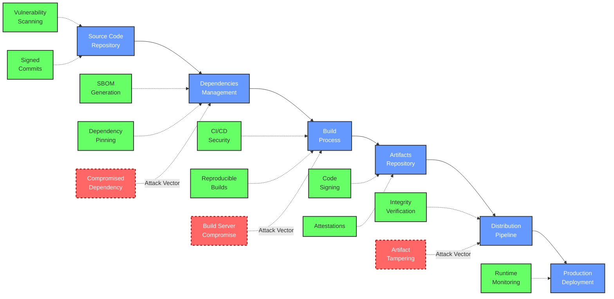

# Software Supply Chain Security Notes

A comprehensive resource on Software Supply Chain Security. This site contains notes, guides, and best practices for securing your software supply chain.

RESOURCE HUB

This knowledge base provides in-depth guidance on protecting your entire software supply chain, from source code to deployment. Use the navigation menu to explore specific topics or start with the [Getting Started](#getting-started) section below.

## What is Software Supply Chain Security?

Software supply chain security focuses on protecting the integrity, quality, and trustworthiness of software throughout its development lifecycle -- from code creation to deployment and beyond. It encompasses all the components, processes, and systems that go into building and delivering software.

!!! warning "Growing Threat Landscape"
    Software supply chains are increasingly targeted because they offer attackers a "force multiplier" effect. By compromising one component in the chain, attackers can potentially affect thousands or millions of downstream users and systems.

Recent high-profile incidents like SolarWinds and Log4j vulnerabilities have highlighted the critical importance of securing every link in the software supply chain. Organizations are now recognizing that traditional security approaches focusing solely on perimeter defense are insufficient. Modern security requires a holistic approach that secures the entire software development lifecycle.

### The Evolution of Supply Chain Security

Software supply chain security has evolved dramatically over the past decade:

| Era | Focus | Key Concerns | Primary Approaches |
| --- | ----- | ------------ | ------------------ |
| Pre-2015 | Network & Host Security | Server vulnerabilities, network intrusions | Firewalls, endpoint protection |
| 2015-2019 | Application Security | Web vulnerabilities, insecure code | SAST/DAST testing, secure coding |
| 2020-2023 | Early Supply Chain Focus | Dependency vulnerabilities, build system integrity | SCA tools, SBOM generation |
| 2023+ | Comprehensive Supply Chain Security | End-to-end integrity, attestations, provenance | Zero trust, SLSA framework, signed artifacts |

Organizations must adapt to this evolving landscape by implementing comprehensive security controls across their entire software development and deployment pipeline.

## Supply Chain Visualization

The software supply chain is a complex ecosystem involving multiple components and security controls. The diagram below illustrates the core flow and critical security measures:

### Understanding the Supply Chain Flow

1. **Development Phase**: Developers write code and submit it to source repositories
2. **Dependency Phase**: Dependencies are integrated from various sources
3. **Build Phase**: Automated processes compile and package the software
4. **Artifact Phase**: Built artifacts are stored in repositories
5. **Distribution Phase**: Artifacts are distributed to end users or deployment targets
6. **Deployment Phase**: Software is deployed to production environments

Each phase has unique security requirements and potential vulnerabilities that must be addressed with specific security controls.

### Common Attack Vectors

The red dashed lines in the diagram highlight common attack vectors:

- **Compromised Dependencies**: Attackers inject malicious code into third-party libraries
- **Build Server Compromises**: CI/CD environments are targeted to inject malware during builds
- **Artifact Tampering**: Built artifacts are modified before or during distribution

These attack methods have been employed in several high-profile supply chain attacks.

## Key Components of Software Supply Chain Security

1. **Source Code Protection**
   - Access controls
   - Code review
   - Vulnerability scanning

2. **Dependency Management**
   - Vulnerability scanning
   - Software Bill of Materials (SBOM)
   - Dependency pinning

3. **Secure Build Processes**
   - Isolated build environments
   - Reproducible builds
   - Pipeline security

4. **Artifact Protection**
   - Code signing
   - Provenance
   - Attestations

5. **Secure Deployment**
   - Deployment validation
   - Runtime verification
   - Monitoring

## Recent Major Supply Chain Attacks

!!! security "Recent Attacks"
    - **npm Token Compromise (2024)** - JounQin's token compromised affecting eslint-config-prettier and other packages with 100M+ weekly downloads
    - **SolarWinds (2020)** - Attackers inserted malicious code into software updates
    - **Log4Shell (2021)** - Critical vulnerability in widely used logging library
    - **Codecov (2021)** - Compromised bash uploader script affecting CI environments
    - **ua-parser-js (2021)** - Popular NPM package compromised with malicious code

SECURITY INFO

These attacks demonstrate the critical importance of securing every link in your software supply chain. Each case involved different entry points that attackers exploited.

## Getting Started

To begin securing your software supply chain, start with these essential steps:

1. **Understand Package Ecosystem Risks**: Review [Package Ecosystem Security](package-ecosystems/overview.md) to understand the specific vulnerabilities in npm, PyPI, Maven, and other ecosystems
2. **Create an Inventory**: Generate a [Software Bill of Materials (SBOM)](secure-development/sbom.md)
3. **Implement Dependency Security**: Follow [dependency management practices](secure-development/dependency-management.md)
4. **Secure Your Pipeline**: Protect your [CI/CD pipeline](ci-cd-security/pipeline-security.md)
5. **Adopt Standards**: Learn about the [SLSA Framework](best-practices/standards.md)
