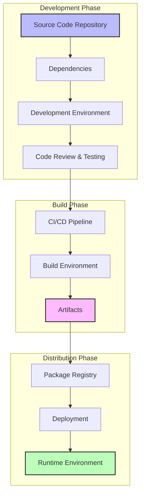
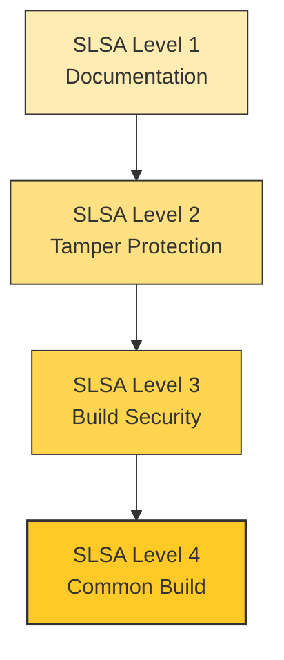

# Overview of Software Supply Chain Security

Software supply chain security refers to the processes and practices that ensure the integrity, security, and reliability of software products and their components throughout the entire supply chain. As software development increasingly relies on third-party components, libraries, and services, understanding and mitigating the risks associated with these dependencies has become paramount.

## Key Concepts

1. **Dependencies**: Modern software often relies on numerous external libraries and frameworks. Each dependency introduces potential vulnerabilities that can be exploited if not properly managed.

2. **Threat Modeling**: This is a proactive approach to identifying potential threats and vulnerabilities in the software supply chain. By understanding the attack vectors, organizations can better prepare and defend against potential security breaches.

3. **Vulnerability Management**: Continuous monitoring and management of vulnerabilities in software components are essential. This includes identifying, assessing, and remediating vulnerabilities to minimize risks.

4. **Secure Development Practices**: Implementing secure coding practices and guidelines during the development phase can significantly reduce the likelihood of introducing vulnerabilities into the software.

5. **Software Bill of Materials (SBOM)**: An SBOM is a comprehensive list of all components in a software product, including their versions and licenses. It provides transparency and helps organizations manage risks associated with third-party components.

## Importance

The importance of software supply chain security cannot be overstated. With the rise of cyber threats and attacks targeting software supply chains, organizations must prioritize security at every stage of the development process. By adopting best practices and frameworks for supply chain security, organizations can protect their assets, maintain customer trust, and comply with regulatory requirements.

# Supply Chain Basics

## Understanding the Software Supply Chain

The software supply chain encompasses all components, processes, and systems that go into developing software, from initial code creation through build, test, and deployment.

### Anatomy of a Software Supply Chain

A typical software supply chain includes:



## Attack Vectors

!!! security "Common Attack Vectors"
    The software supply chain can be compromised at multiple points:
    
    1. **Source Code**: Unauthorized code changes or malicious commits
    2. **Dependencies**: Compromised third-party libraries or "typosquatting" attacks
    3. **Build Systems**: Compromised build servers or build tool tampering
    4. **CI/CD Pipelines**: Exploitation of pipeline privileges or injection of malicious steps
    5. **Artifacts**: Tampering with compiled code or deployment packages
    6. **Deployment**: Unauthorized changes during deployment

## Protection Strategies

### 1. Source Code Protection

```python
# Example: Git hooks for pre-commit validation
def validate_commit(files):
    for file in files:
        if contains_sensitive_data(file):
            return False
        if contains_malicious_patterns(file):
            return False
    return True
```

### 2. Dependency Management

Secure dependency management requires:

| Strategy | Description | Tools |
| -------- | ----------- | ----- |
| Dependency Pinning | Lock dependencies to specific versions | package-lock.json, poetry.lock |
| Vulnerability Scanning | Regularly scan for known vulnerabilities | Dependabot, Snyk, OWASP Dependency Check |
| SBOM Generation | Create a software bill of materials | CycloneDX, SPDX |
| Minimal Dependencies | Reduce dependency footprint | npm prune, pip-tools |

### 3. Secure Build Process

Implement these core practices for build security:

- **Isolated Build Environments**: Use containers or VMs for builds
- **Reproducible Builds**: Ensure builds are deterministic and reproducible
- **Build Provenance**: Record metadata about the build process
- **Artifact Validation**: Validate build outputs match expectations

Example container-based build:

```yaml
# Dockerfile for isolated builds
FROM alpine:3.17

# Add only necessary build tools
RUN apk add --no-cache \
    python3 \
    npm \
    git

# Use specific versions of build tools
RUN pip3 install --no-cache-dir pipenv==2022.4.8

# Set up a non-root user for builds
RUN adduser -D builder
USER builder

# Use a specific working directory
WORKDIR /build
```

## SLSA Framework Alignment

The [Supply-chain Levels for Software Artifacts (SLSA)](../best-practices/standards.md) provides a framework for improving supply chain security:



!!! tip "Incremental Improvement"
    Focus on achieving SLSA Level 1, then progressively work toward higher levels as your security practices mature.

## Getting Started

To begin securing your supply chain:

1. **Inventory**: Document your current supply chain components 
2. **Risk Assessment**: Identify vulnerable points in your pipeline
3. **Basic Controls**: Implement source control security, dependency scanning, and artifact signing
4. **Measurement**: Establish metrics to track security improvements
5. **Culture**: Build a security-aware development culture