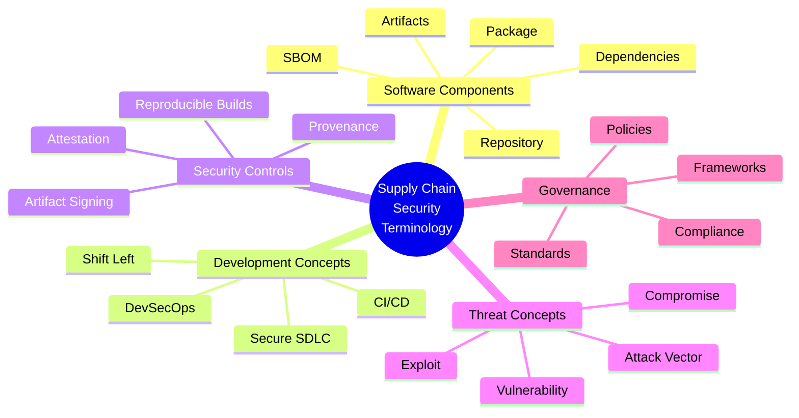

# Terminology in Software Supply Chain Security

REFERENCE GUIDE

This comprehensive glossary provides definitions and context for key terms used throughout software supply chain security discussions. Understanding these terms is essential for effective communication and implementation of security controls.

## Core Supply Chain Concepts

### Software Supply Chain
The complete set of processes, components, systems, and actors involved in the creation, distribution, and maintenance of software—from initial design to deployment and updates. This includes source code, dependencies, build systems, deployment pipelines, and distribution mechanisms.

### Software Bill of Materials (SBOM)
A formal, machine-readable inventory of software components and dependencies used in an application. SBOMs document the "ingredients" of software, enabling organizations to track components, manage vulnerabilities, and meet compliance requirements.

#### Common SBOM Formats:
- **SPDX (Software Package Data Exchange)**: Linux Foundation standard
- **CycloneDX**: OWASP Foundation standard focused on security use cases
- **SWID (Software Identification Tags)**: ISO/IEC 19770-2:2015 standard

### Supply Chain Attack
An attack that targets the less-secure elements in the software supply chain rather than directly attacking the target system. These attacks exploit the trust relationships between organizations and their suppliers or between software components.

### Provenance
Verifiable information about the origin and history of a software artifact, documenting where, when, and how it was created. Provenance provides the "chain of custody" for software components.

<strong>Key Related Concepts</strong>
<ul>
<li><strong>Chain of Custody</strong>: Documented history showing who had possession of artifacts at each point in the supply chain</li>
<li><strong>Trust Model</strong>: Framework for determining which entities and processes in the supply chain are trusted</li>
<li><strong>SLSA Framework</strong>: Supply chain Levels for Software Artifacts - a security framework for ensuring supply chain integrity</li>
<li><strong>VEX</strong>: Vulnerability Exploitability eXchange - documents known vulnerabilities and their exploitability status</li>
</ul>

## Software Components

### Dependency
A software component (library, framework, or module) that another software component relies on to function properly. Dependencies can be:

- **Direct Dependencies**: Explicitly imported or required by the application
- **Transitive Dependencies**: Required by direct dependencies but not explicitly by the application
- **Development Dependencies**: Used during development but not included in the final product
- **Runtime Dependencies**: Required during execution of the application

### Dependency Graph
A directed graph that represents the relationships between a software package and its dependencies, including transitive dependencies. This graph helps visualize dependency relationships and identify potential security issues.

### Artifact
A file or collection of files produced during software development that serves a specific purpose, such as source code, compiled binaries, container images, or packages. Artifacts are the outputs of the software development process that are stored, shared, and deployed.

### Package
A bundled collection of software files and metadata distributed as a single unit. Packages typically include executables, configuration files, documentation, and dependency information.

### Repository
A centralized storage location for software packages or artifacts. Repositories can be:

- **Source Code Repository**: Stores and manages source code versions (e.g., Git repositories)
- **Artifact Repository**: Stores built software artifacts like packages or container images
- **Package Repository**: Specialized for distributing software packages (e.g., npm, PyPI, Maven Central)

### Container
A lightweight, standalone, executable software package that includes everything needed to run an application: code, runtime, system tools, libraries, and settings. Containers are isolated from each other and from the host system.

### Container Image
A lightweight, standalone, executable package that includes everything needed to run a piece of software, including the application code, runtime, system tools, libraries, and settings.

## Development and Build Concepts

### Continuous Integration/Continuous Deployment (CI/CD)
A set of practices and tools that automate the process of integrating code changes, testing them, and deploying applications. In the context of supply chain security, CI/CD pipelines are both critical infrastructure to be secured and key control points for implementing security measures.

<table>
<thead>
<tr>
<th>CI/CD Component</th>
<th>Supply Chain Security Consideration</th>
</tr>
</thead>
<tbody>
<tr>
<td>Build Servers</td>
<td>Must be secured against tampering; compromise could lead to malicious code insertion</td>
</tr>
<tr>
<td>Build Scripts</td>
<td>Should be version controlled and reviewed to prevent inclusion of malicious commands</td>
</tr>
<tr>
<td>Pipeline Configurations</td>
<td>Should implement security checks and prevent unauthorized modifications</td>
</tr>
<tr>
<td>Deployment Jobs</td>
<td>Must use secure credentials and verify artifact integrity before deployment</td>
</tr>
</tbody>
</table>

### DevSecOps
An approach that integrates security practices throughout the development lifecycle, rather than treating security as a separate, final phase. DevSecOps emphasizes collaboration between development, security, and operations teams to build security into applications from the beginning.

### Infrastructure as Code (IaC)
The practice of managing and provisioning infrastructure through machine-readable definition files rather than manual processes. IaC enables consistent, version-controlled infrastructure deployment, reducing the risk of configuration drift or unauthorized changes.

### Reproducible Build
A build process that always produces bit-for-bit identical outputs given the same inputs, regardless of when or where the build is performed. Reproducible builds allow verification that no vulnerabilities or malicious code were introduced during the build process.

### Hermetic Build
A build process that is fully isolated from the external environment and depends only on declared inputs. Hermetic builds improve security by preventing undeclared or unauthorized inputs from affecting the build.

### Ephemeral Environment
A temporary, isolated environment created specifically for a single build or test process and destroyed immediately afterward. Ephemeral environments reduce the risk of persistent compromises or cross-contamination between builds.

## Security Controls and Mechanisms

### Artifact Signing
The process of cryptographically signing software artifacts to ensure their integrity and authenticity. Signatures allow users to verify that artifacts have not been tampered with and come from trusted sources.

### Code Signing
The practice of digitally signing executable files and scripts to verify the author's identity and ensure that the code has not been altered since it was signed. Code signing establishes trust in the integrity and origin of the code.

### Multi-Factor Authentication (MFA)
An authentication method requiring users to provide two or more verification factors to gain access to resources. MFA is essential for securing access to code repositories, build systems, and deployment environments.

### Immutable Artifact
An artifact that cannot be modified after it is created. Immutable artifacts improve security by preventing tampering after the artifact has been built and validated.

### Attestation
A cryptographically verifiable statement about a software artifact, such as who built it, what source code it was built from, or what dependencies it contains. Attestations create a chain of trust for software components.

### Binary Authorization
A policy enforcement system that requires verification of container or binary provenance before deployment. Binary authorization ensures only trusted, validated artifacts are deployed to production environments.

### Least Privilege
The principle of providing only the minimum permissions necessary for users, processes, or systems to perform their functions. Following least privilege reduces the potential impact of compromised accounts or systems.

## Threat and Vulnerability Concepts

### Vulnerability
A weakness or flaw in a software system that could be exploited to compromise the system's security. Vulnerabilities can exist in application code, dependencies, configurations, or infrastructure.

### Common Vulnerability and Exposure (CVE)
A standardized identifier for a publicly known cybersecurity vulnerability. CVEs provide a common reference point for identifying and tracking vulnerabilities across different systems and organizations.

### Common Vulnerability Scoring System (CVSS)
A framework for assessing the severity and impact of vulnerabilities. CVSS scores help organizations prioritize vulnerability remediation based on standardized criteria.

### Zero-Day Vulnerability
A previously unknown vulnerability that has not yet been patched and for which no official fix is available. Zero-day vulnerabilities are particularly dangerous as they can be exploited before defenders have time to respond.

<strong>Common Supply Chain Vulnerabilities</strong>
<ul>
<li><strong>Typosquatting</strong>: Creating malicious packages with names similar to legitimate ones</li>
<li><strong>Dependency Confusion</strong>: Exploiting package resolution to substitute public malicious packages for private ones</li>
<li><strong>Hijacked Accounts</strong>: Taking over accounts of package maintainers</li>
<li><strong>Compromised Build Systems</strong>: Inserting malicious code during the build process</li>
<li><strong>Unsigned Artifacts</strong>: Distributing tampered artifacts without signature verification</li>
</ul>

### Attack Vector
The path or means by which an attacker can gain unauthorized access to a system or network to deliver a malicious payload or exploit a vulnerability. In supply chain security, attack vectors often include compromised dependencies, build systems, or distribution channels.

### Supply Chain Compromise
An incident where an attacker successfully manipulates the software supply chain to introduce malicious code or vulnerabilities into a target system. Examples include the SolarWinds attack and the event-stream npm package compromise.

### Poisoned Pipeline Execution (PPE)
An attack where an attacker compromises a CI/CD pipeline to inject malicious code during the build process, resulting in compromised artifacts despite clean source code.

## Governance and Compliance

### Standards
Established guidelines and best practices that organizations follow to ensure security and compliance in software development and supply chain management. Examples include:

- **NIST Secure Software Development Framework (SSDF)**
- **Supply chain Levels for Software Artifacts (SLSA)**
- **ISO/IEC 27001** (Information Security Management)
- **OWASP Software Component Verification Standard (SCVS)**

### Frameworks
Structured approaches or methodologies that provide a foundation for implementing security practices and processes in software development and supply chain management. Examples include:

- **NIST Cybersecurity Framework (CSF)**
- **MITRE ATT&CK Framework** for supply chain attacks
- **Software Assurance Maturity Model (SAMM)**

### Policy
A documented set of rules and guidelines that define how an organization manages software supply chain security risks, including requirements for third-party software, build processes, and deployment practices.

<strong>Related Regulations</strong>
<ul>
<li><strong>Executive Order 14028</strong>: US Executive Order on improving the nation's cybersecurity, with significant focus on software supply chain security</li>
<li><strong>EU Cyber Resilience Act</strong>: European regulation requiring software producers to implement security measures throughout the product lifecycle</li>
<li><strong>NIST SP 800-161</strong>: Guidelines for supply chain risk management for federal information systems</li>
<li><strong>SBOM Mandates</strong>: Emerging requirements for software vendors to provide SBOMs for products sold to government agencies</li>
</ul>

### Compliance
The state of adhering to regulatory requirements, standards, or specifications related to software supply chain security. Compliance may be mandated by law, industry regulations, or contractual obligations.

### Risk Management
The process of identifying, assessing, and controlling threats to an organization's software supply chain. This includes evaluating the security practices of suppliers, analyzing dependencies for vulnerabilities, and implementing mitigations for identified risks.

## Emerging Terminology

### SLSA (Supply chain Levels for Software Artifacts)
A security framework, a checklist of standards and controls to prevent tampering, improve integrity, and secure packages and infrastructure. SLSA defines four progressive levels of security maturity, from basic documentation to fully secured build systems.

### VEX (Vulnerability Exploitability eXchange)
A standardized format for communicating the exploitability of vulnerabilities in specific products. VEX documents allow software producers to provide information about whether a vulnerability in a component actually affects a specific product.

### Sigstore
An open-source project providing tools for signing, verifying, and protecting software artifacts using ephemeral cryptographic keys tied to a user's OpenID Connect identity.

### in-toto
A framework to secure software supply chains by defining and enforcing the integrity of each step in the chain, ensuring that the software delivered to end users is the result of a trustworthy process.

### GUAC (Graph for Understanding Artifact Composition)
An open-source project that aggregates software security metadata into a high-fidelity graph database, enabling advanced security analysis of software supply chains.

## Additional Resources

For more detailed explorations of software supply chain security concepts and implementation guidance, refer to:

- [CISA Securing the Software Supply Chain](https://www.cisa.gov/resources-tools/resources/securing-software-supply-chain)
- [NIST Secure Software Development Framework (SSDF)](https://csrc.nist.gov/Projects/ssdf)
- [The Linux Foundation's Open Source Software Supply Chain Security](https://www.linuxfoundation.org/research/the-state-of-software-supply-chain-security)
- [SLSA Framework Documentation](https://slsa.dev/spec/v1.0/)