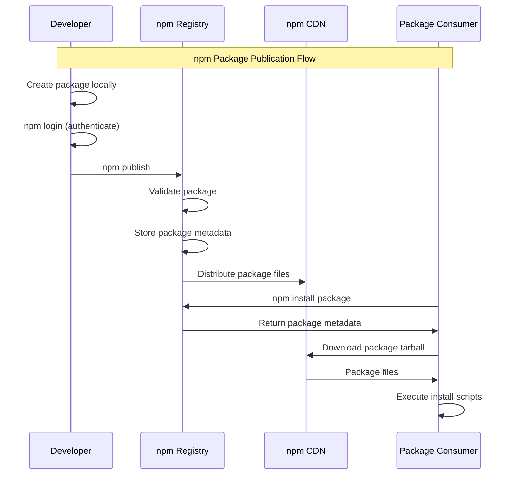
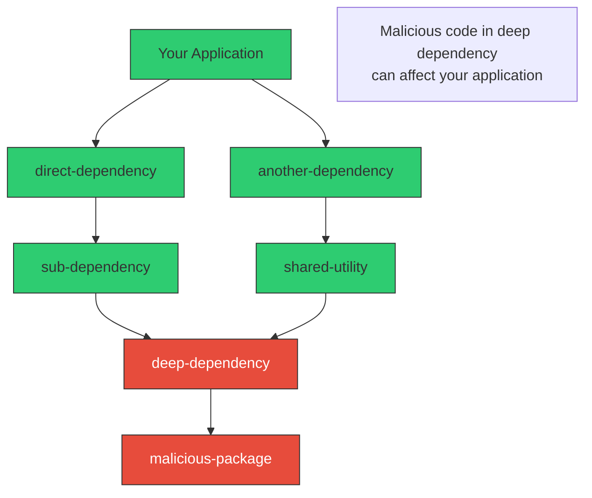

# npm/Node.js Ecosystem Security

<div class="secure-component">
<span class="security-badge badge-critical">HIGH-RISK ECOSYSTEM</span>

The npm ecosystem is the world's largest software repository with over 3.5 million packages and approximately 90 billion downloads per week. This massive scale, combined with the ecosystem's design characteristics, creates significant security challenges for developers and organizations.
</div>

## npm Ecosystem Overview

### Scale and Characteristics

The npm ecosystem's unprecedented scale creates unique security challenges:

- **3.5+ million packages** with rapid growth (~1,000 new packages daily)
- **~90 billion downloads per week** across all packages
- **Highly connected dependency graphs** with deep transitive dependencies
- **Low barrier to entry** for package publishing
- **Automatic dependency resolution** with semantic versioning

### Package Publication Process

Understanding npm's publication process reveals potential attack vectors:



### Key Security Characteristics

1. **Post-install scripts**: Packages can execute arbitrary code during installation
2. **Transitive dependencies**: Deep dependency trees increase attack surface
3. **Automatic updates**: Semantic versioning allows automatic minor/patch updates
4. **Scoped packages**: Organization namespaces (@org/package) with varying security
5. **Registry centralization**: Single point of failure for the entire ecosystem

## Recent Security Incidents

### JounQin npm Token Compromise (Recent)

The recent compromise of maintainer JounQin's npm authentication token illustrates the ecosystem's vulnerabilities:

**Timeline and Impact:**
- **Compromised packages**: eslint-config-prettier, eslint-plugin-prettier, synckit, @pkgr/core, napi-postinstall
- **Weekly downloads**: ~100 million combined
- **Maintainer scope**: JounQin publishes 266 packages with 181+ million weekly downloads
- **Attack duration**: Several hours before detection and response
- **Malicious payload**: Likely information gathering and potential backdoor installation

**Attack Vector Analysis:**
```bash
# Potential attack flow
1. Token compromise (unclear method - could be credential theft, phishing, or system compromise)
2. Automated publishing of malicious versions to multiple packages
3. Malicious code designed to:
   - Steal environment variables and credentials
   - Establish persistence mechanisms
   - Potentially spread to other systems
```

**Affected Package Examples:**
```json
{
  "eslint-config-prettier": {
    "compromised_version": "9.1.0",
    "weekly_downloads": "25M+",
    "malicious_payload": "Environment variable exfiltration"
  },
  "synckit": {
    "compromised_version": "0.8.8", 
    "weekly_downloads": "50M+",
    "malicious_payload": "Credential harvesting"
  }
}
```

### Historical npm Attacks

<div class="security-table">
<table>
<thead>
<tr>
<th>Package</th>
<th>Year</th>
<th>Attack Vector</th>
<th>Impact</th>
<th>Downloads</th>
</tr>
</thead>
<tbody>
<tr>
<td><strong>ua-parser-js</strong></td>
<td>2021</td>
<td>Compromised maintainer account</td>
<td>Cryptocurrency miners, password stealers</td>
<td>~7M weekly</td>
</tr>
<tr>
<td><strong>event-stream</strong></td>
<td>2018</td>
<td>Social engineering + dependency injection</td>
<td>Bitcoin wallet theft (Copay app)</td>
<td>~2M weekly</td>
</tr>
<tr>
<td><strong>eslint-scope</strong></td>
<td>2018</td>
<td>Compromised maintainer account</td>
<td>npm credential harvesting</td>
<td>~3M weekly</td>
</tr>
<tr>
<td><strong>getcookies</strong></td>
<td>2022</td>
<td>Typosquatting</td>
<td>Information disclosure</td>
<td>~100K weekly</td>
</tr>
<tr>
<td><strong>node-ipc</strong></td>
<td>2022</td>
<td>Maintainer activism</td>
<td>File deletion on Russian/Belarusian IPs</td>
<td>~1M weekly</td>
</tr>
</tbody>
</table>
</div>

## npm-Specific Attack Vectors

### 1. Package Installation Script Exploitation

npm packages can execute arbitrary code through several mechanisms:

```json
{
  "scripts": {
    "preinstall": "node ./scripts/download-binary.js",
    "install": "node-gyp rebuild",
    "postinstall": "node ./scripts/setup.js"
  }
}
```

**Risk Assessment:**
- **preinstall**: Executes before dependencies are installed
- **install**: Typically used for native module compilation
- **postinstall**: Executes after package installation
- **No sandboxing**: Scripts run with full user permissions

### 2. Dependency Confusion in npm

npm's resolution algorithm can be exploited through dependency confusion:

```bash
# Example vulnerability
# Private package: @mycompany/utils@1.0.0 (internal registry)
# Attacker publishes: @mycompany/utils@2.0.0 (public registry)

# Developer runs:
npm install @mycompany/utils
# npm may fetch malicious v2.0.0 instead of internal v1.0.0
```

**Protection Mechanisms:**
```bash
# Configure npm to use scoped registries
npm config set @mycompany:registry https://internal-registry.company.com/
npm config set registry https://registry.npmjs.org/

# Use .npmrc file
echo "@mycompany:registry=https://internal-registry.company.com/" >> .npmrc
```

### 3. Typosquatting and Name Confusion

Common typosquatting patterns in npm:

```bash
# Legitimate packages vs malicious variants
legitimate_package    malicious_variants
---------------------- ------------------
lodash                 lodahs, lodash-, lodashjs
react                  react-js, reactt, reacct
express               expres, expresss, express-js
moment                momentt, moment-js, momnet
```

### 4. Transitive Dependency Attacks

npm's dependency resolution creates complex attack chains:



## npm Security Features and Limitations

### Built-in Security Features

1. **npm audit**: Vulnerability scanning for known security issues
   ```bash
   # Scan for vulnerabilities
   npm audit
   
   # Attempt automatic fixes
   npm audit fix
   
   # Force fixes (potentially breaking)
   npm audit fix --force
   ```

2. **Package signing**: Experimental support for package signatures
   ```bash
   # Verify package signatures (experimental)
   npm verify signatures
   ```

3. **Two-factor authentication**: Required for high-impact packages
   ```bash
   # Enable 2FA for npm account
   npm profile enable-2fa auth-and-writes
   ```

4. **Access tokens**: Granular permissions for publishing
   ```bash
   # Create read-only token
   npm token create --read-only
   
   # Create publish token with CIDR restrictions
   npm token create --cidr=192.168.1.0/24
   ```

### Security Limitations

1. **Post-install script execution**: No sandboxing of install scripts
2. **Transitive dependency depth**: Limited visibility into deep dependencies
3. **Version range resolution**: Automatic updates can introduce vulnerabilities
4. **Registry trust model**: Single point of trust in npm registry

## npm Installation Process Deep Dive

Understanding npm's installation process reveals security implications:

### 1. Package Resolution

```bash
# npm install process
1. Parse package.json and package-lock.json
2. Build dependency tree with version constraints
3. Resolve packages from registry (or cache)
4. Download package tarballs
5. Extract packages to node_modules
6. Execute lifecycle scripts (preinstall, install, postinstall)
7. Build native modules if needed
```

### 2. Registry Communication

```bash
# npm registry API calls
GET /{package}                    # Get package metadata
GET /{package}/{version}          # Get specific version
GET /{package}/-/{package}-{version}.tgz  # Download tarball
```

### 3. Cache and Lock File Integrity

```bash
# Package-lock.json security
{
  "packages": {
    "node_modules/lodash": {
      "version": "4.17.21",
      "resolved": "https://registry.npmjs.org/lodash/-/lodash-4.17.21.tgz",
      "integrity": "sha512-v2kDEe57lecTulaDIuNTPy3Ry4gLGJ6Z1O3vE1krgXZNrsQ+LFTGHVxVjcXPs17LhbZVGedAJv8XZ1tvj5FvSg=="
    }
  }
}
```

## Developer Environment Protection

### 1. Secure npm Configuration

```bash
# Essential npm security configurations
npm config set fund false                    # Disable funding messages
npm config set audit-level moderate          # Set audit threshold
npm config set fund false                    # Disable package funding
npm config set ignore-scripts true          # Disable install scripts (use carefully)

# Registry configuration for organizations
npm config set @mycompany:registry https://internal-registry.company.com/
npm config set registry https://registry.npmjs.org/
```

### 2. Package Verification Workflows

```bash
#!/bin/bash
# Pre-install security check script

PACKAGE_NAME=$1

echo "🔍 Analyzing package: $PACKAGE_NAME"

# Check package age and popularity
npm info $PACKAGE_NAME time created versions downloads
# Check for recent versions (rapid version bumps can be suspicious)
npm info $PACKAGE_NAME versions --json | jq 'length'

# Check maintainers
npm info $PACKAGE_NAME maintainers

# Check for install scripts
npm info $PACKAGE_NAME scripts

# Check dependencies
npm info $PACKAGE_NAME dependencies

echo "⚠️  Review the above information before installing"
```

### 3. Sandboxed Development Environments

```bash
# Using Docker for isolated npm environments
FROM node:18-alpine
WORKDIR /app

# Copy package files first
COPY package*.json ./

# Install dependencies in isolated environment
RUN npm ci --only=production --ignore-scripts

# Copy application code
COPY . .

# Run with limited permissions
USER node
CMD ["npm", "start"]
```

### 4. CI/CD Security Integration

```yaml
# GitHub Actions npm security workflow
name: npm Security Check

on: [push, pull_request]

jobs:
  security:
    runs-on: ubuntu-latest
    steps:
      - uses: actions/checkout@v3
      
      - name: Setup Node.js
        uses: actions/setup-node@v3
        with:
          node-version: '18'
          
      - name: Install dependencies
        run: npm ci
        
      - name: Run npm audit
        run: npm audit --audit-level high
        
      - name: Check for suspicious packages
        run: |
          # Check for packages with install scripts
          npm ls --json | jq -r '.dependencies | to_entries[] | select(.value.scripts.install or .value.scripts.postinstall) | .key'
          
      - name: Generate SBOM
        run: npm sbom --sbom-format cyclonedx --sbom-type application > sbom.json
        
      - name: Upload SBOM
        uses: actions/upload-artifact@v3
        with:
          name: npm-sbom
          path: sbom.json
```

## Advanced npm Security Techniques

### 1. Package Integrity Verification

```javascript
// Custom package verification script
const crypto = require('crypto');
const fs = require('fs');
const https = require('https');

async function verifyPackageIntegrity(packageName, version, expectedHash) {
    const url = `https://registry.npmjs.org/${packageName}/-/${packageName}-${version}.tgz`;
    
    return new Promise((resolve, reject) => {
        https.get(url, (res) => {
            const hash = crypto.createHash('sha512');
            
            res.on('data', (chunk) => {
                hash.update(chunk);
            });
            
            res.on('end', () => {
                const actualHash = hash.digest('base64');
                const isValid = actualHash === expectedHash;
                
                resolve({
                    package: packageName,
                    version: version,
                    isValid: isValid,
                    expectedHash: expectedHash,
                    actualHash: actualHash
                });
            });
        }).on('error', reject);
    });
}

// Usage
verifyPackageIntegrity('lodash', '4.17.21', 'expected_sha512_hash')
    .then(result => console.log(result))
    .catch(err => console.error('Verification failed:', err));
```

### 2. Dependency Analysis Tools

```bash
# Advanced npm dependency analysis
npm install -g npm-check-updates depcheck npm-audit-resolver

# Check for outdated packages
ncu

# Check for unused dependencies
depcheck

# Resolve audit issues with custom rules
npm-audit-resolver check
```

### 3. Private Registry Setup

```bash
# Setting up Verdaccio private registry
npm install -g verdaccio

# Start private registry
verdaccio

# Configure npm to use private registry for scoped packages
npm config set @mycompany:registry http://localhost:4873/

# Publish to private registry
npm publish --registry http://localhost:4873/
```

### 4. Runtime Package Monitoring

```javascript
// Runtime package monitoring with Module wrapper
const Module = require('module');
const originalRequire = Module.prototype.require;

Module.prototype.require = function(id) {
    // Log all package loads
    console.log(`Loading package: ${id}`);
    
    // Analyze package for suspicious behavior
    if (isSuspicious(id)) {
        console.warn(`⚠️ Suspicious package detected: ${id}`);
        // Could block, warn, or audit
    }
    
    return originalRequire.apply(this, arguments);
};

function isSuspicious(packageName) {
    // Check against known indicators
    const suspiciousPatterns = [
        /eval\(/,           // Dynamic code execution
        /child_process/,    // Process spawning
        /crypto/,          // Cryptographic operations
        /network/          // Network access
    ];
    
    return suspiciousPatterns.some(pattern => pattern.test(packageName));
}
```

## npm Ecosystem Threat Landscape

### Current Threat Trends

1. **Maintainer Account Compromise**: Increasingly sophisticated attacks targeting high-value maintainer accounts
2. **Supply Chain Insertion**: Injecting malicious code into legitimate packages
3. **Dependency Confusion**: Exploiting naming conventions and resolution algorithms
4. **Automated Attack Tools**: Scripts that automatically identify and exploit npm vulnerabilities

### Emerging Threats

1. **AI-Generated Malicious Packages**: Using AI to create convincing malicious packages
2. **Multi-Stage Attacks**: Complex attacks that activate after installation
3. **Developer Environment Profiling**: Gathering intelligence about development environments
4. **Cloud Credential Harvesting**: Targeting cloud service credentials in developer environments

### Attribution and Actor Analysis

Recent npm attacks show characteristics of:
- **Cybercriminal groups**: Financially motivated attacks
- **Nation-state actors**: Intelligence gathering and infrastructure targeting
- **Ideologically motivated actors**: Attacks based on political beliefs
- **Insider threats**: Legitimate maintainers acting maliciously

## Organizational npm Security Strategy

### 1. Policy Development

```markdown
# npm Security Policy Template

## Dependency Approval Process
- All new dependencies require security team approval for:
  - High-impact packages (>1M weekly downloads)
  - Packages with install scripts
  - Packages from new maintainers

## Mandatory Security Controls
- npm audit must pass for all dependencies
- Package lock files required in all repositories
- Automated dependency update scanning
- SBOM generation for all builds

## Incident Response
- Immediate response for compromised package alerts
- Dependency rollback procedures
- Communication plan for affected teams
```

### 2. Technical Controls

```bash
# Organization-wide npm configuration
# Deploy via configuration management

# Global .npmrc configuration
registry=https://registry.npmjs.org/
@mycompany:registry=https://internal-registry.company.com/
package-lock=true
save-exact=true
audit-level=high
fund=false
```

### 3. Monitoring and Detection

```yaml
# Continuous monitoring setup
monitoring:
  dependency_updates:
    - Monitor for new versions of critical dependencies
    - Alert on major version changes
    - Track security advisory feeds
    
  registry_monitoring:
    - Monitor npm registry for typosquatting
    - Track new packages from known maintainers
    - Detect suspicious package patterns
    
  internal_usage:
    - Track internal package usage
    - Monitor for unauthorized package installations
    - Audit package access patterns
```

## Conclusion

The npm ecosystem's massive scale and design characteristics create significant security challenges. Recent attacks like the JounQin token compromise demonstrate that even trusted maintainers can become attack vectors. Organizations must implement comprehensive security strategies that include:

1. **Technical controls** (dependency scanning, integrity verification)
2. **Process controls** (approval workflows, incident response)
3. **Environmental controls** (sandboxing, monitoring)
4. **Human controls** (training, awareness)

<div class="secure-component">
<span class="security-badge badge-warning">CRITICAL RECOMMENDATION</span>

Given the high-risk nature of the npm ecosystem and recent attack trends, organizations should treat npm security as a critical priority. Implement defense-in-depth strategies and maintain constant vigilance for emerging threats.
</div>

The next section covers [PyPI/Python Ecosystem Security](pypi-security.md), which has introduced significant security improvements that other ecosystems can learn from.