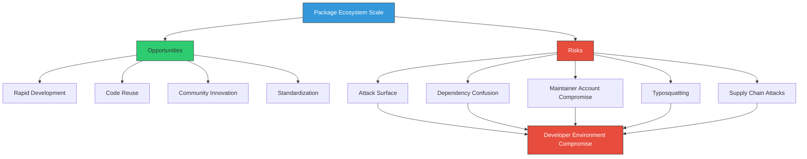
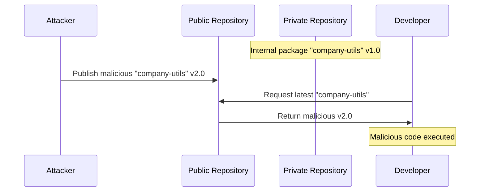

# Package Ecosystem Security Overview

CRITICAL ATTACK SURFACE

Package ecosystems represent one of the most critical attack surfaces in modern software development. With over 90% of applications containing third-party components, understanding the security implications of different package ecosystems is essential for protecting the software supply chain and developer environments.

## The Package Ecosystem Landscape

Modern software development relies heavily on package managers and repositories that enable developers to easily share and reuse code. However, this convenience comes with significant security risks, as demonstrated by recent high-profile attacks targeting package ecosystems.

### Scale and Impact

The scale of modern package ecosystems is staggering:

- **npm**: 3.5+ million packages, ~90 billion downloads per week
- **PyPI**: 400,000+ packages, ~6 billion downloads per month  
- **Maven Central**: 500,000+ packages, billions of downloads per month
- **NuGet**: 350,000+ packages, ~4 billion downloads per month
- **RubyGems**: 175,000+ packages, ~4 billion downloads per month

This massive scale creates both opportunities and risks:

## Recent High-Profile Attacks

### npm Token Compromise (Recent)

The recent compromise of maintainer JounQin's npm token demonstrates the severe impact of package ecosystem attacks:

- **Affected packages**: eslint-config-prettier, eslint-plugin-prettier, synckit, @pkgr/core, napi-postinstall
- **Combined weekly downloads**: ~100 million
- **Maintainer scale**: JounQin maintains 725 packages with 181+ million weekly downloads
- **Attack vector**: Compromised npm authentication token
- **Impact**: Malicious code distribution to millions of developers worldwide

### Other Notable Package Ecosystem Attacks

<table>
<thead>
<tr>
<th>Attack</th>
<th>Ecosystem</th>
<th>Year</th>
<th>Impact</th>
<th>Attack Vector</th>
</tr>
</thead>
<tbody>
<tr>
<td><strong>ua-parser-js</strong></td>
<td>npm</td>
<td>2021</td>
<td>Cryptocurrency miners, password stealers</td>
<td>Compromised maintainer account</td>
</tr>
<tr>
<td><strong>event-stream</strong></td>
<td>npm</td>
<td>2018</td>
<td>Bitcoin wallet theft</td>
<td>Social engineering of maintainer</td>
</tr>
<tr>
<td><strong>SolarWinds</strong></td>
<td>NuGet</td>
<td>2020</td>
<td>Government and enterprise breaches</td>
<td>Build system compromise</td>
</tr>
<tr>
<td><strong>PyTorch</strong></td>
<td>PyPI</td>
<td>2022</td>
<td>Data exfiltration</td>
<td>Dependency confusion</td>
</tr>
<tr>
<td><strong>Codecov</strong></td>
<td>Multiple</td>
<td>2021</td>
<td>CI/CD environment compromise</td>
<td>Docker image tampering</td>
</tr>
</tbody>
</table>

## Common Attack Vectors Across Ecosystems

### 1. Account Compromise

The most direct attack vector involves compromising maintainer accounts:

- **Weak authentication**: Lack of multi-factor authentication (MFA)
- **Credential stuffing**: Reused passwords from other breaches
- **Social engineering**: Phishing attacks targeting maintainers
- **Session hijacking**: Stealing authentication tokens or cookies

### 2. Dependency Confusion

Exploiting how package managers resolve dependencies between public and private repositories:

### 3. Typosquatting

Creating packages with names similar to popular packages:

- **Common typos**: "lodahs" instead of "lodash"
- **Character substitution**: "reqυest" (with Greek upsilon) instead of "request"
- **Domain squatting**: Using similar but different domain names

### 4. Dependency Hijacking

Taking over abandoned or transferred packages:

- **Package abandonment**: Maintainers stop maintaining popular packages
- **Namespace squatting**: Claiming abandoned package names
- **Transfer exploitation**: Exploiting package ownership transfers

## Developer Environment Compromise Vectors

Package ecosystem attacks often target developer environments, leading to:

### Direct System Compromise

- **Credential theft**: Stealing SSH keys, API tokens, cloud credentials
- **Code injection**: Modifying source code or build scripts
- **Backdoor installation**: Installing persistent access mechanisms
- **Data exfiltration**: Stealing proprietary code or sensitive data

### Build System Compromise

- **CI/CD poisoning**: Modifying build pipelines
- **Artifact tampering**: Injecting malicious code into build outputs
- **Environment variable theft**: Accessing secrets and configuration
- **Supply chain propagation**: Using compromised builds to attack downstream users

### Development Tool Compromise

- **IDE plugin attacks**: Malicious extensions or plugins
- **Build tool compromise**: Attacking Maven, Gradle, Webpack, etc.
- **Package manager exploitation**: Exploiting npm, pip, gem command vulnerabilities
- **Git hook injection**: Malicious pre-commit or post-commit hooks

## Ecosystem-Specific Vulnerabilities

Each package ecosystem has unique characteristics that create specific vulnerabilities:

### JavaScript/npm
- **Loose version constraints**: Automatic minor/patch updates
- **Large dependency trees**: Complex transitive dependencies
- **Post-install scripts**: Arbitrary code execution during installation
- **Scoped packages**: Namespace confusion opportunities

### Python/PyPI
- **Setup.py execution**: Code execution during package installation
- **Wheel vs source**: Different installation methods with varying security
- **Virtual environment escape**: Breaking out of isolated environments
- **Import confusion**: Python's module resolution order

### Java/Maven
- **Repository prioritization**: Central vs custom repository conflicts
- **Plugin execution**: Build plugins with extensive permissions
- **Snapshot versions**: Mutable package versions
- **Transitive dependency hell**: Complex dependency resolution

### .NET/NuGet
- **MSBuild integration**: Build-time code execution
- **Package restore**: Automatic dependency resolution
- **Global packages folder**: System-wide package storage
- **Assembly loading**: Runtime package loading vulnerabilities

## Mitigation Strategies

### For Package Maintainers

1. **Enable Multi-Factor Authentication**: Require MFA for all maintainer accounts
2. **Use Package Signing**: Digitally sign packages to verify authenticity
3. **Implement Security Policies**: Regular security reviews and updates
4. **Monitor Dependencies**: Track vulnerabilities in dependencies
5. **Limit Package Permissions**: Use principle of least privilege

### For Package Consumers

1. **Dependency Pinning**: Lock to specific package versions
2. **Integrity Verification**: Verify package checksums and signatures
3. **Security Scanning**: Regular vulnerability scans of dependencies
4. **Isolation**: Use containerized or virtualized development environments
5. **Network Segmentation**: Limit package manager network access

### For Organizations

1. **Private Registries**: Host internal packages separately
2. **Dependency Policies**: Implement organizational dependency guidelines
3. **Scanning Integration**: Automated security scanning in CI/CD
4. **Incident Response**: Prepared procedures for package compromise
5. **Training Programs**: Developer education on package security

## Next Steps

This overview provides the foundation for understanding package ecosystem security. The following sections dive deep into specific ecosystems:

- [npm/Node.js Ecosystem Security](npm-security.md)
- [PyPI/Python Ecosystem Security](pypi-security.md)  
- [Maven/Java Ecosystem Security](maven-security.md)
- [Other Ecosystems (NuGet, RubyGems, Go) & Protection Strategies](other-ecosystems.md)

Each section covers installation processes, specific vulnerabilities, attack vectors, and protection strategies tailored to that ecosystem.

CRITICAL RECOMMENDATION

Given the scale and impact of package ecosystem attacks, organizations should treat package security as a top priority. Implement multiple layers of defense, from developer training to automated scanning to incident response procedures.

