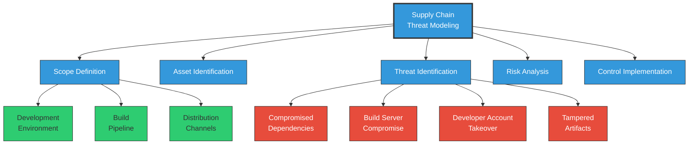
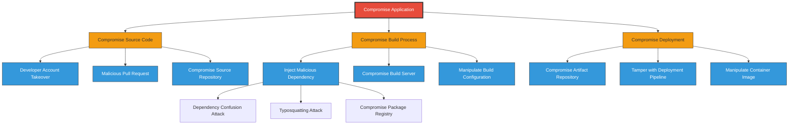
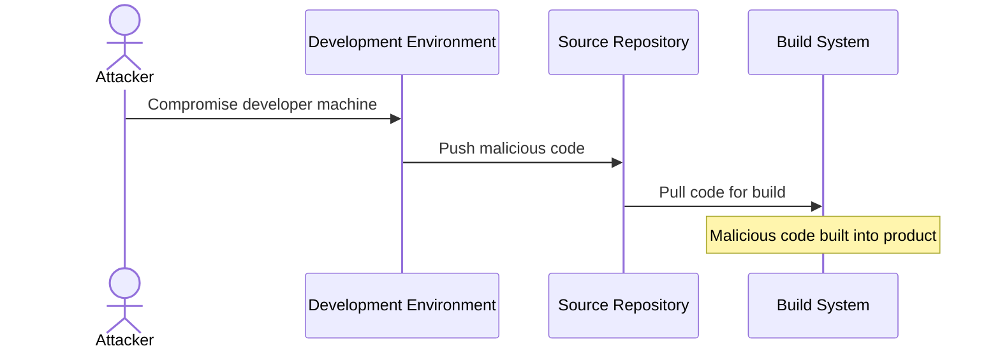
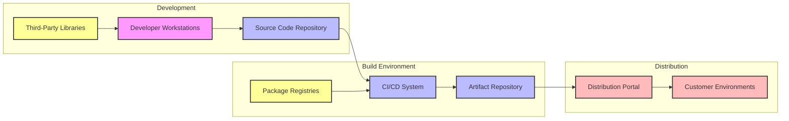
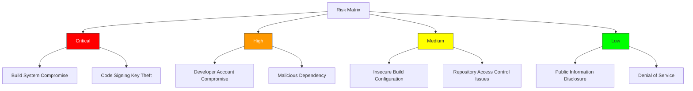
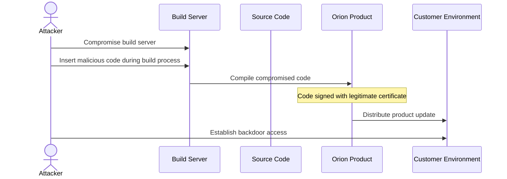
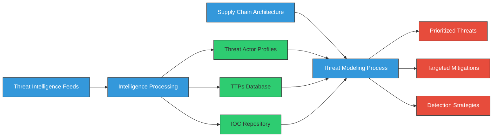
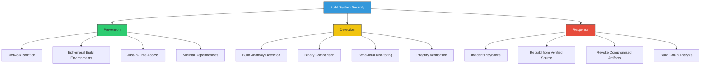
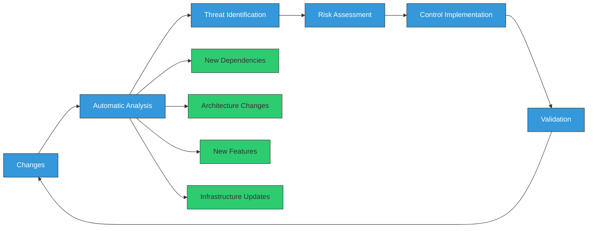

# Threat Modeling in Software Supply Chain Security

<div class="secure-component">
<span class="security-badge badge-info">STRATEGIC PLANNING</span>

Threat modeling is a foundational activity for identifying and addressing supply chain security risks. This guide provides a structured approach specifically adapted for software supply chain security.
</div>

## Introduction

Threat modeling is a proactive approach to identifying and mitigating potential security threats in software supply chains. By understanding the various threats that can impact the integrity, confidentiality, and availability of software components, organizations can better prepare and defend against potential attacks.

Unlike traditional application threat modeling, supply chain threat modeling focuses on the entire ecosystem of components, tools, and processes involved in building, delivering, and maintaining software.



## What is Threat Modeling?

Threat modeling is the process of systematically identifying and evaluating potential threats to a system. In the context of software supply chains, it involves:

1. **Understanding the architecture** of your entire supply chain
2. **Identifying valuable assets** that need protection
3. **Mapping attack surfaces** where threats might enter
4. **Determining potential adversaries** and their motivations
5. **Assessing the likelihood and impact** of different attack scenarios
6. **Developing mitigation strategies** to address identified risks

The goal is to anticipate potential security issues before they occur, rather than responding to incidents after the fact.

## Supply Chain-Specific Considerations

When conducting threat modeling for software supply chains, special attention must be paid to:

- **Trust boundaries** between your code, third-party dependencies, and build systems
- **Transitive dependencies** that may not be directly visible in your supply chain
- **Build infrastructure** including CI/CD systems and their configurations
- **Distribution channels** used to deliver software to end users
- **Attestation and verification** processes for ensuring software integrity

## Key Threat Modeling Techniques for Supply Chains

### 1. STRIDE for Supply Chains

The STRIDE framework can be adapted specifically for supply chain scenarios:

| Threat Category | General Definition | Supply Chain Examples |
|-----------------|-------------------|------------------------|
| **Spoofing** | Impersonating something or someone | Typosquatting packages, repository spoofing, DNS hijacking |
| **Tampering** | Modifying data or code | Modifying dependencies during build, compromising package registries |
| **Repudiation** | Denying having performed an action | Unauthorized changes without audit trails, unsigned commits |
| **Information Disclosure** | Exposing information | Leaking secrets in build logs, hardcoded credentials |
| **Denial of Service** | Denying or degrading service | Removing critical packages, depleting build resources |
| **Elevation of Privilege** | Gaining capabilities without authorization | Escaping build containers, compromising CI systems |

### 2. Attack Trees for Supply Chain Visualization

Attack trees provide a structured way to visualize potential attack paths:



### 3. PASTA (Process for Attack Simulation and Threat Analysis)

PASTA is a risk-centric methodology that's well-suited for supply chain threat modeling:

1. **Define Business Objectives**: Understand what you're trying to protect and why it matters
2. **Define Technical Scope**: Document your supply chain architecture in detail
3. **Decompose Application**: Break down the supply chain into components and data flows
4. **Analyze Threats**: Identify specific threats to each component
5. **Vulnerability Analysis**: Identify weaknesses that threats could exploit
6. **Attack Modeling**: Create scenarios showing how attacks might unfold
7. **Risk Analysis & Mitigation**: Prioritize risks and develop countermeasures

### 4. Supply Chain Threat Matrix

The CISA/NSA Supply Chain Threat Matrix categorizes threats across the development lifecycle:

- **Plan**: Requirements tampering, malicious design influence
- **Develop**: Code tampering, insider threats, compromised development tools
- **Build**: Build system compromise, dependency confusion, malicious dependencies
- **Publish**: Repository compromise, signing key theft, binary manipulation
- **Deploy**: Deployment tool compromise, configuration tampering
- **Operate**: Software update tampering, backdoor activation

## Common Supply Chain Threats

Below are the most common threats that organizations should consider when performing supply chain threat modeling:

### 1. Compromised Development Environment



- **Attack Vectors**: Phishing, malware, backdoored tools, insecure development endpoints
- **Impact**: Direct injection of malicious code into the product
- **Real-World Example**: The SolarWinds attack began with compromised developer environments

### 2. Dependency/Package Tampering

- **Dependency Confusion**: Exploiting how package managers resolve dependencies when same-named packages exist in public and private repositories
- **Typosquatting**: Creating malicious packages with names similar to legitimate ones (e.g., "lodahs" instead of "lodash")
- **Abandoned Package Takeover**: Gaining control of unmaintained packages by assuming ownership
- **Compromised Package Maintainer Account**: Taking over accounts with publishing rights

### 3. Build System Compromise

- **CI/CD Pipeline Injection**: Exploiting vulnerabilities in CI/CD tools or configurations
- **Build Server Access**: Gaining unauthorized access to build infrastructure
- **Build Configuration Tampering**: Modifying build scripts or configuration files
- **Secret Exposure**: Extracting secrets from build environments

### 4. Software Supply Chain Subversion

- **Artifact Repository Compromise**: Tampering with artifacts after they've been built
- **Update Infrastructure Attacks**: Compromising the mechanisms that deliver updates
- **Certificate Theft**: Stealing code signing certificates to sign malicious code

## Step-by-Step Supply Chain Threat Modeling Process

### 1. Document Your Supply Chain Architecture

Create a comprehensive diagram of your entire supply chain:



Include:
- Development environments and tools
- Source code repositories
- Build systems and their configurations
- Dependencies and package sources
- Artifact storage systems
- Deployment and distribution methods

### 2. Identify Critical Assets

Catalog the assets in your supply chain that require protection:

| Asset Type | Examples | Criticality Factors |
|------------|----------|---------------------|
| **Source Code** | Core application code, configuration files | Intellectual property value, security impact |
| **Build Infrastructure** | CI/CD systems, build servers | Control over final artifacts |
| **Credentials** | Code signing keys, repository access tokens | Ability to impersonate or gain access |
| **Dependencies** | Third-party libraries, frameworks | Usage in critical functions, update frequency |
| **Artifacts** | Compiled binaries, container images | Integrity before delivery to customers |

### 3. Analyze Trust Boundaries

Identify where different trust domains intersect:

- Between internal and external code
- Between development and build environments
- Between build systems and artifact repositories
- Between artifact repositories and deployment targets

### 4. Threat Identification and Analysis

For each component in your supply chain, ask:

- Who might want to attack this component?
- What could they gain by compromising it?
- How could they potentially attack it?
- What would the impact be if compromised?
- What existing controls mitigate this threat?

Document these threats using the STRIDE framework or attack trees.

### 5. Risk Evaluation

Evaluate each identified threat based on:

1. **Likelihood**: Probability of the threat being realized
2. **Impact**: Consequences if the threat is realized
3. **Detectability**: How easily the attack can be detected
4. **Exploitability**: How difficult the attack is to execute

Use a risk matrix to visualize and prioritize:



## Recommended Controls

Based on threat modeling results, implement appropriate controls:

### Source Code Protection

- **Signed Commits**: Require cryptographic signatures on all commits
- **Branch Protection**: Require code reviews and passing checks before merging
- **MFA Requirement**: Enforce multi-factor authentication for repository access

### Dependency Security

- **Dependency Pinning**: Lock dependencies to specific versions or hashes
- **Private Package Repositories**: Use private mirrors with pre-approved packages
- **Dependency Scanning**: Automatically scan for known vulnerabilities

### Build Security

- **Isolated Build Environments**: Use ephemeral, isolated environments for builds
- **Least Privilege**: Minimize permissions for build systems
- **Reproducible Builds**: Ensure builds are deterministic and reproducible

### Artifact Protection

- **Artifact Signing**: Cryptographically sign all produced artifacts
- **SBOM Generation**: Generate Software Bill of Materials for all artifacts
- **Signature Verification**: Verify signatures before deployment

## Real-World Supply Chain Attack Case Studies

Understanding real-world attacks helps illustrate the importance of threat modeling in supply chain security. These case studies demonstrate how threat modeling might have identified vulnerabilities before they were exploited.

### SolarWinds (2020)



**Attack Details**: Attackers compromised SolarWinds' build infrastructure and inserted malicious code (SUNBURST) into the Orion software during the build process. The compromised update was then digitally signed and distributed to ~18,000 customers.

**Threat Modeling Lessons**:
- Build server compromise was underestimated as a threat vector
- Integrity verification between source code and final binary was insufficient
- Monitoring for abnormal build process activities could have detected the attack

### CodeCov (2021)

**Attack Details**: Attackers modified a bash uploader script on CodeCov's server, allowing them to harvest environment variables and credentials from CI/CD pipelines that used the script.

**Threat Modeling Lessons**:
- Supply chain asset inventory did not properly account for bash scripts
- Script integrity verification was lacking
- Regular integrity checking of deployment artifacts could have detected tampering

### npm Package Hijacking (Various)

**Attack Details**: Multiple instances where attackers gained control of popular npm packages through social engineering, account takeovers, or creating malicious packages with names similar to popular packages.

**Threat Modeling Lessons**:
- Dependency confusion attacks were not widely understood before exploitation
- Package registry authentication and ownership transfer processes had security gaps
- Verification of package provenance was inadequate

## Advanced Threat Modeling Techniques

### Automated Threat Modeling

Organizations can enhance their threat modeling processes with automation:

```python
# Example: Simplified automated threat model generation
import yaml
import json

# Load system architecture
with open('architecture.yaml', 'r') as f:
    architecture = yaml.safe_load(f)

# Load threat database
with open('threats.json', 'r') as f:
    threat_db = json.load(f)

# Map threats to components
def identify_threats(component, threat_db):
    component_type = component['type']
    applicable_threats = []
    
    for threat in threat_db:
        if component_type in threat['applicable_to']:
            applicable_threats.append({
                'threat_id': threat['id'],
                'name': threat['name'],
                'description': threat['description'],
                'likelihood': threat['base_likelihood'],
                'impact': threat['base_impact'],
                'mitigations': threat['standard_mitigations']
            })
    
    return applicable_threats

# Generate threat model
threat_model = {}
for component in architecture['components']:
    threat_model[component['name']] = identify_threats(component, threat_db)

# Output the threat model
with open('automated_threat_model.json', 'w') as f:
    json.dump(threat_model, f, indent=2)
```

### Threat Intelligence Integration

Modern threat modeling incorporates threat intelligence to prioritize defenses against active threats:



### Threat Modeling for Modern Development Practices

#### Containerization & Kubernetes

For containerized environments, threat modeling must address additional concerns:

- Container escape vulnerabilities
- Image integrity and provenance
- Registry security
- Kubernetes RBAC and network policies
- Secrets management in orchestration

#### Serverless Architectures

Serverless introduces unique threat vectors to consider:

- Function permission boundaries
- Dependency injection in deployment packages
- Event-driven security controls
- Cold start exploitation
- Tenancy isolation failures

#### Infrastructure as Code (IaC)

IaC threat modeling considerations:

- Template injection attacks
- Privilege escalation through misconfiguration
- Secret management in IaC definitions
- Provider API security
- State file protection

## Supply Chain Threat Model Templates

### Standard Threat Scenarios and Mitigations

| Threat Scenario | STRIDE Categories | Common Attack Vectors | Recommended Controls |
|-----------------|-------------------|------------------------|----------------------|
| **Compromised Development Tool** | Tampering, Elevation of Privilege | Malicious plugins, IDE exploits, local malware | Tool verification, reproducible builds, isolated environments |
| **Dependency Substitution** | Spoofing, Tampering | Typosquatting, dependency confusion | Private repositories, dependency pinning, integrity verification |
| **CI/CD Pipeline Compromise** | Tampering, Elevation of Privilege | Webhook exploitation, runner compromise | Pipeline hardening, ephemeral environments, build provenance |
| **Source Code Repository Breach** | Information Disclosure, Tampering | Credential theft, weak access controls | MFA, branch protection, signed commits |
| **Artifact Repository Compromise** | Tampering, Spoofing | Unauthorized publishing, metadata tampering | Artifact signing, access controls, immutability |
| **Build Infrastructure Breach** | Elevation of Privilege, Tampering | Vulnerable build tools, insider threats | Isolated build environments, least privilege, attestation |

### Mitigation Strategy Templates

#### Strategy 1: Defense in Depth for Build Systems



#### Strategy 2: Dependency Security Controls

1. **Inventory Management**
   - Maintain a complete inventory of all dependencies (direct and transitive)
   - Generate and maintain SBOMs for all applications

2. **Access Controls**
   - Use private dependency mirrors/proxies for critical applications
   - Implement strict access controls for adding new dependencies

3. **Verification Mechanisms**
   - Verify integrity of all downloaded dependencies
   - Implement dependency pinning using cryptographic hashes
   - Use lockfiles to prevent dependency confusion attacks

4. **Continuous Monitoring**
   - Monitor for new vulnerabilities in dependencies
   - Implement automated dependency update processes with security testing
   - Monitor for suspicious behavior in dependency-related tooling

## Threat Modeling Tools Comparison

| Tool | Platform | Visualization | Collaboration | Automation | Supply Chain Focus | Cost |
|------|----------|---------------|--------------|------------|----------------------|------|
| **Microsoft Threat Modeling Tool** | Windows | Diagrams, Reports | Limited | Manual | Limited | Free |
| **OWASP Threat Dragon** | Cross-platform | Interactive diagrams | GitHub integration | Manual | Limited | Free/Open Source |
| **IriusRisk** | Web-based | Diagrams, Reports, Dashboards | Team collaboration | Rule-based automation | Supply chain templates | Commercial |
| **ThreatModeler** | Web-based | Diagrams, Heat maps | Team collaboration | Automated generation | Industry templates | Commercial |
| **PyTM** | Python library | Graph visualization | GitHub integration | Automated from code | Customizable | Free/Open Source |
| **Threagile** | Go application | Risk heatmaps | Limited | Architecture as code | Cloud native focus | Free/Open Source |

## Executable Threat Modeling for DevSecOps

To integrate threat modeling into CI/CD pipelines, organizations can implement "executable threat models" - threat modeling as code that can be automatically evaluated:

```yaml
# Example: Threat Model as Code (simplified syntax)
name: "Container Registry"
type: "artifact-repository"
description: "Central registry for container images"

trust_boundaries:
  - name: "internet-boundary"
    description: "Boundary between internet and registry"
  - name: "registry-backend"
    description: "Boundary between registry API and storage"

assets:
  - name: "container-images"
    classification: "high"
    description: "Built container images"
  - name: "registry-credentials"
    classification: "critical"
    description: "Credentials for pushing/pulling images"

threats:
  - name: "unauthorized-image-push"
    stride: "tampering"
    description: "Attacker pushes malicious image to registry"
    affected_assets: ["container-images"]
    risk: "high"
    mitigations:
      - "registry-authentication"
      - "image-signing"
      - "push-restrictions"
  
  - name: "credential-theft"
    stride: "information-disclosure"
    description: "Attacker steals registry credentials"
    affected_assets: ["registry-credentials"]
    risk: "critical"
    mitigations:
      - "short-lived-credentials"
      - "credential-rotation"
      - "mfa-for-registry"

mitigations:
  - name: "registry-authentication"
    implemented: true
    description: "OIDC-based authentication for registry access"
  
  - name: "image-signing"
    implemented: false
    description: "Cryptographic signing of container images"
    implementation_plan: "Implement Cosign in Q3 2023"
  
  - name: "push-restrictions"
    implemented: true
    description: "Only allow pushes from CI/CD pipeline"
```

This approach allows for:
- Automated threat model evaluation in CI/CD pipelines
- Version-controlled threat models alongside code
- Automated reporting on security coverage
- Integration with security testing and validation

## Continuous Threat Modeling

Modern software development requires continuous threat modeling rather than point-in-time exercises:



Key practices for continuous threat modeling:

1. **Integrate with Development Workflows**
   - Add threat modeling checkpoints to design reviews
   - Include security architecture in definition of done
   - Make threat modeling a standard part of sprint planning

2. **Automate Where Possible**
   - Use automated scanning to identify new components/dependencies
   - Implement rule-based threat identification
   - Automate control verification testing

3. **Focus on Changes**
   - Analyze the threat implications of each change
   - Maintain a living threat model that evolves with the application
   - Prioritize analysis of high-risk changes

## Conclusion and Next Steps

Threat modeling is an essential practice for organizations looking to enhance their software supply chain security. By systematically identifying and addressing potential threats, organizations can significantly reduce their risk exposure and improve their overall security posture.

### Creating Your First Supply Chain Threat Model

1. **Start Small**: Begin with a single, critical component of your supply chain
2. **Map the Flow**: Document how code moves from development to production
3. **Identify Assets**: List the valuable assets in your supply chain
4. **Apply STRIDE**: Use the STRIDE framework to identify threats to each component
5. **Prioritize**: Focus on high-impact, high-likelihood threats first
6. **Mitigate**: Implement controls to address identified risks
7. **Validate**: Test your controls to ensure they work as expected
8. **Expand**: Gradually expand your threat model to cover more of your supply chain

### Additional Resources

- [CISA Secure Software Development Framework](https://www.cisa.gov/resources-tools/resources/secure-software-development-framework-ssdf)
- [SLSA Framework](https://slsa.dev/)
- [NIST SP 800-218](https://csrc.nist.gov/publications/detail/sp/800-218/final)
- [Supply Chain Compromise Topic](https://www.ncsc.gov.uk/collection/supply-chain-security)
- [Microsoft Threat Modeling Tool](https://learn.microsoft.com/en-us/azure/security/develop/threat-modeling-tool)
- [OWASP Threat Dragon](https://owasp.org/www-project-threat-dragon/)
- [Practical Threat Analysis for Software Developers (ACM Queue)](https://queue.acm.org/detail.cfm?id=3471639)
- [Building a Software Supply Chain Threat Model (Google Cloud Blog)](https://cloud.google.com/blog/products/application-development/using-threat-modeling-for-secure-application-development)

!!! tip "Threat Modeling Workshops"
    Consider conducting regular threat modeling workshops with cross-functional teams (developers, security, operations) to build a shared understanding of risks and foster a security culture across your organization.