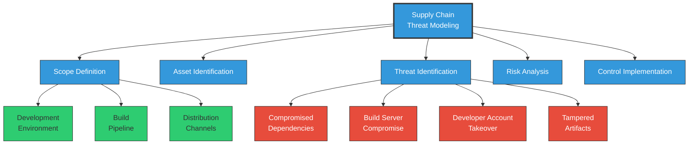
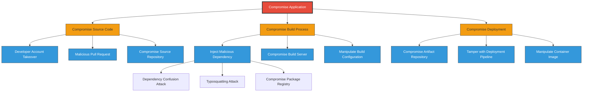
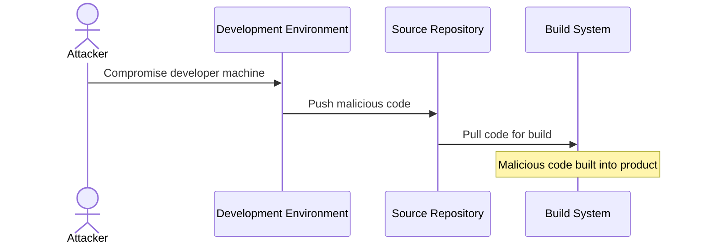
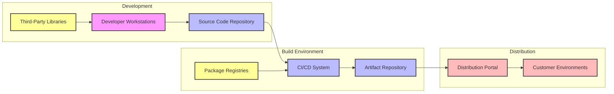
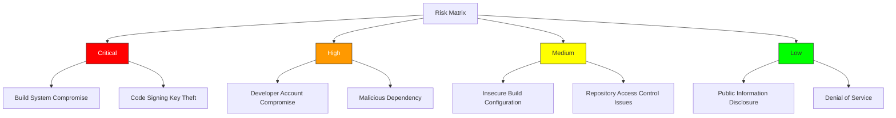

# Threat Modeling in Software Supply Chain Security

STRATEGIC PLANNING

Threat modeling is a foundational activity for identifying and addressing supply chain security risks. This guide provides a structured approach specifically adapted for software supply chain security.

## Introduction

Threat modeling is a proactive approach to identifying and mitigating potential security threats in software supply chains. By understanding the various threats that can impact the integrity, confidentiality, and availability of software components, organizations can better prepare and defend against potential attacks.

Unlike traditional application threat modeling, supply chain threat modeling focuses on the entire ecosystem of components, tools, and processes involved in building, delivering, and maintaining software.

## What is Threat Modeling?

Threat modeling is the process of systematically identifying and evaluating potential threats to a system. In the context of software supply chains, it involves:

1. **Understanding the architecture** of your entire supply chain
2. **Identifying valuable assets** that need protection
3. **Mapping attack surfaces** where threats might enter
4. **Determining potential adversaries** and their motivations
5. **Assessing the likelihood and impact** of different attack scenarios
6. **Developing mitigation strategies** to address identified risks

The goal is to anticipate potential security issues before they occur, rather than responding to incidents after the fact.

## Supply Chain-Specific Considerations

When conducting threat modeling for software supply chains, special attention must be paid to:

- **Trust boundaries** between your code, third-party dependencies, and build systems
- **Transitive dependencies** that may not be directly visible in your supply chain
- **Build infrastructure** including CI/CD systems and their configurations
- **Distribution channels** used to deliver software to end users
- **Attestation and verification** processes for ensuring software integrity

## Key Threat Modeling Techniques for Supply Chains

### 1. STRIDE for Supply Chains

The STRIDE framework can be adapted specifically for supply chain scenarios:

| Threat Category | General Definition | Supply Chain Examples |
|-----------------|-------------------|------------------------|
| **Spoofing** | Impersonating something or someone | Typosquatting packages, repository spoofing, DNS hijacking |
| **Tampering** | Modifying data or code | Modifying dependencies during build, compromising package registries |
| **Repudiation** | Denying having performed an action | Unauthorized changes without audit trails, unsigned commits |
| **Information Disclosure** | Exposing information | Leaking secrets in build logs, hardcoded credentials |
| **Denial of Service** | Denying or degrading service | Removing critical packages, depleting build resources |
| **Elevation of Privilege** | Gaining capabilities without authorization | Escaping build containers, compromising CI systems |

### 2. Attack Trees for Supply Chain Visualization

Attack trees provide a structured way to visualize potential attack paths:

### 3. PASTA (Process for Attack Simulation and Threat Analysis)

PASTA is a risk-centric methodology that's well-suited for supply chain threat modeling:

1. **Define Business Objectives**: Understand what you're trying to protect and why it matters
2. **Define Technical Scope**: Document your supply chain architecture in detail
3. **Decompose Application**: Break down the supply chain into components and data flows
4. **Analyze Threats**: Identify specific threats to each component
5. **Vulnerability Analysis**: Identify weaknesses that threats could exploit
6. **Attack Modeling**: Create scenarios showing how attacks might unfold
7. **Risk Analysis & Mitigation**: Prioritize risks and develop countermeasures

### 4. Supply Chain Threat Matrix

The CISA/NSA Supply Chain Threat Matrix categorizes threats across the development lifecycle:

- **Plan**: Requirements tampering, malicious design influence
- **Develop**: Code tampering, insider threats, compromised development tools
- **Build**: Build system compromise, dependency confusion, malicious dependencies
- **Publish**: Repository compromise, signing key theft, binary manipulation
- **Deploy**: Deployment tool compromise, configuration tampering
- **Operate**: Software update tampering, backdoor activation

## Common Supply Chain Threats

Below are the most common threats that organizations should consider when performing supply chain threat modeling:

### 1. Compromised Development Environment

- **Attack Vectors**: Phishing, malware, backdoored tools, insecure development endpoints
- **Impact**: Direct injection of malicious code into the product
- **Real-World Example**: The SolarWinds attack began with compromised developer environments

### 2. Dependency/Package Tampering

- **Dependency Confusion**: Exploiting how package managers resolve dependencies when same-named packages exist in public and private repositories
- **Typosquatting**: Creating malicious packages with names similar to legitimate ones (e.g., "lodahs" instead of "lodash")
- **Abandoned Package Takeover**: Gaining control of unmaintained packages by assuming ownership
- **Compromised Package Maintainer Account**: Taking over accounts with publishing rights

### 3. Build System Compromise

- **CI/CD Pipeline Injection**: Exploiting vulnerabilities in CI/CD tools or configurations
- **Build Server Access**: Gaining unauthorized access to build infrastructure
- **Build Configuration Tampering**: Modifying build scripts or configuration files
- **Secret Exposure**: Extracting secrets from build environments

### 4. Software Supply Chain Subversion

- **Artifact Repository Compromise**: Tampering with artifacts after they've been built
- **Update Infrastructure Attacks**: Compromising the mechanisms that deliver updates
- **Certificate Theft**: Stealing code signing certificates to sign malicious code

## Step-by-Step Supply Chain Threat Modeling Process

### 1. Document Your Supply Chain Architecture

Create a comprehensive diagram of your entire supply chain:

Include:
- Development environments and tools
- Source code repositories
- Build systems and their configurations
- Dependencies and package sources
- Artifact storage systems
- Deployment and distribution methods

### 2. Identify Critical Assets

Catalog the assets in your supply chain that require protection:

| Asset Type | Examples | Criticality Factors |
|------------|----------|---------------------|
| **Source Code** | Core application code, configuration files | Intellectual property value, security impact |
| **Build Infrastructure** | CI/CD systems, build servers | Control over final artifacts |
| **Credentials** | Code signing keys, repository access tokens | Ability to impersonate or gain access |
| **Dependencies** | Third-party libraries, frameworks | Usage in critical functions, update frequency |
| **Artifacts** | Compiled binaries, container images | Integrity before delivery to customers |

### 3. Analyze Trust Boundaries

Identify where different trust domains intersect:

- Between internal and external code
- Between development and build environments
- Between build systems and artifact repositories
- Between artifact repositories and deployment targets

### 4. Threat Identification and Analysis

For each component in your supply chain, ask:

- Who might want to attack this component?
- What could they gain by compromising it?
- How could they potentially attack it?
- What would the impact be if compromised?
- What existing controls mitigate this threat?

Document these threats using the STRIDE framework or attack trees.

### 5. Risk Evaluation

Evaluate each identified threat based on:

1. **Likelihood**: Probability of the threat being realized
2. **Impact**: Consequences if the threat is realized
3. **Detectability**: How easily the attack can be detected
4. **Exploitability**: How difficult the attack is to execute

Use a risk matrix to visualize and prioritize:

## Recommended Controls

Based on threat modeling results, implement appropriate controls:

### Source Code Protection

- **Signed Commits**: Require cryptographic signatures on all commits
- **Branch Protection**: Require code reviews and passing checks before merging
- **MFA Requirement**: Enforce multi-factor authentication for repository access

### Dependency Security

- **Dependency Pinning**: Lock dependencies to specific versions or hashes
- **Private Package Repositories**: Use private mirrors with pre-approved packages
- **Dependency Scanning**: Automatically scan for known vulnerabilities

### Build Security

- **Isolated Build Environments**: Use ephemeral, isolated environments for builds
- **Least Privilege**: Minimize permissions for build systems
- **Reproducible Builds**: Ensure builds are deterministic and reproducible

### Artifact Protection

- **Artifact Signing**: Cryptographically sign all produced artifacts
- **SBOM Generation**: Generate Software Bill of Materials for all artifacts
- **Signature Verification**: Verify signatures before deployment

## Supply Chain Threat Modeling Maturity Model

Organizations can assess their supply chain threat modeling maturity using this framework:

| Level | Characteristics | Activities |
|-------|----------------|------------|
| **Level 1: Ad-hoc** | Reactive, inconsistent, minimal documentation | Occasional threat discussions, basic asset identification |
| **Level 2: Repeatable** | Defined process, basic tools, conducted post-design | Regular reviews, documented architecture, STRIDE analysis |
| **Level 3: Defined** | Standardized, integrated into SDLC, threat library | Threat modeling in design phase, threat tracking, complete documentation |
| **Level 4: Managed** | Metrics driven, automated, comprehensive coverage | Automated analysis, threat intelligence integration, risk-based prioritization |
| **Level 5: Optimizing** | Continuous improvement, advanced techniques, supply chain focus | Custom threat modeling frameworks, advanced visualization, attack simulation |

## Threat Modeling Tools for Supply Chain Security

Several tools can assist with supply chain threat modeling:

- **Microsoft Threat Modeling Tool**: Visual diagramming tool for STRIDE analysis
- **OWASP Threat Dragon**: Open-source threat modeling tool
- **PyTM**: Python-based tool for threat modeling
- **IriusRisk**: Commercial threat modeling platform with supply chain templates
- **ThreatModeler**: Enterprise-grade threat modeling solution

## Conclusion

Threat modeling is an essential practice for organizations looking to enhance their software supply chain security. By systematically identifying and addressing potential threats, organizations can significantly reduce their risk exposure and improve their overall security posture.

A well-executed threat modeling process should be:
- **Continuous**: Performed regularly as your supply chain evolves
- **Collaborative**: Involving developers, security teams, and operations
- **Actionable**: Resulting in concrete security improvements
- **Documented**: Creating a record of decisions and assumptions
- **Validated**: Tested through penetration testing or red team exercises

By making threat modeling a core part of your software supply chain security program, you can stay ahead of evolving threats and build more resilient systems.

!!! info "Threat Modeling Resources"
    - [CISA Secure Software Development Framework](https://www.cisa.gov/resources-tools/resources/secure-software-development-framework-ssdf)
    - [SLSA Framework](https://slsa.dev/)
    - [NIST SP 800-218](https://csrc.nist.gov/publications/detail/sp/800-218/final)
    - [Supply Chain Compromise Topic](https://www.ncsc.gov.uk/collection/supply-chain-security)