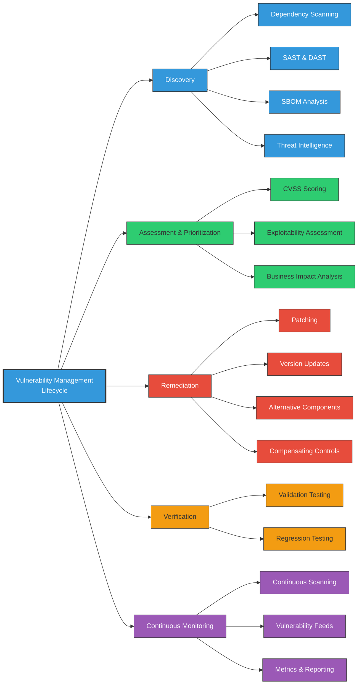
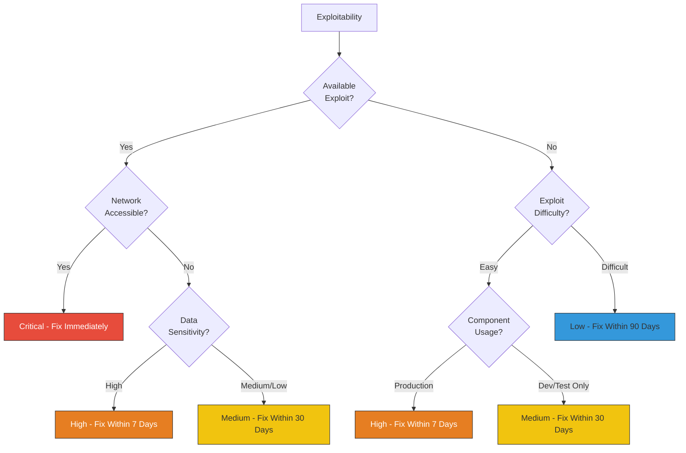
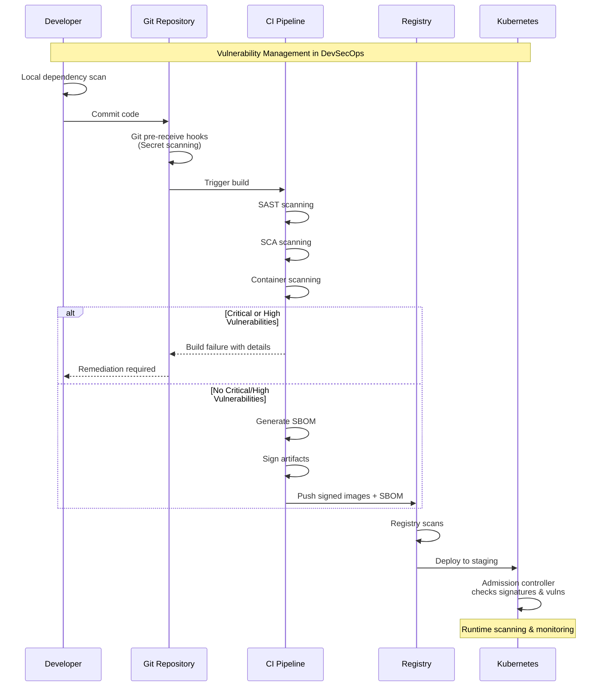

# Vulnerability Management in Software Supply Chain Security

<div class="secure-component">
<span class="security-badge badge-warning">CRITICAL PROCESS</span>

Vulnerability management is a systematic approach to identifying, evaluating, classifying, remediating, and mitigating security vulnerabilities throughout the software supply chain. An effective vulnerability management program is essential to prevent exploitation of weaknesses in your software components.
</div>

## Vulnerability Management Lifecycle

Effective vulnerability management in the software supply chain requires a continuous, iterative approach across the entire software lifecycle:



## Discovery Phase {#discovery-phase}

<div class="security-grid">
<div class="security-grid-item security-grid-item-main">

The vulnerability discovery phase involves systematically identifying potential security weaknesses across the software supply chain. This comprehensive approach includes:

### 1. Dependency Scanning

Automated scanning of all third-party libraries, frameworks, and components for known vulnerabilities. This should include:

- **Direct dependencies**: Libraries directly imported by your application
- **Transitive dependencies**: Dependencies of your dependencies
- **Development dependencies**: Tools used in your build process
- **Runtime dependencies**: Components needed during execution

### 2. Code Analysis

- **Static Application Security Testing (SAST)**: Analyzes source code without execution to identify coding flaws, security vulnerabilities, and bad practices
- **Dynamic Application Security Testing (DAST)**: Tests running applications to find vulnerabilities exploitable at runtime
- **Interactive Application Security Testing (IAST)**: Combines static and dynamic approaches by instrumenting the application

### 3. SBOM Analysis

Software Bill of Materials (SBOM) provides a foundation for vulnerability management by:

- Providing a complete inventory of all components
- Documenting component versions and origins
- Enabling correlation with vulnerability databases
- Supporting auditing and compliance requirements
</div>

<div class="security-grid-item security-grid-item-side">
<div class="security-info-box">
<strong>Key Discovery Tools</strong>
<ul>
<li><strong>OWASP Dependency-Check</strong>: Identifies project dependencies and checks if there are any known vulnerabilities</li>
<li><strong>Snyk</strong>: Multi-language dependency scanner with remediation guidance</li>
<li><strong>Trivy</strong>: Container, filesystem, and Git repository vulnerability scanner</li>
<li><strong>Grype</strong>: Fast, effective vulnerability scanner for containers</li>
<li><strong>Dependabot</strong>: Automated dependency updates with security checks</li>
<li><strong>Sonatype Nexus IQ</strong>: Component lifecycle management</li>
<li><strong>Black Duck</strong>: Comprehensive open source security solution</li>
</ul>
</div>
</div>
</div>

### 4. Binary Analysis

Examine compiled artifacts for vulnerabilities that may not be apparent in source code, including:
- **Software Composition Analysis (SCA)** of binaries to identify included components
- **Binary vulnerability scanning** to detect known vulnerable functions
- **Malware detection** to identify potentially malicious code

### 5. Supply Chain Intelligence

- **Monitoring vulnerability databases** (NVD, CVE, etc.)
- **Subscribing to security advisories** for used components
- **Tracking dependency maintainer activity** to identify abandoned projects
- **Analyzing package registry security** for dependency sources

## Assessment and Prioritization {#assessment-and-prioritization}

Once vulnerabilities are discovered, they must be assessed for severity and prioritized for remediation based on objective criteria:

<div class="security-table">
<table>
<thead>
<tr>
<th>Assessment Method</th>
<th>Description</th>
<th>Application</th>
</tr>
</thead>
<tbody>
<tr>
<td><strong>CVSS Scoring</strong></td>
<td>Common Vulnerability Scoring System provides a standardized framework for assessing severity on a scale from 0.0 to 10.0</td>
<td>
  • Base metrics (exploitability and impact)<br>
  • Temporal metrics (exploit maturity)<br>
  • Environmental metrics (organization-specific factors)
</td>
</tr>
<tr>
<td><strong>Exploitability Assessment</strong></td>
<td>Evaluation of how likely the vulnerability is to be exploited in a given context</td>
<td>
  • Availability of exploit code<br>
  • Attack complexity and prerequisites<br>
  • Authentication requirements<br>
  • Network accessibility
</td>
</tr>
<tr>
<td><strong>Business Impact Analysis</strong></td>
<td>Evaluation of potential impact on business operations if the vulnerability is exploited</td>
<td>
  • Data sensitivity in affected systems<br>
  • Operational criticality<br>
  • Potential financial impact<br>
  • Compliance implications
</td>
</tr>
</tbody>
</table>
</div>

### Prioritization Matrix

Not all vulnerabilities require immediate attention. Use this prioritization matrix to determine remediation timeline:



## Remediation Strategies {#remediation-strategies}

<div class="security-grid">
<div class="security-grid-item security-grid-item-main">

After vulnerabilities are discovered and prioritized, implement appropriate remediation strategies:

### 1. Direct Remediation

- **Dependency Updates**: Upgrade to a non-vulnerable version of the component
- **Patching**: Apply security patches to affected components
- **Component Replacement**: Replace vulnerable libraries with secure alternatives
- **Code Refactoring**: Modify application code to remove vulnerability

### 2. Compensating Controls

When direct remediation is not immediately possible:

- **Virtual Patching**: Implement detection and blocking at application or network boundaries
- **Input Validation**: Add additional validation to prevent exploitation
- **Output Encoding**: Ensure proper encoding to prevent execution of malicious content
- **Runtime Protection**: Deploy runtime application self-protection (RASP) solutions

### 3. Risk Acceptance

In limited circumstances, with proper governance:

- **Document risk acceptance** with formal sign-off from security leadership
- **Establish expiration date** for the acceptance
- **Define monitoring requirements** for the vulnerability
- **Document business justification** for risk acceptance
</div>

<div class="security-grid-item security-grid-item-side">
```yaml
# Example vulnerability policy in code
vulnerability_policy:
  critical:
    remediation_timeline: 24_hours
    approval_for_exception: CISO
    compensating_controls: required
  high:
    remediation_timeline: 7_days
    approval_for_exception: Security_Director
    compensating_controls: required
  medium:
    remediation_timeline: 30_days
    approval_for_exception: Security_Manager
    compensating_controls: recommended
  low:
    remediation_timeline: 90_days
    approval_for_exception: Team_Lead
    compensating_controls: optional
```
</div>
</div>

### 4. Building a Vulnerability Management Policy

An effective vulnerability management policy should include:

- **Clear ownership** of vulnerability management across teams
- **Defined service level objectives** for remediation timelines based on severity
- **Exception management process** for vulnerabilities that cannot be immediately fixed
- **Regular reporting** on vulnerability status and remediation progress
- **Integration with change management** processes

## Verification and Continuous Monitoring

<div class="secure-component">
<span class="security-badge badge-secure">BEST PRACTICE</span>

Vulnerability management is not complete after remediation—verification testing and continuous monitoring are essential to ensure ongoing security.
</div>

### Verification Testing

After implementing remediation measures:

1. **Validation Testing**: Confirm the vulnerability is actually fixed
2. **Regression Testing**: Ensure the fix didn't introduce new issues
3. **Penetration Testing**: Periodically test for exploitable vulnerabilities
4. **Security Review**: Conduct reviews of critical components and changes

### Continuous Monitoring

Implement ongoing surveillance to detect new vulnerabilities:

1. **Automated Scanning**: Schedule regular scans of code and dependencies
2. **Vulnerability Feed Integration**: Subscribe to CVE feeds and security advisories
3. **SBOM Monitoring**: Track components against new vulnerability disclosures
4. **Runtime Monitoring**: Deploy tools to detect exploitation attempts
5. **Metrics and Reporting**: Track key metrics like time-to-remediation and vulnerability density

## Supply Chain-Specific Considerations

<div class="security-grid">
<div class="security-grid-item security-grid-item-main">

Software supply chain vulnerability management introduces unique challenges:

### 1. Dependency Management Challenges

- **Dependency Hell**: Complex dependency graphs with multiple versions of same package
- **Diamond Dependencies**: Multiple paths to the same dependency with different versions
- **Abandoned Dependencies**: Libraries no longer maintained or updated
- **Build-Time vs. Runtime Dependencies**: Different vulnerability profiles

### 2. Pipeline Security

- **Build Tool Vulnerabilities**: Security of compilers, packers, and other build tools
- **CI/CD Security**: Vulnerabilities in automation systems themselves
- **Infrastructure as Code**: Security of deployment templates and configurations
- **Artifact Integrity**: Ensuring built artifacts haven't been tampered with
</div>

<div class="security-grid-item security-grid-item-side">
<div class="security-info-box">
<strong>Real-world Supply Chain Vulnerabilities</strong>

<p><strong>Log4Shell (CVE-2021-44228)</strong></p>
<ul>
<li>Critical vulnerability in widely-used Log4j library</li>
<li>Affected thousands of applications and services</li>
<li>Many organizations struggled to identify all affected systems</li>
<li>Remediation complicated by nested dependencies</li>
</ul>

<p><strong>Dependency Confusion Attacks</strong></p>
<ul>
<li>Exploits how package managers resolve dependencies</li>
<li>Attackers publish malicious packages on public repositories with same names as private packages</li>
<li>Build systems may pull malicious versions with higher version numbers</li>
</ul>
</div>
</div>
</div>

### 3. Component Provenance

- **Verifying Component Sources**: Ensuring dependencies come from legitimate sources
- **Component Authenticity**: Validating digital signatures of packages
- **Supply Chain Attacks**: Detecting malicious code inserted into legitimate packages
- **Counterfeit Components**: Identifying components that masquerade as legitimate libraries

## Implementing Vulnerability Management in DevOps

### Tools Integration

<div class="security-table">
<table>
<thead>
<tr>
<th>Pipeline Stage</th>
<th>Integration Point</th>
<th>Tool Examples</th>
<th>Implementation</th>
</tr>
</thead>
<tbody>
<tr>
<td>Development</td>
<td>IDE and Pre-commit</td>
<td>Snyk, GitHub CodeQL, SonarLint</td>
<td>
  • IDE plugins for real-time alerts<br>
  • Pre-commit hooks for quick scanning<br>
  • Developer feedback in context
</td>
</tr>
<tr>
<td>Continuous Integration</td>
<td>Build Process</td>
<td>OWASP Dependency-Check, Trivy, Anchore</td>
<td>
  • Automatic scanning in CI pipeline<br>
  • Breaking builds on critical issues<br>
  • Generating SBOMs during build
</td>
</tr>
<tr>
<td>Deployment</td>
<td>Release Gates</td>
<td>Aqua Security, Prisma Cloud, Qualys</td>
<td>
  • Pre-deployment vulnerability checks<br>
  • Policy-based release approvals<br>
  • Attestation generation
</td>
</tr>
<tr>
<td>Runtime</td>
<td>Production Monitoring</td>
<td>Tenable, Rapid7, Lacework</td>
<td>
  • Continuous monitoring in production<br>
  • Runtime application protection<br>
  • Container and infrastructure scanning
</td>
</tr>
</tbody>
</table>
</div>

### DevSecOps Workflow Example



## Example Implementation: Vulnerability Management Pipeline

<div class="secure-component">
<span class="security-badge badge-info">IMPLEMENTATION EXAMPLE</span>

The following GitHub Actions workflow demonstrates a comprehensive vulnerability management approach for a typical application:
</div>

```yaml
name: Vulnerability Management Pipeline

on:
  push:
    branches: [ main, develop ]
  pull_request:
    branches: [ main ]
  schedule:
    - cron: '0 2 * * *'  # Daily at 2 AM

jobs:
  dependency-scanning:
    name: Dependency Security Scanning
    runs-on: ubuntu-latest
    steps:
      - uses: actions/checkout@v3
        
      - name: Setup Node.js
        uses: actions/setup-node@v3
        with:
          node-version: '18'
          cache: 'npm'
          
      - name: Install dependencies
        run: npm ci
        
      - name: Generate SBOM
        uses: CycloneDX/gh-node-module-generatebom@master
        with:
          output: bom.xml
          
      - name: Dependency vulnerability scan
        uses: snyk/actions/node@master
        with:
          args: --severity-threshold=high
        env:
          SNYK_TOKEN: ${{ secrets.SNYK_TOKEN }}
          
      - name: Upload SBOM as artifact
        uses: actions/upload-artifact@v3
        with:
          name: bom
          path: bom.xml
          
  code-scanning:
    name: Static Code Analysis
    runs-on: ubuntu-latest
    steps:
      - uses: actions/checkout@v3
      
      - name: Initialize CodeQL
        uses: github/codeql-action/init@v2
        with:
          languages: javascript, typescript
          
      - name: Perform CodeQL Analysis
        uses: github/codeql-action/analyze@v2
  
  container-scanning:
    name: Container Image Scanning
    runs-on: ubuntu-latest
    needs: [dependency-scanning, code-scanning]
    if: ${{ success() && github.event_name != 'pull_request' }}
    steps:
      - uses: actions/checkout@v3
      
      - name: Build container image
        run: docker build -t myapp:${{ github.sha }} .
      
      - name: Scan container image
        uses: aquasecurity/trivy-action@master
        with:
          image-ref: 'myapp:${{ github.sha }}'
          format: 'sarif'
          output: 'trivy-results.sarif'
          severity: 'CRITICAL,HIGH'
          exit-code: '1'
          
      - name: Upload scan results
        uses: github/codeql-action/upload-sarif@v2
        if: always()
        with:
          sarif_file: 'trivy-results.sarif'
```

## Metrics and KPIs

<div class="security-table">
<table>
<thead>
<tr>
<th>Metric</th>
<th>Description</th>
<th>Target</th>
</tr>
</thead>
<tbody>
<tr>
<td>Mean Time to Remediate (MTTR)</td>
<td>Average time from vulnerability discovery to remediation</td>
<td>
  • Critical: < 24 hours<br>
  • High: < 7 days<br>
  • Medium: < 30 days
</td>
</tr>
<tr>
<td>Vulnerability Density</td>
<td>Number of vulnerabilities per 1,000 lines of code or per component</td>
<td>Trending downward over time</td>
</tr>
<tr>
<td>Patch Coverage</td>
<td>Percentage of components that are on latest security patches</td>
<td>> 95%</td>
</tr>
<tr>
<td>SBOM Coverage</td>
<td>Percentage of applications with complete and up-to-date SBOMs</td>
<td>100%</td>
</tr>
<tr>
<td>Risk Acceptance Rate</td>
<td>Percentage of vulnerabilities addressed through risk acceptance</td>
<td>< 5% of total vulnerabilities</td>
</tr>
</tbody>
</table>
</div>

## Conclusion

Effective vulnerability management is essential for maintaining the security of software supply chains. By implementing a comprehensive strategy that includes automated discovery, risk-based prioritization, timely remediation, and continuous monitoring, organizations can significantly reduce their exposure to security risks.

Remember that vulnerability management is not a one-time activity but a continuous process that requires dedicated resources, well-defined processes, and integration throughout the software development lifecycle.

<div class="secure-component">
<span class="security-badge badge-warning">KEY TAKEAWAYS</span>

<ul>
<li>Implement vulnerability scanning throughout the entire software development lifecycle</li>
<li>Prioritize vulnerabilities based on exploitability and business impact</li>
<li>Establish clear remediation timelines based on risk level</li>
<li>Integrate vulnerability management into CI/CD pipelines</li>
<li>Develop policies for handling vulnerabilities that cannot be immediately fixed</li>
<li>Monitor continuously for new vulnerabilities in existing components</li>
<li>Track metrics to measure and improve your vulnerability management program</li>
</ul>
</div>