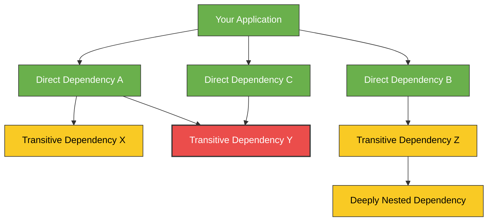
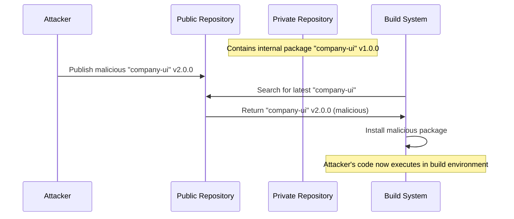
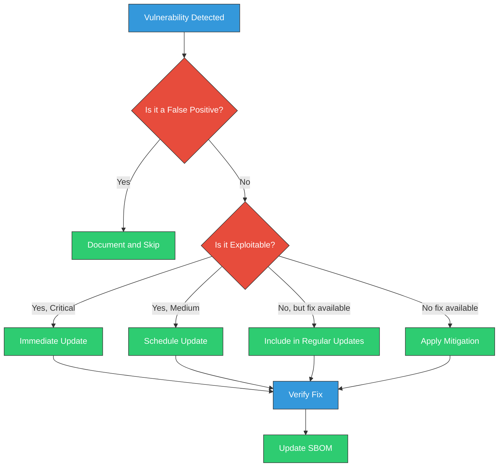

# Dependency Management in Software Development

<div class="secure-component">
<span class="security-badge badge-warning">HIGH RISK AREA</span>

Dependency management represents one of the highest-risk areas in the modern software supply chain. This guide provides comprehensive strategies to mitigate dependency-related risks.
</div>

Managing dependencies securely is a critical aspect of software development, particularly in the context of software supply chain security. This document outlines best practices and guidelines for effectively managing dependencies to minimize risks.

## Understanding Dependencies

Dependencies are external libraries or packages that your software relies on to function. While they can significantly speed up development, they also introduce potential vulnerabilities if not managed properly.



### Types of Dependencies

1. **Direct Dependencies**: Libraries that are explicitly included in your project.
2. **Transitive Dependencies**: Libraries that your direct dependencies rely on (dependencies of dependencies).
3. **Development Dependencies**: Libraries used only during development, not in production.
4. **Runtime Dependencies**: Libraries required during execution of your application.
5. **Peer Dependencies**: Libraries that your package expects to be provided by the consumer.

### The Dependency Risk Landscape

Software dependencies introduce several categories of risk:

| Risk Category | Description | Examples | Impact |
|---------------|-------------|----------|--------|
| **Security Vulnerabilities** | Flaws in dependencies that can be exploited | SQL injection, buffer overflow, command injection | High - can lead to data breaches, system compromise |
| **Maintenance Issues** | Abandoned or poorly maintained packages | Outdated libraries, unmaintained code | Medium - leads to technical debt and future security issues |
| **Supply Chain Attacks** | Malicious code intentionally introduced | Typosquatting, dependency confusion, account takeover | Critical - direct insertion of backdoors or malware |
| **Licensing Compliance** | Incompatible or restrictive licenses | GPL violations, improper attribution | Medium - legal and compliance issues |
| **Operational Stability** | Breaking changes, performance issues | API changes, regression bugs | Medium - application instability |

## Common Dependency-Related Attacks

### Dependency Confusion

Dependency confusion is an attack where a malicious package with the same name as an internal/private package is published to a public repository with a higher version number. When the build system looks for the "latest" version, it finds and installs the malicious package instead of the legitimate internal one.



### Typosquatting

Attackers publish malicious packages with names similar to popular packages, hoping that developers will accidentally install them through typographical errors (e.g., "lodahs" instead of "lodash").

### Compromised Maintainer Accounts

If an attacker gains access to a package maintainer's account, they can publish malicious versions of legitimate, widely used packages.

## Vulnerability Management

Vulnerability management for dependencies involves:

1. **Identification**: Discovering vulnerabilities in your dependencies
2. **Assessment**: Evaluating the risk and impact of the vulnerability
3. **Remediation**: Updating or replacing vulnerable dependencies
4. **Verification**: Ensuring vulnerabilities are properly addressed



## Best Practices for Dependency Management

### 1. Inventory and Selection

- **Use Trusted Sources**: Always source dependencies from reputable and trusted repositories. Avoid using unverified or unknown sources.

  ```bash
  # Configure npm to use only approved registries
  npm config set registry https://registry.npmjs.org/
  ```

- **Evaluate Before Adding**: Before adding a new dependency, evaluate its:
  - Maintenance status and update frequency
  - Community adoption and activity
  - Security track record
  - Size and impact on your application
  - Available alternatives

- **Prefer Established Libraries**: When possible, use well-maintained, popular libraries that have undergone significant security scrutiny.

### 2. Version Control and Pinning

- **Lock Dependency Versions**: Use lock files (e.g., `package-lock.json`, `yarn.lock`, `Pipfile.lock`, `poetry.lock`) to ensure consistent installations across different environments.

  ```json
  // Example package-lock.json snippet
  "lodash": {
    "version": "4.17.21",
    "resolved": "https://registry.npmjs.org/lodash/-/lodash-4.17.21.tgz",
    "integrity": "sha512-v2kDEe57lecTulaDIuNTPy3Ry4gLGJ6Z1O3vE1krgXZNrsQ+LFTGHVxVjcXPs17LhbZVGedAJv8XZ1tvj5FvSg=="
  }
  ```

- **Pin to Specific Versions**: Avoid using version ranges (`^`, `~`, `>=`, `*`) when security is critical. Pin to exact versions to prevent automatic updates that might introduce vulnerabilities.

  ```json
  // Bad - allows potentially insecure updates
  "dependencies": {
    "express": "^4.17.1"
  }
  
  // Good - pins to specific version
  "dependencies": {
    "express": "4.17.1"
  }
  ```

- **Use Checksums/Integrity Verification**: Ensure your package manager verifies the integrity of downloaded packages.

### 3. Monitoring and Updates

- **Regularly Update Dependencies**: Keep your dependencies up to date to benefit from security patches and improvements. Use tools that can automate this process.

- **Monitor for Vulnerabilities**: Set up monitoring for your dependencies to receive alerts about newly discovered vulnerabilities. Services like Snyk, GitHub Dependabot, or OWASP Dependency-Check can assist with this.

  ```yaml
  # Example GitHub Dependabot configuration (.github/dependabot.yml)
  version: 2
  updates:
    - package-ecosystem: "npm"
      directory: "/"
      schedule:
        interval: "weekly"
      security-updates-only: true
  ```

- **Implement Security Scanning in CI/CD**: Integrate dependency scanning tools into your CI/CD pipeline to automatically check for vulnerabilities during the build process.

  ```yaml
  # Example GitHub Action for dependency scanning
  name: Security Scan
  on: [push, pull_request]
  
  jobs:
    security:
      runs-on: ubuntu-latest
      steps:
        - uses: actions/checkout@v3
        - name: Run Snyk to check for vulnerabilities
          uses: snyk/actions/node@master
          env:
            SNYK_TOKEN: ${{ secrets.SNYK_TOKEN }}
  ```

### 4. Risk Reduction Strategies

- **Minimize Dependencies**: Only include dependencies that are absolutely necessary for your project. This reduces the attack surface and potential vulnerabilities.

- **Use Private Registries or Mirrors**: Consider using private registries or mirrors to cache and pre-approve dependencies.

  ```bash
  # Configure npm to use a private registry
  npm config set registry https://private-registry.company.com/
  ```

- **Review Dependency Licenses**: Ensure that the licenses of your dependencies are compatible with your project and do not impose unexpected obligations.

- **Implement Dependency Firewall**: Use tools like npm-audit-resolver to create policies for allowed dependencies.

### 5. Advanced Techniques

- **Vendor Dependencies**: For critical applications, consider vendoring (copying dependencies directly into your repository) to prevent supply chain attacks.

- **Use Runtime Application Self-Protection (RASP)**: Implement RASP tools that can detect and block attacks exploiting vulnerabilities in dependencies during runtime.

- **Air-gapped Builds**: For highly sensitive systems, consider building in air-gapped environments to prevent dependency confusion attacks.

- **Multi-factor Verification**: Implement systems that verify dependencies through multiple validation methods (hash checking, signature verification, etc.)

## Language-Specific Tools and Practices

### Node.js / JavaScript

```bash
# Audit dependencies for vulnerabilities
npm audit

# Fix automatically when possible
npm audit fix

# Generate SBOM
npm install -g @cyclonedx/cyclonedx-npm
cyclonedx-npm --output-file sbom.xml
```

### Python

```bash
# Check for security issues
pip install safety
safety check

# Generate dependency tree
pip install pipdeptree
pipdeptree

# Lock dependencies
pip install pip-tools
pip-compile requirements.in
```

### Java / Maven

```bash
# Check for vulnerabilities
mvn org.owasp:dependency-check-maven:check

# Generate SBOM
mvn org.cyclonedx:cyclonedx-maven-plugin:makeAggregateBom
```

### Go

```bash
# Audit dependencies
go install golang.org/x/vuln/cmd/govulncheck@latest
govulncheck ./...

# Use vendoring
go mod vendor
```

## Conclusion

Dependency management is a critical aspect of software supply chain security that requires continuous attention and proactive measures. By implementing the strategies outlined in this guide, organizations can significantly reduce the risk of supply chain attacks and vulnerabilities introduced through third-party dependencies.

Remember that dependency management is not a one-time activity but an ongoing process that should be integrated into your development lifecycle. Regular audits, updates, and monitoring are essential components of a robust dependency management strategy.

!!! info "Key Takeaways"
    - Lock and pin dependency versions
    - Use checksums and integrity verification
    - Keep dependencies updated for security patches
    - Implement automated vulnerability scanning
    - Minimize your dependency footprint
    - Monitor dependencies for security issues continuously