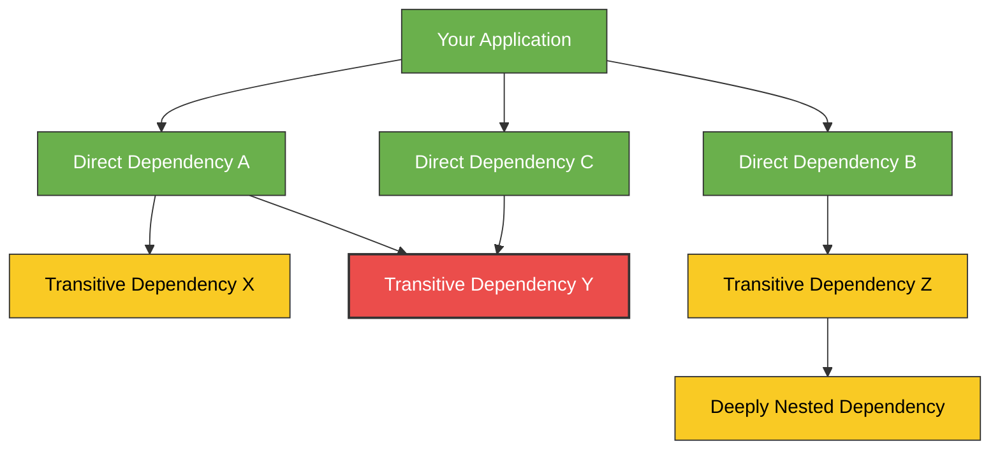
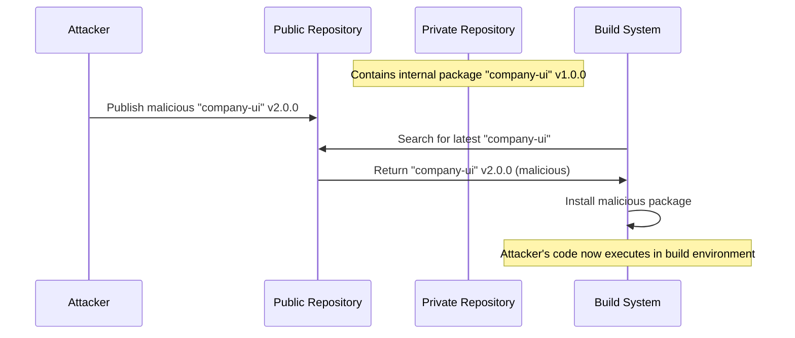
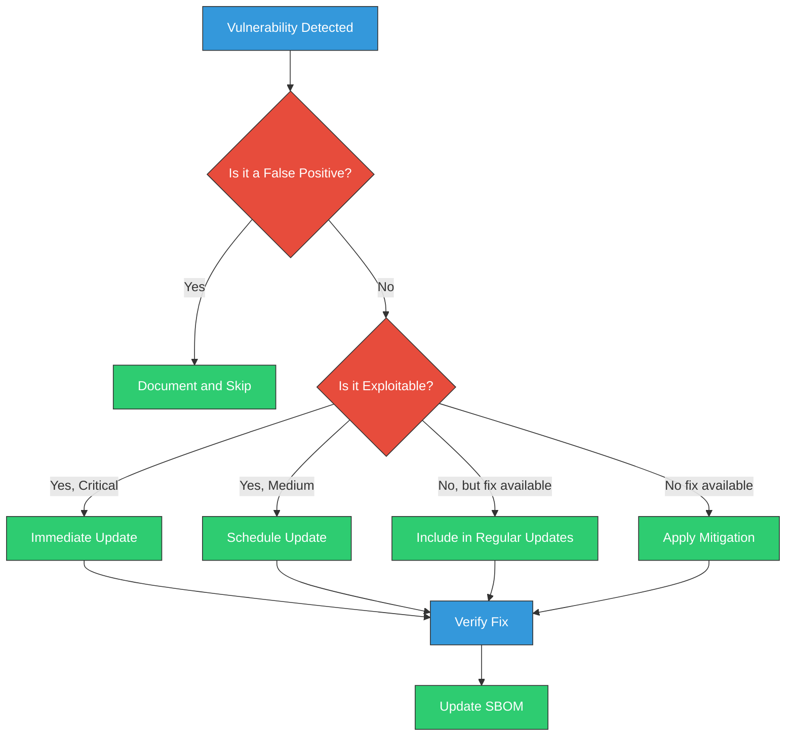
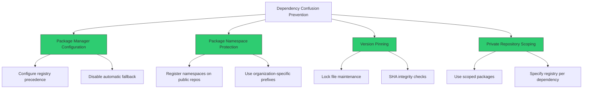
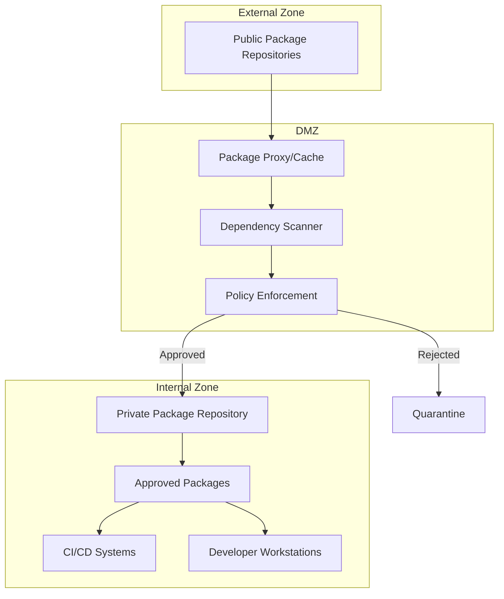

# Dependency Management in Software Development

<div class="secure-component">
<span class="security-badge badge-warning">HIGH RISK AREA</span>

Dependency management represents one of the highest-risk areas in the modern software supply chain. This guide provides comprehensive strategies to mitigate dependency-related risks.
</div>

Managing dependencies securely is a critical aspect of software development, particularly in the context of software supply chain security. This document outlines best practices and guidelines for effectively managing dependencies to minimize risks.

## Understanding Dependencies

Dependencies are external libraries or packages that your software relies on to function. While they can significantly speed up development, they also introduce potential vulnerabilities if not managed properly.



### Types of Dependencies

1. **Direct Dependencies**: Libraries that are explicitly included in your project.
2. **Transitive Dependencies**: Libraries that your direct dependencies rely on (dependencies of dependencies).
3. **Development Dependencies**: Libraries used only during development, not in production.
4. **Runtime Dependencies**: Libraries required during execution of your application.
5. **Peer Dependencies**: Libraries that your package expects to be provided by the consumer.

### The Dependency Risk Landscape

Software dependencies introduce several categories of risk:

| Risk Category | Description | Examples | Impact |
|---------------|-------------|----------|--------|
| **Security Vulnerabilities** | Flaws in dependencies that can be exploited | SQL injection, buffer overflow, command injection | High - can lead to data breaches, system compromise |
| **Maintenance Issues** | Abandoned or poorly maintained packages | Outdated libraries, unmaintained code | Medium - leads to technical debt and future security issues |
| **Supply Chain Attacks** | Malicious code intentionally introduced | Typosquatting, dependency confusion, account takeover | Critical - direct insertion of backdoors or malware |
| **Licensing Compliance** | Incompatible or restrictive licenses | GPL violations, improper attribution | Medium - legal and compliance issues |
| **Operational Stability** | Breaking changes, performance issues | API changes, regression bugs | Medium - application instability |

## Common Dependency-Related Attacks

### Dependency Confusion

Dependency confusion is an attack where a malicious package with the same name as an internal/private package is published to a public repository with a higher version number. When the build system looks for the "latest" version, it finds and installs the malicious package instead of the legitimate internal one.



### Typosquatting

Attackers publish malicious packages with names similar to popular packages, hoping that developers will accidentally install them through typographical errors (e.g., "lodahs" instead of "lodash").

### Compromised Maintainer Accounts

If an attacker gains access to a package maintainer's account, they can publish malicious versions of legitimate, widely used packages.

## Vulnerability Management

Vulnerability management for dependencies involves:

1. **Identification**: Discovering vulnerabilities in your dependencies
2. **Assessment**: Evaluating the risk and impact of the vulnerability
3. **Remediation**: Updating or replacing vulnerable dependencies
4. **Verification**: Ensuring vulnerabilities are properly addressed



## Best Practices for Dependency Management

### 1. Inventory and Selection

- **Use Trusted Sources**: Always source dependencies from reputable and trusted repositories. Avoid using unverified or unknown sources.

  ```bash
  # Configure npm to use only approved registries
  npm config set registry https://registry.npmjs.org/
  ```

- **Evaluate Before Adding**: Before adding a new dependency, evaluate its:
  - Maintenance status and update frequency
  - Community adoption and activity
  - Security track record
  - Size and impact on your application
  - Available alternatives

- **Prefer Established Libraries**: When possible, use well-maintained, popular libraries that have undergone significant security scrutiny.

### 2. Version Control and Pinning

- **Lock Dependency Versions**: Use lock files (e.g., `package-lock.json`, `yarn.lock`, `Pipfile.lock`, `poetry.lock`) to ensure consistent installations across different environments.

  ```json
  // Example package-lock.json snippet
  "lodash": {
    "version": "4.17.21",
    "resolved": "https://registry.npmjs.org/lodash/-/lodash-4.17.21.tgz",
    "integrity": "sha512-v2kDEe57lecTulaDIuNTPy3Ry4gLGJ6Z1O3vE1krgXZNrsQ+LFTGHVxVjcXPs17LhbZVGedAJv8XZ1tvj5FvSg=="
  }
  ```

- **Pin to Specific Versions**: Avoid using version ranges (`^`, `~`, `>=`, `*`) when security is critical. Pin to exact versions to prevent automatic updates that might introduce vulnerabilities.

  ```json
  // Bad - allows potentially insecure updates
  "dependencies": {
    "express": "^4.17.1"
  }
  
  // Good - pins to specific version
  "dependencies": {
    "express": "4.17.1"
  }
  ```

- **Use Checksums/Integrity Verification**: Ensure your package manager verifies the integrity of downloaded packages.

### 3. Monitoring and Updates

- **Regularly Update Dependencies**: Keep your dependencies up to date to benefit from security patches and improvements. Use tools that can automate this process.

- **Monitor for Vulnerabilities**: Set up monitoring for your dependencies to receive alerts about newly discovered vulnerabilities. Services like Snyk, GitHub Dependabot, or OWASP Dependency-Check can assist with this.

  ```yaml
  # Example GitHub Dependabot configuration (.github/dependabot.yml)
  version: 2
  updates:
    - package-ecosystem: "npm"
      directory: "/"
      schedule:
        interval: "weekly"
      security-updates-only: true
  ```

- **Implement Security Scanning in CI/CD**: Integrate dependency scanning tools into your CI/CD pipeline to automatically check for vulnerabilities during the build process.

  ```yaml
  # Example GitHub Action for dependency scanning
  name: Security Scan
  on: [push, pull_request]
  
  jobs:
    security:
      runs-on: ubuntu-latest
      steps:
        - uses: actions/checkout@v3
        - name: Run Snyk to check for vulnerabilities
          uses: snyk/actions/node@master
          env:
            SNYK_TOKEN: ${{ secrets.SNYK_TOKEN }}
  ```

### 4. Risk Reduction Strategies

- **Minimize Dependencies**: Only include dependencies that are absolutely necessary for your project. This reduces the attack surface and potential vulnerabilities.

- **Use Private Registries or Mirrors**: Consider using private registries or mirrors to cache and pre-approve dependencies.

  ```bash
  # Configure npm to use a private registry
  npm config set registry https://private-registry.company.com/
  ```

- **Review Dependency Licenses**: Ensure that the licenses of your dependencies are compatible with your project and do not impose unexpected obligations.

- **Implement Dependency Firewall**: Use tools like npm-audit-resolver to create policies for allowed dependencies.

### 5. Advanced Techniques

- **Vendor Dependencies**: For critical applications, consider vendoring (copying dependencies directly into your repository) to prevent supply chain attacks.

- **Use Runtime Application Self-Protection (RASP)**: Implement RASP tools that can detect and block attacks exploiting vulnerabilities in dependencies during runtime.

- **Air-gapped Builds**: For highly sensitive systems, consider building in air-gapped environments to prevent dependency confusion attacks.

- **Multi-factor Verification**: Implement systems that verify dependencies through multiple validation methods (hash checking, signature verification, etc.)

## Language-Specific Tools and Practices

### Node.js / JavaScript

```bash
# Audit dependencies for vulnerabilities
npm audit

# Fix automatically when possible
npm audit fix

# Generate SBOM
npm install -g @cyclonedx/cyclonedx-npm
cyclonedx-npm --output-file sbom.xml
```

### Python

```bash
# Check for security issues
pip install safety
safety check

# Generate dependency tree
pip install pipdeptree
pipdeptree

# Lock dependencies
pip install pip-tools
pip-compile requirements.in
```

### Java / Maven

```bash
# Check for vulnerabilities
mvn org.owasp:dependency-check-maven:check

# Generate SBOM
mvn org.cyclonedx:cyclonedx-maven-plugin:makeAggregateBom
```

### Go

```bash
# Audit dependencies
go install golang.org/x/vuln/cmd/govulncheck@latest
govulncheck ./...

# Use vendoring
go mod vendor
```

## Advanced Dependency Management Strategies

While basic dependency management practices form a solid foundation, advanced strategies provide deeper protection against supply chain attacks and vulnerabilities.

### Dependency Confusion Prevention

Dependency confusion attacks exploit how package managers resolve dependencies when same-named packages exist in public and private repositories. To defend against these attacks:



**NPM Configuration Example:**

```json
// .npmrc
# Scope all packages under @company to private registry
@company:registry=https://npm.company.internal/
# Set registry token
//npm.company.internal/:_authToken=${NPM_TOKEN}
# Disable fallback to public registry for @company scoped packages
@company:always-auth=true
# Verify registry SSL
strict-ssl=true
```

**Yarn Configuration Example:**

```yaml
# .yarnrc.yml
npmScopes:
  company:
    npmRegistryServer: "https://npm.company.internal/"
    npmAlwaysAuth: true
    npmAuthToken: "${NPM_TOKEN}"

# Disable public registry for specific packages
packageExtensions:
  "internal-component@*":
    dependencies:
      "company-lib": "workspace:*"
```

**Maven Configuration Example:**

```xml
<!-- settings.xml -->
<settings>
  <mirrors>
    <!-- Block external access for internal group IDs -->
    <mirror>
      <id>internal-repository</id>
      <name>Internal Repository Manager</name>
      <url>https://repo.company.internal/maven</url>
      <mirrorOf>*</mirrorOf>
    </mirror>
  </mirrors>
  
  <!-- Configure repository-specific credentials -->
  <servers>
    <server>
      <id>internal-repository</id>
      <username>${env.MAVEN_USERNAME}</username>
      <password>${env.MAVEN_PASSWORD}</password>
    </server>
  </servers>
</settings>
```

### Dependency Verification and Attestation

Move beyond basic integrity checks to comprehensive verification of dependencies:

1. **Signature Verification**

```bash
# NPM signature verification with sigstore
npm audit signatures lodash@4.17.21

# Verify JAR signatures
jarsigner -verify -certs -verbose my-dependency.jar

# Verify Python package signatures
gpg --verify downloaded_package.tar.gz.asc downloaded_package.tar.gz
```

2. **Reproducible Builds Verification**

```bash
# Example build verification script
#!/bin/bash

# Clone the source at the specific version
git clone https://github.com/dependency/repo.git
cd repo
git checkout v1.2.3

# Build from source using defined build environment
docker run --rm -v $(pwd):/src build-environment:1.0 \
  /bin/sh -c "cd /src && npm ci && npm run build"

# Compare built artifact with downloaded one
sha256sum ./dist/package.min.js > built.sha256
sha256sum ../downloaded/package.min.js > downloaded.sha256

if cmp -s built.sha256 downloaded.sha256; then
  echo "Verification successful: builds match"
  exit 0
else
  echo "Verification failed: builds differ"
  exit 1
fi
```

3. **Supply Chain Level for Software Artifacts (SLSA) Verification**

```python
# Example SLSA provenance verification
import json
from cryptography.x509 import load_pem_x509_certificate
from cryptography.hazmat.primitives.asymmetric import padding
from cryptography.hazmat.primitives import hashes

def verify_slsa_attestation(attestation_path, artifact_path):
    """Verify SLSA attestation for an artifact."""
    # Load attestation
    with open(attestation_path, 'r') as f:
        attestation = json.load(f)
    
    # Extract certificate and signature
    cert_data = attestation['payload']['certificate']
    signature = attestation['signature']
    
    # Load certificate
    cert = load_pem_x509_certificate(cert_data.encode('utf-8'))
    public_key = cert.public_key()
    
    # Calculate artifact digest
    with open(artifact_path, 'rb') as f:
        artifact_data = f.read()
    artifact_digest = hashes.Hash(hashes.SHA256())
    artifact_digest.update(artifact_data)
    digest = artifact_digest.finalize()
    
    # Verify signature
    try:
        public_key.verify(
            signature,
            digest,
            padding.PKCS1v15(),
            hashes.SHA256()
        )
        print("Signature verification successful")
        
        # Verify provenance attributes
        builder = attestation['payload']['provenance']['builder']
        built_from = attestation['payload']['provenance']['materials'][0]['uri']
        
        print(f"Built by: {builder}")
        print(f"Built from: {built_from}")
        
        return True
    except Exception as e:
        print(f"Verification failed: {e}")
        return False
```

### Dependency Firewall Architecture

Implement a multi-layered approach to dependency security:



**Implementation with Artifactory JFrog:**

```yaml
# Example Artifactory configuration for dependency firewall
repositories:
  # Remote repositories (proxies to external sources)
  remote:
    npm-remote:
      url: https://registry.npmjs.org
      xray:
        enabled: true
      blackedOut: false
      propertySets:
        - core-properties
      
    maven-remote:
      url: https://repo.maven.apache.org/maven2
      xray:
        enabled: true
      blackedOut: false
      
  # Virtual repositories (the entry points for developers)
  virtual:
    npm-virtual:
      includes:
        - npm-approved-local
        - npm-quarantine-local
        - npm-remote
      defaultDeploymentRepo: npm-quarantine-local
    
    maven-virtual:
      includes:
        - maven-approved-local
        - maven-quarantine-local
        - maven-remote
      defaultDeploymentRepo: maven-quarantine-local
      
  # Local repositories
  local:
    npm-approved-local:
      xrayIndex: true
      propertySets:
        - core-properties
    
    npm-quarantine-local:
      xrayIndex: true
      propertySets:
        - core-properties

# XRay policies
xray:
  policies:
    security-policy:
      type: security
      rule:
        min-severity: medium
        block-unscanned: true
        fail-build: true
      
    license-policy:
      type: license
      rule:
        allow:
          - MIT
          - Apache-2.0
          - BSD-3-Clause
        block:
          - GPL-3.0
          - AGPL-3.0
```

**Nexus Repository Manager Configuration:**

```json
// Example Nexus security policy
{
  "name": "dependency-firewall",
  "format": "npm",
  "mode": "block",
  "criterias": [
    {
      "operator": "equals",
      "attribute": "vulnerability.severity",
      "value": "critical"
    },
    {
      "operator": "regex",
      "attribute": "name",
      "value": "^suspicious.*"
    },
    {
      "operator": "matches",
      "attribute": "license",
      "value": ["GPL-*"]
    }
  ]
}
```

### Dependency Risk Scoring and Prioritization

Develop a comprehensive scoring system for dependency risk:

```python
# Example dependency risk scoring algorithm
def calculate_dependency_risk(dependency):
    """Calculate risk score for a dependency."""
    score = 0
    
    # Security factors
    if dependency['has_vulnerabilities']:
        vuln_score = sum(v['cvss_score'] for v in dependency['vulnerabilities'])
        score += min(vuln_score, 10) * 2  # Max 20 points
    
    # Maintenance factors
    if dependency['last_release'] > 365:  # days
        score += 5  # Unmaintained
    elif dependency['last_release'] > 180:
        score += 3  # Poorly maintained
        
    if dependency['open_issues'] > 100 and dependency['open_issues_rate'] > 0.7:
        score += 5  # Many unresolved issues
    
    # Popularity factors
    if dependency['downloads_last_month'] < 1000:
        score += 5  # Low adoption
    elif dependency['downloads_last_month'] < 10000:
        score += 3  # Moderate adoption
    
    # Supply chain factors
    if not dependency['has_2fa']:
        score += 5  # No 2FA for maintainers
        
    if dependency['contributors_count'] < 3:
        score += 3  # Too few maintainers
    
    # License factors
    if dependency['license'] in HIGH_RISK_LICENSES:
        score += 5
    elif dependency['license'] in MEDIUM_RISK_LICENSES:
        score += 3
    
    # Usage factors
    if dependency['is_direct']:
        score *= 1.2  # Direct dependencies are higher risk
    
    if dependency['used_in_critical_path']:
        score *= 1.5  # Used in critical application features
    
    return min(score, 100)  # Cap at 100
```

Integrate this scoring into your CI/CD pipeline for dependency assessment and remediation prioritization:

```yaml
# Example GitHub Action for dependency risk assessment
name: Dependency Risk Assessment

on:
  push:
    branches: [ main ]
  pull_request:
    branches: [ main ]
  schedule:
    - cron: '0 0 * * 1'  # Weekly on Mondays

jobs:
  assess-dependencies:
    runs-on: ubuntu-latest
    
    steps:
      - uses: actions/checkout@v3
      
      - name: Install dependencies
        run: npm ci
        
      - name: Generate dependency data
        run: |
          npx dependency-risk-analyzer > dependency-data.json
        
      - name: Calculate risk scores
        run: |
          python .github/scripts/calculate_risk.py \
            --input dependency-data.json \
            --output risk-report.json
        
      - name: Generate risk report
        run: |
          python .github/scripts/generate_report.py \
            --input risk-report.json \
            --output risk-report.md
        
      - name: Upload risk report
        uses: actions/upload-artifact@v3
        with:
          name: dependency-risk-report
          path: risk-report.md
      
      - name: Fail if high-risk dependencies found
        run: |
          HIGH_RISK=$(jq '.dependencies | map(select(.risk_score > 70)) | length' risk-report.json)
          if [ "$HIGH_RISK" -gt 0 ]; then
            echo "❌ $HIGH_RISK high-risk dependencies found"
            jq '.dependencies | map(select(.risk_score > 70)) | .[]' risk-report.json
            exit 1
          else
            echo "✅ No high-risk dependencies found"
          fi
```

## Dependency Management Implementation Guide

### Step 1: Dependency Inventory and Classification

Begin by creating a comprehensive inventory of all dependencies across your projects:

```bash
# Generate dependency reports for all repositories
for repo in $(ls -d */); do
  cd "$repo"
  echo "Processing $repo"
  
  # For npm projects
  if [ -f package.json ]; then
    npm list --json > dependency-report.json
  fi
  
  # For Python projects
  if [ -f requirements.txt ] || [ -f pyproject.toml ]; then
    pip install pipdeptree
    pipdeptree --json > dependency-report.json
  fi
  
  # For Java projects
  if [ -f pom.xml ]; then
    mvn dependency:tree -DoutputFile=dependency-report.txt
  fi
  
  cd ..
done
```

Then classify dependencies by criticality:

```python
# Example dependency classification script
import json
import os
import csv

def classify_dependency(name, metadata):
    """Classify a dependency by criticality."""
    # Critical dependencies directly affect security
    security_related = [
        'crypto', 'auth', 'password', 'login', 'cipher',
        'token', 'oauth', 'permission', 'access', 'jwt'
    ]
    
    # Check if name or description contains security-related terms
    is_security = any(term in name.lower() for term in security_related)
    if metadata.get('description'):
        is_security = is_security or any(term in metadata['description'].lower() 
                                        for term in security_related)
    
    if is_security:
        return 'critical'
    
    # High-impact dependencies affect core functionality
    if metadata.get('is_direct') and metadata.get('used_in_core_features'):
        return 'high'
    
    # Medium-impact dependencies have moderate usage
    if metadata.get('is_direct'):
        return 'medium'
    
    # Low-impact dependencies are transitive with limited impact
    return 'low'

# Process dependency reports
results = []
for root, dirs, files in os.walk('.'):
    if 'dependency-report.json' in files:
        with open(os.path.join(root, 'dependency-report.json'), 'r') as f:
            try:
                data = json.load(f)
                project_name = os.path.basename(root)
                
                # Process dependencies
                for dep_name, dep_data in data.get('dependencies', {}).items():
                    classification = classify_dependency(dep_name, dep_data)
                    
                    results.append({
                        'project': project_name,
                        'dependency': dep_name,
                        'version': dep_data.get('version', 'unknown'),
                        'classification': classification,
                        'direct': dep_data.get('is_direct', False),
                        'license': dep_data.get('license', 'unknown')
                    })
            except json.JSONDecodeError:
                print(f"Error processing {os.path.join(root, 'dependency-report.json')}")

# Write results to CSV
with open('dependency-inventory.csv', 'w', newline='') as f:
    writer = csv.DictWriter(f, fieldnames=[
        'project', 'dependency', 'version', 'classification', 
        'direct', 'license'
    ])
    writer.writeheader()
    writer.writerows(results)
```

### Step 2: Dependency Security Baseline

Establish a baseline for dependency security across your projects:

```bash
# Baseline security scanning
npm audit --json > security-baseline-npm.json
pip-audit --output json > security-baseline-python.json
mvn dependency-check:aggregate -DoutputFormat=JSON -DoutputDirectory=./baseline
```

Analyze results to identify common patterns and issues:

```python
# Example security baseline analysis
import json

# Load security scan results
with open('security-baseline-npm.json', 'r') as f:
    npm_results = json.load(f)
    
# Count vulnerabilities by severity
severity_counts = {
    'critical': 0,
    'high': 0,
    'moderate': 0,
    'low': 0
}

affected_deps = set()

# Process npm results
for vuln in npm_results.get('vulnerabilities', {}).values():
    severity = vuln.get('severity', 'unknown')
    if severity in severity_counts:
        severity_counts[severity] += 1
    
    affected_deps.add(vuln.get('name'))

print(f"Total affected dependencies: {len(affected_deps)}")
print("Vulnerabilities by severity:")
for severity, count in severity_counts.items():
    print(f"  {severity}: {count}")

# Identify top vulnerable dependencies
dep_count = {}
for vuln in npm_results.get('vulnerabilities', {}).values():
    name = vuln.get('name')
    dep_count[name] = dep_count.get(name, 0) + 1

top_deps = sorted(dep_count.items(), key=lambda x: x[1], reverse=True)[:10]
print("\nTop 10 vulnerable dependencies:")
for dep, count in top_deps:
    print(f"  {dep}: {count} vulnerabilities")
```

### Step 3: Dependency Policy Development

Create a comprehensive dependency management policy:

```markdown
# Dependency Management Policy

## Approved Sources
- NPM: registry.npmjs.org
- PyPI: pypi.org
- Maven Central: repo.maven.apache.org

## Dependency Approval Process
1. Developer submits dependency request via [form]
2. Security team reviews request within 3 business days
3. Upon approval, dependency is added to approved list
4. CI/CD pipeline enforces approved dependencies

## Version Control Requirements
- All projects must use lock files (package-lock.json, poetry.lock, etc.)
- Direct dependencies must specify exact versions
- Version ranges only permitted for dev dependencies

## Security Requirements
- No dependencies with known HIGH or CRITICAL vulnerabilities
- All dependencies must have active maintenance (commit in last 6 months)
- License must be on approved list (MIT, Apache 2.0, BSD, etc.)

## Monitoring and Updates
- Weekly automated dependency scanning
- Monthly dependency update review
- Quarterly dependency cleanup and consolidation

## Emergency Process
For urgent dependency changes:
1. Submit emergency request via [emergency form]
2. Receive expedited review (4 hour SLA)
3. Document exception and review at next security meeting
```

Implement the policy with enforcement tools:

```javascript
// Example dependency policy enforcement script (NodeJS)
const fs = require('fs');
const path = require('path');

// Load approved dependencies
const approvedDeps = require('./approved-dependencies.json');

// Load package.json
const packageJson = JSON.parse(fs.readFileSync('package.json', 'utf8'));

// Check dependencies
const violations = [];

for (const [depName, depVersion] of Object.entries(packageJson.dependencies || {})) {
  // Check if dependency is approved
  if (!approvedDeps.includes(depName)) {
    violations.push({
      name: depName,
      reason: 'Dependency not on approved list',
      suggestion: 'Submit for approval or use an approved alternative'
    });
    continue;
  }
  
  // Check version format (must be exact)
  if (depVersion.startsWith('^') || depVersion.startsWith('~')) {
    violations.push({
      name: depName,
      reason: 'Version must be exact (no ^ or ~)',
      suggestion: `Change "${depName}": "${depVersion}" to "${depName}": "${depVersion.replace(/[\^~]/, '')}"`
    });
  }
}

// Output results
if (violations.length > 0) {
  console.error('Dependency policy violations found:');
  for (const violation of violations) {
    console.error(`- ${violation.name}: ${violation.reason}`);
    console.error(`  Suggestion: ${violation.suggestion}`);
  }
  process.exit(1);
} else {
  console.log('All dependencies comply with policy');
}
```

### Step 4: Automated Dependency Update Strategy

Implement a structured approach to dependency updates:

```yaml
# Example Dependabot configuration
# .github/dependabot.yml
version: 2
updates:
  # Package ecosystem for npm
  - package-ecosystem: "npm"
    directory: "/"
    schedule:
      interval: "weekly"
      day: "monday"
    # Group all dev dependencies into a single PR
    groups:
      dev-dependencies:
        patterns:
          - "*eslint*"
          - "*prettier*"
          - "*test*"
          - "*webpack*"
    # Add reviewers
    reviewers:
      - "security-team"
    # Apply dependency labels
    labels:
      - "dependencies"
      - "security"
    # Limit open PRs
    open-pull-requests-limit: 10
    # Special rules for version updates
    ignore:
      # Don't update major versions automatically
      - dependency-name: "*"
        update-types: ["version-update:semver-major"]
    # Auto-merge non-major updates for certain dependencies
    allow:
      - dependency-type: "direct"
        dependency-name: "lodash"
        update-types: ["version-update:semver-patch", "version-update:semver-minor"]
```

Extend with custom update automation:

```python
# Example custom dependency update script
import os
import json
import subprocess
import requests
from datetime import datetime

def check_dependency_health(name, version):
    """Check the health of a dependency."""
    # Check GitHub repo stats
    repo_info = get_github_repo_info(name)
    
    # Check last commit date
    last_commit_date = repo_info.get('last_commit_date')
    if last_commit_date:
        last_commit_date = datetime.fromisoformat(last_commit_date.replace('Z', '+00:00'))
        days_since_commit = (datetime.now() - last_commit_date).days
        if days_since_commit > 365:
            return False, f"Last commit was {days_since_commit} days ago"
    
    # Check open issues
    open_issues = repo_info.get('open_issues', 0)
    total_issues = repo_info.get('total_issues', 0)
    if total_issues > 0 and open_issues / total_issues > 0.8:
        return False, f"High ratio of open issues: {open_issues}/{total_issues}"
    
    # Check security advisories
    advisories = get_security_advisories(name, version)
    if advisories:
        return False, f"Has {len(advisories)} security advisories"
    
    return True, "Dependency is healthy"

def update_dependencies():
    """Update dependencies based on health checks."""
    # Load package.json
    with open('package.json', 'r') as f:
        package_json = json.load(f)
    
    dependencies = package_json.get('dependencies', {})
    results = {
        'updated': [],
        'skipped': []
    }
    
    for dep_name, current_version in dependencies.items():
        print(f"Checking {dep_name}@{current_version}...")
        
        # Get latest version
        latest_version = get_latest_version(dep_name)
        
        if latest_version == current_version:
            results['skipped'].append({
                'name': dep_name,
                'reason': 'Already at latest version'
            })
            continue
        
        # Check dependency health
        is_healthy, health_msg = check_dependency_health(dep_name, latest_version)
        
        if not is_healthy:
            results['skipped'].append({
                'name': dep_name,
                'reason': health_msg
            })
            continue
        
        # Update dependency
        try:
            subprocess.run(['npm', 'install', f'{dep_name}@{latest_version}'], check=True)
            results['updated'].append({
                'name': dep_name,
                'from': current_version,
                'to': latest_version
            })
        except subprocess.CalledProcessError:
            results['skipped'].append({
                'name': dep_name,
                'reason': 'Installation failed'
            })
    
    # Output results
    print(f"\nUpdated {len(results['updated'])} dependencies:")
    for dep in results['updated']:
        print(f"  {dep['name']}: {dep['from']} -> {dep['to']}")
    
    print(f"\nSkipped {len(results['skipped'])} dependencies:")
    for dep in results['skipped']:
        print(f"  {dep['name']}: {dep['reason']}")
    
    # Run tests to verify updates
    try:
        subprocess.run(['npm', 'test'], check=True)
        print("\n✅ Tests passed with updated dependencies")
    except subprocess.CalledProcessError:
        print("\n❌ Tests failed with updated dependencies")
        print("Rolling back changes...")
        subprocess.run(['git', 'checkout', '--', 'package.json', 'package-lock.json'])
        subprocess.run(['npm', 'ci'])
```

### Step 5: Dependency Monitoring and Incident Response

Set up continuous monitoring for dependency issues:

```yaml
# Example GitHub Action for dependency monitoring
name: Dependency Monitoring

on:
  schedule:
    - cron: '0 */6 * * *'  # Run every 6 hours
  workflow_dispatch:

jobs:
  monitor:
    runs-on: ubuntu-latest
    steps:
      - uses: actions/checkout@v3
      
      - name: Set up Node.js
        uses: actions/setup-node@v3
        with:
          node-version: '18'
      
      - name: Install dependencies
        run: npm ci
      
      - name: Check for new vulnerabilities
        id: audit
        run: |
          # Get previous audit
          if [[ -f .audit-baseline.json ]]; then
            cp .audit-baseline.json previous-audit.json
          else
            echo "{}" > previous-audit.json
          fi
          
          # Run new audit
          npm audit --json > current-audit.json
          
          # Compare for new issues
          node .github/scripts/compare-audits.js \
            previous-audit.json current-audit.json > new-vulns.json
          
          # Save current audit as baseline
          cp current-audit.json .audit-baseline.json
          
          # Check if new vulnerabilities found
          NEW_VULNS=$(jq 'length' new-vulns.json)
          echo "new_vulns=$NEW_VULNS" >> $GITHUB_OUTPUT
          
          if [[ "$NEW_VULNS" -gt 0 ]]; then
            echo "⚠️ New vulnerabilities detected"
            jq '.' new-vulns.json
          else
            echo "✅ No new vulnerabilities"
          fi
      
      - name: Create issue for new vulnerabilities
        if: steps.audit.outputs.new_vulns != '0'
        uses: JasonEtco/create-an-issue@v2
        env:
          GITHUB_TOKEN: ${{ secrets.GITHUB_TOKEN }}
        with:
          filename: .github/VULNERABILITY_ISSUE_TEMPLATE.md
          update_existing: true
      
      - name: Commit updated baseline
        run: |
          git config user.name "Dependency Monitor"
          git config user.email "bot@example.com"
          git add .audit-baseline.json
          git commit -m "Update vulnerability audit baseline" || echo "No changes to commit"
          git push
```

Create a dependency incident response plan:

```markdown
# Dependency Incident Response Plan

## Incident Types
1. Critical vulnerability discovered in dependency
2. Dependency compromised (malicious code insertion)
3. Dependency abandoned/deprecated
4. License change in dependency

## Response Team
- Security Engineer (lead)
- Application Developer
- DevOps Engineer
- Product Manager

## Response Process

### 1. Detect & Alert
- Automated detection via monitoring tools
- Manual reports from security mailing lists
- Bug bounty reports

### 2. Assess & Triage
- Determine affected applications
- Assess technical impact
- Evaluate exploitability
- Assign severity level

### 3. Contain & Mitigate
**For Critical/High severity:**
- Implement temporary workarounds
- Consider emergency rollback if actively exploited
- Pin to last known good version

**For Medium/Low severity:**
- Schedule normal update cycle
- Document in vulnerability tracking system

### 4. Remediate
- Update to fixed version
- Remove vulnerable dependency
- Replace with alternative
- Implement custom patch if needed

### 5. Verify & Close
- Validate fix effectiveness
- Run regression tests
- Update dependency inventory
- Document lessons learned

## Emergency Contact List
- Security Team: security@example.com
- On-call Engineer: +1-555-123-4567
- Slack Channel: #dependency-emergencies
```

## Specialized Dependency Management Approaches

### Monorepo Dependency Management

In monorepo environments, dependencies must be managed across multiple projects:

```json
// Example workspace configuration for Yarn
{
  "name": "monorepo-root",
  "private": true,
  "workspaces": [
    "packages/*",
    "apps/*"
  ],
  "scripts": {
    "audit": "yarn-workspace-audit",
    "update-deps": "yarn upgrade-interactive",
    "clean": "yarn clean:modules && yarn clean:builds",
    "clean:modules": "find . -name 'node_modules' -type d -prune -exec rm -rf '{}' +",
    "clean:builds": "find . -name 'dist' -type d -prune -exec rm -rf '{}' +"
  },
  "devDependencies": {
    "yarn-workspace-audit": "^1.0.0"
  },
  "resolutions": {
    "lodash": "4.17.21",
    "minimist": "1.2.6"
  }
}
```

### Microservice Dependency Management

For microservice architectures:

```yaml
# Example microservice dependency management workflow
name: Coordinated Dependency Updates

on:
  workflow_dispatch:
  schedule:
    - cron: '0 0 * * 1'  # Weekly on Mondays

jobs:
  analyze-dependencies:
    runs-on: ubuntu-latest
    outputs:
      update-matrix: ${{ steps.generate-matrix.outputs.update-matrix }}
    
    steps:
      - uses: actions/checkout@v3
      
      - name: Discover services
        id: discover
        run: |
          echo "services=$(ls -d services/* | jq -R -s -c 'split("\n")[:-1]')" >> $GITHUB_OUTPUT
      
      - name: Analyze dependencies across services
        id: analyze
        run: |
          python .github/scripts/analyze_common_deps.py \
            --services '${{ steps.discover.outputs.services }}' \
            --output 'dep-analysis.json'
      
      - name: Generate update matrix
        id: generate-matrix
        run: |
          UPDATE_MATRIX=$(jq -c '{service: .services, dependency: .common_dependencies}' dep-analysis.json)
          echo "update-matrix=${UPDATE_MATRIX}" >> $GITHUB_OUTPUT
  
  update-dependencies:
    needs: analyze-dependencies
    runs-on: ubuntu-latest
    strategy:
      matrix: ${{ fromJson(needs.analyze-dependencies.outputs.update-matrix) }}
      fail-fast: false
    
    steps:
      - uses: actions/checkout@v3
      
      - name: Set up environment
        run: |
          cd ${{ matrix.service }}
          # Install dependencies based on service type
          if [ -f package.json ]; then
            npm ci
          elif [ -f requirements.txt ]; then
            pip install -r requirements.txt
          fi
      
      - name: Update dependency
        run: |
          cd ${{ matrix.service }}
          # Update dependency based on service type
          if [ -f package.json ]; then
            npm update ${{ matrix.dependency }} --save
          elif [ -f requirements.txt ]; then
            pip install --upgrade ${{ matrix.dependency }}
            pip freeze > requirements.txt
          fi
      
      - name: Run tests
        run: |
          cd ${{ matrix.service }}
          # Run tests based on service type
          if [ -f package.json ]; then
            npm test
          elif [ -f requirements.txt ]; then
            pytest
          fi
      
      - name: Create PR for update
        uses: peter-evans/create-pull-request@v4
        with:
          branch: update-${{ matrix.dependency }}-${{ matrix.service }}
          title: "Update ${{ matrix.dependency }} in ${{ matrix.service }}"
          body: |
            This PR updates ${{ matrix.dependency }} to the latest version in ${{ matrix.service }}.
            
            This update is part of a coordinated update across all services.
          labels: dependencies, automated
          commit-message: "chore(deps): update ${{ matrix.dependency }} in ${{ matrix.service }}"
```

### Air-gapped Environment Dependency Management

For secure environments without external network access:

```bash
#!/bin/bash
# Mirror dependencies for air-gapped environment

# Create directory structure
mkdir -p mirrors/npm
mkdir -p mirrors/pypi
mkdir -p mirrors/maven

# Mirror npm packages
echo "Mirroring npm packages..."
if [ -f package-lock.json ]; then
  # Extract package URLs
  NPM_URLS=$(jq -r '.packages | to_entries[] | select(.key != "") | .value.resolved | select(. != null)' package-lock.json)
  
  # Download each package
  for URL in $NPM_URLS; do
    FILENAME=$(basename "$URL")
    echo "Downloading $FILENAME..."
    curl -s -L -o "mirrors/npm/$FILENAME" "$URL"
  done
fi

# Mirror PyPI packages
echo "Mirroring PyPI packages..."
if [ -f requirements.txt ]; then
  pip download -r requirements.txt -d mirrors/pypi
fi

# Mirror Maven packages
echo "Mirroring Maven packages..."
if [ -f pom.xml ]; then
  mvn dependency:go-offline -Dmaven.repo.local=./mirrors/maven
fi

# Create mirror configuration files
echo "Creating mirror configurations..."

# npm
cat > .npmrc << EOL
registry=file:./mirrors/npm
offline=true
EOL

# pip
cat > pip.conf << EOL
[global]
no-index = true
find-links = file://$(pwd)/mirrors/pypi
EOL

# maven
cat > settings.xml << EOL
<settings>
  <mirrors>
    <mirror>
      <id>local-mirror</id>
      <url>file://$(pwd)/mirrors/maven</url>
      <mirrorOf>*</mirrorOf>
    </mirror>
  </mirrors>
</settings>
EOL

echo "Done creating mirror configuration"
```

## Dependency Management Maturity Model

Assess and improve your organization's dependency management practices using this maturity model:

| Level | Name | Characteristics | Example Practices |
|-------|------|-----------------|-------------------|
| **1** | **Ad-hoc** | Manual, reactive dependency management | Occasional manual updates, security fixes only after incidents |
| **2** | **Aware** | Basic processes and tools implemented | Regular updates, vulnerability scanning, simple policies |
| **3** | **Defined** | Formalized processes, automated tools | CI/CD integration, comprehensive policies, standard tools |
| **4** | **Managed** | Measured, controlled dependency management | Metrics-driven approach, risk scoring, proactive updates |
| **5** | **Optimizing** | Continuous improvement, advanced techniques | Advanced verification, contribution strategy, influence on upstream |

### Level 5 (Optimizing) Practices

Organizations at the highest maturity level implement practices like:

1. **Upstream Contribution Strategy**

```markdown
# Upstream Contribution Strategy

## Goals
- Reduce dependency risks by improving upstream security
- Ensure long-term maintenance of critical dependencies
- Build organizational reputation in open source communities

## Contribution Tiers
1. **Critical Dependencies**
   - Assign dedicated maintainer time (20%)
   - Regular security audits & fixes
   - Financial support/sponsorship
   
2. **High-Impact Dependencies**
   - Regular contributions (bug fixes, features)
   - Security vulnerability reporting
   - Participation in design discussions
   
3. **Standard Dependencies**
   - Issue reporting
   - Occasional PRs for needed fixes
   - Documentation improvements

## Process
1. Identify strategic dependencies quarterly
2. Allocate engineering resources
3. Track contribution metrics
4. Report impact to leadership
```

2. **Advanced Verification Techniques**

```python
# Example reproducible build verification
import os
import json
import subprocess
import hashlib

def verify_package_integrity(package_name, version, expected_hash=None):
    """Verify package integrity through reproducible build."""
    print(f"Verifying {package_name}@{version}...")
    
    # Create temporary build environment
    build_dir = f"./verify-builds/{package_name}"
    os.makedirs(build_dir, exist_ok=True)
    
    # Clone source
    repo_url = get_repository_url(package_name)
    if not repo_url:
        print(f"❌ Could not determine repository URL for {package_name}")
        return False
    
    # Clone at specific version
    subprocess.run([
        "git", "clone", repo_url, build_dir
    ], check=True)
    
    # Checkout version
    os.chdir(build_dir)
    subprocess.run([
        "git", "checkout", f"v{version}"
    ], check=True)
    
    # Build package in controlled environment
    print("Building from source...")
    build_result = subprocess.run([
        "docker", "run", "--rm",
        "-v", f"{os.getcwd()}:/build",
        "reproducible-build-env:latest",
        "/bin/sh", "-c", "cd /build && npm ci && npm run build"
    ], capture_output=True)
    
    if build_result.returncode != 0:
        print(f"❌ Build failed: {build_result.stderr.decode('utf-8')}")
        return False
    
    # Calculate hash of built package
    built_package_path = "./dist/package.tgz"
    if not os.path.exists(built_package_path):
        print(f"❌ Built package not found at {built_package_path}")
        return False
    
    with open(built_package_path, 'rb') as f:
        built_hash = hashlib.sha256(f.read()).hexdigest()
    
    # Compare with expected hash
    if expected_hash:
        if built_hash == expected_hash:
            print(f"✅ Package hash matches expected: {built_hash}")
            return True
        else:
            print(f"❌ Hash mismatch! Expected: {expected_hash}, Got: {built_hash}")
            return False
    
    # If no expected hash, compare with published version
    published_package = get_published_package(package_name, version)
    published_hash = hashlib.sha256(published_package).hexdigest()
    
    if built_hash == published_hash:
        print(f"✅ Built package matches published package: {built_hash}")
        return True
    else:
        print(f"❌ Hash mismatch! Published: {published_hash}, Built: {built_hash}")
        # Store diff for analysis
        with open(f"{package_name}-{version}-diff.log", "w") as f:
            f.write(f"Published hash: {published_hash}\n")
            f.write(f"Built hash: {built_hash}\n")
        return False
```

## Conclusion

Dependency management is a critical aspect of software supply chain security that requires continuous attention and proactive measures. By implementing the strategies outlined in this guide, organizations can significantly reduce the risk of supply chain attacks and vulnerabilities introduced through third-party dependencies.

Remember that dependency management is not a one-time activity but an ongoing process that should be integrated into your development lifecycle. Regular audits, updates, and monitoring are essential components of a robust dependency management strategy.

As you mature your dependency management practices, focus on automation, comprehensive policies, and developer education to create a secure and sustainable approach to third-party code.

!!! tip "Getting Started"
    1. Start by creating a complete inventory of your dependencies
    2. Implement basic vulnerability scanning
    3. Establish simple dependency policies
    4. Integrate scanning into your CI/CD pipeline
    5. Gradually improve processes based on lessons learned
    
    The most important step is to begin treating dependencies as first-class citizens in your security program rather than an afterthought.