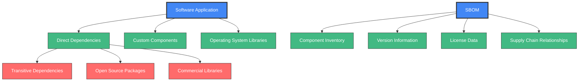
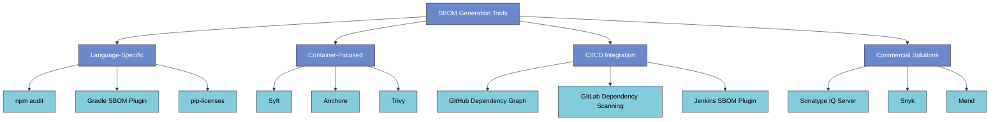
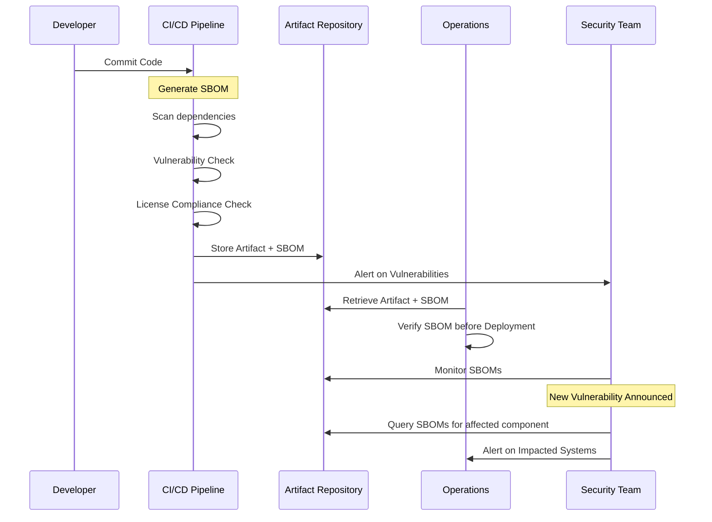
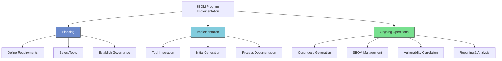
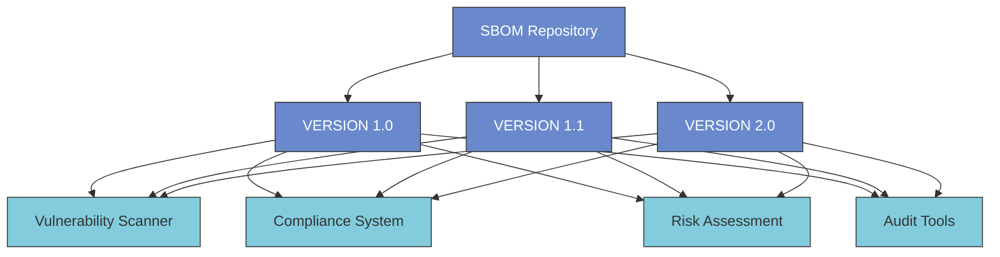
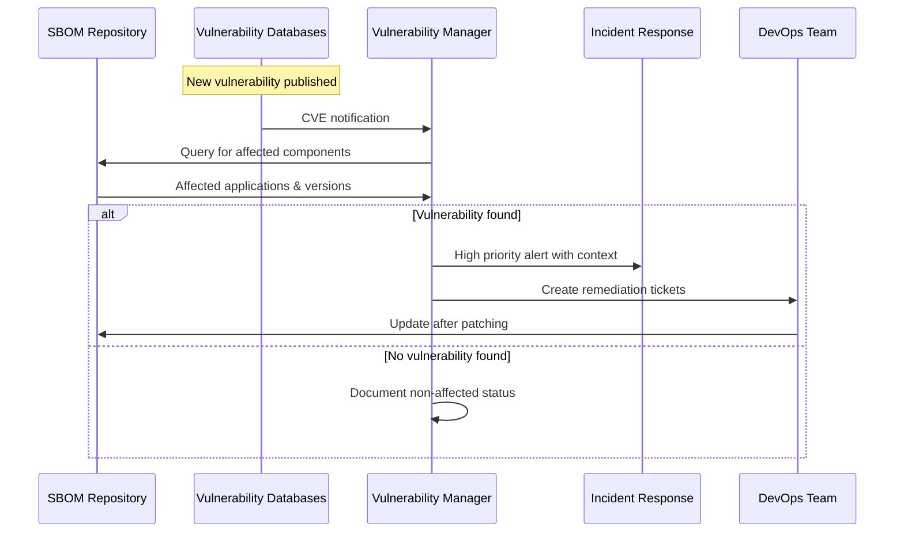
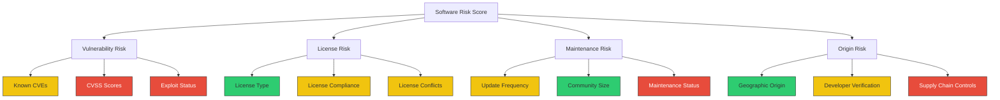
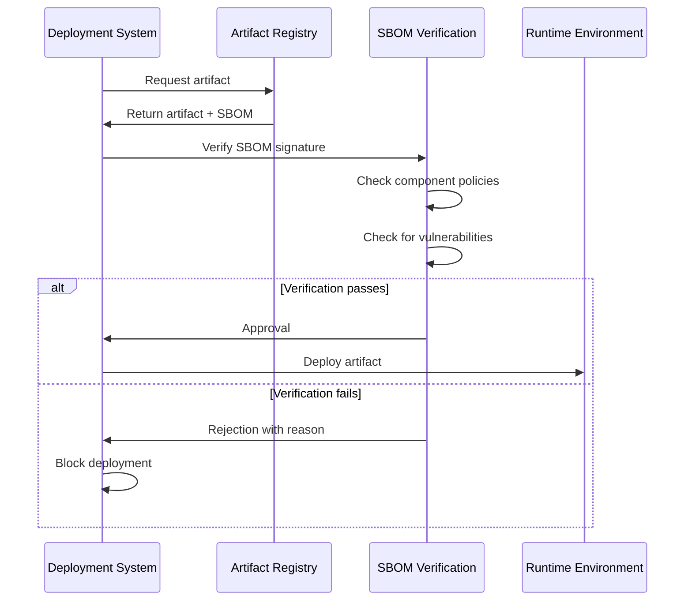
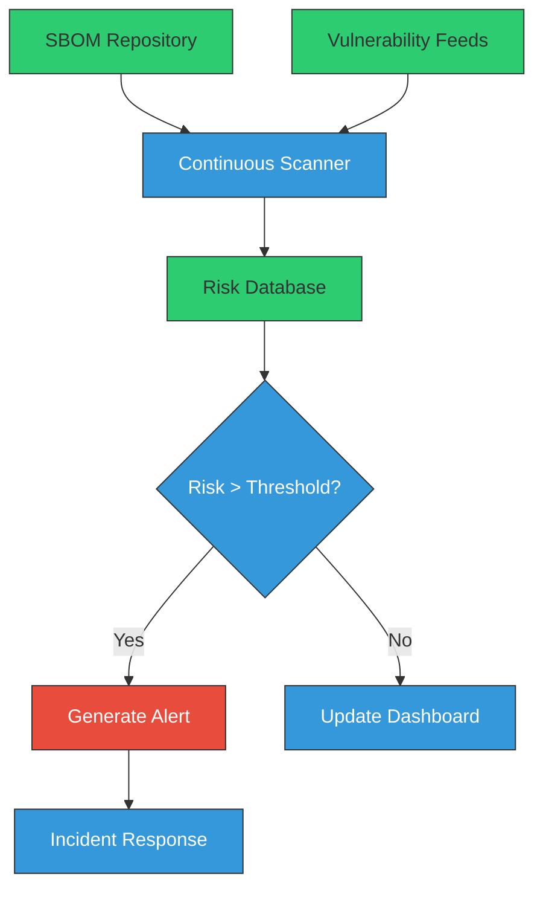
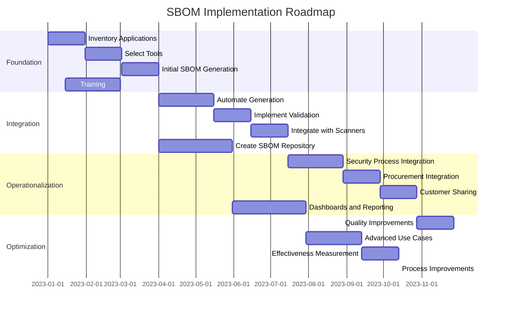

# Software Bill of Materials (SBOM)

<div class="secure-component">
<span class="security-badge badge-info">CRITICAL PRACTICE</span>

A Software Bill of Materials (SBOM) is a foundational element of modern software supply chain security. This document provides a comprehensive guide to understanding, implementing, and maintaining SBOMs in your organization.
</div>

## Introduction

A Software Bill of Materials (SBOM) is a comprehensive inventory of all components, libraries, and dependencies that are included in a software product. It serves as a critical tool for understanding the composition of software and managing its security throughout the supply chain.

Think of an SBOM as a "list of ingredients" for your software - just as food packaging lists ingredients to inform consumers about what they're eating, an SBOM lists all components in your software to inform users about what they're installing and running.



## Importance of SBOM

SBOMs have become critical in modern software development for several key reasons:

1. **Transparency**: SBOMs provide visibility into the components used in software, enabling organizations to assess the security posture of their applications.

2. **Vulnerability Management**: By maintaining an up-to-date SBOM, organizations can quickly identify and remediate vulnerabilities in third-party components.

3. **Compliance**: Many regulatory frameworks and industry standards now require organizations to maintain an SBOM to demonstrate compliance with security best practices.
   - The U.S. Executive Order 14028 mandates SBOMs for software sold to the federal government
   - FDA requires SBOMs for medical device software
   - Critical infrastructure sectors increasingly require SBOMs

4. **Risk Assessment**: SBOMs facilitate better risk assessment by allowing organizations to evaluate the security of individual components and their potential impact on the overall system.

5. **Incident Response**: When a new vulnerability is discovered, an SBOM allows security teams to quickly determine if and where vulnerable components exist in their software.

!!! warning "Without an SBOM"
    Without an accurate SBOM, organizations often face:
    
    - Delayed vulnerability responses (days or weeks to determine exposure)
    - Unexpected licensing issues leading to legal complications
    - Incomplete security assessments
    - Difficulty meeting compliance requirements
    - Challenges with open-source governance

### SBOM Value Across Organizational Roles

| Role | Value of SBOM |
|------|--------------|
| **Security Team** | Rapid vulnerability identification, improved risk assessments |
| **Development Team** | Better dependency management, faster security patching |
| **Legal/Compliance** | License compliance verification, regulatory requirement fulfillment |
| **Operations** | Improved incident response, better deployment decisions |
| **Executive Leadership** | Enhanced risk visibility, reduced organizational liability |

## Components of an SBOM

An effective SBOM typically includes the following information:

- **Component Name**: The name of the software component or library.
- **Version**: The specific version of the component being used.
- **Supplier**: The entity that provides the component.
- **License Information**: The licensing terms under which the component is distributed.
- **Dependency Relationships**: Information on how components depend on one another.
- **Component Hashes**: Cryptographic hashes that uniquely identify the exact component.
- **Provenance Information**: Data about where the component came from and how it was built.
- **End-of-Life Data**: Information about component support lifecycle and maintenance status.
- **Known Vulnerabilities**: CVEs or other vulnerability identifiers associated with the component.
- **Patch Status**: Whether the component has been patched or updated.

### SBOM Formats

Several standardized formats have emerged for SBOMs:

#### SPDX (Software Package Data Exchange)

SPDX is an open standard format maintained by the Linux Foundation that provides a common way to communicate the components, licenses, and copyrights associated with software packages.

```xml
<SPDX version="SPDX-2.2">
  <Document>
    <SPDX-Identifier>SPDXRef-DOCUMENT</SPDX-Identifier>
    <Name>example-application-1.0.0</Name>
    <Creator>Organization: Example Corp</Creator>
    <Created>2023-05-18T08:30:00Z</Created>
  </Document>
  
  <Package>
    <Name>left-pad</Name>
    <SPDX-Identifier>SPDXRef-Package-left-pad</SPDX-Identifier>
    <Version>1.3.0</Version>
    <DownloadLocation>https://registry.npmjs.org/left-pad/-/left-pad-1.3.0.tgz</DownloadLocation>
    <LicenseConcluded>MIT</LicenseConcluded>
    <LicenseInfoFromFiles>MIT</LicenseInfoFromFiles>
    <CopyrightText>Copyright (c) 2018 left-pad</CopyrightText>
    <ExternalRef>SECURITY cpe23Type cpe:2.3:a:left-pad:left-pad:1.3.0:*:*:*:*:*:*:*</ExternalRef>
  </Package>
  
  <!-- Additional packages would be listed here -->
</SPDX>
```

#### CycloneDX

CycloneDX is a lightweight SBOM standard designed for use in application security contexts and supply chain component analysis, created by the OWASP Foundation.

```json
{
  "bomFormat": "CycloneDX",
  "specVersion": "1.4",
  "serialNumber": "urn:uuid:3e671687-395b-41f5-a30f-a58921a69b79",
  "version": 1,
  "components": [
    {
      "type": "library",
      "name": "acme-library",
      "version": "1.0.0",
      "purl": "pkg:npm/acme-library@1.0.0",
      "licenses": [
        {
          "license": {
            "id": "Apache-2.0"
          }
        }
      ],
      "hashes": [
        {
          "alg": "SHA-256",
          "content": "3942447fac867ae5cdb3229b658f4d48957e7f1c0876e17615c071f8737bb9c4"
        }
      ]
    }
  ]
}
```

#### SWID (Software Identification Tags)

SWID is an ISO standard (ISO/IEC 19770-2) that defines a structured metadata format for software identification.

```xml
<SoftwareIdentity xmlns="http://standards.iso.org/iso/19770/-2/2015/schema.xsd" 
    tagId="example.com-application-1.0.0" 
    name="Example Application" 
    version="1.0.0">
    <Entity name="Example Corp" 
        regid="example.com" 
        role="tagCreator softwareCreator"/>
    <Link rel="component" 
        href="swid:example.com-library-2.1.0"/>
</SoftwareIdentity>
```

## SBOM Generation Tools

Numerous tools are available to automatically generate SBOMs for your software:



## Best Practices for Maintaining SBOM

- **Automate SBOM Generation**: Use tools that automatically generate and update SBOMs as part of the build process.

- **Regular Updates**: Ensure that the SBOM is updated regularly to reflect changes in dependencies and versions.

- **Integrate with CI/CD**: Incorporate SBOM generation into the CI/CD pipeline to maintain an accurate inventory throughout the software development lifecycle.

- **Review and Audit**: Periodically review and audit the SBOM to ensure compliance with security policies and standards.

- **Include All Dependencies**: Ensure your SBOM includes both direct dependencies and transitive dependencies (dependencies of dependencies).

- **Establish a Trust Chain**: Maintain cryptographic signatures for SBOMs to establish authenticity.

- **Version Control SBOMs**: Store SBOMs in version control alongside the code they represent.

- **Share with Stakeholders**: Make SBOMs available to security teams, customers, and other stakeholders as appropriate.

### SBOM Integration in Development Lifecycle



## Executive Order 14028 and SBOM Requirements

In May 2021, the U.S. President issued Executive Order 14028 on "Improving the Nation's Cybersecurity," which includes provisions requiring software vendors to provide an SBOM to federal agencies when selling their software. This represents a significant shift in making SBOMs a standard deliverable for software products.

!!! info "NTIA Minimum SBOM Elements"
    The National Telecommunications and Information Administration (NTIA) has defined the minimum elements for an SBOM:
    
    1. Supplier Name
    2. Component Name
    3. Component Version
    4. Unique Identifiers
    5. Dependency Relationship
    6. SBOM Data Author
    7. Timestamp
    
    These elements form the baseline for SBOM compliance with the Executive Order.

## Comprehensive SBOM Implementation Guide

Creating and maintaining SBOMs requires a systematic approach across the software development lifecycle. This section provides practical guidance for implementing SBOMs in your organization.

### Step 1: SBOM Planning and Preparation

Before generating SBOMs, establish your organization's approach:

1. **Define Scope and Requirements**:
   - Determine which applications require SBOMs
   - Identify regulatory or customer requirements
   - Decide on SBOM format(s) to support

2. **Select Appropriate Tools**:
   - Evaluate SBOM generation tools based on your technology stack
   - Consider integration capabilities with existing systems
   - Assess accuracy and completeness of tool output

3. **Establish Governance**:
   - Define ownership and responsibilities
   - Create policies for SBOM maintenance
   - Develop processes for SBOM review and approval



### Step 2: SBOM Generation Automation

The most effective SBOM implementations are fully automated, integrated into the CI/CD pipeline, and updated with each build:

#### GitHub Actions Example

```yaml
# .github/workflows/generate-sbom.yml
name: Generate SBOM

on:
  push:
    branches: [ main ]
  pull_request:
    branches: [ main ]

jobs:
  generate-sbom:
    runs-on: ubuntu-latest
    steps:
      - uses: actions/checkout@v3
      
      # For JavaScript/Node.js projects
      - name: Generate SBOM (CycloneDX)
        if: hashFiles('package.json') != ''
        uses: CycloneDX/gh-node-module-generatebom@master
        with:
          path: ./
          output: ./bom.xml
          
      # For Java projects
      - name: Generate SBOM (Java)
        if: hashFiles('pom.xml') != ''
        run: |
          mvn org.cyclonedx:cyclonedx-maven-plugin:makeAggregateBom
      
      # For Python projects
      - name: Generate SBOM (Python)
        if: hashFiles('requirements.txt') != '' || hashFiles('pyproject.toml') != ''
        run: |
          pip install cyclonedx-bom
          cyclonedx-py -i requirements.txt -o bom.json
      
      # For container images
      - name: Build and generate container SBOM
        run: |
          docker build -t my-app:latest .
          syft my-app:latest -o cyclonedx-json=container-bom.json
      
      # Store SBOM with build artifacts
      - name: Upload SBOM
        uses: actions/upload-artifact@v3
        with:
          name: sbom
          path: |
            bom.xml
            bom.json
            container-bom.json
```

#### GitLab CI/CD Example

```yaml
# .gitlab-ci.yml
stages:
  - build
  - test
  - sbom
  - publish

generate-sbom:
  stage: sbom
  image: alpine:latest
  script:
    # Install tools
    - apk add --no-cache curl npm
    - npm install -g @cyclonedx/cyclonedx-npm
    
    # Generate SBOM
    - cyclonedx-npm --output-file bom.json
    
    # Store SBOM as artifact
    - mkdir -p sbom
    - cp bom.json sbom/
  artifacts:
    paths:
      - sbom/
```

#### Azure DevOps Pipeline Example

```yaml
# azure-pipelines.yml
trigger:
- main

pool:
  vmImage: 'ubuntu-latest'

steps:
- task: NodeTool@0
  inputs:
    versionSpec: '16.x'
  displayName: 'Install Node.js'

- script: npm install
  displayName: 'npm install'

- script: |
    npm install -g @cyclonedx/cyclonedx-npm
    cyclonedx-npm --output-file bom.json
  displayName: 'Generate SBOM'

- task: PublishBuildArtifacts@1
  inputs:
    PathtoPublish: 'bom.json'
    ArtifactName: 'sbom'
    publishLocation: 'Container'
  displayName: 'Publish SBOM'
```

### Step 3: SBOM Storage and Management

Once generated, SBOMs need to be properly stored, versioned, and managed:

1. **Storage Options**:
   - Artifact repositories (Nexus, Artifactory)
   - Document management systems
   - Cloud object storage (S3, Azure Blob Storage)
   - Specialized SBOM management platforms

2. **Version Control**:
   - Link SBOMs to specific software versions
   - Maintain history of changes
   - Support SBOM comparison between versions

3. **Access Control**:
   - Define who can access and modify SBOMs
   - Implement appropriate authentication and authorization
   - Consider sensitivity of component information



### Step 4: SBOM Sharing and Distribution

SBOMs provide the most value when shared appropriately with stakeholders:

1. **Internal Sharing**:
   - Development teams
   - Security operations
   - Risk management
   - Legal and compliance

2. **External Sharing**:
   - Customers
   - Regulators
   - Supply chain partners
   - Vulnerability researchers

3. **Sharing Methods**:
   - API access to SBOM repository
   - SBOM packages with software deliverables
   - Secure SBOM exchange platforms
   - Integration with procurement systems

```yaml
# Example API for SBOM retrieval
openapi: 3.0.0
info:
  title: SBOM API
  version: 1.0.0
paths:
  /sboms/{productId}/{version}:
    get:
      summary: Retrieve SBOM for a product version
      parameters:
        - name: productId
          in: path
          required: true
          schema:
            type: string
        - name: version
          in: path
          required: true
          schema:
            type: string
        - name: format
          in: query
          schema:
            type: string
            enum: [cyclonedx-json, cyclonedx-xml, spdx-json, spdx-xml]
      responses:
        '200':
          description: SBOM document
          content:
            application/json:
              schema:
                type: object
            application/xml:
              schema:
                type: string
```

## Advanced SBOM Usage Scenarios

### Vulnerability Management with SBOMs

SBOMs significantly enhance vulnerability management by providing accurate component inventories:



Implement this workflow using the following approach:

1. **Continuous Monitoring**:
   ```bash
   # Schedule regular SBOM vulnerability scans using Grype
   grype sbom:./sbom.json --fail-on high
   
   # Integration with vulnerability sources
   VULNS=$(curl -s https://api.vulnerability-db.com/latest)
   for VULN in $VULNS; do
     # Check if vulnerability affects components in SBOM
     sbom-checker check --sbom sbom.json --vulnerability $VULN
   done
   ```

2. **Prioritization Based on SBOM Context**:
   ```python
   # Example prioritization logic using SBOM data
   def prioritize_vulnerability(sbom_path, cve_id):
       # Parse SBOM
       with open(sbom_path, 'r') as f:
           sbom = json.load(f)
       
       # Get affected component details
       affected_components = []
       for component in sbom['components']:
           if is_affected(component, cve_id):
               affected_components.append({
                   'name': component['name'],
                   'version': component['version'],
                   'usage': get_component_usage(component)
               })
       
       # Calculate risk score based on component usage
       risk_score = 0
       for component in affected_components:
           if component['usage'] == 'direct':
               risk_score += 10
           elif component['usage'] == 'transitive':
               risk_score += 5
           
           if is_in_external_api(component):
               risk_score += 15
           if has_public_interface(component):
               risk_score += 10
       
       return {
           'cve_id': cve_id,
           'affected_components': affected_components,
           'risk_score': risk_score,
           'priority': get_priority_level(risk_score)
       }
   ```

### Compliance Validation with SBOMs

SBOMs enable automated compliance checks for regulatory and policy requirements:

```python
# Example compliance check script
def check_compliance(sbom_path, policy_path):
    """Check SBOM against compliance policies."""
    # Load SBOM
    with open(sbom_path, 'r') as f:
        sbom = json.load(f)
    
    # Load compliance policies
    with open(policy_path, 'r') as f:
        policies = json.load(f)
    
    # Check for banned components
    violations = []
    for component in sbom['components']:
        # Check against banned components
        if component['name'] in policies['banned_components']:
            violations.append({
                'type': 'banned_component',
                'component': component['name'],
                'version': component['version'],
                'policy': 'banned_components'
            })
        
        # Check against banned licenses
        if 'licenses' in component:
            for license in component['licenses']:
                license_id = license.get('license', {}).get('id')
                if license_id in policies['banned_licenses']:
                    violations.append({
                        'type': 'banned_license',
                        'component': component['name'],
                        'license': license_id,
                        'policy': 'banned_licenses'
                    })
    
    # Check SBOM minimum requirements
    for req in policies['sbom_requirements']:
        if not check_sbom_requirement(sbom, req):
            violations.append({
                'type': 'missing_sbom_data',
                'requirement': req
            })
    
    return {
        'compliant': len(violations) == 0,
        'violations': violations
    }
```

### Risk Scoring and Analysis

SBOMs enable more sophisticated risk analysis of software components:



### Supply Chain Visualization

SBOMs can be used to visualize and analyze complex supply chain relationships:

```python
# Example code to generate dependency graph from SBOM
def generate_dependency_graph(sbom_path, output_path):
    """Generate a graphviz dependency graph from an SBOM."""
    import graphviz
    
    # Load SBOM
    with open(sbom_path, 'r') as f:
        sbom = json.load(f)
    
    # Create graph
    dot = graphviz.Digraph(comment='Software Supply Chain')
    
    # Add nodes for components
    for component in sbom['components']:
        component_id = f"{component['name']}-{component['version']}"
        label = f"{component['name']}\n{component['version']}"
        
        # Style based on risk or other attributes
        node_attrs = {'label': label}
        if is_vulnerable(component):
            node_attrs['color'] = 'red'
            node_attrs['style'] = 'filled'
        
        dot.node(component_id, **node_attrs)
    
    # Add edges for dependencies
    if 'dependencies' in sbom:
        for dependency in sbom['dependencies']:
            ref = dependency['ref']
            if 'dependsOn' in dependency:
                for depends_on in dependency['dependsOn']:
                    dot.edge(ref, depends_on)
    
    # Save graph
    dot.render(output_path, format='png')
    return output_path
```

## SBOM Integration Patterns

### Pattern 1: CI/CD Pipeline Integration


### Pattern 2: Runtime Verification



### Pattern 3: Continuous Monitoring



## SBOM Tooling Comparison

When selecting SBOM tools, consider these options based on your ecosystem:

| Tool | Languages/Ecosystems | Formats | CI Integration | Key Features | Limitations |
|------|---------------------|---------|---------------|--------------|-------------|
| **Syft** | Container images, multiple languages | CycloneDX, SPDX | GitHub Actions, GitLab CI | Fast scanning, comprehensive packages | Limited source code analysis |
| **CycloneDX Maven Plugin** | Java, Maven | CycloneDX | Maven-compatible CI | Deep Java ecosystem support | Java ecosystem only |
| **CycloneDX NPM Module** | JavaScript, Node.js | CycloneDX | npm-compatible CI | Detects dev dependencies | JavaScript ecosystem only |
| **SPDX SBOM Generator** | Multi-language | SPDX | Various | SPDX compliance focus | Limited automation features |
| **Microsoft SBOM Tool** | .NET, NuGet | SPDX | Azure DevOps | Visual Studio integration | Windows-focused |
| **Tern** | Container images | SPDX | Docker-based CI | Container layer analysis | Container-focused only |
| **cdxgen** | Multi-language | CycloneDX | Various | Wide language support | Less mature than alternatives |

## SBOM Practical Challenges and Solutions

### Challenge 1: Incomplete Dependency Resolution

**Problem**: Tools may miss transitive or dynamically loaded dependencies.

**Solution**: Use multiple scanning approaches and validate with runtime analysis.

```bash
# Example combined approach
# 1. Static analysis
cyclonedx-npm --output-file static-bom.json

# 2. Runtime analysis (using AppInspector)
node --require appinspector app.js &
sleep 10  # Let the application run
curl http://localhost:8000/appinspector/sbom > runtime-bom.json

# 3. Merge results
sbom-merger --input static-bom.json runtime-bom.json --output complete-bom.json
```

### Challenge 2: Maintaining SBOMs at Scale

**Problem**: Managing SBOMs across hundreds of applications becomes challenging.

**Solution**: Implement a centralized SBOM management platform with automation.

```python
# Example SBOM indexing script
def index_sboms(sbom_directory, database_connection):
    """Index SBOMs into a searchable database."""
    for filename in os.listdir(sbom_directory):
        if filename.endswith('.json') or filename.endswith('.xml'):
            path = os.path.join(sbom_directory, filename)
            
            # Extract metadata
            metadata = extract_sbom_metadata(path)
            
            # Extract components
            components = extract_sbom_components(path)
            
            # Store in database
            store_sbom_metadata(database_connection, metadata)
            store_sbom_components(database_connection, metadata['id'], components)
```

### Challenge 3: Dependency Vulnerability Noise

**Problem**: SBOMs may identify vulnerabilities in unused dependencies or code paths.

**Solution**: Implement context-aware vulnerability filtering.

```javascript
// Example vulnerability filtering based on usage context
function filterVulnerabilities(sbom, vulnerabilities) {
  const filteredVulns = [];
  
  for (const vuln of vulnerabilities) {
    const component = sbom.components.find(c => 
      c.name === vuln.component && c.version === vuln.version
    );
    
    if (!component) continue;
    
    // Get dependency usage context
    const usageContext = getComponentUsageContext(sbom, component.bom-ref);
    
    // Filter based on context
    if (
      // Critical vulnerabilities are always included
      vuln.severity === 'CRITICAL' ||
      // High severity in direct dependencies
      (vuln.severity === 'HIGH' && usageContext.isDirect) ||
      // Medium+ in publicly exposed components
      (
        ['MEDIUM', 'HIGH'].includes(vuln.severity) && 
        usageContext.isPubliclyExposed
      ) ||
      // Any severity in authentication components
      usageContext.isAuthenticationComponent
    ) {
      filteredVulns.push({
        ...vuln,
        context: usageContext
      });
    }
  }
  
  return filteredVulns;
}
```

### Challenge 4: Proprietary Code Protection

**Problem**: SBOMs might include sensitive component information.

**Solution**: Implement component redaction policies while maintaining compliance.

```python
def redact_sensitive_components(sbom, redaction_policy):
    """Redact sensitive component information from SBOM."""
    for component in sbom['components']:
        # Check if component matches redaction policy
        if is_sensitive_component(component, redaction_policy):
            # Replace detailed info with generic description
            component['name'] = f"proprietary-component-{hash_id(component['name'])}"
            component['description'] = "Proprietary component, details redacted"
            
            # Remove internal details
            if 'properties' in component:
                component['properties'] = [
                    p for p in component['properties'] 
                    if not p['name'].startswith('internal:')
                ]
            
            # Keep minimum required fields
            for required_field in ['type', 'bom-ref', 'licenses']:
                if required_field not in component:
                    component[required_field] = get_default_value(required_field)
    
    return sbom
```

## SBOM Adoption Roadmap

Organizations can implement SBOMs in phases:

### Phase 1: Foundation (1-3 months)

- Inventory applications requiring SBOMs
- Select SBOM formats and tools
- Generate initial SBOMs for critical applications
- Train teams on SBOM concepts and tools

### Phase 2: Integration (3-6 months)

- Automate SBOM generation in CI/CD pipelines
- Implement SBOM validation and quality checks
- Integrate with vulnerability scanners
- Create SBOM storage repository

### Phase 3: Operationalization (6-9 months)

- Implement SBOM-driven security processes
- Integrate SBOMs with procurement workflows
- Develop SBOM sharing mechanisms for customers
- Create SBOM dashboards and reports

### Phase 4: Optimization (9-12 months)

- Enhance SBOM quality and coverage
- Implement advanced use cases
- Measure and report SBOM program effectiveness
- Continuously improve SBOM processes



## Measuring SBOM Program Effectiveness

Track these key metrics to assess your SBOM program:

1. **Coverage Metrics**:
   - Percentage of applications with SBOMs
   - Percentage of components identified in SBOMs
   - Depth of dependency analysis (e.g., N levels deep)

2. **Quality Metrics**:
   - SBOM completeness score
   - Percentage of components with complete metadata
   - Number of validation errors

3. **Security Metrics**:
   - Time to identify vulnerable components
   - Number of vulnerabilities identified via SBOMs
   - Percentage of vulnerabilities with context

4. **Process Metrics**:
   - Time to generate SBOMs
   - Time to update SBOMs after changes
   - SBOM program maturity score

## Conclusion

Maintaining a Software Bill of Materials is essential for organizations looking to enhance their software supply chain security. By providing transparency and facilitating effective vulnerability management, SBOMs play a crucial role in safeguarding software applications against potential threats.

As regulatory requirements continue to evolve and supply chain attacks increase in frequency, SBOMs will become a standard component of secure software development practices. Organizations that implement robust SBOM practices now will be better positioned to respond to security incidents, meet compliance requirements, and build customer trust.

Start with small steps—generate SBOMs for your most critical applications using available tools, then gradually expand coverage and automation as your program matures. The most successful SBOM initiatives focus on practical use cases and integration with existing security processes rather than treating SBOMs as a compliance checkbox.

!!! tip "SBOM Quick Start"
    1. Choose a simple, well-understood application as your SBOM pilot project
    2. Select an SBOM generation tool appropriate for your technology stack
    3. Generate an initial SBOM and validate for completeness
    4. Use the SBOM to identify and remediate vulnerabilities
    5. Document lessons learned and expand to additional applications