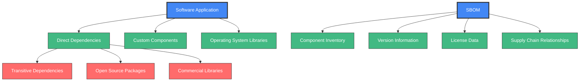
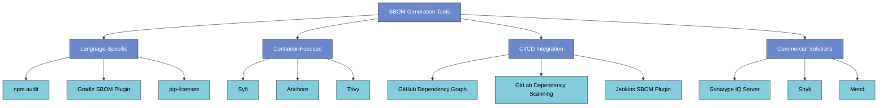
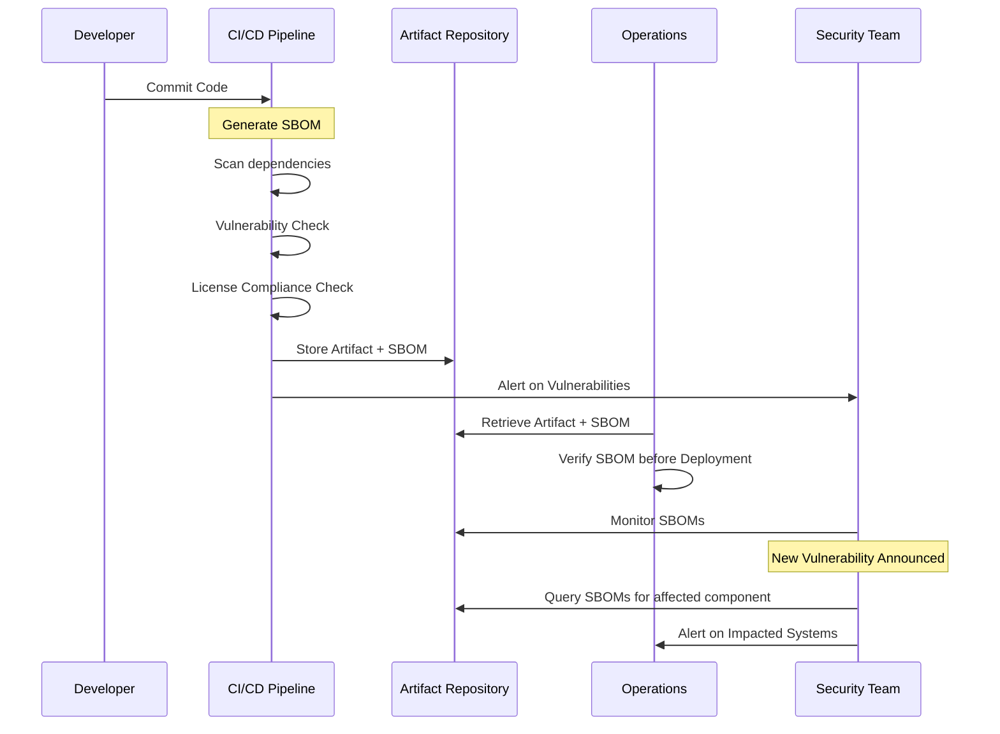

# Software Bill of Materials (SBOM)

<div class="secure-component">
<span class="security-badge badge-info">CRITICAL PRACTICE</span>

A Software Bill of Materials (SBOM) is a foundational element of modern software supply chain security. This document provides a comprehensive guide to understanding, implementing, and maintaining SBOMs in your organization.
</div>

## Introduction

A Software Bill of Materials (SBOM) is a comprehensive inventory of all components, libraries, and dependencies that are included in a software product. It serves as a critical tool for understanding the composition of software and managing its security throughout the supply chain.

Think of an SBOM as a "list of ingredients" for your software - just as food packaging lists ingredients to inform consumers about what they're eating, an SBOM lists all components in your software to inform users about what they're installing and running.



## Importance of SBOM

SBOMs have become critical in modern software development for several key reasons:

1. **Transparency**: SBOMs provide visibility into the components used in software, enabling organizations to assess the security posture of their applications.

2. **Vulnerability Management**: By maintaining an up-to-date SBOM, organizations can quickly identify and remediate vulnerabilities in third-party components.

3. **Compliance**: Many regulatory frameworks and industry standards now require organizations to maintain an SBOM to demonstrate compliance with security best practices.
   - The U.S. Executive Order 14028 mandates SBOMs for software sold to the federal government
   - FDA requires SBOMs for medical device software
   - Critical infrastructure sectors increasingly require SBOMs

4. **Risk Assessment**: SBOMs facilitate better risk assessment by allowing organizations to evaluate the security of individual components and their potential impact on the overall system.

5. **Incident Response**: When a new vulnerability is discovered, an SBOM allows security teams to quickly determine if and where vulnerable components exist in their software.

!!! warning "Without an SBOM"
    Without an accurate SBOM, organizations often face:
    
    - Delayed vulnerability responses (days or weeks to determine exposure)
    - Unexpected licensing issues leading to legal complications
    - Incomplete security assessments
    - Difficulty meeting compliance requirements
    - Challenges with open-source governance

### SBOM Value Across Organizational Roles

| Role | Value of SBOM |
|------|--------------|
| **Security Team** | Rapid vulnerability identification, improved risk assessments |
| **Development Team** | Better dependency management, faster security patching |
| **Legal/Compliance** | License compliance verification, regulatory requirement fulfillment |
| **Operations** | Improved incident response, better deployment decisions |
| **Executive Leadership** | Enhanced risk visibility, reduced organizational liability |

## Components of an SBOM

An effective SBOM typically includes the following information:

- **Component Name**: The name of the software component or library.
- **Version**: The specific version of the component being used.
- **Supplier**: The entity that provides the component.
- **License Information**: The licensing terms under which the component is distributed.
- **Dependency Relationships**: Information on how components depend on one another.
- **Component Hashes**: Cryptographic hashes that uniquely identify the exact component.
- **Provenance Information**: Data about where the component came from and how it was built.
- **End-of-Life Data**: Information about component support lifecycle and maintenance status.
- **Known Vulnerabilities**: CVEs or other vulnerability identifiers associated with the component.
- **Patch Status**: Whether the component has been patched or updated.

### SBOM Formats

Several standardized formats have emerged for SBOMs:

#### SPDX (Software Package Data Exchange)

SPDX is an open standard format maintained by the Linux Foundation that provides a common way to communicate the components, licenses, and copyrights associated with software packages.

```xml
<SPDX version="SPDX-2.2">
  <Document>
    <SPDX-Identifier>SPDXRef-DOCUMENT</SPDX-Identifier>
    <Name>example-application-1.0.0</Name>
    <Creator>Organization: Example Corp</Creator>
    <Created>2023-05-18T08:30:00Z</Created>
  </Document>
  
  <Package>
    <Name>left-pad</Name>
    <SPDX-Identifier>SPDXRef-Package-left-pad</SPDX-Identifier>
    <Version>1.3.0</Version>
    <DownloadLocation>https://registry.npmjs.org/left-pad/-/left-pad-1.3.0.tgz</DownloadLocation>
    <LicenseConcluded>MIT</LicenseConcluded>
    <LicenseInfoFromFiles>MIT</LicenseInfoFromFiles>
    <CopyrightText>Copyright (c) 2018 left-pad</CopyrightText>
    <ExternalRef>SECURITY cpe23Type cpe:2.3:a:left-pad:left-pad:1.3.0:*:*:*:*:*:*:*</ExternalRef>
  </Package>
  
  <!-- Additional packages would be listed here -->
</SPDX>
```

#### CycloneDX

CycloneDX is a lightweight SBOM standard designed for use in application security contexts and supply chain component analysis, created by the OWASP Foundation.

```json
{
  "bomFormat": "CycloneDX",
  "specVersion": "1.4",
  "serialNumber": "urn:uuid:3e671687-395b-41f5-a30f-a58921a69b79",
  "version": 1,
  "components": [
    {
      "type": "library",
      "name": "acme-library",
      "version": "1.0.0",
      "purl": "pkg:npm/acme-library@1.0.0",
      "licenses": [
        {
          "license": {
            "id": "Apache-2.0"
          }
        }
      ],
      "hashes": [
        {
          "alg": "SHA-256",
          "content": "3942447fac867ae5cdb3229b658f4d48957e7f1c0876e17615c071f8737bb9c4"
        }
      ]
    }
  ]
}
```

#### SWID (Software Identification Tags)

SWID is an ISO standard (ISO/IEC 19770-2) that defines a structured metadata format for software identification.

```xml
<SoftwareIdentity xmlns="http://standards.iso.org/iso/19770/-2/2015/schema.xsd" 
    tagId="example.com-application-1.0.0" 
    name="Example Application" 
    version="1.0.0">
    <Entity name="Example Corp" 
        regid="example.com" 
        role="tagCreator softwareCreator"/>
    <Link rel="component" 
        href="swid:example.com-library-2.1.0"/>
</SoftwareIdentity>
```

## SBOM Generation Tools

Numerous tools are available to automatically generate SBOMs for your software:



## Best Practices for Maintaining SBOM

- **Automate SBOM Generation**: Use tools that automatically generate and update SBOMs as part of the build process.

- **Regular Updates**: Ensure that the SBOM is updated regularly to reflect changes in dependencies and versions.

- **Integrate with CI/CD**: Incorporate SBOM generation into the CI/CD pipeline to maintain an accurate inventory throughout the software development lifecycle.

- **Review and Audit**: Periodically review and audit the SBOM to ensure compliance with security policies and standards.

- **Include All Dependencies**: Ensure your SBOM includes both direct dependencies and transitive dependencies (dependencies of dependencies).

- **Establish a Trust Chain**: Maintain cryptographic signatures for SBOMs to establish authenticity.

- **Version Control SBOMs**: Store SBOMs in version control alongside the code they represent.

- **Share with Stakeholders**: Make SBOMs available to security teams, customers, and other stakeholders as appropriate.

### SBOM Integration in Development Lifecycle



## Executive Order 14028 and SBOM Requirements

In May 2021, the U.S. President issued Executive Order 14028 on "Improving the Nation's Cybersecurity," which includes provisions requiring software vendors to provide an SBOM to federal agencies when selling their software. This represents a significant shift in making SBOMs a standard deliverable for software products.

!!! info "NTIA Minimum SBOM Elements"
    The National Telecommunications and Information Administration (NTIA) has defined the minimum elements for an SBOM:
    
    1. Supplier Name
    2. Component Name
    3. Component Version
    4. Unique Identifiers
    5. Dependency Relationship
    6. SBOM Data Author
    7. Timestamp
    
    These elements form the baseline for SBOM compliance with the Executive Order.

## Conclusion

Maintaining a Software Bill of Materials is essential for organizations looking to enhance their software supply chain security. By providing transparency and facilitating effective vulnerability management, SBOMs play a crucial role in safeguarding software applications against potential threats.

As regulatory requirements continue to evolve and supply chain attacks increase in frequency, SBOMs will become a standard component of secure software development practices. Organizations that implement robust SBOM practices now will be better positioned to respond to security incidents, meet compliance requirements, and build customer trust.