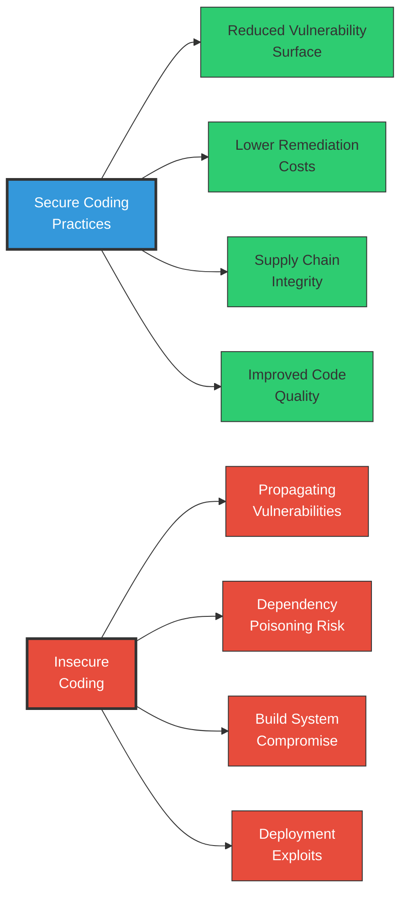
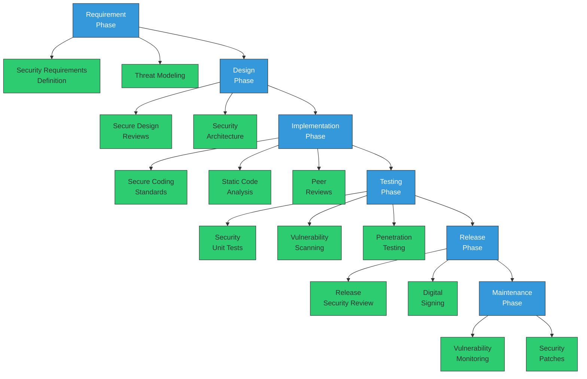

# Secure Coding Best Practices

<div class="secure-component">
<span class="security-badge badge-secure">FOUNDATION</span>

Secure coding practices form the foundation of software supply chain security. While many security controls focus on detecting issues after they occur, secure coding aims to prevent vulnerabilities from being introduced in the first place.
</div>

## The Role of Secure Coding in Supply Chain Security

Secure coding is not just about application security—it's a critical element of supply chain integrity:



### Cascading Effects in the Supply Chain

When your code becomes a dependency for other applications, any security vulnerabilities you introduce may affect all downstream consumers. This creates a responsibility to implement secure coding practices not just for your own security, but for the entire ecosystem.

## Language-Specific Secure Coding Guidelines

Different programming languages have unique security considerations. Below are language-specific secure coding practices particularly relevant to supply chain security:

<div class="security-grid">
<div class="security-grid-item security-grid-item-main">

### JavaScript/TypeScript

```typescript
// INSECURE: Using eval with unsanitized input
function processData(data) {
  return eval(data);  // Dangerous! Allows code execution
}

// SECURE: Avoid eval, parse data properly
function processData(data: string) {
  try {
    return JSON.parse(data);  // Proper parsing
  } catch (e) {
    console.error("Invalid JSON data");
    return null;
  }
}

// INSECURE: Using dynamic requires (facilitates supply chain attacks)
function loadModule(moduleName) {
  const module = require(moduleName);  // Dangerous for supply chain!
  return module;
}

// SECURE: Only use statically analyzable requires
const safeModule = require('safe-module');  // Static imports only
```

### Python

```python
# INSECURE: Using exec with unvalidated input
def run_command(user_input):
    exec(user_input)  # Dangerous! Allows arbitrary code execution

# SECURE: Avoid exec/eval, use safer alternatives
def run_command(command_id):
    commands = {
        'backup': backup_function,
        'status': status_function,
    }
    if command_id in commands:
        return commands[command_id]()
    return "Invalid command"

# INSECURE: Unsafe deserialization (supply chain risk)
import pickle
def load_data(data):
    return pickle.loads(data)  # Dangerous! Can execute code

# SECURE: Use safe serialization formats
import json
def load_data(data):
    return json.loads(data)  # Safer alternative
```
</div>

<div class="security-grid-item security-grid-item-side">
<div class="security-info-box">
<strong>Language-Specific Resources</strong>

<ul>
<li><a href="https://github.com/goldbergyoni/nodebestpractices">Node.js Best Practices</a></li>
<li><a href="https://owasp.org/www-community/OWASP_Go_Secure_Coding_Practices_Guide">Go Secure Coding</a></li>
<li><a href="https://wiki.sei.cmu.edu/confluence/display/java/SEI+CERT+Oracle+Coding+Standard+for+Java">Java Coding Standard</a></li>
<li><a href="https://cheatsheetseries.owasp.org/cheatsheets/Dotnet_Security_Cheat_Sheet.html">.NET Security Cheatsheet</a></li>
<li><a href="https://github.com/rubysec/ruby-advisory-db">Ruby Security Advisory Database</a></li>
<li><a href="https://wiki.sei.cmu.edu/confluence/display/c/SEI+CERT+C+Coding+Standard">C Coding Standard</a></li>
</ul>
</div>
</div>
</div>

### Go

```go
// INSECURE: Using unsafe deserialization
func processData(data []byte) map[string]interface{} {
    var result map[string]interface{}
    gob.NewDecoder(bytes.NewBuffer(data)).Decode(&result) // Unsafe
    return result
}

// SECURE: Input validation and safer formats
func processData(data []byte) (map[string]interface{}, error) {
    var result map[string]interface{}
    if len(data) > MAX_SIZE {
        return nil, errors.New("data exceeds maximum size")
    }
    err := json.Unmarshal(data, &result) // Safer format with error handling
    return result, err
}

// INSECURE: Using shell commands with user input
func runCommand(input string) string {
    cmd := exec.Command("bash", "-c", input) // Dangerous!
    out, _ := cmd.Output()
    return string(out)
}

// SECURE: Use the proper API or validate carefully
func runCommand(command string, args []string) (string, error) {
    // Whitelist allowed commands
    allowedCommands := map[string]bool{"ls": true, "cat": true}
    if !allowedCommands[command] {
        return "", errors.New("command not allowed")
    }
    
    cmd := exec.Command(command, args...) 
    out, err := cmd.Output()
    return string(out), err
}
```

### Java

```java
// INSECURE: Using reflection with user input
public Object createObject(String className) throws Exception {
    Class<?> clazz = Class.forName(className);
    return clazz.newInstance(); // Dangerous!
}

// SECURE: Whitelist allowed classes
public Object createObject(String className) throws Exception {
    Map<String, Class<?>> allowedClasses = Map.of(
        "SafeClass1", SafeClass1.class,
        "SafeClass2", SafeClass2.class
    );
    
    Class<?> clazz = allowedClasses.get(className);
    if (clazz == null) {
        throw new SecurityException("Class not allowed: " + className);
    }
    return clazz.getDeclaredConstructor().newInstance();
}

// INSECURE: SQL injection
public List<User> findUsers(String name) {
    String query = "SELECT * FROM users WHERE name = '" + name + "'";
    // Execute query...
}

// SECURE: Use parameterized queries
public List<User> findUsers(String name) {
    String query = "SELECT * FROM users WHERE name = ?";
    PreparedStatement stmt = connection.prepareStatement(query);
    stmt.setString(1, name);
    // Execute statement...
}
```

## 10 Critical Secure Coding Practices for Supply Chain Security

### 1. Input Validation and Sanitization

<div class="security-grid">
<div class="security-grid-item security-grid-item-main">

Input validation is your first line of defense against malicious data that could compromise your application or its dependencies.

**Key Approaches:**
- **Validation Strategy**: Use a positive security model (whitelist) rather than a negative one (blacklist)
- **Input Source**: Validate all input regardless of source (users, APIs, files, databases, or even other trusted systems)
- **Validation Location**: Validate data both at the entry point and before use in sensitive operations
- **Data Type**: Apply strict type checking appropriate to the expected data
- **Format Verification**: Ensure data conforms to expected patterns using regular expressions or schema validation

**Example: API Input Validation with JSON Schema**
</div>

<div class="security-grid-item security-grid-item-side">
```javascript
// JSON Schema for API input validation
const userSchema = {
  type: 'object',
  required: ['username', 'email'],
  properties: {
    username: {
      type: 'string',
      pattern: '^[a-zA-Z0-9_]{3,16}$',
      minLength: 3,
      maxLength: 16
    },
    email: {
      type: 'string',
      format: 'email'
    },
    role: {
      type: 'string',
      enum: ['user', 'admin', 'editor']
    }
  },
  additionalProperties: false
};

// Validate incoming data
function processUserData(data) {
  const validate = ajv.compile(userSchema);
  const valid = validate(data);
  
  if (!valid) {
    throw new Error('Invalid data: ' + 
      ajv.errorsText(validate.errors));
  }
  
  // Process validated data
}
```
</div>
</div>

### 2. Output Encoding and Content Security

Output encoding prevents injection attacks by ensuring that data is properly escaped before being rendered or processed.

<div class="secure-component">
<span class="security-badge badge-warning">CRITICAL</span>

Proper output encoding is essential for preventing XSS attacks, which can lead to session hijacking, credential theft, and malware distribution—all of which can compromise your supply chain.
</div>

**Key Approaches:**
- **Context-Specific Encoding**: Use the right encoding for the context (HTML, JavaScript, CSS, URL)
- **Content Security Policy (CSP)**: Implement CSP headers to restrict resource loading and script execution
- **Template Systems**: Use auto-escaping template engines that encode by default
- **API Responses**: Set proper Content-Type headers and validate response formats

**Example: Context-Aware Encoding**

```html
<!-- HTML context -->
<div data-user="<%= encoder.forHtml(user.name) %>">
  Welcome back!
</div>

<!-- JavaScript context -->
<script>
  const username = "<%= encoder.forJavaScript(user.name) %>";
  console.log(`Welcome, ${username}`);
</script>

<!-- URL context -->
<a href="/profile?id=<%= encoder.forUriComponent(user.id) %>">
  View Profile
</a>
```

### 3. Authentication and Authorization

<div class="security-table">
<table>
<thead>
<tr>
<th>Practice</th>
<th>Implementation</th>
<th>Supply Chain Relevance</th>
</tr>
</thead>
<tbody>
<tr>
<td><strong>Multi-factor Authentication</strong></td>
<td>Require MFA for all access to code repositories, build systems, and deployment tools</td>
<td>Prevents unauthorized code commits and system access that could introduce malicious code</td>
</tr>
<tr>
<td><strong>Strong Password Policies</strong></td>
<td>Enforce complex passwords, regular rotation, and secure storage using modern hashing algorithms (bcrypt, Argon2)</td>
<td>Reduces risk of credential-based attacks on development infrastructure</td>
</tr>
<tr>
<td><strong>API Authentication</strong></td>
<td>Use OAuth 2.0, API keys with proper rotation, or mutual TLS for API authentication</td>
<td>Secures communication between supply chain components</td>
</tr>
<tr>
<td><strong>Service-to-Service Auth</strong></td>
<td>Implement token-based or certificate-based authentication between systems</td>
<td>Ensures only authorized systems can interact with build and deployment pipelines</td>
</tr>
<tr>
<td><strong>Principle of Least Privilege</strong></td>
<td>Grant minimal permissions necessary for each role or function</td>
<td>Limits the impact of compromised accounts in the supply chain</td>
</tr>
</tbody>
</table>
</div>

**Example: OAuth 2.0 Implementation for Service-to-Service Authentication**

```javascript
// Node.js example using OAuth 2.0 client credentials flow for service authentication
async function getServiceAccessToken() {
  const tokenEndpoint = 'https://auth.example.com/oauth/token';
  
  const response = await fetch(tokenEndpoint, {
    method: 'POST',
    headers: {
      'Content-Type': 'application/x-www-form-urlencoded',
      'Authorization': 'Basic ' + Buffer.from(`${clientId}:${clientSecret}`).toString('base64')
    },
    body: new URLSearchParams({
      'grant_type': 'client_credentials',
      'scope': 'build:read deploy:write'
    })
  });
  
  if (!response.ok) {
    throw new Error(`Authentication failed: ${response.status}`);
  }
  
  const token = await response.json();
  return token.access_token;
}
```

### 4. Secure Memory Management

Poor memory management can lead to vulnerabilities like buffer overflows, use-after-free, and memory leaks, which are particularly critical in languages with manual memory management.

**Key Practices:**

- **Bounds Checking**: Always verify array bounds and buffer limits before operations
- **Memory Zeroing**: Clear sensitive data from memory after use
- **Safe Memory Allocation**: Use safe allocation patterns and check for allocation failures
- **Modern Language Features**: Use memory-safe language features when available (e.g., smart pointers in C++)
- **Automatic Memory Management**: Prefer languages with garbage collection when possible

**Example: Safe Memory Handling in C**

```c
// INSECURE: No bounds checking
void copy_data(char *dst, const char *src) {
    strcpy(dst, src);  // Dangerous! Buffer overflow risk
}

// SECURE: Use bounds-checked alternatives
void copy_data_safe(char *dst, size_t dst_size, const char *src) {
    // Use safe string functions with explicit buffer sizes
    strncpy(dst, src, dst_size - 1);
    dst[dst_size - 1] = '\0';  // Ensure null-termination
}

// SECURE: Sensitive data handling
void process_credentials(const char *password, size_t len) {
    char *pwd_copy = malloc(len + 1);
    if (!pwd_copy) return;  // Check allocation
    
    memcpy(pwd_copy, password, len);
    pwd_copy[len] = '\0';
    
    // Process password
    authenticate(pwd_copy);
    
    // Zero memory containing sensitive data when done
    memset(pwd_copy, 0, len);
    free(pwd_copy);
}
```

### 5. Cryptography and Secure Communication

<div class="security-grid">
<div class="security-grid-item security-grid-item-main">

Proper cryptography is essential for securing data in transit and at rest throughout your software supply chain.

**Best Practices:**

- **Use Standard Libraries**: Never implement your own cryptographic algorithms
- **Choose Strong Algorithms**: Use modern, vetted algorithms (e.g., AES-GCM, ChaCha20-Poly1305)
- **Secure Key Management**: Properly generate, store, and rotate cryptographic keys
- **Forward Secrecy**: Implement perfect forward secrecy in communication protocols
- **Transport Security**: Always use TLS 1.3+ for all communications
- **Certificate Verification**: Validate certificates properly in TLS connections

**Common Pitfalls:**

- Using deprecated algorithms (MD5, SHA-1, DES)
- Hardcoding encryption keys or credentials
- Insufficient entropy in random number generation
- Not validating certificates or using insecure TLS configurations
- Exposing sensitive data in logs or error messages
</div>

<div class="security-grid-item security-grid-item-side">
```python
# INSECURE: Custom encryption (never do this)
def encrypt(data, key):
    return ''.join(chr(ord(c) ^ ord(key[i % len(key)])) 
                  for i, c in enumerate(data))

# SECURE: Using standard libraries
from cryptography.fernet import Fernet
import base64
import os

def generate_key():
    return base64.urlsafe_b64encode(os.urandom(32))

def encrypt_data(data):
    if not isinstance(data, bytes):
        data = data.encode()
        
    key = Fernet.generate_key()
    f = Fernet(key)
    return f.encrypt(data), key

def decrypt_data(encrypted_data, key):
    f = Fernet(key)
    return f.decrypt(encrypted_data)
```
</div>
</div>

### 6. Error Handling and Logging

<div class="secure-component">
<span class="security-badge badge-info">SUPPLY CHAIN INSIGHT</span>

Proper error handling prevents information leakage that could help attackers map your supply chain, while secure logging provides crucial audit trails for security investigation.
</div>

**Key Practices:**

- **Sanitized Error Messages**: Show generic errors to users, log detailed errors securely
- **Exception Handling**: Catch and handle all exceptions appropriately
- **Secure Logging**: Log security events without exposing sensitive data
- **Standardized Approach**: Use a consistent error handling framework across the application
- **Fail Securely**: System should fail closed (securely) rather than open (insecurely)

**Example: Secure Error Handling**

```java
// INSECURE: Revealing sensitive details in errors
try {
    processPayment(cardNumber, amount);
} catch (Exception e) {
    // Leaks sensitive implementation details
    response.setError("Payment failed: " + e.getMessage());
    e.printStackTrace(); // Logs full stack trace with sensitive data
}

// SECURE: Proper error handling
try {
    processPayment(cardNumber, amount);
} catch (InvalidCardException e) {
    // User-friendly error, no sensitive details
    response.setError("Payment failed: Invalid card information");
    // Log with transaction ID but not card details
    logger.error("Payment failed for transaction {}: {}", 
               transactionId, e.getMessage());
} catch (InsufficientFundsException e) {
    response.setError("Payment failed: Insufficient funds");
    logger.error("Insufficient funds for transaction {}", transactionId);
} catch (Exception e) {
    // Generic error for unexpected cases
    response.setError("Payment processing error");
    // Log with correlation ID for investigation
    String correlationId = generateCorrelationId();
    logger.error("Unexpected error processing transaction {}, " + 
               "correlation ID: {}", transactionId, correlationId, e);
    response.setCorrelationId(correlationId);
}
```

### 7. Dependency Management

<div class="security-grid">
<div class="security-grid-item security-grid-item-main">

Secure dependency management is central to supply chain security:

**Key Practices:**

- **Dependency Pinning**: Lock dependencies to specific, verified versions
- **Minimal Dependencies**: Limit the number of third-party dependencies
- **Dependency Verification**: Verify integrity using checksums or signatures
- **Regular Updates**: Establish a process for regularly updating dependencies
- **Vulnerability Scanning**: Continuously scan dependencies for security issues
- **Dependency Provenance**: Verify the source and authenticity of all packages

**Implementation Steps:**

1. Create comprehensive software bills of materials (SBOMs)
2. Configure private artifact repositories with security controls
3. Implement automated dependency scanning in CI/CD pipelines
4. Establish procedures for dependency review and approval
5. Apply version pinning in all dependency declarations
</div>

<div class="security-grid-item security-grid-item-side">
```yaml
# Example: Secure dependency configuration in Python (poetry)
[tool.poetry]
name = "secure-app"
version = "1.0.0"

[tool.poetry.dependencies]
python = "^3.10"
# Pin dependencies to exact versions
requests = "2.28.1"
cryptography = "38.0.1"

# Lock file integrity verification
[tool.poetry.dev-dependencies]
pytest = "7.1.3"

# Hash verification for dependencies
[[tool.poetry.source]]
name = "pypi"
url = "https://pypi.org/simple"
verify_ssl = true

# Example policy enforcement
[tool.safety]
ignore_vulnerabilities = []
ignore_scopes = ["dev-dependencies"]
```
</div>
</div>

### 8. Secure Configuration Management

<div class="security-table">
<table>
<thead>
<tr>
<th>Practice</th>
<th>Implementation</th>
<th>Supply Chain Benefit</th>
</tr>
</thead>
<tbody>
<tr>
<td><strong>Environment Separation</strong></td>
<td>Maintain distinct configurations for development, testing, and production</td>
<td>Prevents propagation of insecure development configurations to production</td>
</tr>
<tr>
<td><strong>Secret Management</strong></td>
<td>Use specialized secret management tools (HashiCorp Vault, AWS Secrets Manager, Azure Key Vault)</td>
<td>Prevents credential leakage and unauthorized access to build systems</td>
</tr>
<tr>
<td><strong>Configuration as Code</strong></td>
<td>Store configurations in version-controlled repositories with proper access control</td>
<td>Enables auditing of configuration changes and prevents unauthorized modifications</td>
</tr>
<tr>
<td><strong>Default Security</strong></td>
<td>Default configurations should be secure by default</td>
<td>Reduces risk of insecure configurations in derived projects</td>
</tr>
<tr>
<td><strong>Configuration Validation</strong></td>
<td>Validate configurations against security baselines before deployment</td>
<td>Prevents misconfigured components from entering the supply chain</td>
</tr>
</tbody>
</table>
</div>

**Example: Secure Configuration Loading**

```javascript
// INSECURE: Hard-coded credentials
const dbConfig = {
  host: 'production-db.example.com',
  username: 'admin',
  password: 'super-secret-password', // Hard-coded credentials
  database: 'app_db'
};

// SECURE: Environment-based configuration
const getConfig = () => {
  // Validate required environment variables
  const requiredVars = ['DB_HOST', 'DB_USER', 'DB_DATABASE'];
  for (const v of requiredVars) {
    if (!process.env[v]) {
      throw new Error(`Missing required environment variable: ${v}`);
    }
  }
  
  return {
    host: process.env.DB_HOST,
    username: process.env.DB_USER,
    // Use secret manager for sensitive values
    password: getSecretFromManager('database-password'),
    database: process.env.DB_DATABASE,
    // Set secure defaults
    ssl: process.env.DB_SSL !== 'false', // Default to true
    connectionLimit: parseInt(process.env.DB_CONN_LIMIT || '10', 10),
    timeout: parseInt(process.env.DB_TIMEOUT || '30000', 10)
  };
};
```

### 9. Code Integrity and Verification

<div class="secure-component">
<span class="security-badge badge-secure">SUPPLY CHAIN CONTROL</span>

Code integrity practices ensure that your code remains unaltered from development through deployment, protecting against unauthorized modifications in the supply chain.
</div>

**Key Practices:**

- **Signed Commits**: Require cryptographically signed Git commits
- **Immutable Artifacts**: Create tamper-evident build artifacts
- **Code Signing**: Sign release packages and binaries
- **Integrity Verification**: Verify code integrity at each supply chain stage
- **Reproducible Builds**: Ensure builds produce identical outputs given the same inputs

**Implementation Example:**

```bash
# Configure Git to require signed commits
git config --global commit.gpgsign true

# Create and sign a Git tag
git tag -s v1.0.0 -m "Release v1.0.0"

# Verify a signed tag
git verify-tag v1.0.0

# Sign a release archive
gpg --detach-sign --armor release-1.0.0.tar.gz

# In CI/CD pipeline, verify signature before deployment
gpg --verify release-1.0.0.tar.gz.asc release-1.0.0.tar.gz
```

### 10. Security Testing and Validation

Comprehensive security testing is essential to verify that secure coding practices have been properly implemented.

<div class="security-grid">
<div class="security-grid-item security-grid-item-main">

**Integration in Development Lifecycle:**

- **Pre-commit Hooks**: Run lightweight security checks before code is committed
- **Automated CI/CD Testing**: Integrate security scanning into build pipelines
- **Peer Reviews**: Require security-focused code reviews
- **Penetration Testing**: Conduct regular penetration tests of your applications
- **Fuzz Testing**: Use fuzz testing to identify edge cases and unexpected inputs

**Types of Security Testing:**

1. **Static Application Security Testing (SAST)**: Analyzes source code for vulnerabilities
2. **Dynamic Application Security Testing (DAST)**: Tests running applications to find vulnerabilities
3. **Interactive Application Security Testing (IAST)**: Combines static and dynamic approaches
4. **Software Composition Analysis (SCA)**: Identifies vulnerabilities in third-party components
5. **Container Security Scanning**: Checks container images for vulnerabilities
</div>

<div class="security-grid-item security-grid-item-side">
```yaml
# Example CI/CD security testing configuration
name: Security Pipeline

on:
  push:
    branches: [ main, develop ]
  pull_request:
    branches: [ main ]

jobs:
  security-checks:
    name: Security Testing
    runs-on: ubuntu-latest
    steps:
      - uses: actions/checkout@v3
      
      - name: SAST scan
        uses: github/codeql-action/analyze@v2
      
      - name: Dependency scanning
        run: |
          npm audit --production
          trivy fs .
      
      - name: Secret scanning
        uses: gitleaks/gitleaks-action@v2
      
      - name: DAST scan
        if: ${{ github.event_name != 'pull_request' }}
        run: |
          docker-compose up -d app
          zap-cli quick-scan --self-contained \
            --start-options '-config api.disablekey=true' \
            http://localhost:3000
```
</div>
</div>

## Supply Chain-Specific Secure Coding Considerations

When developing code that may be consumed by others in the supply chain, additional considerations become important:

<div class="security-table">
<table>
<thead>
<tr>
<th>Consideration</th>
<th>Description</th>
<th>Implementation Approaches</th>
</tr>
</thead>
<tbody>
<tr>
<td><strong>API Security by Default</strong></td>
<td>Ensure that APIs you expose have security enabled by default</td>
<td>
  • Automatic input validation<br>
  • Default rate limiting<br>
  • Secure defaults for authentication
</td>
</tr>
<tr>
<td><strong>Minimal Attack Surface</strong></td>
<td>Expose only necessary functionality to consumers</td>
<td>
  • Explicit exports only<br>
  • Internal modules not exposed<br>
  • Principle of least privilege
</td>
</tr>
<tr>
<td><strong>Safe Consumption Patterns</strong></td>
<td>Design APIs that encourage secure usage patterns</td>
<td>
  • Type-safe interfaces<br>
  • Immutable data structures<br>
  • Clear security documentation
</td>
</tr>
<tr>
<td><strong>Fail Secure</strong></td>
<td>Ensure failures don't create security vulnerabilities</td>
<td>
  • Secure exception handling<br>
  • Graceful degradation<br>
  • No leaking of sensitive info
</td>
</tr>
</tbody>
</table>
</div>

## Secure Development Lifecycle Integration

Secure coding practices should be integrated throughout the development lifecycle:



## Practical Implementation Guide

<div class="secure-component">
<span class="security-badge badge-info">GETTING STARTED</span>

Follow this roadmap to integrate secure coding practices into your development workflow:
</div>

1. **Establish a Security Baseline**
   - Define secure coding standards specific to your technology stack
   - Create a security requirements checklist for new features
   - Set up basic security tools in your development environment

2. **Developer Enablement**
   - Provide secure coding training for all developers
   - Create language-specific security guides
   - Implement security-focused code review checklists

3. **Tool Integration**
   - Integrate SAST tools into developer IDEs
   - Configure pre-commit hooks for security checks
   - Set up dependency scanning in the build process

4. **Continuous Improvement**
   - Collect metrics on security defects
   - Conduct regular security retrospectives
   - Update secure coding standards based on new threats

## Conclusion

Secure coding is the foundation of software supply chain security. By implementing these practices, you not only protect your own applications but contribute to the security of the entire ecosystem that depends on your code.

Remember that secure coding is not a one-time activity but an ongoing commitment to quality and security. Regular training, updated standards, and continuous testing are essential to maintain a strong security posture.

<div class="secure-component">
<span class="security-badge badge-warning">KEY TAKEAWAYS</span>

<ul>
<li>Secure coding prevents vulnerabilities from entering the supply chain</li>
<li>Language-specific security practices address unique risks in each ecosystem</li>
<li>Focus on input validation, output encoding, authentication, and dependency security</li>
<li>Implement automated security testing throughout the development process</li>
<li>Design APIs and libraries with security in mind to protect downstream consumers</li>
</ul>
</div>

## Additional Resources

- [OWASP Secure Coding Practices](https://owasp.org/www-project-secure-coding-practices-quick-reference-guide/)
- [SEI CERT Coding Standards](https://wiki.sei.cmu.edu/confluence/display/seccode/SEI+CERT+Coding+Standards)
- [NIST Secure Software Development Framework (SSDF)](https://csrc.nist.gov/Projects/ssdf)
- [SAFECode Fundamental Practices for Secure Software Development](https://safecode.org/publications/)