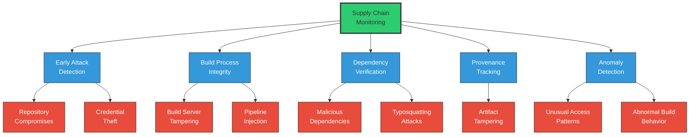
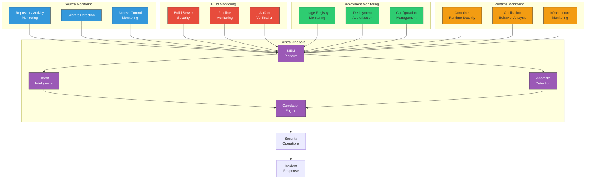
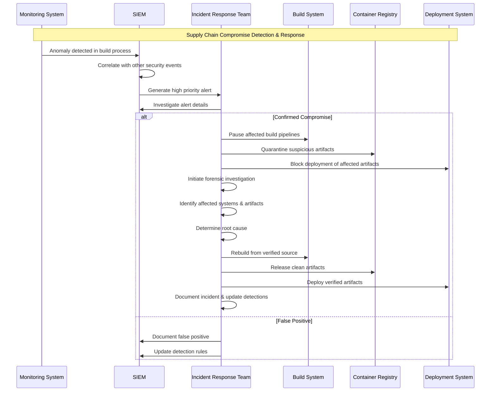

# Monitoring Tools and Techniques for Software Supply Chain Security

<div class="secure-component">
<span class="security-badge badge-secure">DETECTION & RESPONSE</span>

Monitoring is a critical element of software supply chain security, providing visibility into activities, anomalies, and potential threats across development, build, and deployment environments. Effective monitoring enables organizations to detect compromises early and respond swiftly to minimize impact.
</div>

## The Role of Monitoring in Supply Chain Security

Supply chain attacks often remain undetected for extended periods. Without proper monitoring, malicious code injections, unauthorized access, and other security breaches can persist silently, compromising numerous systems downstream. Effective monitoring provides:



## Monitoring Domains for Supply Chain Security

<div class="security-grid">
<div class="security-grid-item security-grid-item-main">

Comprehensive supply chain monitoring covers multiple domains:

### 1. Source Code & Repository Monitoring

- **Access patterns**: Changes in who accesses repositories and when
- **Commit behaviors**: Unusual commit patterns or changes in developer behaviors
- **Code changes**: Suspicious modifications, especially to security-critical components
- **Secrets detection**: Real-time monitoring for accidental secret exposure
- **Branch protection**: Changes to protection rules on sensitive branches

### 2. Build Environment Monitoring

- **Build system access**: Who is accessing build systems and when
- **Configuration changes**: Modifications to build scripts and configurations
- **Resource utilization**: Unusual CPU/memory patterns that may indicate compromise
- **Network traffic**: Unexpected connections to/from build servers
- **Container integrity**: Monitoring for unexpected modifications to container images
</div>

<div class="security-grid-item security-grid-item-side">
<div class="security-info-box">
<strong>SolarWinds Lesson</strong>

<p>The SolarWinds attack demonstrated the limitations of traditional monitoring approaches. The attackers:</p>

<ul>
<li>Modified source code through legitimate credentials</li>
<li>Created malware that specifically evaded detection</li>
<li>Used expected network connections to avoid alerts</li>
<li>Ensured build outputs passed standard integrity checks</li>
</ul>

<p>Modern supply chain monitoring must address these sophisticated tactics through behavioral analysis, provenance verification, and multi-layered detection strategies.</p>
</div>
</div>
</div>

### 3. Dependency Ecosystem Monitoring

- **Dependency changes**: Additions, removals, or updates to dependencies
- **Dependency behaviors**: Runtime activities of third-party components
- **Package registry events**: Unusual updates or ownership transfers
- **Vulnerability disclosures**: New CVEs affecting your dependency ecosystem
- **Maintainer activities**: Unusual behavior from key project maintainers

### 4. Artifact & Deployment Monitoring

- **Artifact integrity**: Verification that artifacts match expected source code builds
- **Signature validation**: Continuous verification of digital signatures
- **Deployment patterns**: Changes in how and when artifacts are deployed
- **Runtime behaviors**: Unexpected behaviors from deployed applications
- **Infrastructure changes**: Modifications to deployment environments

## Early Detection Systems {#early-detection-systems}

<div class="secure-component">
<span class="security-badge badge-info">TIME TO DETECTION</span>

The effectiveness of supply chain security monitoring is measured by how quickly it can detect potential compromises. Early detection systems focus on identifying indicators of compromise as early as possible in the development lifecycle.
</div>

### Repository & Code Monitoring Tools

<div class="security-table">
<table>
<thead>
<tr>
<th>Tool</th>
<th>Key Features</th>
<th>Best For</th>
</tr>
</thead>
<tbody>
<tr>
<td><strong>GitGuardian</strong></td>
<td>
  • Real-time secrets detection<br>
  • Policy enforcement<br>
  • Historical scanning<br>
  • API for integration
</td>
<td>Organizations seeking automated secret detection and remediation</td>
</tr>
<tr>
<td><strong>GitHub Advanced Security</strong></td>
<td>
  • Code scanning with CodeQL<br>
  • Secret scanning<br>
  • Dependency review<br>
  • Security policy enforcement
</td>
<td>GitHub-based repositories requiring comprehensive security monitoring</td>
</tr>
<tr>
<td><strong>Snyk</strong></td>
<td>
  • Code security scanning<br>
  • Dependency vulnerability monitoring<br>
  • License compliance<br>
  • Container security
</td>
<td>Teams needing integrated vulnerability management across the SDLC</td>
</tr>
<tr>
<td><strong>Datree</strong></td>
<td>
  • Policy enforcement for Kubernetes<br>
  • Git hook integration<br>
  • Customizable rules<br>
  • CI/CD integration
</td>
<td>Organizations focusing on infrastructure security monitoring</td>
</tr>
</tbody>
</table>
</div>

### Implementation Example: Repository Monitoring

```yaml
# GitHub Actions workflow for repository monitoring
name: Repository Security Monitoring

on:
  schedule:
    - cron: '0 */6 * * *'  # Every 6 hours
  push:
    branches: [ main, develop ]

jobs:
  monitor-repo:
    name: Repository Security Scan
    runs-on: ubuntu-latest
    steps:
      - name: Checkout repository
        uses: actions/checkout@v3
        with:
          fetch-depth: 0
      
      # Detect unexpected branch protection changes
      - name: Check branch protections
        uses: fregante/protected-branch-check-action@v1
        with:
          main: main
          pull-request-required: true
          reviewers-required: 2
          status-checks-required: true
      
      # Secret scanning with advanced patterns
      - name: Scan for secrets
        uses: gitleaks/gitleaks-action@v2
        with:
          config-path: .gitleaks.toml
      
      # Detect unusual commit patterns
      - name: Analyze commit patterns
        run: |
          echo "Analyzing commit patterns..."
          # Custom script to analyze commit patterns
          # - Time-of-day anomalies
          # - Author behavior changes
          # - Unusual file modifications
          python .github/scripts/analyze_commits.py
      
      # Report findings
      - name: Post findings to security dashboard
        if: ${{ success() || failure() }}
        run: |
          curl -X POST ${{ secrets.SECURITY_DASHBOARD_URL }} \
            -H "Authorization: Bearer ${{ secrets.DASHBOARD_TOKEN }}" \
            -H "Content-Type: application/json" \
            --data-binary @report.json
```

## Build System Monitoring {#build-system-monitoring}

<div class="security-grid">
<div class="security-grid-item security-grid-item-main">

Build systems represent a critical point in the supply chain that requires dedicated monitoring. Key monitoring approaches include:

### 1. Build System Access Control and Logging

- **Identity-based access**: Monitor who accesses build systems, when, and from where
- **Privileged access management**: Special monitoring for admin-level access
- **Multi-factor authentication**: Enforce and monitor MFA usage for build systems
- **Comprehensive audit logs**: Detailed logging of all actions performed on build systems

### 2. Build Process Integrity Monitoring

- **Build script change detection**: Monitor for unauthorized modifications to build configurations
- **Build provenance verification**: Record and verify build metadata (who, what, when, where)
- **Build input validation**: Verify the integrity of inputs to the build process
- **Build output validation**: Ensure outputs match expectations based on inputs
- **Hermetic build enforcement**: Verify that builds only use declared dependencies

### 3. Build Environment Security

- **Container image security**: Monitor base images for vulnerabilities
- **Network isolation**: Monitor for unexpected network connections
- **Ephemeral environments**: Ensure build environments are created fresh for each build
- **Resource utilization**: Watch for unusual patterns in CPU, memory, or network usage
</div>

<div class="security-grid-item security-grid-item-side">
```bash
# Example build integrity monitoring script

#!/bin/bash
# This script monitors build process integrity

# 1. Verify build script hasn't changed
BUILD_SCRIPT_HASH=$(sha256sum build.sh | cut -d ' ' -f 1)
EXPECTED_HASH="e9c5682857d70e097b8a914688f9cddb...."

if [ "$BUILD_SCRIPT_HASH" != "$EXPECTED_HASH" ]; then
  echo "ERROR: Build script has been modified!"
  exit 1
fi

# 2. Verify build environment
if ! docker info &> /dev/null; then
  echo "ERROR: Docker not available!"
  exit 1
fi

# 3. Capture build provenance
BUILD_ID=$(uuidgen)
BUILD_TIME=$(date -u +"%Y-%m-%dT%H:%M:%SZ")
BUILD_USER=$(whoami)
BUILD_HOST=$(hostname)
GIT_COMMIT=$(git rev-parse HEAD)

# 4. Record network connections during build
echo "Starting network monitoring..."
tcpdump -i any -w build_network_$BUILD_ID.pcap &
TCPDUMP_PID=$!

# 5. Run the build with resource monitoring
time docker build -t myapp:$BUILD_ID .
BUILD_EXIT=$?

# 6. Stop monitoring
kill $TCPDUMP_PID

# 7. Generate attestation
cat > attestation.json << EOL
{
  "buildId": "$BUILD_ID",
  "timestamp": "$BUILD_TIME",
  "builder": "$BUILD_USER@$BUILD_HOST",
  "sourceCommit": "$GIT_COMMIT",
  "exitCode": $BUILD_EXIT
}
EOL

# 8. Sign attestation
gpg --detach-sign --armor attestation.json

echo "Build provenance recorded in attestation.json"
```
</div>
</div>

### Build System Monitoring Tools

<div class="security-table">
<table>
<thead>
<tr>
<th>Tool Category</th>
<th>Examples</th>
<th>Key Capabilities</th>
</tr>
</thead>
<tbody>
<tr>
<td><strong>CI/CD Security Solutions</strong></td>
<td>Prisma Cloud, Aqua Security, Lacework</td>
<td>
  • CI/CD pipeline security monitoring<br>
  • Pipeline configuration validation<br>
  • Build-time security policy enforcement
</td>
</tr>
<tr>
<td><strong>Provenance Tools</strong></td>
<td>Sigstore Cosign, in-toto, SLSA Framework</td>
<td>
  • Cryptographic verification of build origin<br>
  • Chain of custody tracking<br>
  • Metadata recording and verification
</td>
</tr>
<tr>
<td><strong>Host Security Monitoring</strong></td>
<td>Wazuh, Falco, osquery</td>
<td>
  • Real-time file integrity monitoring<br>
  • Process activity monitoring<br>
  • System call monitoring and alerting
</td>
</tr>
<tr>
<td><strong>Network Monitoring</strong></td>
<td>Zeek, Suricata, Security Onion</td>
<td>
  • Network traffic analysis<br>
  • Communication pattern monitoring<br>
  • Protocol-specific analysis and alerting
</td>
</tr>
</tbody>
</table>
</div>

## Dependency Monitoring {#dependency-monitoring}

<div class="secure-component">
<span class="security-badge badge-warning">CRITICAL CONTROL</span>

Monitoring the security posture of dependencies is essential for supply chain security. As most applications consist primarily of third-party code, dependency monitoring provides critical visibility into potential upstream threats.
</div>

### Key Monitoring Approaches

1. **Vulnerability Monitoring**
   - **Continuous scanning**: Regular rescanning of dependencies against vulnerability databases
   - **Alert integration**: Notification systems for newly discovered vulnerabilities
   - **Exploit monitoring**: Tracking exploitation status of vulnerabilities in dependencies
   - **Patch notification**: Alerts when fixes become available

2. **Behavioral Monitoring**
   - **Runtime behavior analysis**: Detecting when dependencies act unexpectedly
   - **Network activity**: Monitoring unexpected connections from third-party code
   - **Filesystem access**: Watching for unusual file operations
   - **Resource consumption**: Identifying abnormal resource usage patterns

3. **Ecosystem Intelligence**
   - **Maintainer activity**: Changes in project ownership or maintainer behavior
   - **Package popularity**: Unusual changes in download patterns
   - **Update frequency**: Unexpected release patterns or update timing
   - **Repository activities**: Monitoring for suspicious commits or pull requests

### Implementation Example: Continuous Dependency Monitoring

```bash
# Example: Proactive dependency monitoring script
# This script continuously monitors for new vulnerabilities in dependencies

#!/bin/bash
set -e

# Directory to store vulnerability data
VULN_DIR="./vulnerability-data"
mkdir -p $VULN_DIR

# Function to check dependencies
check_dependencies() {
  echo "Scanning dependencies at $(date)"
  
  # For npm projects
  if [ -f package.json ]; then
    echo "Scanning npm dependencies..."
    npm audit --json > $VULN_DIR/npm-audit-$(date +%F).json
    
    # Compare with previous results
    if [ -f "$VULN_DIR/npm-audit-previous.json" ]; then
      NEW_VULNS=$(jq -r 'if .vulnerabilities then .vulnerabilities | keys | length else 0 end' $VULN_DIR/npm-audit-$(date +%F).json)
      OLD_VULNS=$(jq -r 'if .vulnerabilities then .vulnerabilities | keys | length else 0 end' $VULN_DIR/npm-audit-previous.json)
      
      if [ $NEW_VULNS -gt $OLD_VULNS ]; then
        echo "⚠️ WARNING: New vulnerabilities detected!"
        jq -r '.vulnerabilities | keys | .[]' $VULN_DIR/npm-audit-$(date +%F).json
        
        # Send notification
        curl -X POST $WEBHOOK_URL \
          -H "Content-Type: application/json" \
          -d "{\"text\":\"New vulnerabilities detected in npm dependencies!\"}"
      fi
    fi
    
    # Save current state as previous for next run
    cp $VULN_DIR/npm-audit-$(date +%F).json $VULN_DIR/npm-audit-previous.json
  fi
  
  # For Java projects
  if [ -f pom.xml ]; then
    echo "Scanning Java dependencies..."
    mvn org.owasp:dependency-check-maven:check -DoutputDirectory=$VULN_DIR
    
    # Process results and send alerts similarly...
  fi
}

# Main monitoring loop
while true; do
  check_dependencies
  echo "Sleeping for 6 hours..."
  sleep 21600  # Check every 6 hours
done
```

## Anomaly Detection Systems {#anomaly-detection}

<div class="security-grid">
<div class="security-grid-item security-grid-item-main">

Anomaly detection uses machine learning and behavioral analysis to identify unusual patterns that may indicate supply chain attacks. Effective anomaly detection systems for supply chain security focus on:

### 1. Behavioral Baselines

- **Developer activity patterns**: Normal working hours, commit frequency, file types modified
- **Build process characteristics**: Duration, resource usage, output size/structure
- **Deployment patterns**: Timing, frequency, target environments
- **Runtime behaviors**: API calls, network connections, resource utilization

### 2. Detection Methodology

- **Statistical anomaly detection**: Identifying values outside normal statistical ranges
- **Pattern-based detection**: Recognizing sequences that deviate from established patterns
- **Time series analysis**: Detecting temporal anomalies and unusual timing
- **Clustering and outlier detection**: Grouping similar behaviors and flagging outliers

### 3. Key Anomaly Indicators

- **Unusual commit timing**: Commits outside normal working hours or patterns
- **Atypical file modifications**: Changes to critical files not normally modified
- **Build process deviations**: Unexpected build steps or connections
- **Dependency anomalies**: Unusual updates or version changes
- **Runtime behavior shifts**: New network connections or resource access patterns
</div>

<div class="security-grid-item security-grid-item-side">
<div class="security-info-box">
<strong>Advanced Anomaly Detection Techniques</strong>

<ul>
<li><strong>Unsupervised Learning</strong>: Models that identify unusual patterns without predefined labels</li>
<li><strong>One-class Classification</strong>: Learning what "normal" is and detecting deviations</li>
<li><strong>Graph-based Analysis</strong>: Monitoring relationships between entities in the supply chain</li>
<li><strong>Process Mining</strong>: Analyzing process execution traces for unusual patterns</li>
<li><strong>Transfer Learning</strong>: Applying knowledge from known attacks to detect similar patterns</li>
</ul>
</div>
</div>
</div>

### Implementation Example: Build Behavior Anomaly Detection

```python
# Example Python code for build anomaly detection

import pandas as pd
import numpy as np
from sklearn.ensemble import IsolationForest
import matplotlib.pyplot as plt
import json

# Load historical build data
def load_build_data(filename):
    with open(filename, 'r') as f:
        data = json.load(f)
    
    builds = []
    for build in data:
        builds.append({
            'duration': build['duration'],
            'file_count': build['output_files'],
            'binary_size': build['output_size_bytes'],
            'cpu_usage': build['avg_cpu_percent'],
            'memory_usage': build['max_memory_mb'],
            'network_calls': build['external_network_calls'],
            'exit_code': build['exit_code']
        })
    
    return pd.DataFrame(builds)

# Create anomaly detection model
def train_model(df):
    model = IsolationForest(
        contamination=0.05,  # Expect ~5% anomalies
        random_state=42
    )
    
    # Train on numerical features
    features = ['duration', 'file_count', 'binary_size', 
                'cpu_usage', 'memory_usage', 'network_calls']
    model.fit(df[features])
    
    return model, features

# Detect anomalies in new builds
def detect_anomalies(model, features, historical_df, new_build):
    # Convert new build to DataFrame with same structure
    new_df = pd.DataFrame([new_build])
    
    # Make prediction (1: normal, -1: anomaly)
    prediction = model.predict(new_df[features])[0]
    
    if prediction == -1:
        # Find what's anomalous about this build
        anomalies = []
        for feature in features:
            mean = historical_df[feature].mean()
            std = historical_df[feature].std()
            value = new_build[feature]
            
            # If more than 3 standard deviations away, flag as anomalous
            if abs(value - mean) > 3 * std:
                anomalies.append({
                    'feature': feature,
                    'value': value,
                    'mean': mean,
                    'std_dev': std,
                    'std_deviations': abs(value - mean) / std
                })
        
        return True, anomalies
    
    return False, []

# Main function
def main():
    # Load historical build data
    historical_data = load_build_data('build_history.json')
    
    # Train anomaly detection model
    model, features = train_model(historical_data)
    
    # New build to check
    new_build = {
        'duration': 128,
        'file_count': 1892,
        'binary_size': 15650432,
        'cpu_usage': 82,
        'memory_usage': 1245,
        'network_calls': 17,  # Unusual, typically 0-2 for this build
        'exit_code': 0
    }
    
    # Detect anomalies
    is_anomaly, anomalies = detect_anomalies(model, features, historical_data, new_build)
    
    if is_anomaly:
        print("Anomalous build detected!")
        for anomaly in anomalies:
            print(f"Unusual {anomaly['feature']}: {anomaly['value']} "
                 f"(typical: {anomaly['mean']:.2f} ± {anomaly['std_dev']:.2f}, "
                 f"{anomaly['std_deviations']:.2f} standard deviations away)")
    else:
        print("Build appears normal.")

if __name__ == "__main__":
    main()
```

## Security Information and Event Management (SIEM) {#siem-solutions}

<div class="secure-component">
<span class="security-badge badge-info">CENTRAL MONITORING</span>

SIEM solutions provide a centralized platform for collecting, correlating, and analyzing security events across the software supply chain. Modern SIEM platforms integrate data from multiple sources to provide comprehensive visibility and detection capabilities.
</div>

### Key SIEM Features for Supply Chain Security

1. **Data Collection and Aggregation**
   - Log collection from development, build, and deployment systems
   - API integration with code repositories, CI/CD platforms, and cloud services
   - SBOM and vulnerability data ingestion
   - Authentication and access control event collection

2. **Correlation and Analysis**
   - Cross-domain event correlation (e.g., repository activity with build events)
   - Behavior analytics to identify suspicious patterns
   - Rule-based detection of known attack patterns
   - Machine learning for anomaly detection

3. **Visualization and Reporting**
   - Supply chain security dashboards
   - Attack path visualization
   - Compliance reporting
   - Security metrics and KPIs

### Popular SIEM Solutions for Supply Chain Security

<div class="security-table">
<table>
<thead>
<tr>
<th>Solution</th>
<th>Key Strengths</th>
<th>Supply Chain Security Features</th>
</tr>
</thead>
<tbody>
<tr>
<td><strong>Splunk</strong></td>
<td>
  • Powerful search and analytics<br>
  • Extensive integration ecosystem<br>
  • Advanced correlation capabilities
</td>
<td>
  • DevOps and CI/CD monitoring<br>
  • Container and Kubernetes monitoring<br>
  • Cloud security monitoring<br>
  • Custom dashboards for supply chain
</td>
</tr>
<tr>
<td><strong>Elastic Security</strong></td>
<td>
  • Open-source foundation<br>
  • Scalable architecture<br>
  • Strong search capabilities
</td>
<td>
  • APM integration for runtime monitoring<br>
  • Container monitoring<br>
  • Github/GitLab integration<br>
  • Behavior analytics
</td>
</tr>
<tr>
<td><strong>Microsoft Sentinel</strong></td>
<td>
  • Cloud-native SIEM<br>
  • AI-driven analytics<br>
  • Strong Microsoft ecosystem integration
</td>
<td>
  • Azure DevOps integration<br>
  • GitHub monitoring<br>
  • Container insights<br>
  • Software supply chain specific analytics
</td>
</tr>
<tr>
<td><strong>Google Security Operations</strong></td>
<td>
  • Threat intelligence integration<br>
  • Powerful detection capabilities<br>
  • Managed service
</td>
<td>
  • Cloud build monitoring<br>
  • Container registry insights<br>
  • GKE security monitoring<br>
  • Software delivery shield integration
</td>
</tr>
</tbody>
</table>
</div>

### Splunk Query Example for Supply Chain Security Monitoring

```splunk
/* Detecting potential supply chain attacks by correlating
   unusual repository activity with build anomalies */

/* Step 1: Find unusual repository events */
index=git sourcetype=github 
| stats count by user, repo, action, time_window=1h 
| eventstats avg(count) as avg_count, stdev(count) as stdev_count by user, action
| where count > avg_count + (3 * stdev_count)
| rename user as suspicious_user, repo as affected_repo
| table _time, suspicious_user, affected_repo, action, count

/* Step 2: Find related build events */
| join affected_repo 
    [search index=cicd sourcetype=jenkins 
    | where repository=affected_repo
    | stats list(build_id) as builds by repository
    | table repository, builds]

/* Step 3: Examine artifacts produced by suspicious builds */
| join builds 
    [search index=cicd sourcetype=artifacts 
    | rename build_id as artifact_build_id
    | where match(builds, artifact_build_id)
    | table artifact_build_id, artifact_name, artifact_hash]

/* Step 4: Check if artifacts were deployed */
| join artifact_name
    [search index=deployments 
    | rename artifact as deployed_artifact
    | where deployed_artifact=artifact_name
    | table deployed_artifact, deployment_environment, deployment_time]

/* Final correlation showing potential attack path */
| table _time, suspicious_user, affected_repo, action, 
         builds, artifact_name, artifact_hash, 
         deployment_environment, deployment_time
| sort -_time
```

## Runtime Monitoring {#runtime-monitoring}

<div class="security-grid">
<div class="security-grid-item security-grid-item-main">

Runtime monitoring provides continuous visibility into the behavior of deployed applications and infrastructure, which is essential for detecting supply chain attacks that may manifest only during execution.

### Key Runtime Monitoring Approaches

1. **Runtime Application Self-Protection (RASP)**
   - Integrated protections that monitor application behavior at runtime
   - Detection of exploitation attempts through behavioral analysis
   - Context-aware security controls embedded in applications
   - Blocking of malicious activities in real-time
 
2. **Container Runtime Security**
   - Monitoring container behavior for unexpected activities
   - Enforcement of security policies at runtime
   - Detection of container escape attempts
   - Verification of container image integrity

3. **API Security Monitoring**
   - Analysis of API traffic patterns
   - Detection of API abuse or manipulation
   - Monitoring for data exfiltration attempts
   - API authentication and authorization verification

4. **Infrastructure Monitoring**
   - Cloud resource configuration and access monitoring
   - Network traffic analysis
   - System call monitoring
   - Host-based intrusion detection
</div>

<div class="security-grid-item security-grid-item-side">
```yaml
# Example: Falco rules for detecting supply chain attacks at runtime

# Detect unexpected network connections from build processes
- rule: Unexpected Network Connection from Build Process
  desc: Detect when a build process makes unexpected network connections
  condition: >
    spawned_process and
    proc.name in (make, mvn, gradle, npm, pip) and
    (outbound_connection and not 
     dest.ip in (allowed_build_destinations))
  output: >
    Network connection from build tool (user=%user.name
    command=%proc.cmdline connection=%fd.name)
  priority: WARNING
  tags: [supply-chain, build-process, network]

# Detect modifications to running containers
- rule: Container Modification
  desc: Detect writes to container file systems at runtime
  condition: >
    container and
    (open_write or create or mkdir or rename) and
    not proc.name in (allowed_write_processes) and
    not fd.directory in (allowed_write_directories)
  output: >
    File system write in container (user=%user.name
    command=%proc.cmdline file=%fd.name container=%container.name)
  priority: WARNING
  tags: [supply-chain, container, runtime]

# Detect execution of unusual binaries in production
- rule: Unusual Binary Execution
  desc: Detect execution of binaries not part of base image
  condition: >
    container and
    spawned_process and
    not proc.name in (allowed_processes) and
    not proc.name startswith ("docker-")
  output: >
    Unusual binary execution (user=%user.name
    command=%proc.cmdline container=%container.name)
  priority: WARNING
  tags: [supply-chain, container, runtime]
```
</div>
</div>

## Comprehensive Monitoring Architecture {#comprehensive-architecture}

A mature supply chain monitoring architecture integrates multiple monitoring domains to provide comprehensive visibility and detection capabilities:



## Implementing a Supply Chain Monitoring Strategy

<div class="secure-component">
<span class="security-badge badge-secure">IMPLEMENTATION GUIDE</span>

Follow this roadmap to implement an effective supply chain monitoring strategy in your organization:
</div>

### 1. Assessment and Planning

- **Supply Chain Mapping**: Document your entire supply chain from development to deployment
- **Risk Assessment**: Identify the most critical points in your supply chain
- **Monitoring Goals**: Define specific monitoring objectives and requirements
- **Tool Evaluation**: Assess tools based on your specific needs and environment

### 2. Implementation Phases

<div class="security-table">
<table>
<thead>
<tr>
<th>Phase</th>
<th>Focus Areas</th>
<th>Key Activities</th>
</tr>
</thead>
<tbody>
<tr>
<td><strong>Phase 1:<br>Foundation</strong></td>
<td>Basic visibility into critical components</td>
<td>
  • Implement logging across key systems<br>
  • Deploy basic SIEM collection<br>
  • Establish baseline monitoring for repositories and build systems<br>
  • Define initial alerting for high-risk events
</td>
</tr>
<tr>
<td><strong>Phase 2:<br>Comprehensive Monitoring</strong></td>
<td>Expanded visibility and detection</td>
<td>
  • Integrate all supply chain components into monitoring<br>
  • Implement advanced detection capabilities<br>
  • Deploy behavior analytics<br>
  • Establish cross-domain correlation rules
</td>
</tr>
<tr>
<td><strong>Phase 3:<br>Advanced Detection</strong></td>
<td>Sophisticated detection and prevention</td>
<td>
  • Implement machine learning-based anomaly detection<br>
  • Integrate threat intelligence<br>
  • Deploy automated response capabilities<br>
  • Establish continuous testing of detection capabilities
</td>
</tr>
<tr>
<td><strong>Phase 4:<br>Maturity & Optimization</strong></td>
<td>Refinement and continuous improvement</td>
<td>
  • Optimize detection rules and reduce false positives<br>
  • Implement advanced analytics and trend analysis<br>
  • Integrate with business context<br>
  • Establish metrics-driven improvement processes
</td>
</tr>
</tbody>
</table>
</div>

### 3. Best Practices for Monitoring Implementation

<div class="security-grid">
<div class="security-grid-item security-grid-item-main">

1. **Define Clear Baselines**
   - Document normal behavior for each component
   - Establish acceptable thresholds for variations
   - Regularly update baselines as systems change

2. **Implement Defense in Depth**
   - Deploy multiple monitoring layers for critical systems
   - Avoid dependence on single detection methods
   - Combine signature-based and behavioral detection

3. **Manage Alert Quality**
   - Focus on high-fidelity alerts for critical systems
   - Implement alert tuning and refinement processes
   - Create clear escalation paths for different alert types

4. **Ensure Log Integrity**
   - Protect logging infrastructure from tampering
   - Implement immutable logging where possible
   - Ship logs to external systems in near real-time
</div>

<div class="security-grid-item security-grid-item-side">
<div class="security-info-box">
<strong>Metrics to Track</strong>

<ul>
<li><strong>Mean Time to Detect (MTTD)</strong>: How quickly security events are detected</li>
<li><strong>Alert fidelity rate</strong>: Percentage of alerts that represent actual security issues</li>
<li><strong>Coverage</strong>: Percentage of supply chain components with adequate monitoring</li>
<li><strong>Detection confidence</strong>: Certainty level of detected anomalies</li>
<li><strong>Visibility gaps</strong>: Areas of the supply chain lacking adequate monitoring</li>
</ul>
</div>
</div>
</div>

## Incident Response Integration

<div class="secure-component">
<span class="security-badge badge-warning">CRITICAL CAPABILITY</span>

Monitoring systems must be tightly integrated with incident response capabilities to enable rapid containment and remediation of detected supply chain compromises.
</div>

### Key Integration Points

1. **Alert Triage and Escalation**
   - Automated triage based on alert severity and context
   - Clear escalation paths for different alert types
   - On-call rotations for critical supply chain alerts

2. **Playbook Integration**
   - Predefined response playbooks for common supply chain attacks
   - Automated playbook triggering based on alert types
   - Regular testing and refinement of response procedures

3. **Containment Automation**
   - Automated containment actions for critical threats
   - Integration with CI/CD systems to halt affected pipelines
   - Ability to revoke compromised credentials or access

4. **Root Cause Investigation**
   - Comprehensive forensics data collection
   - Timeline reconstruction capabilities
   - Threat hunting tools for extended investigation

### Example: Supply Chain Attack Response Playbook



## Conclusion

<div class="secure-component">
<span class="security-badge badge-info">KEY TAKEAWAYS</span>

Effective monitoring is a cornerstone of software supply chain security, providing the visibility and detection capabilities needed to identify and respond to threats. A comprehensive monitoring strategy should:
</div>

- **Cover the entire supply chain** from source code to runtime environments
- **Integrate multiple monitoring domains** for comprehensive visibility
- **Combine signature-based and behavioral detection** for maximum effectiveness
- **Focus on anomaly detection** to identify sophisticated and novel attacks
- **Provide context-rich alerting** to enable rapid investigation and response
- **Integrate with incident response processes** for seamless remediation

By implementing a robust monitoring strategy, organizations can significantly reduce the risk of successful supply chain attacks and minimize the impact of security incidents that do occur.

## Additional Resources

- [CISA Guidance on Defending Against Software Supply Chain Attacks](https://www.cisa.gov/publication/software-supply-chain-attacks)
- [NIST SP 800-161: Supply Chain Risk Management Practices](https://csrc.nist.gov/publications/detail/sp/800-161/rev-1/final)
- [Supply Chain Integrity Model (SCIM)](https://www.intel.com/content/dam/develop/external/us/en/documents/supply-chain-integrity-model-scim-whitepaper.pdf)
- [Cloud Native Security Monitoring](https://www.cncf.io/blog/2021/02/05/cloud-native-security-monitoring/)
- [Google's BeyondProd: Cloud-Native Security for Software Supply Chains](https://cloud.google.com/security/beyondprod)