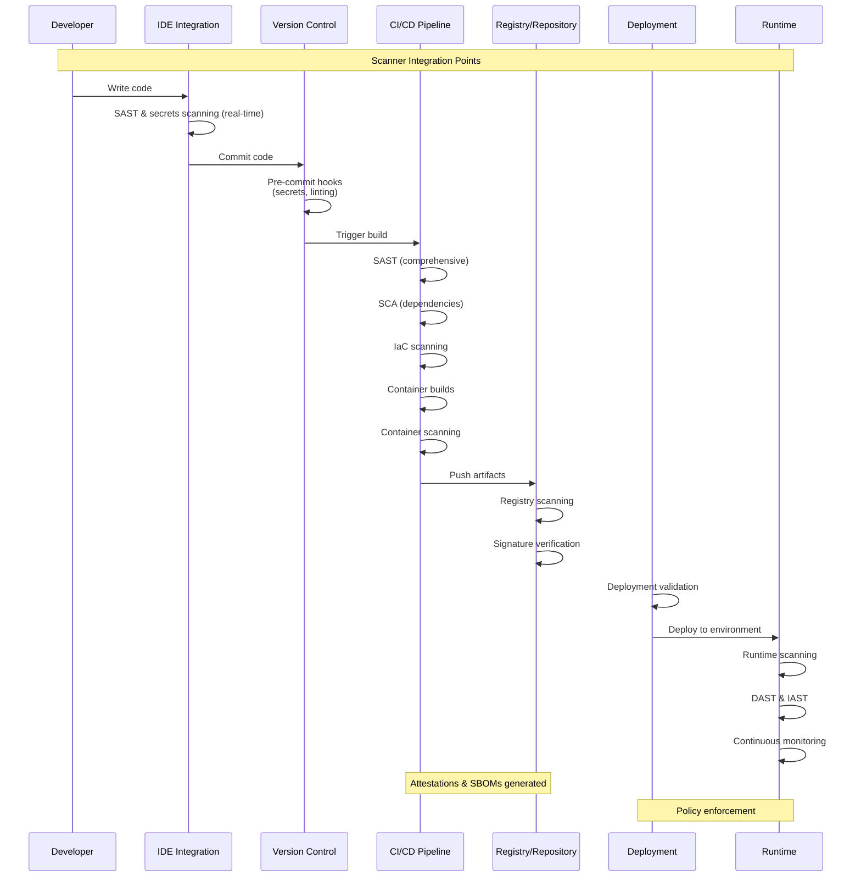
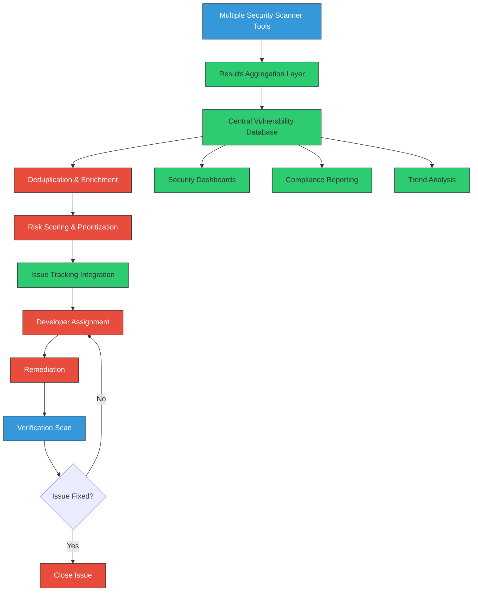

# Scanners for Software Supply Chain Security

<div class="secure-component">
<span class="security-badge badge-secure">DETECTION & PREVENTION</span>

Security scanners are automated tools that analyze software components, codebases, and infrastructure to identify vulnerabilities, misconfigurations, and compliance issues throughout the software supply chain. Implementing the right scanning strategy is essential for maintaining security across the development lifecycle.
</div>

## Scanner Types in the Supply Chain

Security scanning tools target different parts of the software supply chain, each addressing specific risks and vulnerabilities:

```mermaid
graph TD
    classDef scanner fill:#3498db, stroke:#333, stroke-width:1px, color:white
    classDef area fill:#2ecc71, stroke:#333, stroke-width:1px
    
    A[Security Scanner Types]:::scanner
    
    A --> B[Source Code<br/>Analysis]:::scanner
    B --> B1[SAST]:::area
    B --> B2[Secret Scanning]:::area
    B --> B3[Code Quality]:::area
    B --> B4[Secure Coding<br/>Standards]:::area
    
    A --> C[Dependency<br/>Analysis]:::scanner
    C --> C1[SCA]:::area
    C --> C2[License<br/>Compliance]:::area
    C --> C3[SBOM<br/>Generation]:::area
    
    A --> D[Build & Package<br/>Analysis]:::scanner
    D --> D1[Container<br/>Scanning]:::area
    D --> D2[Binary<br/>Analysis]:::area
    D --> D3[Integrity<br/>Verification]:::area
    
    A --> E[Runtime<br/>Analysis]:::scanner
    E --> E1[DAST]:::area
    E --> E2[IAST]:::area
    E --> E3[Penetration<br/>Testing]:::area
    
    A --> F[Infrastructure<br/>Analysis]:::scanner
    F --> F1[IaC Scanning]:::area
    F --> F2[Cloud Security<br/>Posture]:::area
    F --> F3[Configuration<br/>Analysis]:::area
    
    click B1 "#static-application-security-testing-sast" "View SAST tools"
    click C1 "#software-composition-analysis-sca" "View SCA tools"
    click D1 "#container-security-scanners" "View Container scanners"
    
    style A stroke-width:3px
```



## Static Application Security Testing (SAST) {#static-application-security-testing-sast}

<div class="security-grid" markdown="1">
<div class="security-grid-item security-grid-item-main" markdown="1">

SAST tools analyze source code, bytecode, or binary files without executing the application to identify security vulnerabilities, coding flaws, and potential weaknesses.

### How SAST Works

1. **Code Parsing**: Tools parse the source code into an abstract syntax tree (AST)
2. **Pattern Matching**: Predefined or custom rules check for vulnerable patterns
3. **Data Flow Analysis**: Tracks how data flows through the application to identify potential injection points
4. **Control Flow Analysis**: Maps execution paths to find logical vulnerabilities
5. **Results Generation**: Findings are reported with severity ratings and remediation guidance

### Key Benefits for Supply Chain Security

- **Early Detection**: Finds issues during development before they propagate downstream
- **Coverage**: Can scan all code paths, including those not executed during runtime testing
- **Integration**: Embeds directly into development workflows and IDEs
- **Customization**: Rules can be tailored to organization-specific security policies
- **Automation**: Easily incorporated into CI/CD pipelines

</div>

<div class="security-grid-item security-grid-item-side" markdown="1">
<div class="security-info-box" markdown="1">

**Top SAST Tools**

- **SonarQube**: Open-source platform for continuous code quality and security inspection
- **Checkmarx**: Enterprise-grade solution with broad language support and detailed findings
- **Fortify**: Comprehensive static analysis with integration into development tools
- **Semgrep**: Lightweight, fast, open-source static analysis that's easy to customize
- **GitHub CodeQL**: Semantic code analysis engine that treats code as data
- **Snyk Code**: Developer-first SAST with real-time feedback

</div>
</div>
</div>

### Implementation Example: Semgrep in CI/CD

```yaml
# GitHub Actions workflow for Semgrep SAST scanning
name: Semgrep SAST Scan

on:
  push:
    branches: [ main, develop ]
  pull_request:
    branches: [ main ]

jobs:
  semgrep:
    name: Static Analysis
    runs-on: ubuntu-latest
    
    steps:
      - uses: actions/checkout@v3
      
      - name: Semgrep Scan
        uses: returntocorp/semgrep-action@v1
        with:
          config: >-
            p/default
            p/security-audit
            p/r2c-security-audit
            p/secrets
            p/owasp-top-ten
          generateSarif: "1"
        env:
          SEMGREP_APP_TOKEN: ${{ secrets.SEMGREP_APP_TOKEN }}
      
      - name: Upload SARIF file
        uses: github/codeql-action/upload-sarif@v2
        with:
          sarif_file: semgrep.sarif
          wait-for-processing: true
```

### SAST Strengths and Limitations

<div class="security-table">
<table>
<thead>
<tr>
<th>Strengths</th>
<th>Limitations</th>
</tr>
</thead>
<tbody>
<tr>
<td>
  • Can analyze code before execution<br>
  • Identifies a wide range of vulnerability types<br>
  • Scans all code paths, even rarely executed ones<br>
  • Provides immediate feedback during development
</td>
<td>
  • Can produce false positives<br>
  • Limited insight into runtime behavior<br>
  • May miss certain vulnerability types<br>
  • Tool effectiveness varies by language
</td>
</tr>
</tbody>
</table>
</div>

## Software Composition Analysis (SCA) {#software-composition-analysis-sca}

<div class="secure-component">
<span class="security-badge badge-warning">CRITICAL CONTROL</span>

SCA tools identify vulnerabilities in third-party dependencies and open source components—a critical control point for software supply chain security. The vast majority of modern applications consist of up to 70-90% third-party code, making SCA essential.
</div>

### How SCA Works

1. **Dependency Discovery**: Identifies all direct and transitive dependencies
2. **Vulnerability Matching**: Checks components against vulnerability databases like NVD
3. **License Analysis**: Identifies licensing issues that may pose legal risks
4. **Policy Enforcement**: Applies organizational policies to dependency usage
5. **SBOM Generation**: Creates a comprehensive bill of materials

### Key Features to Look For

- **Dependency Tree Visualization**: Graphical representation of dependencies
- **Vulnerability Path Tracing**: Identifies how vulnerabilities are introduced
- **Remediation Guidance**: Suggests fixed versions or alternative packages
- **Automated PR Creation**: Automatically creates pull requests to fix vulnerabilities
- **Developer Tooling Integration**: Integrates with IDEs and development workflows
- **License Compliance**: Ensures open source licenses align with organizational policies

### Popular SCA Tools Comparison

<div class="security-table">
<table>
<thead>
<tr>
<th>Tool</th>
<th>Key Strengths</th>
<th>Best For</th>
<th>Integration Options</th>
</tr>
</thead>
<tbody>
<tr>
<td><strong>Snyk</strong></td>
<td>
  • Developer-friendly interface<br>
  • Strong remediation guidance<br>
  • Broad ecosystem coverage
</td>
<td>Organizations seeking developer adoption and shift-left security</td>
<td>IDE plugins, CI/CD, Git, containers</td>
</tr>
<tr>
<td><strong>Sonatype Nexus IQ</strong></td>
<td>
  • Component lifecycle management<br>
  • Policy engine<br>
  • Comprehensive governance
</td>
<td>Enterprise with mature security programs</td>
<td>Build tools, CI/CD, repository managers</td>
</tr>
<tr>
<td><strong>OWASP Dependency-Check</strong></td>
<td>
  • Free and open source<br>
  • Highly customizable<br>
  • No data sharing required
</td>
<td>Budget-conscious teams or those with data privacy concerns</td>
<td>CLI, Maven/Gradle plugin, Jenkins</td>
</tr>
<tr>
<td><strong>GitHub Dependabot</strong></td>
<td>
  • Free for public repositories<br>
  • Automated PRs<br>
  • Direct GitHub integration
</td>
<td>Teams already using GitHub</td>
<td>GitHub repositories</td>
</tr>
<tr>
<td><strong>WhiteSource/Mend</strong></td>
<td>
  • Large vulnerability database<br>
  • Strong license compliance<br>
  • Broad technology coverage
</td>
<td>Organizations with diverse technology stacks</td>
<td>IDE, CI/CD, repositories, containers</td>
</tr>
</tbody>
</table>
</div>

### Implementation Example: OWASP Dependency-Check

```bash
# Running Dependency-Check on a Java project

# Download and extract Dependency-Check
curl -L https://github.com/jeremylong/DependencyCheck/releases/download/v7.4.0/dependency-check-7.4.0-release.zip -o dc.zip
unzip dc.zip

# Run the scan
./dependency-check/bin/dependency-check.sh \
  --project "My Project" \
  --scan "/path/to/application" \
  --enableExperimental \
  --out "/path/to/reports" \
  --format "ALL"
```

```yaml
# Maven plugin configuration
<plugin>
  <groupId>org.owasp</groupId>
  <artifactId>dependency-check-maven</artifactId>
  <version>7.4.0</version>
  <configuration>
    <failBuildOnCVSS>8</failBuildOnCVSS>
    <suppressionFiles>
      <suppressionFile>owasp-suppressions.xml</suppressionFile>
    </suppressionFiles>
  </configuration>
  <executions>
    <execution>
      <goals>
        <goal>check</goal>
      </goals>
    </execution>
  </executions>
</plugin>
```

## Container Security Scanners {#container-security-scanners}

<div class="security-grid" markdown="1">
<div class="security-grid-item security-grid-item-main" markdown="1">

Container security scanners inspect container images for vulnerabilities, malware, misconfigurations, and compliance issues. These tools are essential for securing containerized applications as they move through the supply chain.

### Scanning Capabilities

1. **OS Package Vulnerabilities**: Identifies vulnerable packages in the base image
2. **Application Dependencies**: Scans application-specific libraries and packages
3. **Configuration Analysis**: Detects security misconfigurations and hardening issues
4. **Secrets Detection**: Finds hardcoded credentials or sensitive data
5. **Malware Scanning**: Identifies known malicious code or backdoors
6. **Image Integrity**: Verifies image signatures and provenance information

### Key Container Scanning Tools

1. **Trivy**: Fast, comprehensive vulnerability scanner for containers and filesystem
2. **Clair**: Open source scanner focusing on container vulnerabilities
3. **Anchore Engine**: Deep analysis of container images with policy enforcement
4. **Docker Scout**: Native scanning for Docker images
5. **Sysdig Secure**: Runtime security and compliance for containers and Kubernetes
6. **Prisma Cloud/Twistlock**: Advanced container security platform

</div>

<div class="security-grid-item security-grid-item-side" markdown="1">

```bash
# Example: Scanning with Trivy
# Install Trivy
curl -sfL https://raw.githubusercontent.com/aquasecurity/trivy/main/contrib/install.sh | sh -s -- -b /usr/local/bin v0.37.3

# Basic image scan
trivy image alpine:latest

# Comprehensive scan with SBOM generation
trivy image --format json \
  --output results.json \
  --list-all-pkgs \
  --scanners vuln,secret,config \
  --generate-sbom cyclonedx \
  --output-sbom-file sbom.json \
  mycompany/myapp:latest

# Scan with policy enforcement
trivy image --exit-code 1 \
  --severity HIGH,CRITICAL \
  mycompany/myapp:latest
```

</div>
</div>

### Container Scanning Best Practices

1. **Scan Base Images**: Verify security of base images before building upon them
2. **Implement Registry Scanning**: Scan images automatically when pushed to registries
3. **Use Admission Controllers**: Block deployment of vulnerable containers in Kubernetes
4. **Version Control Images**: Use specific image tags rather than "latest"
5. **Minimize Image Size**: Reduce attack surface by using minimal images
6. **Layer Analysis**: Understand how vulnerabilities are introduced through layers
7. **Regular Rescanning**: Continuously monitor for newly discovered vulnerabilities

### Kubernetes Admission Control Integration

```yaml
# Example: Trivy-Operator deployment in Kubernetes
apiVersion: helm.cattle.io/v1
kind: HelmChart
metadata:
  name: trivy-operator
  namespace: cattle-system
spec:
  chart: trivy-operator
  repo: https://aquasecurity.github.io/helm-charts/
  targetNamespace: trivy-system
  valuesContent: |-
    trivy:
      ignoreUnfixed: true
    operator:
      policies:
        vulnerability:
          failOnSeverity: CRITICAL
          ignoreUnfixed: true
    vulnerabilityReports:
      scanner:
        trivy:
          resources:
            requests:
              cpu: 100m
              memory: 100M
            limits:
              cpu: 500m
              memory: 500M
```

## Binary Analysis Tools {#binary-analysis-tools}

Binary analysis tools examine compiled applications and components to identify vulnerabilities and security issues without access to source code. These are particularly important for:

- **Verifying Third-Party Components**: Validating the security of precompiled libraries
- **Legacy Code Analysis**: Examining older systems where source code may be unavailable
- **Supply Chain Verification**: Ensuring final artifacts match expected security properties

<div class="security-table">
<table>
<thead>
<tr>
<th>Tool Type</th>
<th>Description</th>
<th>Example Tools</th>
</tr>
</thead>
<tbody>
<tr>
<td><strong>Binary SAST</strong></td>
<td>Static analysis of binary files for security vulnerabilities</td>
<td>Veracode Binary Analysis, Binary Ninja, r2ghidra</td>
</tr>
<tr>
<td><strong>Binary Software Composition Analysis</strong></td>
<td>Identifies third-party components within binary files</td>
<td>Insignary Clarity, OWASP Dependency-Track, Black Duck Binary Analysis</td>
</tr>
<tr>
<td><strong>Malware Analysis</strong></td>
<td>Examines binaries for malicious code or behavior</td>
<td>Cuckoo Sandbox, YARA, VirusTotal</td>
</tr>
<tr>
<td><strong>Reverse Engineering</strong></td>
<td>Decompiles or disassembles binaries to analyze functionality</td>
<td>Ghidra, IDA Pro, Radare2</td>
</tr>
<tr>
<td><strong>Dynamic Binary Instrumentation</strong></td>
<td>Analyzes runtime behavior of binaries</td>
<td>Frida, DynamoRIO, PIN</td>
</tr>
</tbody>
</table>
</div>

## Infrastructure as Code (IaC) Scanners {#iac-scanners}

<div class="secure-component">
<span class="security-badge badge-info">SHIFT-LEFT SECURITY</span>

IaC scanners analyze infrastructure definitions for security issues before deployment, preventing misconfigurations from entering the supply chain. These tools identify insecure defaults, overly permissive access, and compliance violations in infrastructure code.
</div>

### Common IaC Security Issues Detected

1. **Excessive Permissions**: Over-privileged roles and policies
2. **Insecure Network Configurations**: Open security groups, excessive ports
3. **Unencrypted Resources**: Missing encryption for data at rest or in transit
4. **Authentication Weaknesses**: Insecure authentication mechanisms
5. **Logging Deficiencies**: Insufficient audit trails or monitoring
6. **Non-compliance**: Violations of industry standards and regulations

### Popular IaC Scanning Tools

<div class="security-grid" markdown="1">
<div class="security-grid-item security-grid-item-main" markdown="1">

- **Checkov**: Open-source IaC scanner with wide coverage of cloud resources and frameworks
- **Terrascan**: Scans Terraform, Kubernetes, Helm, and Kustomize for security issues
- **tfsec**: Security scanner for Terraform code with customizable rules
- **Kics**: Finds security vulnerabilities and compliance issues in IaC
- **Snyk IaC**: Vulnerability and misconfiguration scanning with remediation guidance
- **Bridgecrew Prisma Cloud**: Cloud infrastructure security across build and runtime

### Implementation Example: Checkov IaC Scanning

</div>

<div class="security-grid-item security-grid-item-side" markdown="1">

```bash
# Install Checkov
pip install checkov

# Scan Terraform directory
checkov -d /path/to/terraform/files

# Scan Kubernetes manifests
checkov -d /path/to/kubernetes/manifests

# Creating a custom policy in Python
cat > custom_policy.py << 'EOL'
from checkov.common.models.enums import CheckResult, CheckCategories
from checkov.terraform.checks.resource.base_resource_check import BaseResourceCheck

class S3BucketMFADelete(BaseResourceCheck):
    def __init__(self):
        name = "Ensure S3 bucket has MFA delete enabled"
        id = "CKV_AWS_S3_MFA_DELETE"
        supported_resources = ['aws_s3_bucket']
        categories = [CheckCategories.S3]
        super().__init__(name=name, id=id, 
                         categories=categories,
                         supported_resources=supported_resources)
    
    def scan_resource_conf(self, conf):
        if 'versioning' in conf.keys():
            versioning = conf['versioning'][0]
            if 'mfa_delete' in versioning.keys():
                if versioning['mfa_delete'][0]:
                    return CheckResult.PASSED
        return CheckResult.FAILED
EOL

# Run with custom policy
checkov -d /path/to/terraform/files --external-checks-dir .
```

</div>
</div>

## Secret Scanning Tools {#secret-scanning-tools}

Secret scanning tools identify leaked credentials, API keys, tokens, and other sensitive data within code, configuration files, and repositories. Preventing secrets from entering the supply chain is critical for security.

### Key Secret Scanning Capabilities

1. **Pattern Detection**: Identifies common secret patterns like API keys and tokens
2. **Entropy Analysis**: Detects high-entropy strings that may be encrypted secrets
3. **Validation**: Verifies found secrets against known formats (e.g., AWS key format)
4. **Pre-commit Hooks**: Blocks commits containing secrets
5. **Historical Scanning**: Examines repository history for previously committed secrets

### Popular Secret Scanning Tools

- **GitLeaks**: Open-source tool for discovering secrets in git repositories
- **Trufflehog**: Searches through git repositories for high entropy strings and secrets
- **GitGuardian**: Monitors public and private repositories for leaked secrets
- **GitHub Secret Scanning**: Built-in scanning for GitHub repositories
- **Whispers**: Identifies hardcoded secrets and dangerous behaviors in source code
- **Detect Secrets**: Airbnb's tool for detecting secrets in code

### Implementation Example: GitLeaks Pre-Commit Hook

```bash
#!/bin/bash
# Pre-commit hook to prevent secrets from being committed

# Install gitleaks if not already installed
if ! command -v gitleaks &> /dev/null; then
    echo "Installing gitleaks..."
    curl -sSfL https://raw.githubusercontent.com/zricethezav/gitleaks/master/install.sh | sh -s -- -b $(go env GOPATH)/bin v8.10.0
fi

# Run gitleaks on staged files
git diff --cached --name-only | xargs gitleaks detect --no-git -v

# If gitleaks found issues, prevent the commit
if [ $? -eq 1 ]; then
    echo "Error: Potential secrets found in commit"
    echo "Please remove any API keys, tokens, or credentials"
    exit 1
fi

exit 0
```

```yaml
# GitHub Actions workflow for secret scanning
name: Secret Scanning

on:
  push:
    branches: [ main, develop ]
  pull_request:
    branches: [ main ]

jobs:
  gitleaks:
    name: GitLeaks
    runs-on: ubuntu-latest
    steps:
      - uses: actions/checkout@v3
        with:
          fetch-depth: 0
      
      - name: GitLeaks Scan
        uses: zricethezav/gitleaks-action@master
        with:
          config-path: .gitleaks.toml
```

## Dynamic Application Security Testing (DAST) {#dynamic-application-security-testing}

<div class="security-grid" markdown="1">
<div class="security-grid-item security-grid-item-main" markdown="1">

DAST tools test running applications by simulating attacks to identify security vulnerabilities that may not be apparent in static code. These tools are particularly valuable for finding issues that only appear at runtime.

### How DAST Works

1. **Crawling**: Discovers all accessible pages and entry points
2. **Authentication**: Logs into the application if credentials are provided
3. **Attack Simulation**: Sends malicious inputs to identify vulnerabilities
4. **Response Analysis**: Evaluates application responses for security issues
5. **Reporting**: Generates detailed vulnerability reports with remediation guidance

### Key DAST Security Checks

- **Injection Attacks**: SQL, NoSQL, OS command, LDAP injection
- **Cross-Site Scripting (XSS)**: Reflected, stored, and DOM-based XSS
- **Authentication Issues**: Weak credentials, session management flaws
- **Authorization Problems**: Insecure direct object references, missing access controls
- **Security Misconfigurations**: Default installations, error handling, insecure HTTP headers
- **Sensitive Data Exposure**: Unencrypted data transmission, improper certificate validation

</div>

<div class="security-grid-item security-grid-item-side" markdown="1">
<div class="security-info-box" markdown="1">

**Popular DAST Tools**

- **OWASP ZAP**: Free, open-source security testing tool with active community
- **Burp Suite**: Industry-standard tool for web application security testing
- **Acunetix**: Automated vulnerability scanner with advanced crawling
- **Netsparker**: DAST with proof-based scanning to reduce false positives
- **AppSpider**: DAST solution supporting complex authentication and modern web apps
- **Rapid7 InsightAppSec**: Cloud-based dynamic application security testing

</div>
</div>
</div>

### API Security Testing

With the proliferation of APIs in modern applications, specialized tools for API security testing have emerged:

- **API-focused DAST**: Tools like Insomnia, Postman, and APIsec for API testing
- **API Schema Validation**: Ensuring API implementations match their specifications
- **Fuzzing**: Testing APIs with unexpected or malformed inputs
- **Authentication Testing**: Verifying API authentication mechanisms

### Integration with CI/CD

```yaml
# GitHub Actions workflow for OWASP ZAP scanning
name: DAST Scan with ZAP

on:
  workflow_dispatch:
  schedule:
    - cron: '0 0 * * 0'  # Weekly scan on Sundays at midnight

jobs:
  zap-scan:
    name: OWASP ZAP Scan
    runs-on: ubuntu-latest
    steps:
      - name: Checkout
        uses: actions/checkout@v3
        
      - name: ZAP Scan
        uses: zaproxy/action-full-scan@v0.4.0
        with:
          target: 'https://www.example.com'
          rules_file_name: 'zap-rules.tsv'
          cmd_options: '-a -j'
      
      - name: Upload ZAP Report
        uses: actions/upload-artifact@v3
        with:
          name: ZAP Full Scan Report
          path: |
            zap-full-scan-report.html
            zap-full-scan-report.json
```

## Scanner Integration Strategy {#scanner-integration-strategy}

To maximize the effectiveness of security scanners in your supply chain, integrate them at multiple points:



### Implementation Considerations

<div class="security-table">
<table>
<thead>
<tr>
<th>Integration Point</th>
<th>Scanner Types</th>
<th>Implementation Approach</th>
</tr>
</thead>
<tbody>
<tr>
<td><strong>Developer Environment</strong></td>
<td>SAST, SCA, Secrets, Linters</td>
<td>
  • IDE plugins for real-time feedback<br>
  • Pre-commit hooks for critical checks<br>
  • Developer-focused tools with minimal noise
</td>
</tr>
<tr>
<td><strong>CI/CD Pipeline</strong></td>
<td>SAST, SCA, Container, IaC, SBOM</td>
<td>
  • Full-featured scanning with all rules enabled<br>
  • Policy-based pass/fail criteria<br>
  • Artifact generation with provenance
</td>
</tr>
<tr>
<td><strong>Registry/Repository</strong></td>
<td>Container, Package, Artifact scanning</td>
<td>
  • Scanning on push and periodic rescanning<br>
  • Block deployment of non-compliant artifacts<br>
  • Automated notifications for new vulnerabilities
</td>
</tr>
<tr>
<td><strong>Deployment</strong></td>
<td>Signature verification, Policy enforcement</td>
<td>
  • Admission controllers (for Kubernetes)<br>
  • Deployment gates based on security criteria<br>
  • Attestation verification
</td>
</tr>
<tr>
<td><strong>Runtime</strong></td>
<td>DAST, IAST, RASP</td>
<td>
  • Scheduled DAST scanning<br>
  • Instrumented applications with IAST<br>
  • Runtime protection with RASP
</td>
</tr>
</tbody>
</table>
</div>

## Managing Scanner Results {#managing-scanner-results}

<div class="secure-component">
<span class="security-badge badge-info">BEST PRACTICE</span>

Effective management of scanner results is crucial for maintaining security without overwhelming development teams. Implement a structured approach to triage, prioritize, and remediate findings.
</div>

### Key Challenges in Scanner Result Management

1. **False Positives**: Tools often flag issues that aren't real vulnerabilities
2. **Alert Fatigue**: Too many alerts lead to important issues being overlooked
3. **Prioritization**: Determining which issues to fix first is challenging
4. **Remediation Guidance**: Developers need clear guidance on how to fix issues
5. **Tracking Progress**: Monitoring vulnerability trends over time

### Best Practices for Scanner Result Management

<div class="security-grid" markdown="1">
<div class="security-grid-item security-grid-item-main" markdown="1">

1. **Establish Severity Thresholds**
   - Define clear criteria for critical, high, medium, and low severity issues
   - Set baseline requirements for each environment (e.g., no critical issues in production)
   - Consider exploitability and business context, not just CVSS scores

2. **Implement a Triage Process**
   - Assign security team members to verify high-severity findings
   - Create a process for developers to mark false positives
   - Set SLAs for remediation based on severity

3. **Centralize Results**
   - Use vulnerability management platforms to aggregate findings from multiple tools
   - Deduplicate findings to prevent redundant work
   - Track findings throughout their lifecycle

4. **Provide Context and Remediation**
   - Include examples and fix guidance with reported issues
   - Link to internal documentation and secure coding practices
   - Offer multiple remediation options where possible

</div>

<div class="security-grid-item security-grid-item-side" markdown="1">

```java
// Example vulnerability management policy in code
public class VulnerabilityPolicy {
    public enum Severity { CRITICAL, HIGH, MEDIUM, LOW }
    
    private static Map<Severity, Integer> remediation_sla = Map.of(
        Severity.CRITICAL, 1,  // 1 day
        Severity.HIGH, 7,      // 7 days
        Severity.MEDIUM, 30,   // 30 days
        Severity.LOW, 90       // 90 days
    );
    
    private static Map<Severity, Boolean> block_build = Map.of(
        Severity.CRITICAL, true,
        Severity.HIGH, true,
        Severity.MEDIUM, false,
        Severity.LOW, false
    );
    
    public static boolean shouldBlockBuild(Severity severity) {
        return block_build.get(severity);
    }
    
    public static int getRemediationDays(Severity severity) {
        return remediation_sla.get(severity);
    }
}
```

</div>
</div>

5. **Automation and Integration**
   - Automatically create tickets for validated findings
   - Link scanning results to code review systems
   - Provide dashboards for visibility into security posture

### Example: Scanner Integration Architecture



## Case Study: Implementing Scanner Strategy in a CI/CD Pipeline

<div class="secure-component">
<span class="security-badge badge-secure">IMPLEMENTATION</span>

This case study demonstrates a comprehensive scanner implementation for a Java web application with a React frontend, deployed as containers in a Kubernetes environment.
</div>

### Scanner Selection

1. **SAST**: SonarQube for Java and JavaScript analysis
2. **SCA**: OWASP Dependency-Check for Java dependencies, npm audit for JavaScript
3. **Container Security**: Trivy for container scanning
4. **Secret Detection**: GitLeaks for secret scanning
5. **IaC Security**: Checkov for Terraform and Kubernetes manifests
6. **DAST**: OWASP ZAP for deployed application testing

### Pipeline Implementation

```yaml
# Example multi-stage security scanning pipeline
name: Security Pipeline

on:
  push:
    branches: [ main, develop ]
  pull_request:
    branches: [ main ]

jobs:
  code-security:
    name: Code Security Checks
    runs-on: ubuntu-latest
    steps:
      - uses: actions/checkout@v3
        with:
          fetch-depth: 0
      
      - name: Set up JDK
        uses: actions/setup-java@v3
        with:
          java-version: '17'
          distribution: 'temurin'
      
      - name: Secret scanning
        uses: gitleaks/gitleaks-action@v2
        
      - name: SonarQube scan
        uses: SonarSource/sonarcloud-github-action@master
        env:
          GITHUB_TOKEN: ${{ secrets.GITHUB_TOKEN }}
          SONAR_TOKEN: ${{ secrets.SONAR_TOKEN }}
            
      - name: Dependency check
        run: |
          mvn org.owasp:dependency-check-maven:check
          npm audit --production
      
      - name: Upload reports
        uses: actions/upload-artifact@v3
        with:
          name: security-reports
          path: |
            target/dependency-check-report.html
            npm-audit.json
  
  infrastructure-security:
    name: Infrastructure Security
    runs-on: ubuntu-latest
    steps:
      - uses: actions/checkout@v3
      
      - name: Setup Terraform
        uses: hashicorp/setup-terraform@v2
      
      - name: Terraform Format Check
        run: terraform fmt -check -recursive
      
      - name: Checkov IaC scan
        uses: bridgecrewio/checkov-action@master
        with:
          directory: terraform/
          framework: terraform
          output_format: github_failed_only
      
      - name: Kubernetes manifests scan
        uses: bridgecrewio/checkov-action@master
        with:
          directory: k8s/
          framework: kubernetes
          output_format: github_failed_only
  
  container-security:
    name: Container Security
    runs-on: ubuntu-latest
    needs: [code-security, infrastructure-security]
    steps:
      - uses: actions/checkout@v3
      
      - name: Build container
        run: docker build -t myapp:${{ github.sha }} .
      
      - name: Trivy scan
        uses: aquasecurity/trivy-action@master
        with:
          image-ref: 'myapp:${{ github.sha }}'
          format: 'sarif'
          output: 'trivy-results.sarif'
          severity: 'CRITICAL,HIGH'
          
      - name: Upload Trivy scan results
        uses: github/codeql-action/upload-sarif@v2
        with:
          sarif_file: 'trivy-results.sarif'
      
      - name: Generate SBOM
        uses: anchore/sbom-action@v0.13.3
        with:
          image: myapp:${{ github.sha }}
          format: spdx-json
          output-file: sbom.spdx.json
          
      - name: Upload SBOM
        uses: actions/upload-artifact@v3
        with:
          name: sbom
          path: sbom.spdx.json

  dast-scan:
    name: DAST Scanning
    runs-on: ubuntu-latest
    needs: [container-security]
    if: github.ref == 'refs/heads/main'
    environment: staging
    steps:
      - uses: actions/checkout@v3
      
      - name: Deploy to test environment
        run: |
          # Deploy application to testing environment
          echo "Deploying to test environment"
      
      - name: OWASP ZAP Scan
        uses: zaproxy/action-baseline@v0.7.0
        with:
          target: 'https://staging.example.com'
          rules_file_name: '.zap/rules.tsv'
          cmd_options: '-a'
```

## Emerging Trends in Software Supply Chain Scanning {#emerging-trends}

<div class="security-grid" markdown="1">
<div class="security-grid-item security-grid-item-main" markdown="1">

The landscape of security scanning continues to evolve with new technologies and approaches:

1. **AI/ML-Enhanced Scanning**
   - Machine learning for more accurate vulnerability detection
   - Reducing false positives through behavior analysis
   - Automated remediation suggestions

2. **Supply Chain Attestations**
   - SLSA framework integration for build provenance
   - Sigstore for artifact signing and verification
   - in-toto for supply chain integrity verification

3. **Policy as Code**
   - Declarative security policies that can be version controlled
   - Integration with OPA (Open Policy Agent) for enforcement
   - Consistent policy application across the organization

4. **Continuous Verification**
   - Moving beyond point-in-time scanning
   - Real-time monitoring for new vulnerabilities
   - Continuous assessment of deployed artifacts

</div>

<div class="security-grid-item security-grid-item-side" markdown="1">
<div class="security-info-box" markdown="1">

**Tool Integration Projects**

Several open-source projects aim to standardize scanner integration:

- **OWASP DefectDojo**: Vulnerability management platform that consolidates findings from multiple tools
- **OWASP Dependency-Track**: SBOM analysis platform with vulnerability tracking
- **OpenSCAP**: Standards-based compliance verification
- **SARIF**: Standard format for static analysis tool results
- **CycloneDX & SPDX**: Standard formats for SBOM generation and sharing

</div>
</div>
</div>

## Conclusion

<div class="secure-component">
<span class="security-badge badge-info">KEY TAKEAWAYS</span>

Security scanners are essential tools for securing the software supply chain, but their effectiveness depends on proper selection, integration, and result management. A comprehensive scanning strategy should:
</div>

1. **Implement Multiple Scanner Types**: Use complementary tools covering different aspects of the supply chain
2. **Shift Security Left**: Integrate scanners early in the development process
3. **Focus on Developer Experience**: Provide clear, actionable feedback with minimal noise
4. **Automate Extensively**: Integrate scanning throughout CI/CD pipelines
5. **Manage Results Effectively**: Prioritize findings based on risk and provide clear remediation guidance
6. **Establish Policies**: Define clear requirements for security scanning and vulnerability remediation
7. **Monitor Continuously**: Regularly scan existing artifacts for newly discovered vulnerabilities

By implementing a robust scanning strategy across the software supply chain, organizations can significantly reduce security risks, maintain compliance, and build trust in their software products.